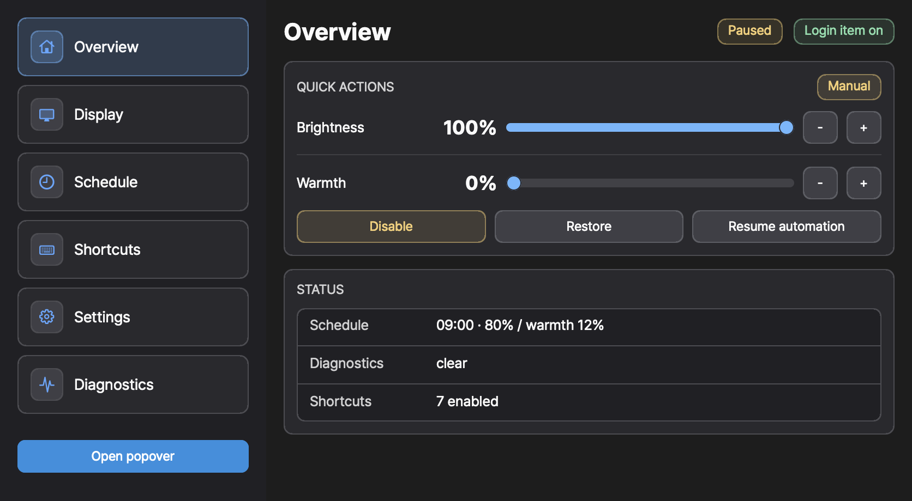
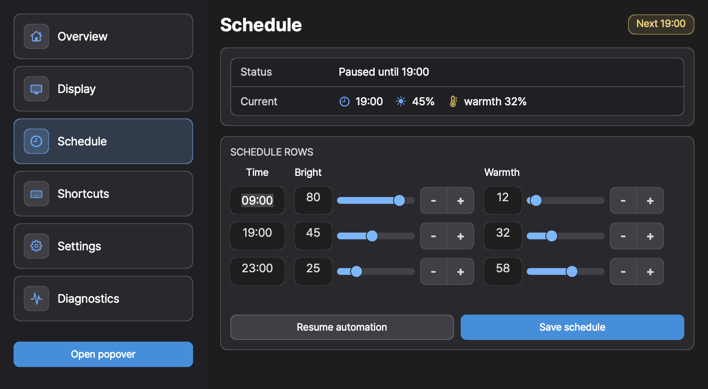
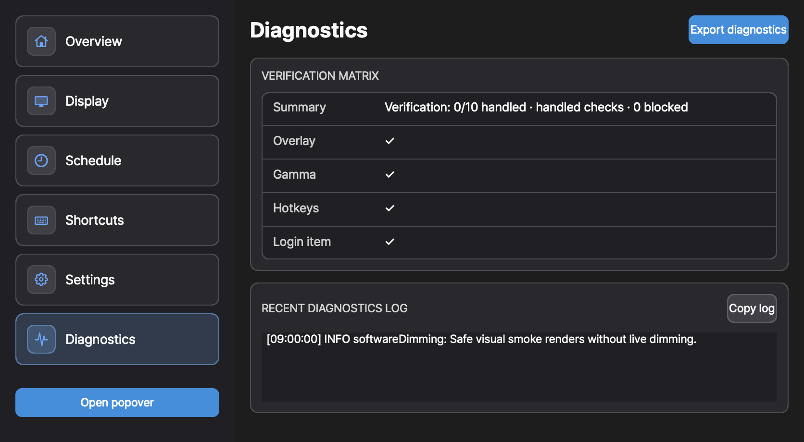

# InnosDimmer


InnosDimmer is a personal macOS menu bar utility for software-based dimming on an external INNOS 27QA100M display.

It reduces perceived brightness with click-through overlay windows and reduces blue light with a CoreGraphics gamma table on the selected external display. It does not attempt hardware DDC/CI monitor brightness control in normal operation.

<p align="center">
  
</p>

## Screenshots

These screenshots are rendered from the real AppKit control window used by the app test suite.

<p align="center">
  
</p>

<p align="center">
  
</p>

<p align="center">
  
</p>

## Highlights

- Native macOS menu bar app built with AppKit and Swift.
- Software-only brightness command routing.
- Click-through overlay dimming for perceived brightness.
- Gamma-based warmth with restore safeguards.
- Display identity and selected-target persistence.
- Time-table schedule engine with manual override until the next schedule boundary.
- Custom global shortcut validation and Carbon `EventHotKey` registration.
- Diagnostics events, snapshots, Settings-window JSON export, and verification matrix guardrails.

## What It Does

InnosDimmer has two practical controls:

- `Brightness`: lowers perceived brightness by placing a click-through dimming overlay on the selected display.
- `Warmth`: lowers blue light through the display gamma table, then restores the original table when disabled or restored.

The main control window includes:

- `Overview`: quick brightness, warmth, disable, restore, and automation controls.
- `Display`: target display selection and current display state.
- `Schedule`: time-based brightness and warmth rows.
- `Shortcuts`: global hotkey bindings for brightness, warmth, restore, and popover access.
- `Settings`: global app settings such as launch at login.
- `Diagnostics`: verification state, recent log output, and local diagnostics export.

## Dimming Modes

- `Software dimming ready`: no dimming command has been applied yet.
- `Overlay active`: perceived brightness adjustment through click-through overlay windows, with gamma-based warmth when configured.
- `Gamma active`: gamma-only mode is not currently exposed as a separate user path.
- `Platform blocked`: macOS or the target surface prevents reliable dimming. This is a disclosed limitation, not success.

Historical DDC/CI probe notes are archived in [docs/ddc-probe-notes.md](docs/ddc-probe-notes.md). They are not part of the current user-facing runtime.

## Current Limitations

- This app changes perceived brightness, not the monitor backlight.
- Manual QA is still required for full-screen Spaces, presentation mode, DRM/protected playback, screen sharing/recording, sleep/wake, HDMI reconnect, and global shortcut behavior.
- The app must not claim all requested dimming contexts are handled unless `VerificationMatrix.canClaimAllRequestedContextsHandled` returns true for complete rows with notes.
- Gamma/color-table dimming is used only for warmth and should restore the original table when cleared.

## Install From Source

No notarized binary release is published yet. Build it locally with Xcode:

```bash
git clone https://github.com/everydy/InnosDimmer.git
cd InnosDimmer
open InnosDimmer.xcodeproj
```

In Xcode, select the `InnosDimmer` scheme and run the app. For a local Release build:

```bash
xcodebuild -scheme InnosDimmer -configuration Release build CODE_SIGNING_ALLOWED=NO
```

The built app appears under Xcode's DerivedData products directory. For everyday use, copy one Release build into `/Applications` or `~/Applications` so Spotlight shows one stable app instead of separate Debug and Release build products.

## Usage

1. Launch `InnosDimmer`.
2. Use the menu bar icon to open the popover, or open the full control window.
3. Choose the external display in `Display` if automatic selection is not what you want.
4. Adjust `Brightness` and `Warmth` in `Overview`.
5. Configure the `Schedule` rows if you want automatic changes by time of day.
6. Use `Quick disable` or `Restore` when you want to temporarily remove dimming.
7. Check `Diagnostics` if the overlay, gamma table, hotkeys, or login item state looks wrong.

## Verification

The repository intentionally has no third-party package dependencies.

Current Xcode verification:

```bash
xcodebuild -scheme InnosDimmer -configuration Debug build-for-testing CODE_SIGNING_ALLOWED=NO
xcodebuild -scheme InnosDimmer -configuration Release build CODE_SIGNING_ALLOWED=NO
bash scripts/smoke_app_window_snapshot.sh
```

Use the Debug command after implementation changes. Use the Release command before launching the local app for manual QA.

## Manual QA

Read the public tutorial at [everydy.github.io/InnosDimmer](https://everydy.github.io/InnosDimmer/) for the basic usage flow, shortcuts, status meanings, and release-readiness cautions.

Use [docs/qa-matrix.md](docs/qa-matrix.md) as the manual QA checklist. Use [docs/operator-guide.md](docs/operator-guide.md) for local operation notes.

Diagnostics export lives in `Settings` under the `Diagnostics` section as `Export diagnostics`. Use it after a successful dimming command and after any observed blocked/failed scenario.

## Repository Map

- [DESIGN.md](DESIGN.md): current product and UI design contract.
- [docs/operator-guide.md](docs/operator-guide.md): local operation policy and shortcuts.
- [docs/qa-matrix.md](docs/qa-matrix.md): manual scenario checklist.
- [docs/ddc-probe-notes.md](docs/ddc-probe-notes.md): archived hardware probing notes.

Large internal planning logs and local research notes are intentionally not part of the public repository tree.

## Security

Please read [SECURITY.md](SECURITY.md) before reporting vulnerabilities or sharing diagnostics. Do not post private diagnostics, display identifiers, local paths, or crash data in public issues.

The app does not need network access for normal operation. Settings are stored locally with `UserDefaults`, and diagnostics export is a local JSON file generated only when requested.

## Contributing

This is a personal utility with a narrow hardware target. Small issues, documentation fixes, and careful bug reports are welcome, but broad product expansion is intentionally out of scope. See [CONTRIBUTING.md](CONTRIBUTING.md).

## License

No open-source license is currently granted. All rights are reserved unless a license file is added later.
