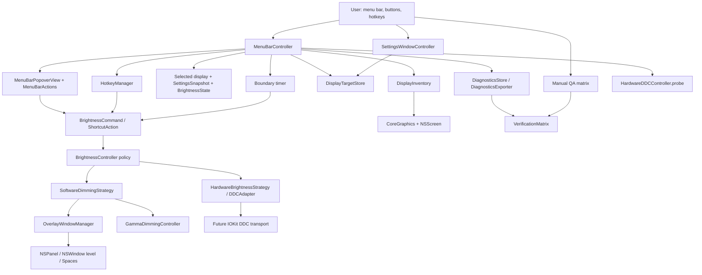

# 2026-06-18 InnosDimmer Completion Plan First

## Goal

Finish InnosDimmer from a running macOS menu bar shell into a personally usable external-monitor dimming app for an M1 Mac with a direct-HDMI INNOS 27QA100M secondary monitor.

The plan must preserve the current product policy:

- Prefer verified hardware DDC brightness control.
- Do not claim hardware control until real write/readback/restore succeeds.
- Keep software dimming as a real implementation path, but activate it only through explicit diagnostic forcing or after hardware capability is exhausted.
- Make brightness, warmth, time-table automation, custom global shortcuts, settings, diagnostics, and manual QA evidence work end to end.
- Avoid third-party package dependencies during the active supply-chain freeze.

## Requested Outcome

The Operator asked for a `plan-first-implementation` document based on the existing research documents. The plan must be detailed enough for follow-up `구현커밋` execution and must include:

- ranked implementation hypotheses
- failure branches and next attempts for each hypothesis
- codebase inspection results
- code snippets for the first-priority implementation path
- concrete commit/phase units
- validation and stop conditions

This document is the implementation source of truth. It does not apply code patches itself.

## Codebase Evidence

- `Confirmed`:
  - `/Users/moonsoo/projects/InnosDimmer/research.md` contains the current hypothesis ladder and evidence base.
  - `InnosDimmer/App/InnosDimmerApp.swift` starts an AppKit `NSApplication` and delegates lifecycle to `AppDelegate`.
  - `InnosDimmer/App/AppDelegate.swift` sets `.accessory`, creates `MenuBarController`, and calls `start()`.
  - `InnosDimmer/UI/MenuBarController.swift` currently configures only status item, popover, and `MenuBarPopoverView`.
  - `InnosDimmer/UI/MenuBarPopoverView.swift` creates user-facing buttons with `target: nil, action: nil`.
  - `InnosDimmer/UI/SettingsWindowController.swift` exists but currently shows mostly static labels.
  - `InnosDimmer/Services/BrightnessController.swift` owns hardware/software routing policy.
  - `InnosDimmer/Services/HardwareDDCController.swift` has a safe DDC probe state machine and `NoopDDCAdapter`.
  - `InnosDimmer/Services/SoftwareDimmingController.swift` delegates software dimming to overlay and gamma controllers.
  - `InnosDimmer/Services/OverlayWindowManager.swift` creates click-through `NSPanel` overlays, but panels are created with `.zero` frame and not refreshed against the selected screen frame on every apply.
  - `InnosDimmer/Services/ScheduleEngine.swift` is pure and tested, but no runtime timer drives it.
  - `InnosDimmer/Services/HotkeyManager.swift` validates and registers Carbon hotkeys, but app startup does not instantiate it.
  - `InnosDimmer/Services/DisplayInventory.swift` can enumerate displays and prefer the first non-main display.
  - `InnosDimmer/Services/DisplayTargetStore.swift` persists `SettingsSnapshot` but runtime does not yet load/save it.
  - `InnosDimmer/Diagnostics/DiagnosticsStore.swift`, `DiagnosticsExporter.swift`, and `VerificationMatrix.swift` exist but are not wired to live app events.
  - `xcodebuild -scheme InnosDimmer -configuration Debug build` and `xcodebuild -scheme InnosDimmer -configuration Debug test` passed after the Swift 6 actor isolation commit.
- `Inferred`:
  - The missing layer is not another domain service; it is the app runtime orchestration that ties existing services together.
  - A main-actor runtime owner is appropriate because the app is AppKit/menu bar/overlay heavy.
  - `MenuBarController` can own the next thin runtime slice before introducing a separate coordinator. If it becomes too large, extract `AppCoordinator`.
  - Real DDC should remain isolated behind `DDCAdapter`; first wire safe probe UI and diagnostics.
- `Unverified`:
  - Whether INNOS 27QA100M supports DDC/CI brightness over this exact M1 direct-HDMI path.
  - Whether overlay windows cover every requested full-screen, DRM, screen-sharing, and presentation context.
  - Whether the current Carbon hotkey approach works in all target apps/full-screen Spaces on the user's machine.
  - Whether login item registration works from the unsigned local debug build.

## System Visualization



- changed nodes:
  - `MenuBarController`: from shell owner to runtime wiring owner.
  - `MenuBarPopoverView`: from static buttons to callback-based action surface.
  - `OverlayWindowManager`: from zero-frame panels to selected-display panels.
  - `HotkeyManager` integration: from testable service to app-started runtime.
  - `ScheduleEngine` integration: from pure engine to one-shot boundary timer.
  - `SettingsWindowController`: from static summary to editable app settings surface.
  - `DiagnosticsStore`: from available service to live event evidence.
- preserved nodes:
  - `BrightnessController` remains the only hardware/software routing policy owner.
  - `HardwareDDCController` remains the probe safety owner.
  - `DDCAdapter` remains the real hardware boundary.
  - `DisplayTargetStore` remains the persistence boundary.
  - `VerificationMatrix` remains the claim-safety gate.
- diagram notes:
  - UI, hotkeys, schedule, and settings must all route through the same command path.
  - Real DDC must not be called directly from UI.
  - Manual QA is part of the system because platform behavior cannot be proven by unit tests alone.

## Related Files

- `/Users/moonsoo/projects/InnosDimmer/research.md`: detailed research and hypothesis ladder.
- `/Users/moonsoo/projects/InnosDimmer/README.md`: product policy and current limitations.
- `/Users/moonsoo/projects/InnosDimmer/docs/operator-guide.md`: default schedule, shortcuts, and no native media-key policy.
- `/Users/moonsoo/projects/InnosDimmer/docs/ddc-probe-notes.md`: DDC safety policy.
- `/Users/moonsoo/projects/InnosDimmer/docs/qa-matrix.md`: manual QA claim gate.
- `/Users/moonsoo/projects/InnosDimmer/InnosDimmer/App/AppDelegate.swift`: app lifecycle entry.
- `/Users/moonsoo/projects/InnosDimmer/InnosDimmer/UI/MenuBarController.swift`: primary runtime owner candidate.
- `/Users/moonsoo/projects/InnosDimmer/InnosDimmer/UI/MenuBarPopoverView.swift`: user command surface.
- `/Users/moonsoo/projects/InnosDimmer/InnosDimmer/UI/SettingsWindowController.swift`: settings surface.
- `/Users/moonsoo/projects/InnosDimmer/InnosDimmer/Services/BrightnessController.swift`: route policy boundary.
- `/Users/moonsoo/projects/InnosDimmer/InnosDimmer/Services/OverlayWindowManager.swift`: software dimming display surface.
- `/Users/moonsoo/projects/InnosDimmer/InnosDimmer/Services/HardwareDDCController.swift`: hardware probe and future real DDC boundary.
- `/Users/moonsoo/projects/InnosDimmer/InnosDimmer/Services/HotkeyManager.swift`: global shortcut backend.
- `/Users/moonsoo/projects/InnosDimmer/InnosDimmer/Services/ScheduleEngine.swift`: automation logic.
- `/Users/moonsoo/projects/InnosDimmer/InnosDimmer/Services/DisplayInventory.swift`: display discovery.
- `/Users/moonsoo/projects/InnosDimmer/InnosDimmer/Services/DisplayTargetStore.swift`: settings persistence.
- `/Users/moonsoo/projects/InnosDimmer/InnosDimmer/Diagnostics/DiagnosticsStore.swift`: live diagnostics.
- `/Users/moonsoo/projects/InnosDimmer/InnosDimmer/Diagnostics/VerificationMatrix.swift`: context claim safety.

## Current Behavior

The app currently launches as a menu bar utility and opens a popover. The popover exposes the right nouns to the user, but its command buttons are inert. The tested service layer contains most of the required policy, but the app lifecycle does not yet:

- resolve the selected external display
- load persisted settings into runtime state
- attach button actions
- apply software dimming to the selected display
- update popover status after changes
- register hotkeys
- drive schedule automation
- run safe probe UI
- expose diagnostics export
- persist settings changes
- record manual QA evidence

## Change Map

- likely files to edit:
  - `InnosDimmer/UI/MenuBarController.swift`
  - `InnosDimmer/UI/MenuBarPopoverView.swift`
  - `InnosDimmer/UI/SettingsWindowController.swift`
  - `InnosDimmer/Services/OverlayWindowManager.swift`
  - `InnosDimmer/Services/SoftwareDimmingController.swift`
  - `InnosDimmer/Services/BrightnessController.swift`
  - `InnosDimmer/Services/DisplayInventory.swift`
  - `InnosDimmer/Services/HotkeyManager.swift`
  - `InnosDimmer/Diagnostics/DiagnosticsExporter.swift`
  - `InnosDimmer/Domain/BrightnessState.swift`
  - `InnosDimmer/Domain/BrightnessCommand.swift`
  - `InnosDimmer/Domain/SettingsSnapshot.swift`
  - `InnosDimmerTests/*.swift`
  - `docs/qa-matrix.md`
  - `docs/operator-guide.md`
  - `docs/ddc-probe-notes.md`
- likely new files:
  - `InnosDimmer/Services/RuntimeClock.swift` or `ScheduleTimerController.swift` only if `MenuBarController` becomes too broad.
  - `InnosDimmer/Services/IOKitDDCAdapter.swift` when real DDC work starts.
  - `InnosDimmerTests/MenuBarControllerRuntimeTests.swift`
  - `InnosDimmerTests/OverlayWindowManagerFrameTests.swift`
  - `InnosDimmerTests/ScheduleRuntimeTests.swift`
- functions/APIs to touch:
  - `MenuBarController.start()`
  - `MenuBarController.togglePopover()`
  - `MenuBarPopoverView.init(...)`
  - `MenuBarPopoverView.update(...)`
  - `OverlayWindowManager.apply(display:brightness:warmth:)`
  - `OverlayWindowManager.configureOverlayPanel(_:for:)`
  - `HardwareDDCController.probe(display:)` call site only, not safety internals
  - `HotkeyManager.start(bindings:)` call site
  - `ScheduleEngine.decision(...)` call site
  - `DisplayTargetStore.load()` and `save(_:)` call sites
- state/data dependencies:
  - selected display
  - `SettingsSnapshot`
  - `BrightnessState`
  - last non-disabled dimming command
  - schedule boundary timer state
  - hotkey registration state
  - diagnostics event list
- side effects to preserve:
  - no accidental hardware writes before explicit real DDC adapter/probe work
  - software overlay remains click-through and reversible
  - manual changes pause automation until next boundary
  - shortcut conflicts remain validation errors
  - selected display does not silently switch after HDMI reconnect
- remaining narrow unknowns before patch:
  - whether `NSPanel` + `.fullScreenAuxiliary` covers the user's exact full-screen contexts
  - whether Carbon hotkeys register in the current debug build
  - whether login item registration should be tested before signing
  - whether real DDC is feasible over this HDMI path

## Planned Changes

- expected behavior changes:
  - Menu bar buttons send real app commands.
  - Software dimming can be forced for diagnostics and visually changes the selected display.
  - Popover labels update after commands.
  - Hotkeys use the same command path as menu buttons.
  - Schedule automation applies default schedule at boundaries.
  - Safe DDC probe UI records visible failure/success state.
  - Settings can change display, schedule, shortcuts, and login item state.
  - Diagnostics can be exported and QA matrix can be updated with observed notes.
- constraints to preserve:
  - No third-party dependencies.
  - No native brightness/media key interception in MVP.
  - No real DDC hardware write until the real adapter commit and explicit probe path.
  - No "all contexts handled" claim without `VerificationMatrix` and `docs/qa-matrix.md` evidence.
- execution order:
  - Make the app usable through software dimming first.
  - Wire hotkeys and schedule to that same command path.
  - Add safe probe UI.
  - Then implement real DDC behind the adapter boundary.
  - Finish with settings, diagnostics, QA, and packaging.

## Ranked Hypothesis Matrix

| Rank | Hypothesis | Why It Ranks Here | Failure Signal | Next Attempt |
| --- | --- | --- | --- | --- |
| 1 | Runtime-orchestrator-first completion | Solves current inert UI with lowest hardware risk and reuses existing services | Menu wiring becomes tangled or overlay cannot show | Extract `AppCoordinator`, then consider `NSViewController`/SwiftUI popover |
| 2 | Overlay-first perceived dimming | Gives immediate usable dimming without monitor writes | Overlay wrong screen, focus steal, full-screen failure | Add screen refresh notifications, `.fullScreenAuxiliary`, separate panels, then gamma |
| 3 | Custom-hotkey-first control | Already implemented and avoids accessibility/media-key permissions | Carbon registration/action failure | Disable failing bindings, show diagnostics, then consider settings rebinding |
| 4 | Boundary-timer schedule | Matches existing pure engine and avoids polling | Missed wake/boundary or manual override race | Add wake/screen/time-change reconciliation, then low-frequency safety timer |
| 5 | Safe DDC probe UI before real DDC | Makes status/diagnostics visible before hardware risk | User needs real hardware proof now | Add explicit experimental real probe gate |
| 6 | Native IOKit DDC adapter | Only in-app route to real backlight control | IOKit path inaccessible/readback mismatch/restore failure | Try alternate service matching, classify read-only/unsupported, stay overlay |
| 7 | Incremental AppKit settings | Matches current app with no new framework | Manual AppKit UI becomes too costly | Embed SwiftUI settings view only for settings |
| 8 | Diagnostics-first QA gate | Required to avoid false completeness claims | Too noisy or unclear | Keep last 200 events, add severity filters, local JSON only |

## Review Notes

- risks:
  - Real DDC can change monitor firmware state; only run after reversible probe code and visible diagnostics exist.
  - Overlay may not work across every macOS Space or protected video surface.
  - Carbon hotkeys may conflict with user apps.
  - Schedule automation can feel broken if manual overrides are overwritten too soon.
  - Local debug login item behavior may not match signed app behavior.
- assumptions:
  - User accepts custom shortcuts for MVP.
  - User accepts software perceived dimming when hardware path fails.
  - Existing `BrightnessController` policy should remain central.
  - The app remains personal-use and local-only.
- unanswered questions:
  - Does INNOS OSD expose a DDC/CI toggle?
  - Should screen sharing include or exclude the dimming overlay?
  - Should native brightness/media keys be considered after MVP?
  - Should real DDC probe be opt-in per launch or persistent once enabled?

## Plan Quality Check

- Alternative considered:
  - Start with real IOKit DDC transport. Rejected for first execution because it is the highest-risk path and the current UI cannot yet display safe status or recovery.
  - Convert UI to SwiftUI. Rejected for first execution because AppKit is already working and conversion adds risk unrelated to core functionality.
  - Ship software-only. Rejected as the primary plan because the product requirement is hardware-first where verified.
- Why this plan:
  - It follows the current tested boundaries and fixes the immediate inert-app problem first.
  - It allows a usable app even if DDC over M1 HDMI fails.
  - It creates diagnostics before risky hardware work.
- Tradeoff:
  - chosen: main-actor runtime wiring inside `MenuBarController` first.
  - alternative: introduce `AppCoordinator` immediately.
  - cost/risk: `MenuBarController` may grow temporarily.
  - why acceptable: current app is small and behavior must become real before abstracting.
  - revisit when: controller exceeds clear UI/runtime ownership or tests require too many unrelated fakes.
- What this plan may still miss:
  - macOS full-screen/DRM behavior that only appears in manual QA.
  - undocumented Apple Silicon DDC details.
  - login item signing constraints.
- When to stop and revise:
  - If menu/overlay wiring cannot be made reliable without a separate coordinator.
  - If overlay dimming cannot affect the secondary display even in ordinary desktop mode.
  - If real DDC restore fails during any probe.
  - If hotkey registration requires permissions beyond the MVP default.

## Skill Routing Manifest

| Phase | Required skills | Optional skills | Evidence |
| --- | --- | --- | --- |
| Commit 1: Connect menu popover actions to a single command surface | `구현커밋` | `review-all-in-one` | `MenuBarPopoverView.swift` buttons have nil targets; `MenuBarController.swift` owns current popover |
| Commit 2: Resolve selected display and make overlay frame display-correct | `구현커밋` | `review-all-in-one` | `DisplayInventory.swift`, `DisplayTargetStore.swift`, `OverlayWindowManager.swift` zero-frame evidence |
| Commit 3: Add runtime diagnostics and visible state refresh | `구현커밋` | `review-all-in-one` | `DiagnosticsStore.swift` exists; popover currently static after construction |
| Commit 4: Wire global shortcuts to the shared command path | `구현커밋` | `qa-gate` | `HotkeyManager.swift` backend exists; `docs/operator-guide.md` default shortcuts |
| Commit 5: Add schedule boundary timer and manual override runtime | `구현커밋` | `qa-gate` | `ScheduleEngine.swift` tested but no runtime timer |
| Commit 6: Add safe DDC probe button and result surfacing | `구현커밋` | `review-all-in-one` | `HardwareDDCController.swift`, `docs/ddc-probe-notes.md` |
| Commit 7: Make settings window edit and persist core settings | `구현커밋` | `review-all-in-one` | `SettingsWindowController.swift` static; `SettingsSnapshot.swift` and `DisplayTargetStore.swift` available |
| Commit 8: Add diagnostics export and QA matrix update workflow | `구현커밋` | `qa-gate` | `DiagnosticsExporter.swift`, `VerificationMatrix.swift`, `docs/qa-matrix.md` |
| Commit 9: Implement experimental real DDC adapter behind `DDCAdapter` | `구현커밋`, `research` | `community-research`, `해결전략검토` | `research.md` identifies DDC as highest variance; Apple/community evidence needed during execution |
| Commit 10: Complete manual QA, packaging notes, and final claim gate | `구현커밋`, `qa-gate` | `review-all-in-one`, `테스트` | `docs/qa-matrix.md`, `README.md`, local Xcode build/test |
| Final Gate | `review-all-in-one`, `qa-gate` | `테스트` | Xcode build/test, app launch, manual QA rows, diagnostics export |

## Implementation Plan

### Commit 1: Connect menu popover actions to a single command surface

- target files:
  - `InnosDimmer/UI/MenuBarPopoverView.swift`
  - `InnosDimmer/UI/MenuBarController.swift`
  - `InnosDimmerTests/MenuBarStateTests.swift`
  - new test file if needed: `InnosDimmerTests/MenuBarPopoverActionTests.swift`
- hypothesis:
  - H1: Keep `MenuBarPopoverView` as AppKit `NSView` and inject a `MenuBarActions` callback struct.
  - H2 if H1 fails: introduce `MenuBarPopoverViewController` with target/action selectors.
  - H3 if H2 fails: use SwiftUI only for popover content.
- changes:
  - Add `MenuBarActions`.
  - Replace `NSButton(title:target:nil,action:nil)` with buttons targeting the view's selector methods.
  - Add warmth up/down and quick disable/restore controls if absent from the current popover.
  - Have `MenuBarController` build actions that call private command methods.
  - Keep `MenuBarViewModel` as the display model.
- code snippets:
  - proposed `InnosDimmer/UI/MenuBarPopoverView.swift`:

```swift
struct MenuBarActions {
    var brightnessDown: () -> Void
    var brightnessUp: () -> Void
    var warmthDown: () -> Void
    var warmthUp: () -> Void
    var probeDDC: () -> Void
    var pauseAutomation: () -> Void
    var quickDisable: () -> Void
    var restorePrevious: () -> Void
    var openSettings: () -> Void
}
```

```swift
private func button(_ title: String, action: Selector) -> NSButton {
    let button = NSButton(title: title, target: self, action: action)
    button.bezelStyle = .rounded
    return button
}

@objc private func brightnessUpPressed() {
    actions.brightnessUp()
}
```

- tradeoff:
  - chosen: callback struct.
  - alternative: view controller or SwiftUI.
  - cost/risk: selector methods are a little verbose.
  - why acceptable: smallest change and no framework shift.
  - revisit when: button state/enabled logic becomes too rich for callbacks.
- verification:
  - `xcodebuild -scheme InnosDimmer -configuration Debug test`: confirms existing tests still pass.
  - Add tests/assertions that `MenuBarViewModel` still reports brightness/warmth/schedule/shortcuts correctly.
  - Manual app check: menu opens and buttons are clickable without crashing.
- success criteria:
  - Every visible command button has an action path.
  - No app crash when pressing each button.
  - No behavior bypasses `BrightnessController` yet.
- stop conditions:
  - If callback lifecycle creates retain cycles or stale state.
  - If AppKit selector wiring makes testability poor.

### Commit 2: Resolve selected display and make overlay frame display-correct

- target files:
  - `InnosDimmer/UI/MenuBarController.swift`
  - `InnosDimmer/Services/OverlayWindowManager.swift`
  - `InnosDimmer/Services/SoftwareDimmingController.swift`
  - `InnosDimmer/Services/DisplayInventory.swift`
  - `InnosDimmerTests/SoftwareDimmingControllerTests.swift`
  - new test file if needed: `InnosDimmerTests/OverlayWindowManagerFrameTests.swift`
- hypothesis:
  - H1: Extend `MenuBarController` with selected display, settings load, and forced software diagnostic command path.
  - H2 if H1 fails: extract `AppCoordinator`.
  - H3 if display frame mapping fails: add an injectable `ScreenProvider`.
- changes:
  - Load `SettingsSnapshot` through `DisplayTargetStore`.
  - Resolve selected display from saved display or first non-main display.
  - Add `isForcedSoftwareModeForTesting = true` only for explicit manual diagnostic commands until hardware state is exhausted.
  - Update `OverlayWindowManager.apply` to set the panel frame to the selected display's `NSScreen.frame` on every apply.
  - Add `.fullScreenAuxiliary` to collection behavior.
  - Keep overlays click-through.
- code snippets:
  - proposed `MenuBarController` command path:

```swift
private enum DimmingStep {
    static let brightness = 5
    static let warmth = 5
}

private func adjust(brightnessDelta: Int = 0, warmthDelta: Int = 0, source: BrightnessCommandSource) {
    guard let display = selectedDisplay else {
        record(.display, "No selected display", .warning)
        return
    }

    let command = BrightnessCommand(
        display: display,
        brightness: brightnessController.state.targetBrightness + brightnessDelta,
        warmth: brightnessController.state.targetWarmth + warmthDelta,
        source: source
    )

    brightnessController.apply(command)
    refreshPopover()
}
```

  - proposed `OverlayWindowManager` frame handling:

```swift
func apply(display: DisplayIdentity, brightness: Int, warmth: Int) {
    guard let frame = frameForDisplay(display) else {
        return
    }

    let panel = panelsByDisplayID[display.cgDisplayID] ?? makePanel()
    panelsByDisplayID[display.cgDisplayID] = panel
    Self.configureOverlayPanel(panel, for: frame)
    panel.contentView?.frame = NSRect(origin: .zero, size: frame.size)
    updateLayers(for: panel, appearance: OverlayAppearance.make(brightness: brightness, warmth: warmth))
    panel.orderFrontRegardless()
}
```

- tradeoff:
  - chosen: overlay frame refresh on every apply.
  - alternative: set frame only at creation.
  - cost/risk: small repeated screen lookup.
  - why acceptable: prevents stale frame after reconnect/Space changes.
  - revisit when: repeated lookup shows measurable overhead or flicker.
- verification:
  - `xcodebuild -scheme InnosDimmer -configuration Debug test`: overlay tests and routing tests pass.
  - Manual app check: forced software brightness down visibly dims the secondary display.
  - Manual app check: overlay does not steal clicks.
- success criteria:
  - Selected external display is resolved and visible in diagnostics/popover.
  - Forced software command applies overlay to the selected display frame.
  - Main display is not dimmed when the secondary display is selected.
- stop conditions:
  - If no external display can be resolved and app silently chooses main display.
  - If overlay blocks mouse or keyboard focus.
  - If frame mapping is wrong after reconnect.

### Commit 3: Add runtime diagnostics and visible state refresh

- target files:
  - `InnosDimmer/UI/MenuBarController.swift`
  - `InnosDimmer/UI/MenuBarPopoverView.swift`
  - `InnosDimmer/Diagnostics/DiagnosticsStore.swift`
  - `InnosDimmerTests/DiagnosticsStoreTests.swift`
  - `InnosDimmerTests/MenuBarStateTests.swift`
- hypothesis:
  - H1: Keep diagnostics as an injected store and refresh the popover directly after each state transition.
  - H2 if UI refresh tangles: use a small `render()`/`refreshPopover()` function with a rebuilt view.
  - H3 if that fails: introduce a main-actor observable state object.
- changes:
  - Add a `record(_:_:_:)` helper in runtime owner.
  - Record app start, display selection, command application, software activation, missing display, and errors.
  - Refresh `MenuBarPopoverView.update(state:)` after every command.
  - Extend `MenuBarViewModel` to show selected display, last event, or hardware state if needed.
- code snippets:

```swift
private func record(_ category: DiagnosticsCategory, _ message: String, _ severity: DiagnosticsSeverity = .info) {
    diagnosticsStore.record(DiagnosticsEvent(
        timestamp: Date(),
        category: category,
        message: message,
        severity: severity
    ))
}

private func refreshPopover() {
    popoverView?.update(state: brightnessController.state)
}
```

- tradeoff:
  - chosen: direct refresh after mutation.
  - alternative: observer/binding layer.
  - cost/risk: caller must remember to refresh.
  - why acceptable: small app and explicit mutation points.
  - revisit when: more than three surfaces need state updates.
- verification:
  - `xcodebuild -scheme InnosDimmer -configuration Debug test`: diagnostics and view model tests pass.
  - Manual app check: brightness label changes after button press.
  - Manual app check: diagnostics summary changes after command/probe failure.
- success criteria:
  - User can see mode/brightness/warmth changes without reopening the app.
  - Diagnostics events are retained and bounded.
- stop conditions:
  - If state updates become inconsistent across popover/settings/diagnostics.

### Commit 4: Wire global shortcuts to the shared command path

- target files:
  - `InnosDimmer/UI/MenuBarController.swift`
  - `InnosDimmer/Services/HotkeyManager.swift`
  - `InnosDimmer/Domain/ShortcutBinding.swift`
  - `InnosDimmerTests/HotkeyBindingTests.swift`
  - new test file if needed: `InnosDimmerTests/MenuBarHotkeyRoutingTests.swift`
- hypothesis:
  - H1: Use existing Carbon `HotkeyManager` with custom shortcuts only.
  - H2 if registration partially fails: disable only failing bindings and report diagnostics.
  - H3 if Carbon path fails broadly: delay hotkeys and expose settings/manual controls.
  - H4 later only: native media-key interception with permissions, if explicitly approved.
- changes:
  - Instantiate `HotkeyManager` in `MenuBarController.start()`.
  - Route `ShortcutAction` to the same command methods as menu buttons.
  - Record registration success/failure.
  - Stop/unregister hotkeys on lifecycle shutdown if app adds termination handling.
- code snippets:

```swift
private func registerHotkeys() {
    hotkeyManager = HotkeyManager { [weak self] action in
        Task { @MainActor in
            self?.handleShortcut(action)
        }
    }

    do {
        try hotkeyManager?.start(bindings: settings.shortcuts)
        record(.shortcut, "Registered shortcuts", .info)
    } catch {
        record(.shortcut, "Shortcut registration failed: \(error)", .warning)
    }
}
```

```swift
private func handleShortcut(_ action: ShortcutAction) {
    switch action {
    case .brightnessUp: adjust(brightnessDelta: DimmingStep.brightness, source: .hotkey)
    case .brightnessDown: adjust(brightnessDelta: -DimmingStep.brightness, source: .hotkey)
    case .warmthUp: adjust(warmthDelta: DimmingStep.warmth, source: .hotkey)
    case .warmthDown: adjust(warmthDelta: -DimmingStep.warmth, source: .hotkey)
    case .quickDisableOverlay: clearSoftwareDimming()
    case .restorePreviousDimming: restorePreviousDimming()
    }
}
```

- tradeoff:
  - chosen: custom shortcuts only.
  - alternative: native brightness keys.
  - cost/risk: shortcuts are less native.
  - why acceptable: avoids extra permissions and follows MVP docs.
  - revisit when: user explicitly requests native F1/F2 and accepts permission prompts.
- verification:
  - `xcodebuild -scheme InnosDimmer -configuration Debug test`: hotkey validation/routing tests pass.
  - Manual app check: `Option + Shift + Up/Down/Left/Right/0/R` trigger actions while Finder/browser is focused.
- success criteria:
  - Hotkey actions use same state and diagnostics path as buttons.
  - Invalid bindings still fail validation.
- stop conditions:
  - If Carbon registration fails on the user's macOS for all default shortcuts.
  - If a default shortcut conflicts with a critical user workflow.

### Commit 5: Add schedule boundary timer and manual override runtime

- target files:
  - `InnosDimmer/UI/MenuBarController.swift`
  - optional new file: `InnosDimmer/Services/ScheduleTimerController.swift`
  - `InnosDimmer/Services/ScheduleEngine.swift`
  - `InnosDimmerTests/ScheduleEngineTests.swift`
  - new test file if needed: `InnosDimmerTests/ScheduleRuntimeTests.swift`
- hypothesis:
  - H1: Use one-shot next-boundary timer with tolerance.
  - H2 if sleep/wake misses boundary: re-evaluate on wake/screen-change notifications.
  - H3 if still unreliable: add low-frequency reconciliation timer.
- changes:
  - Evaluate schedule once on startup after selected display resolution.
  - On manual menu/hotkey commands, update state through `ScheduleEngine.stateAfterManualOverride`.
  - Schedule one timer for the next boundary using `ScheduleEngine.minutesUntilNextBoundary`.
  - On timer fire, use `ScheduleEngine.decision` to apply schedule or preserve paused state.
  - Re-schedule after every fire and after wake/display change.
- code snippets:

```swift
private func scheduleNextBoundaryTimer() {
    scheduleTimer?.invalidate()
    guard let minutes = ScheduleEngine.minutesUntilNextBoundary(
        after: currentMinuteOfDay(),
        entries: settings.schedule
    ) else { return }

    let interval = TimeInterval(max(1, minutes) * 60)
    let timer = Timer.scheduledTimer(withTimeInterval: interval, repeats: false) { [weak self] _ in
        Task { @MainActor in
            self?.applyScheduleDecision()
            self?.scheduleNextBoundaryTimer()
        }
    }
    timer.tolerance = min(60, interval * 0.1)
    scheduleTimer = timer
}
```

- tradeoff:
  - chosen: one-shot boundary timer.
  - alternative: every-minute polling.
  - cost/risk: wake/time-change may require explicit re-evaluation.
  - why acceptable: lower energy use and matches Apple guidance.
  - revisit when: manual QA shows missed boundaries.
- verification:
  - `xcodebuild -scheme InnosDimmer -configuration Debug test`: schedule tests pass.
  - Manual near-boundary test: set temporary schedule boundary a few minutes ahead and confirm apply.
  - Manual override test: button/hotkey change is not overwritten until next boundary.
- success criteria:
  - Schedule applies at startup and boundary.
  - Manual override pauses automation until next schedule boundary.
  - Timer is invalidated/replaced cleanly.
- stop conditions:
  - If schedule applies while display is unresolved.
  - If manual changes are overwritten immediately.

### Commit 6: Add safe DDC probe button and result surfacing

- target files:
  - `InnosDimmer/UI/MenuBarController.swift`
  - `InnosDimmer/UI/MenuBarPopoverView.swift`
  - `InnosDimmer/Services/HardwareDDCController.swift`
  - `InnosDimmer/Domain/BrightnessState.swift`
  - `InnosDimmer/Diagnostics/DiagnosticsExporter.swift`
  - `InnosDimmerTests/HardwareDDCControllerTests.swift`
  - `InnosDimmerTests/MenuBarStateTests.swift`
- hypothesis:
  - H1: Probe button calls current `HardwareDDCController` with default `NoopDDCAdapter`, records visible unsupported state safely.
  - H2 if state update is confusing: record probe in diagnostics only until hardware capability UI is clearer.
  - H3 if user needs hardware test now: add an explicit experimental real adapter gate in Commit 9.
- changes:
  - Wire `DDC Probe` button.
  - Set `state.hardwareCapability` from `ProbeResult.capability`.
  - If probe says unsupported/failed, allow software fallback activation for subsequent normal commands.
  - Export/store probe result in diagnostics.
  - Keep default adapter as `NoopDDCAdapter` until Commit 9.
- code snippets:

```swift
private func runDDCProbe() {
    guard let display = selectedDisplay else {
        record(.hardwareProbe, "Probe skipped: no selected display", .warning)
        return
    }

    let result = hardwareController.probe(display: display)
    brightnessController.state.hardwareCapability = result.capability
    record(.hardwareProbe, "Probe result: \(result.capability)", .info)
    refreshPopover()
}
```

- tradeoff:
  - chosen: safe probe UI before real DDC.
  - alternative: implement real DDC first.
  - cost/risk: first probe will likely report unsupported because adapter is no-op.
  - why acceptable: validates UI/status/diagnostics before hardware writes.
  - revisit when: UI is stable and user is ready for one-step hardware probe.
- verification:
  - `xcodebuild -scheme InnosDimmer -configuration Debug test`: hardware probe tests pass.
  - Manual app check: DDC Probe updates diagnostics/status without changing monitor brightness.
- success criteria:
  - Probe result is visible.
  - Failed probe enables honest software fallback path.
  - No monitor hardware write occurs in this commit.
- stop conditions:
  - If probe failure causes app crash or stale state.
  - If UI implies hardware was tested when only `NoopDDCAdapter` ran.

### Commit 7: Make settings window edit and persist core settings

- target files:
  - `InnosDimmer/UI/SettingsWindowController.swift`
  - `InnosDimmer/UI/MenuBarController.swift`
  - `InnosDimmer/Services/DisplayTargetStore.swift`
  - `InnosDimmer/Services/LoginItemController.swift`
  - `InnosDimmer/Domain/SettingsSnapshot.swift`
  - `InnosDimmerTests/SettingsSnapshotTests.swift`
  - `InnosDimmerTests/DisplayTargetStoreTests.swift`
- hypothesis:
  - H1: Keep settings AppKit-native and incremental.
  - H2 if manual AppKit layout becomes too slow: embed SwiftUI only inside settings.
  - H3 if shortcut capture is too broad: start with reset/default toggles and defer live capture UI.
- changes:
  - Display picker updates selected display and persists `SettingsSnapshot.selectedDisplay`.
  - Schedule editor starts with simple fields for the default three entries.
  - Shortcut section can enable/disable defaults and reset safe defaults.
  - Login-at-startup toggle calls `LoginItemController`.
  - Settings changes notify runtime owner to reload/re-register/reapply.
- code snippets:

```swift
struct SettingsActions {
    var selectDisplay: (DisplayIdentity) -> Void
    var updateSchedule: ([ScheduleEntry]) -> Void
    var updateShortcuts: ([ShortcutBinding]) -> Void
    var setLaunchAtLogin: (Bool) -> Void
    var exportDiagnostics: () -> Void
}
```

- tradeoff:
  - chosen: simple AppKit controls.
  - alternative: SwiftUI settings rewrite.
  - cost/risk: less polished editor initially.
  - why acceptable: personal-use MVP and no framework shift.
  - revisit when: shortcut capture or schedule editing needs richer controls.
- verification:
  - `xcodebuild -scheme InnosDimmer -configuration Debug test`: snapshot/store tests pass.
  - Manual app check: display choice persists after app restart.
  - Manual app check: shortcut disable/reset persists and affects registration.
- success criteria:
  - Core settings persist.
  - Settings changes affect runtime without restart where practical.
  - Login item status is visible and handles `requiresApproval`.
- stop conditions:
  - If login item local debug behavior is inconsistent, document and defer packaging verification.
  - If settings can save an invalid shortcut schedule/binding.

### Commit 8: Add diagnostics export and QA matrix update workflow

- target files:
  - `InnosDimmer/UI/SettingsWindowController.swift`
  - `InnosDimmer/UI/MenuBarController.swift`
  - `InnosDimmer/Diagnostics/DiagnosticsExporter.swift`
  - `InnosDimmer/Diagnostics/VerificationMatrix.swift`
  - `docs/qa-matrix.md`
  - `docs/operator-guide.md`
  - `InnosDimmerTests/DiagnosticsStoreTests.swift`
  - `InnosDimmerTests/VerificationMatrixTests.swift`
- hypothesis:
  - H1: Keep diagnostics local JSON and QA matrix Markdown manual.
  - H2 if export path UX is cumbersome: write to Application Support and reveal in Finder.
  - H3 if QA matrix editing in-app is too much: keep in-app summary and docs update only.
- changes:
  - Add diagnostics export command from settings.
  - Include selected display, hardware capability, active mode, matrix summary, and events.
  - Add clear operator instructions in docs for updating QA rows.
  - Ensure app cannot claim all contexts while matrix rows are untested/failing.
- code snippets:

```swift
private func exportDiagnostics() {
    let snapshot = diagnosticsStore.snapshot(
        selectedDisplay: selectedDisplay,
        state: brightnessController.state,
        matrixSummary: VerificationMatrix.summary(for: VerificationMatrix.defaultRows)
    )
    let data = try DiagnosticsExporter.export(snapshot)
    // Write through a user-approved save panel or local Application Support path.
}
```

- tradeoff:
  - chosen: local JSON + manual Markdown QA.
  - alternative: full in-app QA editor.
  - cost/risk: manual docs step remains.
  - why acceptable: QA requires human observation anyway.
  - revisit when: repeated QA sessions need in-app row editing.
- verification:
  - `xcodebuild -scheme InnosDimmer -configuration Debug test`: diagnostics/verification tests pass.
  - Manual app check: export creates JSON and contains no sensitive user content.
  - Manual docs check: `docs/qa-matrix.md` rows have concrete note format.
- success criteria:
  - Diagnostics export is available and readable.
  - QA matrix workflow is documented.
  - Claims remain gated.
- stop conditions:
  - If export path needs sandbox/signing decisions outside local MVP.

### Commit 9: Implement experimental real DDC adapter behind `DDCAdapter`

- target files:
  - new file: `InnosDimmer/Services/IOKitDDCAdapter.swift`
  - `InnosDimmer/Services/HardwareDDCController.swift`
  - `InnosDimmer/UI/MenuBarController.swift`
  - `InnosDimmer/UI/SettingsWindowController.swift`
  - `docs/ddc-probe-notes.md`
  - `docs/qa-matrix.md`
  - new tests with fake adapter only: `InnosDimmerTests/IOKitDDCAdapterTests.swift` if feasible without real hardware
- hypothesis:
  - H1: Implement native IOKit/I2C adapter for VCP brightness `0x10` and reuse existing read/write/readback/restore policy.
  - H2 if direct service lookup fails: probe alternate IORegistry/framebuffer candidates matching the display identity.
  - H3 if read works but write fails: classify as read-only or failed and keep overlay.
  - H4 if restore fails: hard-stop hardware mode, surface error, require manual monitor OSD recovery if needed.
  - H5 if Apple Silicon HDMI path is unavailable: document hardware unsupported and complete overlay product.
- changes:
  - Add `IOKitDDCAdapter: DDCAdapter` without copying GPL code.
  - Gate real probe behind explicit UI wording such as `Experimental hardware probe`.
  - Keep one-step reversible probe.
  - Never enable `.hardwareDDC` without read/write/readback/restore success.
  - Record exact failure stage.
- code snippets:
  - illustrative only; final API depends on available IOKit symbols:

```swift
final class IOKitDDCAdapter: DDCAdapter {
    func readBrightness(display: DisplayIdentity) throws -> DDCBrightnessValue {
        let service = try resolveService(for: display)
        let response = try sendVCPRead(code: 0x10, service: service)
        return DDCBrightnessValue(current: response.current, range: 0...response.maximum)
    }

    func writeBrightness(_ value: Int, display: DisplayIdentity) throws {
        let service = try resolveService(for: display)
        try sendVCPWrite(code: 0x10, value: Clamped.percent(value), service: service)
    }
}
```

- tradeoff:
  - chosen: native adapter behind existing protocol.
  - alternative: external helper or copied ddcctl-style code.
  - cost/risk: IOKit path may fail on M1 HDMI; hardware side effects are real.
  - why acceptable: isolated, reversible, diagnostics-visible.
  - revisit when: no IORegistry path can be matched or probe restore fails.
- verification:
  - `xcodebuild -scheme InnosDimmer -configuration Debug test`: fake-adapter tests pass.
  - Manual INNOS check: hardware probe changes brightness by one step, reads it back, restores original value.
  - Manual INNOS check: if probe fails, subsequent dimming uses overlay with visible reason.
- success criteria:
  - Hardware mode is enabled only after successful restore.
  - Failure leaves app usable through overlay.
  - Failure stage is visible in diagnostics.
- stop conditions:
  - Any restore failure.
  - Any uncertain mapping between target display and IOKit service.
  - Any need to add third-party dependency or GPL-derived code.

### Commit 10: Complete manual QA, packaging notes, and final claim gate

- target files:
  - `README.md`
  - `docs/operator-guide.md`
  - `docs/qa-matrix.md`
  - `docs/release-notes-local.md`
  - `docs/ddc-probe-notes.md`
  - optional packaging docs under `docs/`
- hypothesis:
  - H1: Finish as local personal-use `.app` with documented manual QA and no external distribution.
  - H2 if login item/signing blocks packaging: keep debug/local app instructions and document signing gap.
  - H3 if some contexts fail: mark `partial` or `platformBlocked`, do not claim full coverage.
- changes:
  - Run and record manual QA rows:
    - general desktop
    - full-screen Spaces
    - presentation mode
    - browser full-screen video
    - DRM/protected playback
    - screen sharing/recording
    - sleep/wake
    - HDMI reconnect
    - shortcut conflict
    - schedule boundary
  - Update docs with actual hardware/overlay result.
  - Document how to launch the app and where diagnostics export lives.
  - Keep release notes honest about DDC result.
- code snippets:
  - code snippets not needed; this is documentation and manual evidence. If code changes are required, stop and create a separate implementation commit.
- tradeoff:
  - chosen: manual QA documented in Markdown.
  - alternative: automate GUI/Space/DRM checks.
  - cost/risk: manual evidence is slower.
  - why acceptable: these contexts depend on physical monitor and macOS behavior.
  - revisit when: repeated releases need an automated smoke harness.
- verification:
  - `xcodebuild -scheme InnosDimmer -configuration Debug build`: app still builds.
  - `xcodebuild -scheme InnosDimmer -configuration Debug test`: tests pass.
  - `open -n <Debug/InnosDimmer.app>`: app launches.
  - Manual QA matrix rows have status and concrete note.
- success criteria:
  - Docs accurately state hardware/overlay status.
  - No `notTested` row is used to claim handled coverage.
  - User has a clear local run path.
- stop conditions:
  - Any QA row reveals a safety issue, wrong-display dimming, focus stealing, or failed restore.

## Operator 결정 필요 사항

- 상태: 보류됨
- 결정 1: Real DDC experimental probe timing
  - 맥락: Commit 9 can change real monitor brightness by one reversible step. This is safe by design but still touches physical monitor state.
  - A: Run only after Commits 1-8 make overlay, diagnostics, and recovery usable.
  - B: Run as early as possible after safe probe UI.
  - C: Skip real DDC and complete overlay-only product.
  - 추천안: A. It preserves safety and gives recovery visibility before touching hardware.
  - 기본값: A.
  - 보류 시 영향: Commits 1-8 can proceed; Commit 9 should pause for explicit probe readiness if the user wants to be present.
- 결정 2: Native brightness/media key support
  - 맥락: Native F1/F2 style control may require permission-sensitive event handling and is out of MVP docs.
  - A: Keep custom `Option + Shift` shortcuts only.
  - B: Add native key research after MVP.
  - C: Replace custom shortcuts with native-key interception.
  - 추천안: A. It avoids extra permissions and follows current operator guide.
  - 기본값: A.
  - 보류 시 영향: MVP remains usable with custom shortcuts; native media keys can be researched later.
- 결정 3: Screen sharing dimming expectation
  - 맥락: Overlay may or may not appear in screen sharing/recording depending on capture path and user expectation.
  - A: Treat observed behavior as QA evidence and document it.
  - B: Try to force dimming into shared output.
  - C: Try to keep dimming local-only.
  - 추천안: A. The current product should report reality before optimizing a capture policy.
  - 기본값: A.
  - 보류 시 영향: Implementation proceeds; QA row determines later product language.

## 검토용 결과물

- HTML: 해당 없음.
- 계획 문서: `/Users/moonsoo/projects/InnosDimmer/docs/2026-06-18-completion-plan-first.md`
- Research basis: `/Users/moonsoo/projects/InnosDimmer/research.md`
- 테스트 링크:
  - Localhost: 해당 없음. Native macOS AppKit 앱이며 계획 문서 작업에는 dev server가 필요하지 않음.
  - Deploy: 해당 없음. 개인용 로컬 macOS 앱이며 배포 환경 없음.
- 상태: implemented.
- 실제 동작:
  - 이 문서는 후행 구현을 위한 source-of-truth 계획이다.
  - 실제 앱 동작 변경은 후행 `구현커밋`에서 수행한다.
- Mock:
  - 없음. 코드 스니펫은 proposed/illustrative이며 실제 패치가 아니다.

## 후행 실행

- 기본 실행: 구현커밋
- 계획 경로 처리: 구현커밋이 직전 대화, 계획 링크, active plan context에서 자동 탐지
- 모호할 때: 후보 목록을 보여주고 Operator에게 선택 요청
- 실행 경계:
  - 이 계획은 실제 구현 패치를 포함하지 않는다.
  - 승인 후 `구현커밋`이 `### Commit N:` 단위로 구현한다.
  - Commit 9 real DDC probe는 물리 모니터 상태를 바꿀 수 있으므로 Commits 1-8 이후 명시 확인 또는 현장 준비가 필요하다.

## HTML 생략 보고서

- 판정: 생략 가능.
- 생략 사유:
  - 사용자가 요구한 산출물은 plan-first 구현 계획 문서다.
  - 현재 작업은 UI 디자인 목업을 고르는 단계가 아니라, 이미 존재하는 macOS AppKit 앱의 후행 구현 순서와 가설/실패 분기를 잠그는 문서 작업이다.
  - 실제 확인 표면은 후행 구현 후 로컬 `.app`, Xcode build/test, diagnostics export, manual QA matrix다.
- 대체 검토물:
  - 계획 문서: `/Users/moonsoo/projects/InnosDimmer/docs/2026-06-18-completion-plan-first.md`
  - research 문서: `/Users/moonsoo/projects/InnosDimmer/research.md`
  - 후행 테스트 명령:

```bash
xcodebuild -scheme InnosDimmer -configuration Debug build
xcodebuild -scheme InnosDimmer -configuration Debug test
```

- 테스트 링크:
  - Localhost: 해당 없음. Native macOS 앱.
  - Deploy: 해당 없음. 로컬 개인용 앱.
- 사용자가 바로 열어볼 링크:
  - `/Users/moonsoo/projects/InnosDimmer/docs/2026-06-18-completion-plan-first.md`

## 구현 후 검토 리스트

- 회귀 확인:
  - 메뉴바 앱이 계속 `.accessory`로 실행된다.
  - status item 아이콘이 유지된다.
  - popover가 열리고 닫힌다.
  - `BrightnessController` routing policy is not bypassed.
  - software fallback does not activate before hardware exhaustion except explicit diagnostics.
  - shortcut validation still rejects unsafe/duplicate enabled bindings.
  - selected display resolution does not silently switch after reconnect.
- 검증 확인:
  - `xcodebuild -scheme InnosDimmer -configuration Debug build`
  - `xcodebuild -scheme InnosDimmer -configuration Debug test`
  - local app launch with `open -n .../InnosDimmer.app`
  - manual visual overlay check on secondary INNOS display
  - default shortcut check in Finder and browser
  - schedule near-boundary check
  - diagnostics export check
  - QA matrix row updates with concrete notes
- 리뷰 관점:
  - `review-all-in-one`: actor isolation, AppKit lifecycle, policy bypass, wrong-display risk.
  - `review-swarm`: DDC restore safety, state persistence, manual QA claim accuracy.
  - `qa-gate`: build/test plus manual QA evidence completeness.
- Operator 재확인:
  - Confirm overlay dims the intended secondary monitor.
  - Confirm DDC experimental probe readiness before Commit 9.
  - Confirm whether custom shortcuts are acceptable after trying them.
  - Confirm screen sharing/DRM rows as pass, partial, or platform-blocked after observation.

## Validation

- manual checks:
  - App launches from Xcode/Debug app bundle.
  - Menu buttons change perceived brightness/warmth in forced software diagnostic mode.
  - Overlay stays click-through.
  - Secondary monitor is dimmed, not the primary monitor.
  - Hotkeys fire while Finder/browser/full-screen app is focused.
  - Schedule boundary applies once and does not poll excessively.
  - Manual override pauses until next boundary.
  - DDC safe probe result is visible.
  - Real DDC probe, if run, restores original brightness.
  - Diagnostics JSON exports and includes recent events.
  - QA matrix rows reflect concrete observation.
- lint/build/test scope:

```bash
xcodebuild -scheme InnosDimmer -configuration Debug build
xcodebuild -scheme InnosDimmer -configuration Debug test
```

- scenario-to-surface checks:
  - General desktop -> overlay and commands.
  - Full-screen Spaces -> overlay level/collection behavior.
  - Presentation -> quick disable and focus safety.
  - Browser full-screen video -> perceived dimming.
  - DRM/protected playback -> pass/partial/platform-blocked note.
  - Screen sharing/recording -> capture behavior note.
  - Sleep/wake -> overlay and display target rebuild.
  - HDMI reconnect -> selected display identity preservation.
  - Shortcut conflict -> validation and recovery.
  - Schedule boundary -> timer and manual override.
