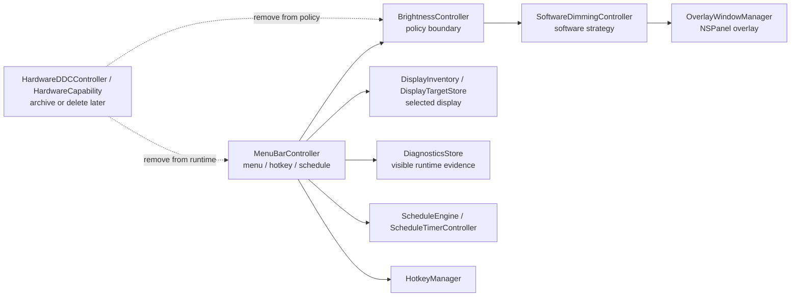

# Software-Only Dimming Plan

Date: 2026-06-18
Plan owner: Codex
Source research: [`../research.md`](../research.md)
Execution boundary: planning only. Approved implementation must run through `구현커밋`.

## Goal

Turn InnosDimmer into a software-only macOS menu bar dimmer for the user's M1 Mac, direct HDMI, and INNOS external monitor.

The app should stop behaving or documenting itself as hardware-first. It should rely on a robust click-through overlay as the primary dimming mechanism, keep warmth control, schedule, shortcuts, quick disable, restore, diagnostics, and visible platform limitations, and remove DDC/hardware code in safe stages.

## Requested Outcome

- Remove unreachable DDC runtime paths from active app flow.
- Keep software dimming behind existing policy/service boundaries.
- Harden overlay behavior across display changes, wake, reconnect, and quick disable.
- Add a safety floor so perceived dimming cannot black out the display accidentally.
- Retire hardware/DDC state and files only after migration and tests protect settings and diagnostics.
- Align README, operator guide, release notes, and archived DDC notes with software-only policy.
- Leave a `구현커밋`-ready plan with small `### Commit N:` execution units.

## Codebase Evidence

- `Confirmed`:
  - `BrightnessController.apply(_:)` currently routes normal commands to `.softwareOnly`.
  - `OverlayWindowManager.apply(display:brightness:warmth:)` is the only real dimming implementation.
  - `MenuBarCommand` and `MenuBarPopoverView` no longer expose a DDC probe command.
  - `MenuBarController` still contains unreachable `hardwareDDCController`, `runDDCProbe()`, `probeExportNote(for:)`, and hardware capability severity logic.
  - `BrightnessController` still contains unreachable `HardwareBrightnessStrategy`, `hardwareStrategy`, and `applyHardware(_:)`.
  - `BrightnessState`, `DiagnosticsSnapshot`, tests, and mode labels still reference hardware/DDC types.
  - `README.md` still says the app is hardware-first.
  - `xcodebuild -scheme InnosDimmer -configuration Debug build-for-testing CODE_SIGNING_ALLOWED=NO` currently succeeds.
- `Inferred`:
  - Removing active DDC runtime paths first is low risk because no current user command reaches them.
  - Removing hardware state and DDC source files should be a later commit because persistence and diagnostics still encode those types.
  - Overlay reapply should live behind `BrightnessController`/`SoftwareDimmingController`, not directly in UI.
- `Unverified`:
  - Full-screen Spaces, DRM/protected playback, screen sharing, and HDMI reconnect behavior still require manual QA on the user's actual setup.
  - Gamma/color-table dimming has not been tested on this M1 HDMI INNOS display.

## System Visualization



- changed nodes:
  - `BrightnessController`: remove hardware injection and unreachable hardware policy.
  - `MenuBarController`: remove unreachable DDC probe path; add overlay reapply/reconcile calls.
  - `SoftwareDimmingController` and `OverlayWindowManager`: add lifecycle, stale panel cleanup, and safety helpers.
  - `BrightnessState`, `DimmingMode`, diagnostics, tests: remove hardware state in a later migration commit.
  - docs: align with software-only policy.
- preserved nodes:
  - `DisplayInventory`, `DisplayTargetResolver`, `DisplayTargetStore`.
  - `ScheduleEngine`, manual override behavior, hotkey validation, quick disable, restore previous.
  - `VerificationMatrix` and platform-blocked disclosure.
- diagram notes:
  - UI, hotkeys, and schedule must continue to go through `BrightnessController`; they must not call overlay directly.

## Related Files

- `/Users/moonsoo/projects/InnosDimmer/research.md`: source evidence and hypothesis ladder.
- `/Users/moonsoo/projects/InnosDimmer/InnosDimmer/Services/BrightnessController.swift`: current policy boundary; contains dead hardware path.
- `/Users/moonsoo/projects/InnosDimmer/InnosDimmer/Services/SoftwareDimmingController.swift`: software dimming strategy; needs reapply/reconcile hooks.
- `/Users/moonsoo/projects/InnosDimmer/InnosDimmer/Services/OverlayWindowManager.swift`: AppKit overlay owner; needs stale panel cleanup and safety tests.
- `/Users/moonsoo/projects/InnosDimmer/InnosDimmer/UI/MenuBarController.swift`: runtime orchestration; contains dead DDC probe path and wake/display observers.
- `/Users/moonsoo/projects/InnosDimmer/InnosDimmer/UI/MenuBarPopoverView.swift`: menu controls and visible state; should stay command-based.
- `/Users/moonsoo/projects/InnosDimmer/InnosDimmer/UI/StatusBadgeView.swift`: mode labels; should stop exposing hardware mode after state migration.
- `/Users/moonsoo/projects/InnosDimmer/InnosDimmer/Domain/BrightnessState.swift`: settings-encoded state; hardware fields must be removed carefully.
- `/Users/moonsoo/projects/InnosDimmer/InnosDimmer/Domain/DimmingMode.swift`: remove `hardwareDDC` after diagnostics/tests are migrated.
- `/Users/moonsoo/projects/InnosDimmer/InnosDimmer/Domain/BrightnessCommand.swift`: remove `diagnosticsProbe` if no caller remains.
- `/Users/moonsoo/projects/InnosDimmer/InnosDimmer/Domain/SettingsSnapshot.swift`: bump schema if hardware fields are removed.
- `/Users/moonsoo/projects/InnosDimmer/InnosDimmer/Diagnostics/DiagnosticsStore.swift`: remove hardware capability from snapshots.
- `/Users/moonsoo/projects/InnosDimmer/InnosDimmer/Diagnostics/DiagnosticsExporter.swift`: remove `ProbeResult` export after DDC removal.
- `/Users/moonsoo/projects/InnosDimmer/InnosDimmer/Services/HardwareDDCController.swift`: archive/delete after runtime no longer references DDC types.
- `/Users/moonsoo/projects/InnosDimmer/InnosDimmer/Domain/HardwareCapability.swift`: delete after state/diagnostics migration.
- `/Users/moonsoo/projects/InnosDimmer/InnosDimmer/Domain/ProbeStep.swift`: delete with probe model.
- `/Users/moonsoo/projects/InnosDimmer/InnosDimmer/Diagnostics/CapabilityProbe.swift`: delete with probe model.
- `/Users/moonsoo/projects/InnosDimmer/InnosDimmer.xcodeproj/project.pbxproj`: remove deleted Swift file references.
- `/Users/moonsoo/projects/InnosDimmer/InnosDimmerTests/*.swift`: update tests around software-only policy, overlay lifecycle, diagnostics, settings.
- `/Users/moonsoo/projects/InnosDimmer/README.md`: stale hardware-first documentation.
- `/Users/moonsoo/projects/InnosDimmer/docs/operator-guide.md`: mostly aligned; update verification command and final behavior if needed.
- `/Users/moonsoo/projects/InnosDimmer/docs/release-notes-local.md`: stale Xcode-blocked note; update after verification.
- `/Users/moonsoo/projects/InnosDimmer/docs/ddc-probe-notes.md`: keep as archived note or delete after DDC file removal.
- `/Users/moonsoo/projects/InnosDimmer/docs/qa-matrix.md`: final manual QA checklist.

## Current Behavior

The app builds and already applies software overlay dimming for normal commands. The visible popover no longer exposes DDC. However, code and docs still carry old hardware-first assumptions:

- Runtime classes keep unreachable DDC code.
- State and diagnostics still encode hardware capability.
- README describes real DDC as a primary brightness mode.
- Tests still use hardware spies to prove hardware is not called.
- Manual QA for difficult visual contexts has not been completed.

## Change Map

- likely files to edit:
  - `InnosDimmer/Services/BrightnessController.swift`
  - `InnosDimmer/Services/SoftwareDimmingController.swift`
  - `InnosDimmer/Services/OverlayWindowManager.swift`
  - `InnosDimmer/UI/MenuBarController.swift`
  - `InnosDimmer/UI/StatusBadgeView.swift`
  - `InnosDimmer/Domain/BrightnessState.swift`
  - `InnosDimmer/Domain/DimmingMode.swift`
  - `InnosDimmer/Domain/BrightnessCommand.swift`
  - `InnosDimmer/Domain/SettingsSnapshot.swift`
  - `InnosDimmer/Diagnostics/DiagnosticsStore.swift`
  - `InnosDimmer/Diagnostics/DiagnosticsExporter.swift`
  - `InnosDimmer.xcodeproj/project.pbxproj`
  - `README.md`
  - `docs/operator-guide.md`
  - `docs/release-notes-local.md`
  - `docs/ddc-probe-notes.md`
  - `docs/qa-matrix.md`
- likely functions/components/hooks/stores/routes to touch:
  - `BrightnessController.init`, `apply(_:)`, `applySoftware(...)`
  - `SoftwareDimmingController.apply`, `clear`, new reapply/reconcile surface
  - `OverlayWindowManager.apply`, `clear`, new stale cleanup/testing helpers
  - `MenuBarController.reconcileScheduleAfterRuntimeBoundaryChange`
  - `MenuBarController.recordAppliedCommand`
  - `ModeStatusLabel.title(for:)`
  - `DiagnosticsStore.snapshot`
  - `DisplayTargetStore.load` tests around older JSON decode
- state/data/content dependencies:
  - `SettingsSnapshot` persists `BrightnessState`.
  - Old JSON with hardware fields must not reset schedule/shortcuts.
  - Diagnostics export shape can change because this is a personal local app, but tests must document the new shape.
- side effects/integrations to preserve or adjust:
  - AppKit overlay must stay click-through and all-Spaces.
  - Manual commands must still pause automation until the next schedule boundary.
  - Quick disable and restore previous must remain available.
  - Hotkeys must still route through `MenuBarController.perform`.
  - No third-party dependencies.
- likely new files:
  - optional `InnosDimmer/Domain/DimmingSafety.swift` for minimum perceived brightness constants.
  - optional test fixture helper if settings migration tests need old JSON.
- remaining narrow unknowns before patch:
  - Whether to delete `docs/ddc-probe-notes.md` or keep it as an archived note. Default: keep archived until the final cleanup commit, then decide from references.

## Planned Changes

- expected behavior changes:
  - The app presents itself as software-overlay-only.
  - Normal runtime no longer has hardware/DDC branches.
  - Overlay reappears or refreshes after wake/display-parameter changes.
  - Stale overlay panels for disconnected displays are cleared.
  - Extremely low requested brightness is visually floored to reduce accidental blackout risk.
  - Diagnostics snapshots no longer report hardware capability after the state migration commit.
- constraints to preserve:
  - `BrightnessController` remains the only command policy boundary.
  - UI, schedule, and hotkeys do not call `OverlayWindowManager` directly.
  - `DisplayInventory` still avoids silently selecting the main display.
  - `VerificationMatrix` still prevents claiming all contexts are handled without manual notes.
- execution order:
  - First remove unreachable active DDC paths.
  - Then align docs and visible vocabulary.
  - Then harden overlay lifecycle and safety while hardware state is still present.
  - Then remove hardware state/types/files with migration tests.
  - Then run build/manual QA and update final docs.

## Review Notes

- risks:
  - Removing hardware state too early can silently reset persisted settings if decoding breaks.
  - Overlay may still fail or behave partially in full-screen, DRM, or screen sharing contexts.
  - A maximum-dimming safety floor may make the app less dark than the user expects at the very low end.
  - Deleting files requires updating `project.pbxproj` carefully.
- assumptions:
  - Software-only overlay is now the approved product direction.
  - Gamma/color-table dimming is not required for the next implementation unit.
  - DDC code can be removed from the active app, with archived docs retained until cleanup is safe.
- unanswered questions:
  - Whether gamma should ever become an advanced option after overlay QA.
  - Whether the user wants overlay included in screen sharing output or only local viewing.

## Plan Quality Check

- Alternative considered:
  - Implement gamma/color-table dimming now. Rejected for this plan because it has higher conflict and recovery risk, and overlay already matches current code.
  - Keep DDC code indefinitely. Rejected because it keeps the product model inconsistent and has no user-facing path.
  - Delete all hardware files in the first commit. Rejected because settings, diagnostics, tests, and project references still depend on those types.
- Why this plan:
  - It follows the evidence in `research.md`: overlay is the lowest-risk first implementation; hardware state deletion needs a separate migration step.
- Tradeoff:
  - Chosen: overlay-only first, gamma deferred, DDC removed in stages.
  - Cost: the app may not dim cursor/protected surfaces perfectly.
  - Why acceptable: the user explicitly chose perceived dimming over direct display control, and partial/platform-blocked states remain visible.
- What this plan may still miss:
  - Real behavior in full-screen Spaces, DRM playback, screen sharing, and reconnect can only be proven on the user's desktop.
- When to stop and revise:
  - Stop if removing hardware state resets saved schedule/shortcuts.
  - Stop if overlay cannot be made visible/recoverable after wake/reconnect.
  - Stop if manual QA shows the overlay misses the user's primary use case.

## Skill Routing Manifest

| Phase | Required skills | Optional skills | Evidence |
| --- | --- | --- | --- |
| Commit 1: Remove active DDC runtime policy | `구현커밋` | `review-all-in-one` | `BrightnessController` and `MenuBarController` contain unreachable hardware paths; tests must prove software-only routing without hardware spies. |
| Commit 2: Align software-only docs and visible vocabulary | `구현커밋` | `content-sync-auditor` | `README.md` conflicts with `docs/operator-guide.md` and current behavior. |
| Commit 3: Harden overlay lifecycle and safety floor | `구현커밋` | `qa-gate` | `OverlayWindowManager` is the active dimming path; wake/display observers already exist in `MenuBarController`. |
| Commit 4: Retire hardware state, diagnostics, and files with migration tests | `구현커밋` | `review-all-in-one` | `BrightnessState`, `DiagnosticsSnapshot`, tests, and Xcode project references still encode hardware types. |
| Commit 5: Verify local app and finalize QA handoff docs | `구현커밋` | `테스트`, `review-all-in-one`, `qa-gate`, `computer-use-operator` | Native app verification requires xcodebuild plus local menu bar/manual QA evidence. |
| Final Gate | `review-all-in-one`, `qa-gate` | `테스트` | Final review should focus on persistence migration, overlay recovery, docs consistency, and no hidden DDC path. |

## Implementation Plan

### Commit 1: Remove active DDC runtime policy

- target files:
  - `InnosDimmer/Services/BrightnessController.swift`
  - `InnosDimmer/UI/MenuBarController.swift`
  - `InnosDimmerTests/BrightnessControllerTests.swift`
  - `InnosDimmerTests/SoftwareDimmingControllerTests.swift`
  - `InnosDimmerTests/MenuBarStateTests.swift`
- changes:
  - Delete `HardwareBrightnessStrategy`.
  - Remove `hardwareStrategy` and the `hardwareStrategy:` initializer parameter from `BrightnessController`.
  - Delete private `applyHardware(_:)` and `hardwareFailureMessage(from:)`.
  - Keep `apply(_:)` as a software-only policy call.
  - Delete `MenuBarController.hardwareDDCController`, its initializer parameter, `runDDCProbe()`, `probeExportNote(for:)`, and `diagnosticsSeverity(for capability:)`.
  - Update tests to use software strategy spies only; do not keep hardware spies just to assert they were not called.
- code snippets:
  - `BrightnessController.apply(_:)` proposed final shape:

```swift
func apply(_ command: BrightnessCommand) {
    let reason = forcedSoftwareActivationReason(for: command) ?? SoftwareActivationReason.softwareOnly
    applySoftware(command, reason: reason)
}
```

  - `BrightnessController.init` proposed final shape:

```swift
init(
    state: BrightnessState = .defaultState(),
    softwareStrategy: SoftwareDimmingStrategy = SoftwareDimmingController()
) {
    self.state = state
    self.softwareStrategy = softwareStrategy
}
```

- tradeoff:
  - chosen: remove active DDC runtime now.
  - alternative: leave dead DDC branches until all hardware files are deleted.
  - cost/risk: tests that inject hardware spies must be rewritten.
  - why acceptable: no visible command reaches DDC, and software-only routing is the approved policy.
  - revisit when: a future explicit hardware-control request appears.
- verification:
  - `xcodebuild -scheme InnosDimmer -configuration Debug build-for-testing CODE_SIGNING_ALLOWED=NO`: asserts app/tests compile after active DDC path removal.
  - `rg -n "HardwareBrightnessStrategy|hardwareStrategy|runDDCProbe|probeExportNote|hardwareDDCController" InnosDimmer InnosDimmerTests`: asserts no active runtime references remain.
- success criteria:
  - Build-for-testing passes.
  - Normal brightness commands still set `state.activeMode = .overlay`.
  - Forced software diagnostic reason still works.
  - No active UI/runtime class owns a DDC probe controller.
- stop conditions:
  - Stop if `BrightnessController` still needs hardware types only because diagnostics/state migration was pulled into this commit.
  - Stop if removing the initializer parameter breaks a test double pattern that cannot be replaced with a software spy.

### Commit 2: Align software-only docs and visible vocabulary

- target files:
  - `README.md`
  - `docs/operator-guide.md`
  - `docs/release-notes-local.md`
  - `docs/ddc-probe-notes.md`
  - `docs/qa-matrix.md`
  - `InnosDimmer/UI/StatusBadgeView.swift`
  - `InnosDimmerTests/MenuBarStateTests.swift`
- changes:
  - Rewrite README as software-overlay-only, not hardware-first.
  - Update local verification docs to use current `xcodebuild` success path.
  - Keep `docs/ddc-probe-notes.md` clearly marked as archived historical reference unless Commit 4 deletes it.
  - Change any user-facing text that implies real monitor backlight control.
  - Keep `ModeStatusLabel` hardware label only if `DimmingMode.hardwareDDC` still exists before Commit 4, but mark it non-user-facing in tests/docs.
- code snippets:
  - `README.md` proposed policy copy:

```md
InnosDimmer is a personal macOS menu bar utility that reduces perceived brightness
on a selected secondary display using a click-through software overlay.
It does not attempt hardware DDC/CI brightness control in normal operation.
```

- tradeoff:
  - chosen: align docs before deleting every hardware type.
  - alternative: wait until all code cleanup is done.
  - cost/risk: docs will mention some code is archived/transitional for one commit.
  - why acceptable: user-facing direction becomes clear early.
  - revisit when: Commit 4 deletes DDC files and docs need final cleanup.
- verification:
  - `rg -n "hardware-first|Hardware DDC|real monitor backlight|DDC Probe|DDC/CI" README.md docs InnosDimmer/UI InnosDimmerTests`: asserts remaining hits are archived/historical or intentionally transitional.
  - `xcodebuild -scheme InnosDimmer -configuration Debug build-for-testing CODE_SIGNING_ALLOWED=NO`: asserts label/test updates compile.
- success criteria:
  - README and operator docs agree that overlay is the only normal dimming path.
  - Release notes no longer say Xcode is blocked if `xcodebuild` is passing.
  - Remaining DDC mentions are explicitly archived or scheduled for Commit 4.
- stop conditions:
  - Stop if docs need to claim manual QA pass before manual QA has been run.

### Commit 3: Harden overlay lifecycle and safety floor

- target files:
  - `InnosDimmer/Services/SoftwareDimmingController.swift`
  - `InnosDimmer/Services/OverlayWindowManager.swift`
  - `InnosDimmer/Services/BrightnessController.swift`
  - `InnosDimmer/UI/MenuBarController.swift`
  - optional `InnosDimmer/Domain/DimmingSafety.swift`
  - `InnosDimmerTests/SoftwareDimmingControllerTests.swift`
  - `InnosDimmerTests/MenuBarStateTests.swift`
  - `InnosDimmerTests/BrightnessControllerTests.swift`
- changes:
  - Add a named minimum visual brightness floor, initially `10`.
  - Apply the floor to overlay opacity calculation, not necessarily to the user's stored target value.
  - Add an overlay reapply path that can refresh the current software command after wake/display change.
  - Add stale panel cleanup for display IDs no longer active.
  - Wire `MenuBarController.reconcileScheduleAfterRuntimeBoundaryChange()` to clear stale panels and reapply current state if a selected display still exists.
  - Keep quick disable and restore previous unchanged.
- code snippets:
  - `DimmingSafety` proposed helper:

```swift
enum DimmingSafety {
    static let minimumVisibleBrightness = 10

    static func visualBrightness(for requestedBrightness: Int) -> Int {
        max(minimumVisibleBrightness, Clamped.percent(requestedBrightness))
    }
}
```

  - `OverlayAppearance.make` proposed use:

```swift
let visualBrightness = DimmingSafety.visualBrightness(for: brightness)
return OverlayAppearance(
    blackOpacity: CGFloat(100 - visualBrightness) / 130.0,
    warmOpacity: CGFloat(clampedWarmth) / 180.0
)
```

  - `BrightnessController` proposed reapply surface:

```swift
func reapplyCurrentSoftwareState() {
    guard let display = state.display else { return }
    let command = BrightnessCommand(
        display: display,
        brightness: state.targetBrightness,
        warmth: state.targetWarmth,
        source: state.lastAppliedCommandSource ?? .startupRestore
    )
    applySoftware(command, reason: .softwareOnly)
}
```

  - `OverlayWindowManager` proposed stale cleanup:

```swift
func clearPanels(excluding activeDisplayIDs: Set<UInt32>) {
    for displayID in panelsByDisplayID.keys where !activeDisplayIDs.contains(displayID) {
        panelsByDisplayID[displayID]?.orderOut(nil)
        panelsByDisplayID.removeValue(forKey: displayID)
    }
}
```

- tradeoff:
  - chosen: safety floor in overlay appearance.
  - alternative: clamp stored brightness commands to 10.
  - cost/risk: UI may show `0%` while the visual overlay uses the safety floor.
  - why acceptable: it preserves user intent data while preventing accidental full blackout.
  - revisit when: user explicitly asks for dim-to-black and accepts a recovery mechanism.
- verification:
  - `xcodebuild -scheme InnosDimmer -configuration Debug build-for-testing CODE_SIGNING_ALLOWED=NO`: asserts lifecycle APIs compile.
  - Unit tests for `OverlayAppearance.make(brightness: 0, warmth: ...)`: asserts black opacity uses safety floor.
  - Unit tests for stale panel cleanup with injected display frame provider or testing accessors: asserts disconnected display panels are removed.
  - Unit tests for `MenuBarController` wake/display reconcile path if exposed/testable: asserts reapply does not create direct overlay calls from UI.
- success criteria:
  - Overlay remains click-through and all-Spaces.
  - Reconcile path re-applies current software state after wake/display change.
  - Stale display panels are cleared.
  - Requested brightness values are preserved, but visual dimming has a safety floor.
- stop conditions:
  - Stop if reapply requires UI to call `OverlayWindowManager` directly.
  - Stop if stale cleanup cannot be tested without exposing too much AppKit internals.
  - Stop if the safety floor breaks existing command semantics in a way tests cannot make explicit.

### Commit 4: Retire hardware state, diagnostics, and files with migration tests

- target files:
  - `InnosDimmer/Domain/BrightnessState.swift`
  - `InnosDimmer/Domain/DimmingMode.swift`
  - `InnosDimmer/Domain/BrightnessCommand.swift`
  - `InnosDimmer/Domain/SettingsSnapshot.swift`
  - `InnosDimmer/Diagnostics/DiagnosticsStore.swift`
  - `InnosDimmer/Diagnostics/DiagnosticsExporter.swift`
  - `InnosDimmer/UI/StatusBadgeView.swift`
  - `InnosDimmer/Services/HardwareDDCController.swift`
  - `InnosDimmer/Domain/HardwareCapability.swift`
  - `InnosDimmer/Domain/ProbeStep.swift`
  - `InnosDimmer/Diagnostics/CapabilityProbe.swift`
  - `InnosDimmerTests/HardwareDDCControllerTests.swift`
  - `InnosDimmerTests/DiagnosticsStoreTests.swift`
  - `InnosDimmerTests/SettingsSnapshotTests.swift`
  - `InnosDimmerTests/MenuBarStateTests.swift`
  - `InnosDimmer.xcodeproj/project.pbxproj`
- changes:
  - Remove hardware capability and last probe result from `BrightnessState`.
  - Remove `DimmingMode.hardwareDDC`.
  - Remove `BrightnessCommandSource.diagnosticsProbe` if no caller remains.
  - Remove `SoftwareActivationReason.hardwareNotReady` and `.hardwareExhausted`.
  - Remove `DiagnosticsSnapshot.hardwareCapability`.
  - Delete DDC/probe model files and their tests.
  - Update Xcode project file references.
  - Bump `SettingsSnapshot.currentSchemaVersion` to `2` if tests show that helps document the model transition.
  - Add a test that decodes old JSON containing hardware fields and preserves selected display, schedule, shortcuts, brightness, and warmth.
- code snippets:
  - `BrightnessState` proposed final shape:

```swift
struct BrightnessState: Codable, Equatable {
    var display: DisplayIdentity?
    var targetBrightness: Int
    var targetWarmth: Int
    var activeMode: DimmingMode
    var automationPausedUntilNextBoundary: Bool
    var automationPausedAtMinuteOfDay: Int?
    var automationResumeMinuteOfDay: Int?
    var lastAppliedCommandSource: BrightnessCommandSource?
    var isForcedSoftwareModeForTesting: Bool
}
```

  - `DimmingMode` proposed final shape:

```swift
enum DimmingMode: String, Codable, Equatable {
    case unknown
    case gamma
    case overlay
    case platformBlocked
}
```

  - Old JSON migration test sketch:

```swift
func testSettingsSnapshotDecodesLegacyHardwareFields() throws {
    let data = Data(legacySchemaOneJSON.utf8)
    let decoded = try JSONDecoder().decode(SettingsSnapshot.self, from: data)

    XCTAssertEqual(decoded.schedule, ScheduleEntry.defaultSchedule)
    XCTAssertEqual(decoded.state.targetBrightness, 45)
    XCTAssertEqual(decoded.state.targetWarmth, 32)
}
```

- tradeoff:
  - chosen: delete hardware model after active runtime and overlay hardening are stable.
  - alternative: keep hardware files as unused archive code.
  - cost/risk: larger compile/project reference cleanup.
  - why acceptable: it removes the misleading product model and reduces future branching.
  - revisit when: old settings JSON cannot decode without custom migration support.
- verification:
  - `rg -n "HardwareCapability|ProbeResult|ProbeStep|HardwareDDCController|DDCAdapter|hardwareDDC|diagnosticsProbe|hardwareNotReady|hardwareExhausted" InnosDimmer InnosDimmerTests`: asserts no runtime/test references remain, except archived docs if retained.
  - `xcodebuild -scheme InnosDimmer -configuration Debug build-for-testing CODE_SIGNING_ALLOWED=NO`: asserts project references and tests compile.
  - Settings migration test: asserts old snapshot JSON does not reset user data.
  - Diagnostics exporter test: asserts new snapshot export excludes hardware capability.
- success criteria:
  - Hardware/DDC Swift files are gone from target membership or deleted.
  - State, diagnostics, and labels no longer mention hardware mode.
  - Old persisted settings with extra hardware fields still decode.
  - Build-for-testing passes.
- stop conditions:
  - Stop if Xcode project file changes become ambiguous or remove unrelated file references.
  - Stop if deleting hardware fields causes `DisplayTargetStore.load()` to fall back to defaults for realistic old settings.

### Commit 5: Verify local app and finalize QA handoff docs

- target files:
  - `README.md`
  - `docs/operator-guide.md`
  - `docs/release-notes-local.md`
  - `docs/qa-matrix.md`
  - optional `docs/ddc-probe-notes.md`
- changes:
  - Run Debug build-for-testing and Release build.
  - Launch Release app locally if the build succeeds.
  - Verify popover opens and shows software-overlay state.
  - Verify brightness down/up and warmth down/up apply overlay and update diagnostics.
  - Verify quick disable and restore previous.
  - Record which manual QA scenarios remain untested; do not mark them pass without observation.
  - Update docs with actual verification status.
  - If DDC files were deleted, either delete `docs/ddc-probe-notes.md` or keep it as historical rationale with no current-code claims.
- code snippets:
  - `docs/qa-matrix.md` expected note style:

```md
| General desktop | pass | 2026-06-18, Release app, INNOS external display: brightness down visibly darkened selected display; diagnostics showed Overlay active. |
```

- tradeoff:
  - chosen: final docs only report evidence actually observed.
  - alternative: mark all scenarios handled because overlay exists.
  - cost/risk: QA matrix may still contain not-tested rows.
  - why acceptable: honest limitations are safer than overclaiming display coverage.
  - revisit when: the user can run through full-screen, DRM, screen sharing, and reconnect checks.
- verification:
  - `xcodebuild -scheme InnosDimmer -configuration Debug build-for-testing CODE_SIGNING_ALLOWED=NO`: asserts debug/test build.
  - `xcodebuild -scheme InnosDimmer -configuration Release build CODE_SIGNING_ALLOWED=NO`: asserts release build.
  - Local app manual check or Computer Use check: asserts menu bar popover and overlay commands work.
  - `git diff --check`: asserts no whitespace errors.
- success criteria:
  - Debug build-for-testing passes.
  - Release build passes.
  - At least general desktop overlay commands are verified locally or explicitly recorded as not run.
  - Docs match current behavior and verification state.
- stop conditions:
  - Stop if Release app cannot launch.
  - Stop if overlay commands update diagnostics but do not visually affect the selected display.
  - Stop if manual QA exposes a platform-blocked case that needs product copy before final docs.

## Operator 결정 필요 사항

- 상태: 보류됨
- 결정 1: Gamma/color-table mode timing
  - 맥락: Research found gamma can cover contexts overlay may miss, but it has higher conflict and recovery risk.
  - A: Overlay-only now; reconsider gamma only after overlay QA. Lowest risk and matches current code.
  - B: Implement gamma as an advanced hidden/diagnostic option in this plan. More coverage potential, more recovery risk.
  - C: Permanently reject gamma. Simplest product, but cursor/protected-surface limitations may remain unresolved.
  - 추천안: A. Build a robust overlay first and defer gamma until real QA says it is needed.
  - 기본값: A. No gamma implementation in this plan.
  - 보류 시 영향: No current implementation is blocked. If overlay fails a key context, a later plan can add gamma as a targeted experiment.
- 결정 2: Archived DDC material
  - 맥락: Current code should stop using DDC, but old research and probe notes explain why hardware control was abandoned.
  - A: Delete active DDC code and keep `docs/ddc-probe-notes.md` as historical rationale. Best traceability.
  - B: Delete all DDC code and docs. Cleanest tree, less historical context.
  - C: Keep DDC code as inactive archive in source. Lowest deletion work, highest confusion risk.
  - 추천안: A. Delete active code, keep archived rationale unless it contains false current-code claims.
  - 기본값: A.
  - 보류 시 영향: If undecided, Commit 4 should remove active code and update docs to avoid false claims, but may leave the archived note.

## 검토용 결과물

- HTML: 해당 없음
- 테스트 링크:
  - Localhost: 해당 없음. This is a native macOS AppKit app, not a web app with a dev server.
  - Deploy: 해당 없음. No deploy target exists for this local personal utility.
- 상태: implemented as plan document
- 실제 동작:
  - Plan source and current build evidence are reviewable in this Markdown file.
  - Current verification command already run: `xcodebuild -scheme InnosDimmer -configuration Debug build-for-testing CODE_SIGNING_ALLOWED=NO`.
- Mock:
  - None.

## 후행 실행

- 기본 실행: 구현커밋
- 계획 경로 처리: 구현커밋이 직전 대화, 계획 링크, active plan context에서 자동 탐지
- 명시 계획 경로: `/Users/moonsoo/projects/InnosDimmer/docs/2026-06-18-software-only-dimming-plan.md`
- 모호할 때: 후보 목록을 보여주고 Operator에게 선택 요청

## HTML 생략 보고서

- 판정: 생략 가능
- 생략 사유:
  - This is a native macOS behavior/refactor plan. The requested artifact is an implementation-ready plan, not a visual design decision or web UI mock.
  - The useful review surface is the plan MD plus xcodebuild/manual app verification commands.
- 대체 검토물:
  - Plan MD: `/Users/moonsoo/projects/InnosDimmer/docs/2026-06-18-software-only-dimming-plan.md`
  - Research MD: `/Users/moonsoo/projects/InnosDimmer/research.md`
  - Verification command: `xcodebuild -scheme InnosDimmer -configuration Debug build-for-testing CODE_SIGNING_ALLOWED=NO`
- 테스트 링크:
  - Localhost: 해당 없음. Native macOS app.
  - Deploy: 해당 없음. Local personal utility.
- 사용자가 바로 열어볼 링크:
  - [Software-only dimming plan](./2026-06-18-software-only-dimming-plan.md)

## 구현 후 검토 리스트

- 회귀 확인:
  - Brightness up/down, warmth up/down, quick disable, and restore previous still route through `BrightnessController`.
  - Manual commands still pause automation until the next schedule boundary.
  - Schedule entries still sort and persist.
  - Shortcut validation and registration behavior remains unchanged.
  - Display selection still avoids silently selecting the main display.
- 검증 확인:
  - Run `xcodebuild -scheme InnosDimmer -configuration Debug build-for-testing CODE_SIGNING_ALLOWED=NO`.
  - Run `xcodebuild -scheme InnosDimmer -configuration Release build CODE_SIGNING_ALLOWED=NO`.
  - Run `git diff --check`.
  - Launch the Release app and verify popover commands on the external display.
  - Update `docs/qa-matrix.md` only with observed notes.
- 리뷰 관점:
  - `review-all-in-one`: check persistence migration, project file deletions, and docs consistency.
  - `qa-gate`: check build commands and manual QA matrix honesty.
  - `review-swarm`: optional if Commit 4 deletes many files or project references.
- Operator 재확인:
  - Confirm whether overlay is acceptable in full-screen Spaces, browser video, DRM/protected playback, screen sharing, sleep/wake, and HDMI reconnect.
  - Decide later whether gamma/color-table mode is needed.

## Validation

- manual checks:
  - Not run in this plan-first pass; implementation must run local app QA in Commit 5.
- lint/build/test scope:
  - Ran `xcodebuild -scheme InnosDimmer -configuration Debug build-for-testing CODE_SIGNING_ALLOWED=NO` on 2026-06-18 before writing this plan; result: `TEST BUILD SUCCEEDED`.
  - Plan document verification to run before handoff: `rg` section checks and `git diff --check`.
- scenario-to-surface checks:
  - General desktop: implementation Commit 5 manual QA.
  - Full-screen Spaces: implementation Commit 5 manual QA or explicit not-tested note.
  - Browser full-screen video: implementation Commit 5 manual QA or explicit not-tested note.
  - DRM/protected playback: implementation Commit 5 manual QA or platform-blocked note.
  - Screen sharing/recording: implementation Commit 5 manual QA or explicit not-tested note.
  - Sleep/wake and HDMI reconnect: implementation Commit 5 manual QA or explicit not-tested note.
