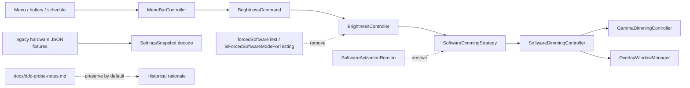

# 2026-06-19 DDC/CI Cleanup Plan First

## Goal

DDC/CI 하드웨어 밝기 조작 시도 이후 남은 active-code 잔여물을 안전하게 줄여, InnosDimmer의 현재 제품 모델을 software dimming-only 구조로 더 명확하게 만든다.

이번 계획은 하드웨어 밝기 조작 기능을 되살리거나 gamma/overlay 동작을 바꾸지 않는다. 이미 제거된 `HardwareDDCController` 계열 코드를 다시 다루지 않고, 현재 active source에 남아 있는 forced-software fallback/diagnostic residue와 문서/테스트 명칭만 정리한다.

## Requested Outcome

사용자는 `plan-first-implementation`을 호출했다. 직전 리서치 결론은 다음이다.

- active source/Xcode project에는 `HardwareDDCController`, `DDCAdapter`, `HardwareCapability`, `hardwareDDC`, `diagnosticsProbe`, `pendingCommand` 같은 DDC/CI 핵심 구현 흔적이 없다.
- 남은 정리 후보는 `SoftwareActivationReason`, `forcedSoftwareTest`, `isForcedSoftwareModeForTesting` 같은 하드웨어 fallback 시절의 diagnostic hook이다.
- legacy hardware JSON decode tests는 지우면 안 된다. 예전 설정을 보존하는 안전장치다.
- `platformBlocked`, display hardware identity matching, `GammaDimmingController`는 현재 기능/상태 모델에 필요한 코드라서 DDC cleanup 대상이 아니다.

이번 산출물:

- 구현 가능한 plan-first MD.
- 후행 실행 단위: `구현커밋`이 추출 가능한 `### Commit N:` heading.
- HTML artifact는 만들지 않는다. 이 작업은 UI/UX 판단이 아니라 Swift 런타임/테스트/문서 cleanup이며, 검토 표면은 계획 MD와 검증 명령이다.

## Codebase Evidence

- `Confirmed`:
  - `/Users/moonsoo/projects/InnosDimmer/docs/research/hardware-cleanup/research.md`는 active source/test/project에 DDC runtime symbol이 없고, `git ls-files | rg -i 'Hardware|DDC|Probe|Capability|Adapter|pendingCommand|applyPendingPreview'` 결과가 `docs/ddc-probe-notes.md`뿐이라고 기록한다.
  - `/Users/moonsoo/projects/InnosDimmer/InnosDimmer/Services/SoftwareDimmingController.swift`의 `SoftwareActivationReason`은 protocol API에 남아 있지만 concrete `SoftwareDimmingController.apply`에서는 `_ = reason`으로 버려진다.
  - `/Users/moonsoo/projects/InnosDimmer/InnosDimmer/Services/BrightnessController.swift`는 `isForcedSoftwareModeForTesting` 또는 `.forcedSoftwareTest`일 때만 `.forcedForDiagnostics` reason을 만든다.
  - `BrightnessController.apply`, `BrightnessController.reapplyCurrentSoftwareState`, and `BrightnessController.applySoftware` currently all pass `.softwareOnly` or `.forcedForDiagnostics`; removing the reason type therefore also requires removing the forced-reason branch in the same compilation unit.
  - `/Users/moonsoo/projects/InnosDimmer/InnosDimmer/Domain/BrightnessState.swift`는 `isForcedSoftwareModeForTesting`을 Codable state에 보유한다.
  - `/Users/moonsoo/projects/InnosDimmer/InnosDimmer/Domain/BrightnessCommand.swift`는 `BrightnessCommandSource.forcedSoftwareTest`를 보유한다.
  - `/Users/moonsoo/projects/InnosDimmer/InnosDimmerTests/SettingsSnapshotTests.swift`는 old JSON의 `hardwareCapability`와 `lastHardwareProbeResult`를 decode해 schedule/shortcuts/state가 유지되는지 확인한다.
  - `/Users/moonsoo/projects/InnosDimmer/docs/qa-matrix.md`는 `Diagnostics can force software mode through forcedSoftwareTest`라고 말한다.
  - `rg` shows five test fake implementations of `SoftwareDimmingStrategy.apply(_:reason:)` across `BrightnessControllerTests`, `SoftwareDimmingControllerTests`, `MenuBarStateTests`, `ScheduleEngineTests`, and `HotkeyBindingTests`.
- `Inferred`:
  - `SoftwareActivationReason` 제거는 런타임 동작보다 protocol/test fake 정리에 가깝다.
  - `.forcedSoftwareTest` 제거는 Codable enum 경계이므로 old persisted source fallback을 같이 설계해야 한다. Fallback target should be non-manual to avoid accidentally pausing automation after decoding old state.
  - `isForcedSoftwareModeForTesting` 제거는 object key 제거라 old JSON compatibility risk가 상대적으로 낮다.
- `Unverified`:
  - 사용자의 실제 persisted settings에 `"lastAppliedCommandSource": "forcedSoftwareTest"`가 있는지는 확인하지 않았다.
  - 새 cleanup 이후 `xcodebuild`는 아직 실행하지 않았다.
  - 기존 dirty worktree에 unrelated UI/test/capture changes가 있다.

## System Visualization



- changed nodes:
  - `SoftwareDimmingStrategy`: remove unused reason parameter.
  - `BrightnessController`: remove forced software activation branch.
  - `BrightnessState`: remove test-only persisted forced-software flag.
  - `BrightnessCommandSource`: remove forced software command source with decode fallback.
  - tests/docs: rename/update current references.
- preserved nodes:
  - `GammaDimmingController`: current blue reduction behavior.
  - `OverlayWindowManager`: current perceived brightness behavior.
  - `DisplayTargetResolver` hardware identity matching.
  - `platformBlocked` mode and verification matrix semantics.
  - legacy hardware JSON decode coverage.
  - archived `docs/ddc-probe-notes.md`, unless Operator explicitly chooses deletion later.
- diagram notes:
  - This plan removes remnants of the hardware-vs-software routing era, not current software gamma/overlay functionality.

## Related Files

- `/Users/moonsoo/projects/InnosDimmer/docs/research/hardware-cleanup/research.md`: source evidence for this plan.
- `/Users/moonsoo/projects/InnosDimmer/InnosDimmer/Services/SoftwareDimmingController.swift`: owns `SoftwareActivationReason` and `SoftwareDimmingStrategy`.
- `/Users/moonsoo/projects/InnosDimmer/InnosDimmer/Services/BrightnessController.swift`: owns forced software activation logic.
- `/Users/moonsoo/projects/InnosDimmer/InnosDimmer/Domain/BrightnessCommand.swift`: owns `BrightnessCommandSource`.
- `/Users/moonsoo/projects/InnosDimmer/InnosDimmer/Domain/BrightnessState.swift`: owns persisted dimming state.
- `/Users/moonsoo/projects/InnosDimmer/InnosDimmer/UI/MenuBarController.swift`: references `.forcedSoftwareTest` in source classification/labels.
- `/Users/moonsoo/projects/InnosDimmer/InnosDimmerTests/BrightnessControllerTests.swift`: asserts activation reasons.
- `/Users/moonsoo/projects/InnosDimmer/InnosDimmerTests/SoftwareDimmingControllerTests.swift`: tests forced software path and software-only behavior names.
- `/Users/moonsoo/projects/InnosDimmer/InnosDimmerTests/MenuBarStateTests.swift`, `/Users/moonsoo/projects/InnosDimmer/InnosDimmerTests/ScheduleEngineTests.swift`, `/Users/moonsoo/projects/InnosDimmer/InnosDimmerTests/HotkeyBindingTests.swift`: contain fake `SoftwareDimmingStrategy` implementations.
- `/Users/moonsoo/projects/InnosDimmer/InnosDimmerTests/SettingsSnapshotTests.swift`: legacy hardware JSON decode guardrail.
- `/Users/moonsoo/projects/InnosDimmer/docs/qa-matrix.md`: current QA text mentioning forced software diagnostics.
- `/Users/moonsoo/projects/InnosDimmer/docs/ddc-probe-notes.md`: archived DDC reference, not default cleanup target.

## Current Behavior

Current active DDC/CI status:

- No active DDC/CI hardware brightness implementation remains in source/test/project membership.
- `docs/ddc-probe-notes.md` is the only tracked file whose path itself references DDC.
- README/operator guide already state the app does not attempt hardware DDC/CI monitor brightness control in normal operation.

Current leftover behavior:

- `BrightnessController.apply` still computes a `SoftwareActivationReason`.
- `SoftwareDimmingStrategy.apply` still requires `reason`.
- Current `SoftwareDimmingController.apply` ignores `reason`.
- Tests record `activationReasons` to prove software-only or forced-diagnostic paths.
- `BrightnessState` still persists `isForcedSoftwareModeForTesting`, even though no user-facing hardware/software mode selection remains.
- `BrightnessCommandSource` still has `.forcedSoftwareTest`.

## Change Map

- likely files to edit:
  - `InnosDimmer/Services/SoftwareDimmingController.swift`
  - `InnosDimmer/Services/BrightnessController.swift`
  - `InnosDimmer/Domain/BrightnessCommand.swift`
  - `InnosDimmer/Domain/BrightnessState.swift`
  - `InnosDimmer/UI/MenuBarController.swift`
  - `InnosDimmerTests/BrightnessControllerTests.swift`
  - `InnosDimmerTests/SoftwareDimmingControllerTests.swift`
  - `InnosDimmerTests/MenuBarStateTests.swift`
  - `InnosDimmerTests/ScheduleEngineTests.swift`
  - `InnosDimmerTests/HotkeyBindingTests.swift`
  - `InnosDimmerTests/BrightnessStateTests.swift`
  - `InnosDimmerTests/SettingsSnapshotTests.swift`
  - `docs/qa-matrix.md`
- likely functions/components/hooks/stores/routes to touch:
  - `SoftwareDimmingStrategy.apply`
  - `SoftwareDimmingController.apply`
  - `BrightnessController.apply`
  - `BrightnessController.applySoftware`
  - `BrightnessController.reapplyCurrentSoftwareState`
  - `BrightnessController.forcedSoftwareActivationReason`
  - `BrightnessCommandSource` Codable implementation
  - `BrightnessState.init` and Codable conformance
  - `MenuBarController.pausesAutomation(for:)`
  - `MenuBarController.commandSourceLabel(for:)`
- state/data/content dependencies:
  - `SettingsSnapshot` persisted JSON must still decode old hardware-era fixtures.
  - `lastAppliedCommandSource` must not break if old data contains `forcedSoftwareTest`.
- side effects/integrations to preserve or adjust:
  - All menu/hotkey/schedule commands still apply software dimming immediately.
  - Manual commands still pause automation until next schedule boundary.
  - Schedule/startup restore commands still do not become manual overrides.
  - Diagnostics still report software apply failures and `platformBlocked`.
- likely new files:
  - No production file required.
- remaining narrow unknowns before patch:
  - Whether to support unknown `BrightnessCommandSource` values globally with fallback to `.startupRestore` or only handle `forcedSoftwareTest` as legacy.

## Planned Changes

- expected behavior changes:
  - No externally visible dimming behavior should change.
  - `SoftwareDimmingStrategy` no longer carries a reason that runtime ignores.
  - Forced-software test state/source no longer exists in active model.
  - Docs stop presenting `forcedSoftwareTest` as a diagnostic path.
- constraints to preserve:
  - Do not reintroduce DDC/CI or hardware brightness control.
  - Do not remove gamma blue reduction.
  - Do not remove `platformBlocked`.
  - Do not remove display hardware identity matching.
  - Do not delete legacy hardware JSON decode tests.
  - Do not touch unrelated dirty UI/capture changes.
- execution order:
  - First remove the ignored strategy reason layer and the forced-reason branch that cannot compile without it.
  - Then remove the now-inactive forced-software state/source with decode fallback.
  - Then update test names/docs and run focused searches.

## Review Notes

- risks:
  - Removing a Codable enum case can break old persisted settings unless decode fallback is explicit.
  - Protocol signature changes require all test fakes to be updated in the same commit.
  - Dirty worktree has unrelated UI/test/capture changes; implementation must avoid staging/reverting them.
- assumptions:
  - No user-facing feature currently emits `.forcedSoftwareTest`.
  - `docs/ddc-probe-notes.md` should remain archived rationale by default.
  - Current no-op warmth overlay residue is out of scope for DDC cleanup.
- unanswered questions:
  - Whether the user wants archived DDC docs deleted later for a cleaner repo.
  - Whether `.gamma` should eventually be removed or replaced by a combined mode. This is not part of this cleanup.

## Plan Quality Check

- Alternative considered:
  - Delete every file/doc mentioning DDC/hardware. Rejected because legacy decode tests and archived rationale are protective, not dirty runtime code.
  - Keep all forced-software hooks. Rejected because they preserve a hardware/software routing mental model that no longer exists.
  - Include `.gamma` and warm overlay no-op cleanup now. Rejected as scope creep; those are current/adjacent software-mode concerns, not DDC/CI hardware cleanup.
- Why this plan:
  - It removes the active leftovers most directly tied to the old hardware fallback era while protecting persisted settings and current software dimming.
- Tradeoff:
  - chosen: remove unused reason/forced-software path, keep archived docs and legacy decode guardrails.
  - alternative: aggressively delete all historical references.
  - cost/risk: some historical DDC mentions remain in docs, so search output is not perfectly clean.
  - why acceptable: active code becomes cleaner without losing the decision record for why DDC was abandoned.
  - revisit when: user explicitly asks to delete archived rationale or create a public-facing repo without historical hardware notes.
- What this plan may still miss:
  - A persisted settings value with an unexpected old enum raw value besides `forcedSoftwareTest`.
  - Local untracked/modified design files can complicate later commit packaging if not separated.
- When to stop and revise:
  - If `SettingsSnapshotTests` show old settings fall back to defaults.
  - If removing the protocol reason breaks a current diagnostics assertion that should remain product behavior.
  - If `rg` finds active DDC/hardware runtime symbols not covered by this plan.

## Review Iteration Notes

- Iteration 1 finding: removing `SoftwareActivationReason` cannot be isolated to `SoftwareDimmingController.swift`; `BrightnessController.apply`, `reapplyCurrentSoftwareState`, `applySoftware`, `forcedSoftwareActivationReason`, and every `SoftwareDimmingStrategy` fake must change together or the build cannot compile.
- Iteration 1 action: Commit 1 now owns the full protocol/call-site/fake update, while Commit 2 only removes the still-persisted forced-software state/source after legacy decode protection is in place.
- Iteration 2 finding: the legacy `"forcedSoftwareTest"` fixture must be a full `SettingsSnapshot` JSON or a helper-generated full fixture. A partial JSON fragment is not an implementation-ready test input.
- Iteration 2 action: Commit 2 now includes an XCTest-shaped migration snippet and calls out the expected fallback value explicitly.
- Iteration 2 scope check: warm overlay no-op cleanup remains outside this DDC/CI cleanup. Only current QA wording may be corrected if it is already being edited and demonstrably describes behavior that is no longer true.

## Skill Routing Manifest

| Phase | Required skills | Optional skills | Evidence |
| --- | --- | --- | --- |
| Commit 1: Remove ignored software activation reason plumbing | `구현커밋` | `review-all-in-one` | `SoftwareDimmingController.apply` ignores `reason`; `BrightnessController.apply` and `reapplyCurrentSoftwareState` currently pass reason values, so the policy call sites and all fakes must update together. |
| Commit 2: Remove forced-software test state/source with legacy decode fallback | `구현커밋` | `review-all-in-one` | `BrightnessState.isForcedSoftwareModeForTesting` and `.forcedSoftwareTest` are remnants, but Codable persistence needs explicit protection. |
| Commit 3: Align tests and current QA docs with DDC-free runtime | `구현커밋` | `content-sync-auditor` | `docs/qa-matrix.md` and test names still mention forced software/hardware probing while active DDC runtime is gone. |
| Final Gate | `review-all-in-one`, `qa-gate` | `테스트` | Final review must verify no active DDC symbols, legacy settings still decode, and Debug build-for-testing passes if local Xcode permits. |

## Implementation Plan

### Commit 1: Remove ignored software activation reason plumbing

- target files:
  - `InnosDimmer/Services/SoftwareDimmingController.swift`
  - `InnosDimmer/Services/BrightnessController.swift`
  - `InnosDimmerTests/BrightnessControllerTests.swift`
  - `InnosDimmerTests/SoftwareDimmingControllerTests.swift`
  - `InnosDimmerTests/MenuBarStateTests.swift`
  - `InnosDimmerTests/ScheduleEngineTests.swift`
  - `InnosDimmerTests/HotkeyBindingTests.swift`
- changes:
  - Delete `SoftwareActivationReason`.
  - Change `SoftwareDimmingStrategy.apply(_ command: BrightnessCommand, reason: SoftwareActivationReason)` to `apply(_ command: BrightnessCommand)`.
  - Change `BrightnessController.apply(_:)` to call `applySoftware(command)` directly.
  - Change `BrightnessController.reapplyCurrentSoftwareState()` to call `applySoftware(...)` without `.softwareOnly`.
  - Delete `BrightnessController.forcedSoftwareActivationReason(for:)` in this commit, because it can no longer return a removed reason type.
  - Leave `BrightnessState.isForcedSoftwareModeForTesting` and `BrightnessCommandSource.forcedSoftwareTest` in place temporarily as inert Codable residues until Commit 2 removes them with fallback tests.
  - Remove reason capture arrays from test fakes.
  - Replace tests that assert `.softwareOnly` activation reason with assertions on applied command, state, active mode, and diagnostics.
  - Delete or rewrite `testForcedSoftwareTestAppliesSoftwareWithVisibleReason`, because `.forcedForDiagnostics` is removed with the reason type. If kept temporarily as a behavior-only test, it must be deleted in Commit 2 when `.forcedSoftwareTest` is removed.
  - Preserve `SoftwareDimmingError.platformBlocked`.
- code snippets:
  - proposed API shape:

```swift
@MainActor
protocol SoftwareDimmingStrategy {
    func apply(_ command: BrightnessCommand) throws
    func clear(display: DisplayIdentity) throws
    func clearStalePanels(activeDisplayIDs: Set<UInt32>)
}
```

  - `BrightnessController.applySoftware` proposed call:

```swift
func apply(_ command: BrightnessCommand) {
    applySoftware(command)
}

func reapplyCurrentSoftwareState() {
    guard let display = state.display else {
        return
    }

    applySoftware(
        BrightnessCommand(
            display: display,
            brightness: state.targetBrightness,
            warmth: state.targetWarmth,
            source: state.lastAppliedCommandSource ?? .startupRestore
        )
    )
}

private func applySoftware(_ command: BrightnessCommand) {
    do {
        try softwareStrategy.apply(command)
        lastSoftwareDimmingFailure = nil
        recordApplied(command)
        state.activeMode = .overlay
    } catch {
        // keep current failure handling shape
    }
}
```

  - proposed fake shape:

```swift
@MainActor
final class RecordingSoftwareStrategy: SoftwareDimmingStrategy {
    private(set) var appliedCommands: [BrightnessCommand] = []

    func apply(_ command: BrightnessCommand) throws {
        appliedCommands.append(command)
    }

    func clear(display: DisplayIdentity) throws {}
    func clearStalePanels(activeDisplayIDs: Set<UInt32>) {}
}
```

- tradeoff:
  - chosen: remove the reason parameter entirely.
  - alternative: keep reason but stop testing it.
  - cost/risk: broad fake updates in tests.
  - why acceptable: the concrete implementation ignores reason, so retaining it keeps dead conceptual weight.
  - revisit when: a real diagnostics requirement needs source-specific software application reasons.
- verification:
  - `rg -n "SoftwareActivationReason|forcedForDiagnostics|activationReasons" InnosDimmer InnosDimmerTests`: should return no matches after Commit 1.
  - `rg -n "forcedSoftwareTest|isForcedSoftwareModeForTesting" InnosDimmer InnosDimmerTests`: may still return matches after Commit 1; those are intentionally deferred to Commit 2.
  - Focused build/test if feasible: `xcodebuild -scheme InnosDimmer -configuration Debug build-for-testing CODE_SIGNING_ALLOWED=NO` proves protocol/fake signatures compile.
- success criteria:
  - Strategy protocol no longer has a reason parameter.
  - All software dimming tests assert behavior, not discarded reason values.
- stop conditions:
  - Stop if any product diagnostics currently depend on activation reason text.

### Commit 2: Remove forced-software test state/source with legacy decode fallback

- target files:
  - `InnosDimmer/Domain/BrightnessCommand.swift`
  - `InnosDimmer/Domain/BrightnessState.swift`
  - `InnosDimmer/UI/MenuBarController.swift`
  - `InnosDimmerTests/MenuBarStateTests.swift`
  - `InnosDimmerTests/BrightnessStateTests.swift`
  - `InnosDimmerTests/SettingsSnapshotTests.swift`
  - `InnosDimmerTests/SoftwareDimmingControllerTests.swift`
- changes:
  - Delete `BrightnessState.isForcedSoftwareModeForTesting`.
  - Delete `BrightnessCommandSource.forcedSoftwareTest`.
  - Remove `isForcedSoftwareModeForTesting:` from every explicit `BrightnessState(...)` call.
  - Remove `.forcedSoftwareTest` branches from `MenuBarController.pausesAutomation(for:)` and `commandSourceLabel(for:)`.
  - Add custom `Codable` fallback for `BrightnessCommandSource` so old `"forcedSoftwareTest"` or other unknown command-source raw values do not reset settings.
  - Extend legacy settings tests with a fixture where `lastAppliedCommandSource` is `"forcedSoftwareTest"` and assert load succeeds.
  - Remove the default-state assertion that references `snapshot.state.isForcedSoftwareModeForTesting` from `SettingsSnapshotTests`.
- code snippets:
  - proposed enum decode/encode shape:

```swift
enum BrightnessCommandSource: String, Codable, Equatable {
    case menuSlider
    case hotkey
    case schedule
    case startupRestore

    init(from decoder: Decoder) throws {
        let raw = try decoder.singleValueContainer().decode(String.self)
        self = BrightnessCommandSource(rawValue: raw) ?? .startupRestore
    }

    func encode(to encoder: Encoder) throws {
        var container = encoder.singleValueContainer()
        try container.encode(rawValue)
    }
}
```

  - proposed legacy decode assertion. Use the existing full legacy `SettingsSnapshot` fixture shape; only vary the source/forced flag values:

```swift
func testDecodesLegacyForcedSoftwareCommandSourceAsStartupRestore() throws {
    let legacyJSON = legacyHardwareSettingsJSON(
        lastAppliedCommandSource: "forcedSoftwareTest",
        isForcedSoftwareModeForTesting: true
    )

    let decoded = try JSONDecoder().decode(
        SettingsSnapshot.self,
        from: Data(legacyJSON.utf8)
    )

    XCTAssertEqual(decoded.state.lastAppliedCommandSource, .startupRestore)
    XCTAssertEqual(decoded.state.targetBrightness, 45)
    XCTAssertEqual(decoded.schedule.first?.minuteOfDay, 600)
}
```

  - if no fixture helper exists, create a private helper in `SettingsSnapshotTests` rather than duplicating the entire legacy JSON string a third time.
  - note: if preserving unknown command source as `nil` is preferred, implement fallback in `BrightnessState` instead. Default recommendation is `.startupRestore` because it is non-manual and avoids unintended schedule pause.
- tradeoff:
  - chosen: remove forced software source and fallback old raw values to `.startupRestore`.
  - alternative: keep `.forcedSoftwareTest` as hidden legacy enum case.
  - cost/risk: fallback loses exact old source identity.
  - why acceptable: source identity is used for command classification, and `.startupRestore` is the safest non-manual fallback.
  - revisit when: user-visible diagnostics must preserve exact historical command source.
- verification:
  - `rg -n "forcedSoftwareTest|isForcedSoftwareModeForTesting|forcedForDiagnostics" InnosDimmer InnosDimmerTests --glob '!InnosDimmerTests/SettingsSnapshotTests.swift'`: should return no matches after Commit 2.
  - `rg -n "forcedSoftwareTest|isForcedSoftwareModeForTesting" InnosDimmerTests/SettingsSnapshotTests.swift`: may return matches only inside legacy JSON decode fixture/helper coverage.
  - `xcodebuild test -scheme InnosDimmer -only-testing:InnosDimmerTests/SettingsSnapshotTests`: proves legacy settings with hardware-era fields still decode, if local XCTest runner permits.
  - `rg -n "BrightnessState\\(" InnosDimmer InnosDimmerTests`: inspect any explicit initializers left after removing the parameter; all must compile without `isForcedSoftwareModeForTesting:`.
  - If XCTest runner is unstable, use `xcodebuild -scheme InnosDimmer -configuration Debug build-for-testing CODE_SIGNING_ALLOWED=NO` as compile gate and report test-runner limitation.
- success criteria:
  - Active model has no forced-software test state/source.
  - Old hardware-era settings fixture still loads selected display, brightness, blue reduction, schedule, and shortcuts.
  - Old `"forcedSoftwareTest"` command source decodes to `.startupRestore` rather than failing the whole snapshot decode.
  - An arbitrary unknown legacy command source also decodes to `.startupRestore`.
- stop conditions:
  - Stop if removing the field causes `DisplayTargetStore.load()` to fall back to defaults for old hardware JSON.

### Commit 3: Align tests and current QA docs with DDC-free runtime

- target files:
  - `InnosDimmerTests/BrightnessControllerTests.swift`
  - `InnosDimmerTests/SoftwareDimmingControllerTests.swift`
  - `InnosDimmerTests/SettingsSnapshotTests.swift`
  - `docs/qa-matrix.md`
  - optional: `README.md`, only if a stale current-policy phrase is discovered during implementation
- changes:
  - Rename hardware-era test names to describe current behavior.
    - `testSoftwareOnlyModeDoesNotQueueWhenHardwareIsNotProbed` -> `testStartupRestoreAppliesSoftwareDimmingImmediately`
    - `testRegularCommandsApplySoftwareOnlyEvenWhenHardwareIsUnsupported` -> `testRegularCommandsApplySoftwareDimmingImmediately`
  - Keep legacy JSON test names explicit enough to show why old hardware fields remain in fixtures.
  - Remove or replace `Diagnostics can force software mode through forcedSoftwareTest` in `docs/qa-matrix.md`.
  - If `docs/qa-matrix.md` is already being edited near the overlay row, correct any false warm-tint wording as documentation truthfulness only. Do not delete warm-layer code or expand this plan into warmth cleanup.
  - If correcting the overlay QA row, optionally rename `testOverlayAppearanceMapsBrightnessAndWarmthToOpacity` to a current-behavior name such as `testOverlayAppearanceMapsBrightnessToBlackOpacityOnly`; this is test/document wording cleanup, not production warmth cleanup.
  - Do not edit old historical plan docs as part of active cleanup.
- code snippets:
  - proposed QA row replacement shape:

```markdown
| Overlay appearance keeps black dimming in overlay while warmth is handled by gamma blue reduction | Unit | `SoftwareDimmingControllerTests` overlay appearance assertions and gamma table tests | Current software model stays overlay + gamma; no DDC/CI path is expected. |
```

- tradeoff:
  - chosen: update current QA docs/tests, preserve archived DDC docs.
  - alternative: delete or rewrite all old plan docs mentioning DDC.
  - cost/risk: `rg DDC` still finds archived/historical references.
  - why acceptable: old docs are clearly historical; active code clarity matters more.
  - revisit when: repo is prepared for public release and historical internal rationale should be removed.
- verification:
  - `rg -n "forcedSoftwareTest|isForcedSoftwareModeForTesting|forcedForDiagnostics" InnosDimmer InnosDimmerTests docs/qa-matrix.md --glob '!InnosDimmerTests/SettingsSnapshotTests.swift'`: no matches.
  - `rg -n "forcedSoftwareTest|isForcedSoftwareModeForTesting" InnosDimmerTests/SettingsSnapshotTests.swift`: remaining matches are allowed only as legacy persisted-settings fixtures.
  - `rg -n "HardwareDDCController|DDCAdapter|HardwareCapability|hardwareDDC|diagnosticsProbe|pendingCommand|applyPendingPreview" InnosDimmer InnosDimmerTests InnosDimmer.xcodeproj`: no matches.
  - `rg -n "DDC|DDC/CI|hardware brightness" README.md docs/operator-guide.md docs/qa-matrix.md docs/release-notes-local.md`: remaining current-doc matches must say DDC is not active, or be removed.
- success criteria:
  - Current docs/tests describe software-only runtime without forced-software diagnostic residue.
  - Archived docs are not confused with active runtime.
- stop conditions:
  - Stop if current README/operator docs conflict about whether DDC is active.

## Operator 결정 필요 사항

- 상태: 보류됨
- 결정 1: Archived DDC 문서 보존 여부
  - 맥락: `docs/ddc-probe-notes.md`는 현재 runtime code가 아니며, DDC/CI 포기 이유를 기록하는 archived reference다.
  - A: 보존한다. 검색에는 남지만 왜 DDC를 버렸는지 추적 가능하다.
  - B: 삭제한다. 트리는 더 깨끗하지만 과거 판단 근거가 사라진다.
  - C: `docs/archive/` 같은 위치로 이동한다. 검색 noise는 줄이고 근거는 보존한다.
  - 추천안: A. 현재 문서가 이미 archived 상태를 명확히 말하고, public cleanup 요구가 아니므로 보존이 안전하다.
  - 기본값: A. 별도 선택이 없으면 이 계획의 구현 범위에서 건드리지 않는다.
  - 보류 시 영향: active code cleanup은 진행 가능하다. 다만 `rg DDC`는 archived doc 때문에 계속 match가 남는다.

- 결정 2: No-op warmth overlay cleanup 포함 여부
  - 맥락: `OverlayAppearance.warmOpacity`와 warm layer는 DDC/CI 하드웨어 코드는 아니지만 현재 gamma blue reduction 전환 이후 no-op residue다.
  - A: 이번 DDC cleanup에서는 제외한다.
  - B: 이번 cleanup에 포함한다.
  - C: 별도 software cleanup plan으로 분리한다.
  - 추천안: A. DDC/CI 하드웨어 cleanup과 software warmth residue cleanup은 리스크/검증 표면이 다르다.
  - 기본값: A. 별도 선택이 없으면 이번 구현 범위에서 제외한다.
  - 보류 시 영향: visible behavior에는 영향이 없다. `warmOpacity` 관련 no-op code는 후속 cleanup 후보로 남는다.

## 검토용 결과물

- 계획 MD: `/Users/moonsoo/projects/InnosDimmer/docs/2026-06-19-ddc-ci-cleanup-plan-first.md`
- HTML: 해당 없음
- 테스트 링크:
  - Localhost: 해당 없음. native macOS Swift cleanup이며 로컬 웹 서버가 필요 없다.
  - Deploy: 해당 없음. 배포 작업이 아니다.
- 상태: planned
- 실제 동작:
  - 계획 문서와 후행 검증 명령으로 판단한다.
- Mock:
  - 없음.

## 후행 실행

- 기본 실행: 구현커밋
- 계획 경로 처리: 구현커밋이 직전 대화, 계획 링크, active plan context에서 자동 탐지
- 모호할 때: 후보 목록을 보여주고 Operator에게 선택 요청

## HTML 생략 보고서

- 판정: 생략 가능
- 생략 사유:
  - 이번 작업은 UI/UX/시각 상태 변경이 아니라 Swift 런타임 API, persisted state compatibility, tests/docs cleanup 계획이다.
- 대체 검토물:
  - 계획 MD와 verification commands.
- 테스트 링크:
  - Localhost: 해당 없음. native macOS cleanup이며 서버 미사용.
  - Deploy: 해당 없음. 배포 미수행.
- 사용자가 바로 열어볼 링크:
  - `/Users/moonsoo/projects/InnosDimmer/docs/2026-06-19-ddc-ci-cleanup-plan-first.md`

## 구현 후 검토 리스트

- 회귀 확인:
  - Menu/hotkey/schedule commands still apply software dimming.
  - Manual commands still pause schedule automation.
  - Schedule/startup restore commands remain non-manual.
  - Legacy hardware-era settings decode without losing selected display, brightness, blue reduction, schedule, shortcuts.
  - `platformBlocked` remains available for software failure disclosure.
- 검증 확인:
  - `rg` checks for active DDC/forced-software remnants.
  - `xcodebuild -scheme InnosDimmer -configuration Debug build-for-testing CODE_SIGNING_ALLOWED=NO`.
  - Focused `SettingsSnapshotTests` if local XCTest runner permits.
- 리뷰 관점:
  - `review-all-in-one`: Codable migration risk, protocol fake updates, docs/current-runtime consistency.
  - `qa-gate`: build-for-testing and narrow test behavior.
- Operator 재확인:
  - Decide later whether archived DDC docs should be deleted or moved.
  - Decide later whether no-op warmth overlay residue gets its own cleanup.

## Validation

- manual checks:
  - No manual app QA required for the plan itself.
  - After implementation, manual app launch is optional because visible dimming behavior should not change.
- lint/build/test scope:
  - `rg -n "HardwareBrightnessStrategy|hardwareStrategy|runDDCProbe|probeExportNote|hardwareDDCController|HardwareDDCController|DDCAdapter|HardwareCapability|ProbeStep|CapabilityProbe|hardwareDDC|diagnosticsProbe|pendingCommand|applyPendingPreview" InnosDimmer InnosDimmerTests InnosDimmer.xcodeproj`
    - Assertion: no active source/test/project DDC or pending-preview remnants.
  - `rg -n "SoftwareActivationReason|forcedSoftwareTest|isForcedSoftwareModeForTesting|forcedForDiagnostics" InnosDimmer InnosDimmerTests docs/qa-matrix.md`
    - Assertion: forced software diagnostic residue is removed from active code/current QA doc; any remaining `forcedSoftwareTest` or `isForcedSoftwareModeForTesting` matches must be isolated to `SettingsSnapshotTests` legacy fixture coverage.
  - `xcodebuild -scheme InnosDimmer -configuration Debug build-for-testing CODE_SIGNING_ALLOWED=NO`
    - Assertion: project and tests compile after protocol/state/enum cleanup.
  - `xcodebuild test -scheme InnosDimmer -only-testing:InnosDimmerTests/SettingsSnapshotTests`
    - Assertion: old settings decode still preserves user data, if local test runner permits.
- scenario-to-surface checks:
  - Settings persistence: `SettingsSnapshotTests`.
  - Software command routing: `BrightnessControllerTests`, `MenuBarStateTests`, `ScheduleEngineTests`, `HotkeyBindingTests`.
  - Current docs consistency: `README.md`, `docs/operator-guide.md`, `docs/qa-matrix.md`, `docs/release-notes-local.md`.
