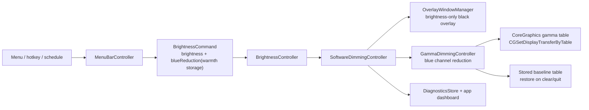

# 2026-06-19 Gamma Blue Reduction Plan First

## Goal

`Warmth`가 주황색 overlay를 덮는 방식이라 인위적으로 보이는 문제를 해결한다. 밝기 dimming은 기존 overlay 방식을 유지하고, 색감/블루라이트 조절은 CoreGraphics gamma table을 이용해 외부 모니터의 blue channel 출력을 줄이는 방향으로 구현한다.

이 계획은 구현 전 source of truth다. 승인 후 실제 패치는 `구현커밋`으로 실행한다.

## Requested Outcome

- 사용자는 gamma 기반 `Blue reduction`이 가능한지 조사한 뒤 `plan-first-implementation`으로 계획을 요청했다.
- `research.md`의 최신 조사 결론은 다음이다.
  - Apple 공식 API상 gamma table 읽기/쓰기는 가능하다.
  - 로컬 read-only probe에서 `27QA100M`은 `capacity=1024`, `sampleCount=1024`, `getGammaStatus=0`으로 확인됐다.
  - 아직 `CGSetDisplayTransferByTable` write probe는 실행하지 않았다.
  - gamma는 display-level 상태이므로 restore/충돌/종료 처리 리스크가 overlay보다 크다.
- 계획은 write probe를 hard gate로 두고, 성공한 경우에만 실제 gamma runtime 구현으로 넘어간다.

## Codebase Evidence

- `Confirmed`:
  - `/Users/moonsoo/projects/InnosDimmer/InnosDimmer/Services/GammaDimmingController.swift`는 현재 `clear(display:)`만 있는 stub이다.
  - `/Users/moonsoo/projects/InnosDimmer/InnosDimmer/Services/SoftwareDimmingController.swift`는 이미 `overlayWindowManager`와 `gammaDimmingController`를 모두 가진다.
  - `/Users/moonsoo/projects/InnosDimmer/InnosDimmer/Services/OverlayWindowManager.swift`는 `brightness`를 black overlay opacity로, `warmth`를 orange overlay opacity로 변환한다.
  - `/Users/moonsoo/projects/InnosDimmer/InnosDimmer/Domain/BrightnessCommand.swift`, `/Users/moonsoo/projects/InnosDimmer/InnosDimmer/Domain/BrightnessState.swift`, `/Users/moonsoo/projects/InnosDimmer/InnosDimmer/Domain/ScheduleEntry.swift`는 두 번째 조절 값을 아직 `warmth`로 저장한다.
  - `/Users/moonsoo/projects/InnosDimmer/InnosDimmer/UI/MenuBarController.swift`가 menu/hotkey/schedule 명령과 diagnostics를 소유한다.
  - `/Users/moonsoo/projects/InnosDimmer/InnosDimmer/UI/MenuBarPopoverView.swift`와 dashboard view model은 현재 `Warmth` 문구를 보여준다.
  - `/Users/moonsoo/projects/InnosDimmer/research.md`에는 gamma blue reduction 사전 조사가 추가되어 있다.
- `Inferred`:
  - persisted schema는 당장 바꾸지 않고 `targetWarmth`/`warmth` 값을 `Blue reduction` 의미로 재해석하는 것이 가장 작고 안전하다.
  - gamma 적용은 overlay brightness와 분리해야 한다. brightness는 overlay, blue reduction은 gamma가 맡는다.
  - orange warm overlay는 기본 경로에서 제거해야 사용자가 말한 "인위적인 따뜻함"이 줄어든다.
- `Unverified`:
  - `CGSetDisplayTransferByTable`가 실제로 M1 + HDMI + `27QA100M`에서 보이는 색 변화를 만든다는 것은 아직 확인 전이다.
  - app termination, force quit, sleep/wake, HDMI reconnect, Night Shift/ColorSync interaction은 아직 미검증이다.

## System Visualization



- changed nodes:
  - `GammaDimmingController`: CoreGraphics gamma read/apply/restore owner.
  - `SoftwareDimmingController`: combines brightness overlay and blue reduction gamma.
  - `OverlayWindowManager`: disables or neutralizes orange warm overlay by default.
  - UI labels/docs/tests: `Warmth` becomes `Blue reduction` in visible copy.
- preserved nodes:
  - `BrightnessController`: state and command ownership.
  - `MenuBarController`: command source, schedule pause, diagnostics.
  - `DisplayInventory` / `DisplayTargetResolver`: target display selection.
  - `OverlayWindowManager`: perceived brightness dimming.
- diagram notes:
  - The data field may remain `warmth` for compatibility, while user-facing copy changes to `Blue reduction`.
  - Gamma write is not applied until the write probe gate passes.

## Related Files

- `/Users/moonsoo/projects/InnosDimmer/InnosDimmer/Services/GammaDimmingController.swift`: implement gamma table adapter, blue reduction transform, baseline store, restore.
- `/Users/moonsoo/projects/InnosDimmer/InnosDimmer/Services/SoftwareDimmingController.swift`: route `command.warmth` to gamma blue reduction and call overlay with neutral warmth.
- `/Users/moonsoo/projects/InnosDimmer/InnosDimmer/Services/OverlayWindowManager.swift`: preserve black brightness overlay; remove or neutralize orange warm layer from primary path.
- `/Users/moonsoo/projects/InnosDimmer/InnosDimmer/Services/BrightnessController.swift`: preserve state mutation and failure handling; avoid direct CoreGraphics calls.
- `/Users/moonsoo/projects/InnosDimmer/InnosDimmer/UI/MenuBarController.swift`: diagnostics wording and possibly termination/clear integration.
- `/Users/moonsoo/projects/InnosDimmer/InnosDimmer/UI/MenuBarPopoverView.swift`: rename visible labels/buttons/dashboard copy from `Warmth` to `Blue reduction`.
- `/Users/moonsoo/projects/InnosDimmer/InnosDimmer/UI/SettingsWindowController.swift`: schedule/settings label update.
- `/Users/moonsoo/projects/InnosDimmer/InnosDimmer/Domain/BrightnessCommand.swift`: likely keep storage field `warmth`; add comments only if helpful.
- `/Users/moonsoo/projects/InnosDimmer/InnosDimmer/Domain/ScheduleEntry.swift`: likely keep `warmth`; user-facing labels change.
- `/Users/moonsoo/projects/InnosDimmer/InnosDimmerTests/SoftwareDimmingControllerTests.swift`: gamma transform, overlay neutralization, routing tests.
- `/Users/moonsoo/projects/InnosDimmer/InnosDimmerTests/MenuBarStateTests.swift`: visible copy and dashboard tests.
- `/Users/moonsoo/projects/InnosDimmer/InnosDimmerTests/HotkeyBindingTests.swift`: command label/action expectations if affected.
- `/Users/moonsoo/projects/InnosDimmer/docs/operator-guide.md`: blue reduction usage and recovery notes.
- `/Users/moonsoo/projects/InnosDimmer/docs/qa-matrix.md`: gamma write/restore manual QA scenarios.
- `/Users/moonsoo/projects/InnosDimmer/research.md`: evidence basis.

## Current Behavior

Current flow:

```text
BrightnessCommand(brightness, warmth)
  -> SoftwareDimmingController.apply
  -> OverlayWindowManager.apply(display, brightness, warmth)
  -> black dim layer + orange warm layer
```

Current warm overlay formula:

```swift
// current behavior in OverlayAppearance.make
warmOpacity = CGFloat(Clamped.percent(warmth)) / 180.0
```

```swift
// current warm layer color in OverlayWindowManager.updateLayers
NSColor(calibratedRed: 1.0, green: 0.64, blue: 0.32, alpha: appearance.warmOpacity)
```

Problem:

- This reduces perceived blue by adding orange, but it shifts all colors.
- User reports `20%` 이상은 인위적으로 보여서 쓰기 어렵다.
- The user's actual goal is blue-light reduction, not orange warmth tint.

## Change Map

- likely files to edit:
  - `InnosDimmer/Services/GammaDimmingController.swift`
  - `InnosDimmer/Services/SoftwareDimmingController.swift`
  - `InnosDimmer/Services/OverlayWindowManager.swift`
  - `InnosDimmer/UI/MenuBarPopoverView.swift`
  - `InnosDimmer/UI/SettingsWindowController.swift`
  - `InnosDimmer/UI/MenuBarController.swift`
  - focused tests and docs
- likely functions/components/hooks/stores/routes to touch:
  - `GammaDimmingController.clear(display:)`
  - new `GammaDimmingController.applyBlueReduction(display:amount:)`
  - new testable gamma adapter protocol
  - `SoftwareDimmingController.apply(...)`
  - `OverlayAppearance.make(...)`
  - `OverlayWindowManager.updateLayers(...)`
  - `MenuBarPopoverView.buildLayout()`
  - `MenuBarViewModel` / `AppDashboardViewModel`
  - `SettingsWindowController` schedule labels and action labels
- state/data/content dependencies:
  - Keep persisted `warmth` field for compatibility unless a later migration is explicitly approved.
  - Treat stored `warmth` as `blueReduction` in UI and gamma implementation.
  - Do not change default schedule values until visual QA proves a better scale.
- side effects/integrations to preserve or adjust:
  - Overlay brightness must still work if gamma fails.
  - Gamma must restore on `clear(display:)`.
  - App must log gamma failures to diagnostics.
  - Do not apply gamma to built-in display unless explicitly selected, which current target selection should avoid.
- likely new files:
  - None required. Protocol/test doubles can live in `GammaDimmingController.swift` and existing test files.
- remaining narrow unknowns before patch:
  - Live write probe result.
  - Exact blue reduction curve that feels natural.
  - Whether emergency `CGDisplayRestoreColorSyncSettings()` should be surfaced as a user button in this same implementation or a later safety tool.

## Planned Changes

- expected behavior changes:
  - User-facing `Warmth` becomes `Blue reduction` / `Blue light`.
  - Brightness remains overlay dimming.
  - Orange warm overlay is disabled in the primary path.
  - `command.warmth` value controls gamma blue-channel reduction.
  - Diagnostics logs gamma capability, apply success/failure, and restore success/failure.
- constraints to preserve:
  - No package installs or new dependencies.
  - No DDC/CI hardware path.
  - No full schema migration unless explicitly approved.
  - No unapproved live display gamma write during implementation planning.
- execution order:
  1. Run operator-approved live write probe.
  2. Add testable gamma adapter/runtime.
  3. Route software dimming through overlay brightness + gamma blue reduction.
  4. Rename visible UI/docs copy.
  5. Add lifecycle restore/reapply behavior and manual QA checklist.

## Review Notes

- risks:
  - Gamma write can be ignored even when read succeeds.
  - Restore failure can leave the external monitor color-shifted.
  - Other color utilities can fight over gamma tables.
  - `CGDisplayRestoreColorSyncSettings()` is broad and has community-reported edge cases with custom ICC profiles.
  - Full XCTest is already not fully isolated; use focused tests plus build/manual QA.
- assumptions:
  - User prefers real blue reduction over orange warmth even if implementation requires a capability gate.
  - Keeping `warmth` storage avoids migration risk and is acceptable if all visible copy says `Blue reduction`.
  - The app is personal-use, so a manual write probe is acceptable before shipping the feature.
- unanswered questions:
  - Does write probe work visibly on this exact setup?
  - Should emergency ColorSync restore be a visible app button?
  - Should `Quick disable` reset blue reduction to 0 or restore previous blue reduction together with brightness?

## Plan Quality Check

- Alternative considered:
  - Keep orange overlay and tune opacity: lower risk but fails the core complaint.
  - Replace brightness and blue reduction both with gamma: higher restore risk and unnecessary because overlay brightness already works.
  - Use macOS Night Shift: system-wide, not targeted to selected external display, hard to control from app.
- Why this plan:
  - It keeps working overlay brightness while moving only the color/blue-light concern to gamma, which matches the user's goal and limits blast radius.
- Tradeoff:
  - Gain: less artificial color cast and more direct blue channel reduction.
  - Cost: gamma is display-level state requiring careful restore and capability checks.
  - Acceptable because: the repo already has `GammaDimmingController` and diagnostics window, and the read-only probe confirms the target display exposes a table.
- What this plan may still miss:
  - Night Shift/HDR/ColorSync interaction and force-kill recovery.
- When to stop and revise:
  - Write probe returns nonzero status, read-back does not change, restore does not match baseline, or user reports the gamma result still looks unnatural.

## Skill Routing Manifest

| Phase | Required skills | Optional skills | Evidence |
| --- | --- | --- | --- |
| Phase 1: Operator-approved live gamma write probe | `computer-use-operator` | `review-all-in-one` | Live display color changes require explicit human-visible QA and restore verification. |
| Commit 1: Gamma adapter and blue reduction transform | `구현커밋` | `qa-gate` | `GammaDimmingController.swift` is currently a stub; focused unit tests can validate table transform and restore calls. |
| Commit 2: Route software dimming through overlay brightness plus gamma blue reduction | `구현커밋` | `review-all-in-one` | `SoftwareDimmingController.swift` already composes overlay and gamma controllers. |
| Commit 3: Rename user-facing Warmth copy to Blue reduction | `구현커밋` | `qa-gate` | Popover, dashboard, settings, docs, and tests currently expose `Warmth`. |
| Commit 4: Add lifecycle restore/reapply diagnostics and docs | `구현커밋` | `review-all-in-one`, `테스트` | Gamma restore must be visible in diagnostics and documented for manual QA. |
| Final Gate | `review-all-in-one`, `테스트` | `review-swarm` | Native app needs build, focused tests, manual Accessibility/CGWindow smoke, and operator visual confirmation. |

## Implementation Plan

### Phase 1: Operator-approved live gamma write probe

- target:
  - External display `27QA100M`, current observed `CGDirectDisplayID` is `2` during research.
- work:
  - Read baseline gamma table for external display.
  - Apply tiny blue reduction, suggested 8-12%, for 1-2 seconds.
  - Read table back and compare expected blue values.
  - Restore exact baseline table.
  - Read table again and compare against baseline.
  - If exact restore fails, call `CGDisplayRestoreColorSyncSettings()` only as emergency restore.
- code snippets:
  - proposed probe skeleton:

```swift
let capacity = CGDisplayGammaTableCapacity(displayID)
try readBaseline(displayID, capacity)
defer { restoreBaselineOrColorSync(displayID) }
try setBlueReduction(displayID, amount: 0.10, holdSeconds: 1.5)
try verifyReadBack(displayID)
try restoreBaseline(displayID)
```

- tradeoff:
  - chosen: manual live probe before implementation.
  - alternative: implement first and test through app.
  - cost/risk: probe briefly changes external monitor color.
  - why acceptable: it is safer than shipping a gamma path without proving write/restore.
  - revisit when: probe fails, restore is not exact, or visual result is unacceptable.
- verification:
  - `CGSetDisplayTransferByTable` apply status is `0`.
  - read-back blue table differs from baseline during probe.
  - restore status is `0`.
  - read-back after restore matches baseline within float tolerance.
  - operator visually confirms external monitor changed and restored.
- success criteria:
  - Write and restore both succeed on `27QA100M`.
  - No built-in display change is observed.
  - There is a clear output log to paste into diagnostics/research.
- stop conditions:
  - No explicit operator approval for live write.
  - Any restore uncertainty.
  - Display ID no longer maps to `27QA100M`.

### Commit 1: Gamma adapter and blue reduction transform

- target files:
  - `InnosDimmer/Services/GammaDimmingController.swift`
  - `InnosDimmerTests/SoftwareDimmingControllerTests.swift`
- changes:
  - Introduce a small gamma API abstraction wrapping CoreGraphics calls.
  - Read and store original gamma tables per `DisplayIdentity.cgDisplayID` before first reduction.
  - Add pure transform function that scales only blue values.
  - Implement `applyBlueReduction(display:amount:)`.
  - Implement deterministic `clear(display:)` restore using stored baseline.
- code snippets:
  - proposed production shape:

```swift
protocol DisplayGammaTableControlling {
    func capacity(for displayID: CGDirectDisplayID) -> UInt32
    func read(displayID: CGDirectDisplayID, capacity: UInt32) throws -> GammaTable
    func write(displayID: CGDirectDisplayID, table: GammaTable) throws
}

final class GammaDimmingController {
    func applyBlueReduction(display: DisplayIdentity, amount: Int) throws {
        let original = try baselineTable(for: display)
        let adjusted = GammaTable.blueReduced(from: original, amount: amount)
        try gamma.write(displayID: display.cgDisplayID, table: adjusted)
    }
}
```

- tradeoff:
  - chosen: adapter protocol for testability.
  - alternative: call CoreGraphics directly in `GammaDimmingController`.
  - cost/risk: a few more types.
  - why acceptable: avoids real display writes in unit tests.
  - revisit when: abstraction grows beyond CoreGraphics read/write/capacity needs.
- verification:
  - focused tests assert red/green unchanged and blue reduced.
  - focused tests assert `clear(display:)` writes the stored baseline.
  - focused tests assert zero amount restores or leaves blue unchanged.
- success criteria:
  - Gamma transform is deterministic and unit-tested.
  - CoreGraphics calls are isolated behind one adapter.
  - No real display writes in tests.
- stop conditions:
  - Test adapter cannot model restore safely.
  - CoreGraphics API requires main-thread behavior that conflicts with current service boundaries.

### Commit 2: Route software dimming through overlay brightness plus gamma blue reduction

- target files:
  - `InnosDimmer/Services/SoftwareDimmingController.swift`
  - `InnosDimmer/Services/OverlayWindowManager.swift`
  - `InnosDimmerTests/SoftwareDimmingControllerTests.swift`
  - `InnosDimmerTests/BrightnessControllerTests.swift`
- changes:
  - `SoftwareDimmingController.apply(...)` calls overlay with `warmth: 0` or a neutral tint path.
  - `SoftwareDimmingController.apply(...)` then calls `gammaDimmingController.applyBlueReduction(display: command.display, amount: command.warmth)`.
  - If gamma fails, preserve brightness overlay if already applied but report a software failure that diagnostics can show.
  - Define ordering explicitly: brightness overlay first, gamma second.
- code snippets:

```swift
func apply(_ command: BrightnessCommand, reason: SoftwareActivationReason) throws {
    _ = reason
    try overlayWindowManager.apply(display: command.display, brightness: command.brightness, warmth: 0)
    try gammaDimmingController.applyBlueReduction(display: command.display, amount: command.warmth)
}
```

- tradeoff:
  - chosen: overlay first, gamma second.
  - alternative: gamma first, overlay second.
  - cost/risk: if gamma fails after overlay succeeds, state must not claim full success.
  - why acceptable: user still gets dimming, diagnostics can report blue reduction failure.
  - revisit when: partial success handling becomes confusing in UI.
- verification:
  - test that overlay receives `warmth: 0`.
  - test that gamma receives `command.warmth`.
  - test gamma failure records platformBlocked or visible failure without silently applying blue reduction.
- success criteria:
  - Brightness dimming remains overlay-based.
  - Orange overlay no longer increases with `warmth`.
  - Gamma handles the blue reduction value.
- stop conditions:
  - Existing state model cannot represent partial overlay success + gamma failure clearly.

### Commit 3: Rename user-facing Warmth copy to Blue reduction

- target files:
  - `InnosDimmer/UI/MenuBarPopoverView.swift`
  - `InnosDimmer/UI/SettingsWindowController.swift`
  - `InnosDimmer/UI/MenuBarController.swift`
  - `InnosDimmerTests/MenuBarStateTests.swift`
  - `InnosDimmerTests/HotkeyBindingTests.swift`
  - `docs/operator-guide.md`
  - `docs/qa-matrix.md`
  - `docs/release-notes-local.md`
- changes:
  - Replace visible `Warmth` labels with `Blue reduction`.
  - Rename button text:
    - `Warmth up` -> `Blue reduction up`
    - `Warmth down` -> `Blue reduction down`
  - Diagnostics should say `blue reduction` for new messages.
  - Preserve internal field names unless migration is separately approved.
- code snippets:

```swift
let blueReductionTitle = NSTextField(labelWithString: "Blue reduction")
brightnessLine = "Brightness: \(state.targetBrightness)% / Blue reduction: \(state.targetWarmth)%"
```

- tradeoff:
  - chosen: copy-only semantic rename, storage unchanged.
  - alternative: rename domain fields and migrate schema.
  - cost/risk: code still has `warmth` identifiers internally.
  - why acceptable: prevents storage migration risk and keeps implementation small.
  - revisit when: a schema v2 migration is planned.
- verification:
  - focused UI model tests assert `Blue reduction` visible strings.
  - `rg -n "Warmth|warmth"` distinguishes internal storage from user-facing copy.
- success criteria:
  - User-facing UI no longer implies orange warmth.
  - Tests preserve command routing.
  - Docs explain internal compatibility naming if necessary.
- stop conditions:
  - A public/exported diagnostics schema needs field rename now.

### Commit 4: Add lifecycle restore/reapply diagnostics and docs

- target files:
  - `InnosDimmer/UI/MenuBarController.swift`
  - `InnosDimmer/Services/GammaDimmingController.swift`
  - `InnosDimmer/Services/SoftwareDimmingController.swift`
  - `InnosDimmer/UI/MenuBarPopoverView.swift`
  - `docs/operator-guide.md`
  - `docs/qa-matrix.md`
- changes:
  - Ensure `clear(display:)` restores gamma baseline.
  - Reapply gamma after wake/display-change when the selected display is present.
  - Log diagnostics:
    - capacity/read success
    - apply success/failure
    - restore success/failure
    - emergency ColorSync restore if used
  - Add manual QA docs for quit restore, sleep/wake, HDMI reconnect, Night Shift/ColorSync.
  - Consider a visible diagnostics note if gamma support is unavailable.
- code snippets:

```swift
record(.softwareDimming, "Applied blue reduction \(command.warmth)% on \(command.display.localizedName)")
record(.softwareDimming, "Restored gamma table for \(display.localizedName)")
record(.softwareDimming, "Blue reduction unavailable: \(error)", .warning)
```

- tradeoff:
  - chosen: diagnostics-first lifecycle handling.
  - alternative: silently restore/reapply.
  - cost/risk: more log noise.
  - why acceptable: this app is being debugged locally and the diagnostics window was added for exactly this.
  - revisit when: logs become noisy in normal use.
- verification:
  - focused tests for restore call on `clear(display:)`.
  - manual QA with app quit/relaunch.
  - manual QA after display sleep/wake and HDMI reconnect.
- success criteria:
  - Diagnostics clearly show gamma apply/restore.
  - User can tell whether blue reduction is active or unavailable.
  - Restore happens on normal clear path.
- stop conditions:
  - Restore cannot be guaranteed enough for normal use.
  - Manual QA shows gamma is reset by macOS unpredictably without reliable reapply.

## Operator 결정 필요 사항

- 상태: 필요
- 결정 1: Live gamma write probe 실행 승인
  - 맥락: `CGSetDisplayTransferByTable`는 실제 외부 모니터 색 출력을 바꾸는 API다. 구현 전에 1-2초짜리 약한 blue reduction과 즉시 복원을 확인해야 한다.
  - A: 승인. 27QA100M에만 8-12% blue reduction을 1-2초 적용하고 즉시 baseline 복원한다.
  - B: 보류. 코드 구현 계획은 유지하되, write probe 전에는 gamma runtime 구현을 시작하지 않는다.
  - C: 취소. gamma 경로를 포기하고 기존 overlay tint를 약하게 조정하는 별도 계획으로 바꾼다.
  - 추천안: A. 실제 환경에서 write/restore가 되는지 확인해야 계획 리스크가 크게 줄어든다.
  - 기본값: 없음. Operator 승인 전 live display gamma write는 진행하지 않음.
  - 보류 시 영향: 구현은 멈추고 계획만 유지된다. gamma 방식이 실제로 되는지 계속 미확정으로 남는다.
- 결정 2: 내부 필드명 유지 여부
  - 맥락: 현재 저장 스키마와 테스트는 `warmth` 이름을 쓴다. 사용자-facing copy만 `Blue reduction`으로 바꾸면 migration 없이 작게 갈 수 있다.
  - A: 내부 `warmth` 유지, UI/docs만 `Blue reduction`으로 변경.
  - B: 내부 필드까지 `blueReduction`으로 바꾸고 schema migration을 추가.
  - C: 내부는 유지하되 주석/문서에 compatibility naming을 명시.
  - 추천안: C. 구현은 작게 유지하면서 미래 혼란을 줄인다.
  - 기본값: C. 내부는 유지하고 compatibility naming을 문서화한다.
  - 보류 시 영향: 구현 중 이름 혼란이 생길 수 있다.

## 검토용 결과물

- HTML: 해당 없음.
- 테스트 링크:
  - Localhost: 해당 없음. native macOS app이며 로컬 웹 서버가 없다.
  - Deploy: 해당 없음. 개인용 로컬 macOS 앱이며 배포 환경이 없다.
- 상태: planned.
- 실제 동작:
  - 구현 후 검토 표면은 Release 앱의 `InnosDimmer` dashboard window, menu bar popover, diagnostics log, CGWindow/Accessibility smoke이다.
- Mock:
  - 없음. 색 출력/gamma는 HTML mock으로 정확히 검증할 수 없다.

## 후행 실행

- 기본 실행: 구현커밋
- 계획 경로 처리: 구현커밋이 직전 대화, 계획 링크, active plan context에서 자동 탐지
- 모호할 때: 후보 목록을 보여주고 Operator에게 선택 요청

## HTML 생략 보고서

- 판정: 생략 가능.
- 생략 사유:
  - 이 작업의 핵심 검토 표면은 native macOS display gamma write/restore와 실제 외부 모니터 색 변화다. HTML은 gamma table write, ColorSync restore, sleep/wake, HDMI reconnect를 검증할 수 없다.
  - UI copy 변경은 작고 기존 native app 화면에서 바로 검증 가능하다.
- 대체 검토물:
  - `/Users/moonsoo/projects/InnosDimmer/docs/2026-06-19-gamma-blue-reduction-plan-first.md`
  - `/Users/moonsoo/projects/InnosDimmer/research.md`
  - 구현 후 Release 앱의 dashboard window와 diagnostics log.
- 테스트 링크:
  - Localhost: 해당 없음. native macOS app.
  - Deploy: 해당 없음. remote/upstream/deploy 없음.
- 사용자가 바로 열어볼 링크:
  - [계획 문서](/Users/moonsoo/projects/InnosDimmer/docs/2026-06-19-gamma-blue-reduction-plan-first.md)
  - [연구 문서](/Users/moonsoo/projects/InnosDimmer/research.md)

## 구현 후 검토 리스트

- 회귀 확인:
  - Brightness down/up still dims via overlay.
  - Quick disable and restore previous still work.
  - Schedule automation still applies current time entry.
  - Global hotkeys still route to the same menu commands.
  - External display target selection still avoids built-in display by default.
- 검증 확인:
  - `git diff --check`
  - Debug `build-for-testing`
  - Release build
  - focused gamma controller tests
  - focused menu/dashboard/settings copy tests
  - manual write/restore probe on `27QA100M`
  - manual app quit/relaunch restore check
  - manual sleep/wake and HDMI reconnect check
- 리뷰 관점:
  - `review-all-in-one`: failure handling, restore path, diagnostics truthfulness.
  - `review-swarm`: gamma conflicts, partial success state, hidden side effects.
  - `테스트`: native app smoke and packaging.
- Operator 재확인:
  - visually confirm blue reduction looks less artificial than orange overlay.
  - confirm 20%, 40%, 60% values feel usable or request curve adjustment.
  - confirm restore returns the monitor to the original color.

## Validation

- manual checks:
  - live write probe with immediate restore.
  - dashboard diagnostics log shows gamma apply/restore.
  - popover labels and dashboard labels show `Blue reduction`.
  - external monitor color changes and restores; built-in display does not change.
- lint/build/test scope:
  - `git diff --check`
  - `xcodebuild -scheme InnosDimmer -configuration Debug build-for-testing CODE_SIGNING_ALLOWED=NO`
  - `xcodebuild -scheme InnosDimmer -configuration Release build CODE_SIGNING_ALLOWED=NO`
  - focused `xcodebuild test` targets for gamma and UI copy.
- scenario-to-surface checks:
  - `CGWindowListCopyWindowInfo`: overlay and dashboard windows present.
  - `osascript System Events`: popover and dashboard labels visible.
  - diagnostics text area includes gamma capacity/apply/restore events.
