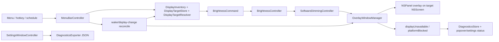

# 2026-06-19 Overlay Reliability Plan First

## Goal

InnosDimmer의 소프트웨어 오버레이 디밍을 "적용했다고 보이지만 실제로 화면이 어두워지지 않는" 상태에 강하게 만든다.

이번 계획은 새 디밍 엔진을 추가하지 않는다. 현재 AppKit overlay 방식을 기본으로 유지하면서, 실패 감지, stale display 재해석, HDMI 재연결/wake 재적용, diagnostics/export 정합성을 구현 직전 수준으로 잠근다.

## Requested Outcome

사용자는 `plan-first-implementation`을 호출했다. 직전 리서치 결론은 다음이다.

- 더 확실한 방법은 DDC/CI 또는 gamma table로 갈아타는 것이 아니라 현재 overlay primary 경로를 lifecycle-safe하게 만드는 것이다.
- M1 Mac + HDMI 직결 + INNOS 외부 모니터 개인용 앱이라는 전제를 유지한다.
- 하드웨어 밝기 제어는 다시 기본 경로로 되살리지 않는다.
- gamma/color table은 기본 구현이 아니라 overlay QA 이후의 optional experiment로 보류한다.

이번 산출물:

- 구현 가능한 plan-first MD.
- 후행 실행 단위: `구현커밋`이 추출 가능한 `### Commit N:` / `### Phase N:` heading.
- HTML artifact는 만들지 않는다. 이 작업은 native macOS 동작 안정화와 diagnostics wiring 중심이며, 디자인 판단용 독립 목업보다 실제 앱 빌드/수동 QA가 더 정확한 검토 표면이다.

## Codebase Evidence

- `Confirmed`:
  - `/Users/moonsoo/projects/InnosDimmer/InnosDimmer/Services/BrightnessController.swift`는 모든 명령을 `SoftwareDimmingController`로 보낸다.
  - `/Users/moonsoo/projects/InnosDimmer/InnosDimmer/Services/OverlayWindowManager.swift`는 `displayFrameProvider`가 nil을 반환하면 line 40-43에서 조용히 return한다.
  - `/Users/moonsoo/projects/InnosDimmer/InnosDimmer/UI/MenuBarController.swift`는 line 350-354에서 `state.display ?? resolveSelectedDisplay()`를 사용하므로, `state.display`가 stale이면 재해석하지 않는다.
  - `/Users/moonsoo/projects/InnosDimmer/InnosDimmer/UI/MenuBarController.swift` line 501-507은 wake/display-change 후 stale panel clear와 reapply를 수행하지만 display state 자체의 stale 여부를 먼저 검증하지 않는다.
  - `/Users/moonsoo/projects/InnosDimmer/InnosDimmer/UI/SettingsWindowController.swift` line 66은 `Diagnostics: local export available`이라고 표시하지만 export button/action은 없다.
  - `/Users/moonsoo/projects/InnosDimmer/InnosDimmer/Diagnostics/DiagnosticsExporter.swift`는 JSON export encoder만 제공한다.
  - `/Users/moonsoo/projects/InnosDimmer/InnosDimmer/Services/DisplayInventory.swift` line 27-39는 saved display가 없을 때 main display가 아닌 첫 candidate를 고른다.
  - `/Users/moonsoo/projects/InnosDimmer/InnosDimmer/Services/DisplayTargetResolver.swift` line 4-7은 saved display가 nil이면 candidates의 첫 항목을 반환하므로, external-only guard 없이 직접 쓰면 main display 선택 회귀가 생길 수 있다.
  - `/Users/moonsoo/projects/InnosDimmer/research.md`는 overlay hardening을 1순위로 권장한다.
- `Inferred`:
  - 사용자가 본 "작동 안 하는 것 같음"의 다음 주요 위험은 overlay opacity 수식보다 display lifecycle과 silent no-op이다.
  - HDMI reconnect 후 `CGDirectDisplayID` 또는 `NSScreenNumber`가 바뀌면 현재 state가 낡은 target을 계속 가리킬 수 있다.
  - diagnostics export UI가 없으면 QA 중 실패 증거를 저장하기 어렵다.
- `Unverified`:
  - 사용자의 실제 macOS 환경에서 full-screen Space, Stage Manager, DRM/protected playback, screen sharing/recording, sleep/wake, HDMI reconnect가 모두 overlay를 유지하는지 아직 수동 QA가 끝나지 않았다.
  - `xcodebuild test`는 이전 시도에서 runner launch/finalization이 멈춘 적이 있어, build-for-testing과 targeted test를 분리해서 검증해야 한다.

## System Visualization



- changed nodes:
  - `OverlayWindowManager`: frame lookup failure becomes an explicit error.
  - `SoftwareDimmingController`: propagates overlay apply failure.
  - `BrightnessController`: exposes the last software failure for diagnostics without turning it into persisted user state.
  - `MenuBarController`: resolves stale displays and debounces display-change/wake reconciliation.
  - `SettingsWindowController`: gets a real diagnostics export action.
- preserved nodes:
  - `OverlayAppearance` dim/warm opacity formula.
  - `HotkeyManager` Carbon shortcut registration.
  - `ScheduleEngine` manual override and boundary behavior.
  - `DisplayTargetResolver` stable hardware identity matching.
  - `VerificationMatrix` pass/partial/platform-blocked semantics.
- diagram notes:
  - The plan keeps overlay as the only default user-facing dimming engine.
  - Gamma/color table remains explicitly deferred.

## Related Files

- `/Users/moonsoo/projects/InnosDimmer/InnosDimmer/Services/OverlayWindowManager.swift`: owns overlay panel creation, screen frame lookup, layer update, stale panel cleanup.
- `/Users/moonsoo/projects/InnosDimmer/InnosDimmer/Services/SoftwareDimmingController.swift`: owns software strategy protocol and overlay delegation.
- `/Users/moonsoo/projects/InnosDimmer/InnosDimmer/Services/BrightnessController.swift`: owns brightness state mutation and active mode.
- `/Users/moonsoo/projects/InnosDimmer/InnosDimmer/UI/MenuBarController.swift`: owns user commands, schedule commands, wake/display-change observers, diagnostics recording.
- `/Users/moonsoo/projects/InnosDimmer/InnosDimmer/Services/DisplayInventory.swift`: owns active display enumeration and automatic external display selection.
- `/Users/moonsoo/projects/InnosDimmer/InnosDimmer/Services/DisplayTargetResolver.swift`: owns stable display identity matching.
- `/Users/moonsoo/projects/InnosDimmer/InnosDimmer/UI/SettingsWindowController.swift`: owns settings window controls and diagnostics section copy.
- `/Users/moonsoo/projects/InnosDimmer/InnosDimmer/Diagnostics/DiagnosticsStore.swift`: owns event retention and snapshot creation.
- `/Users/moonsoo/projects/InnosDimmer/InnosDimmer/Diagnostics/DiagnosticsExporter.swift`: owns JSON encoding.
- `/Users/moonsoo/projects/InnosDimmer/InnosDimmerTests/SoftwareDimmingControllerTests.swift`: overlay appearance/panel behavior test surface.
- `/Users/moonsoo/projects/InnosDimmer/InnosDimmerTests/BrightnessControllerTests.swift`: software routing/reapply test surface.
- `/Users/moonsoo/projects/InnosDimmer/InnosDimmerTests/MenuBarStateTests.swift`: menu command, diagnostics, popover state test surface.
- `/Users/moonsoo/projects/InnosDimmer/InnosDimmerTests/DiagnosticsStoreTests.swift`: diagnostics snapshot/export test surface.
- `/Users/moonsoo/projects/InnosDimmer/docs/qa-matrix.md`: manual scenario matrix.
- `/Users/moonsoo/projects/InnosDimmer/docs/operator-guide.md`: operator usage and QA instructions.
- `/Users/moonsoo/projects/InnosDimmer/docs/release-notes-local.md`: local MVP limitation/status handoff.
- `/Users/moonsoo/projects/InnosDimmer/research.md`: research basis for this plan.

## Current Behavior

Current command path:

```text
Menu/hotkey/schedule
  -> MenuBarController.makeCommand
  -> BrightnessController.apply
  -> SoftwareDimmingController.apply
  -> OverlayWindowManager.apply
  -> NSPanel overlay
```

Current risk behavior:

- If the target screen frame is missing, `OverlayWindowManager.apply` returns without error.
- `BrightnessController` then records the command as applied because no error propagated.
- `MenuBarController.recordAppliedCommand` logs an applied command even though the overlay may not be visible.
- `MenuBarController.makeCommand` reuses `brightnessController.state.display` without checking active displays.
- Wake/display-change reconciliation clears stale panels but does not force a fresh selected display if the stored state is non-nil.
- Settings says diagnostics export is available, but there is no user-visible export button or save flow.

## Change Map

- likely files to edit:
  - `InnosDimmer/Services/OverlayWindowManager.swift`
  - `InnosDimmer/Services/SoftwareDimmingController.swift`
  - `InnosDimmer/Services/BrightnessController.swift`
  - `InnosDimmer/UI/MenuBarController.swift`
  - `InnosDimmer/Services/DisplayInventory.swift`
  - `InnosDimmer/UI/SettingsWindowController.swift`
  - `InnosDimmer/Diagnostics/DiagnosticsStore.swift`
  - `InnosDimmerTests/SoftwareDimmingControllerTests.swift`
  - `InnosDimmerTests/BrightnessControllerTests.swift`
  - `InnosDimmerTests/MenuBarStateTests.swift`
  - `InnosDimmerTests/HotkeyBindingTests.swift`
  - `InnosDimmerTests/ScheduleEngineTests.swift`
  - `InnosDimmerTests/DiagnosticsStoreTests.swift`
  - `docs/operator-guide.md`
  - `docs/qa-matrix.md`
  - `docs/release-notes-local.md`
- likely functions/components/hooks/stores/routes to touch:
  - `OverlayWindowManager.apply`
  - `SoftwareDimmingController.apply`
  - `BrightnessController.applySoftware`
  - `BrightnessController.reapplyCurrentSoftwareState`
  - `MenuBarController.makeCommand`
  - `MenuBarController.stateResolvingSelectedDisplayIfNeeded`
  - `MenuBarController.reconcileScheduleAfterRuntimeBoundaryChange`
  - `MenuBarController.registerScheduleReconciliationObservers`
  - `MenuBarController.makeSettingsActions`
  - `SettingsActions`
  - `SettingsWindowController.installContent`
  - `SettingsWindowController` diagnostics button handler
- state/data/content dependencies:
  - Do not add new persistent schema unless unavoidable.
  - Prefer non-persisted `BrightnessController.lastSoftwareDimmingFailure` for diagnostics.
  - Keep `SettingsSnapshot.currentSchemaVersion` unchanged unless a persistent field is added.
- side effects/integrations to preserve or adjust:
  - Overlay must remain click-through.
  - Quick disable and restore previous must remain immediate.
  - Manual commands must still pause schedule automation until next boundary.
  - Schedule commands must not become manual overrides.
  - Global shortcuts must stay registered through existing `HotkeyManager`.
- likely new files:
  - No production file is required.
  - Optional test helper protocol/stub may be added inside existing test files.
- remaining narrow unknowns before patch:
  - Whether `DisplayInventory` should become protocol-backed for tests, or whether `MenuBarController` should accept active-display closures. Preferred: protocol-backed, because it preserves ownership names.
  - The protocol must preserve `DisplayInventory.resolveSelectedDisplay(saved:candidates:mainDisplayID:)` semantics. Do not call `DisplayTargetResolver.resolve(saved:nil,candidates:)` from `MenuBarController`, because it can select the first candidate even if that candidate is the main display.

## Planned Changes

- expected behavior changes:
  - Overlay frame lookup failure becomes visible as `platformBlocked`/diagnostic failure, not false success.
  - Manual/hotkey/schedule commands use a fresh display target if the previous target is no longer active.
  - Wake/display-change reconciliation collapses burst notifications and reapplies after target resolution.
  - Settings diagnostics section has a real export button. The alternate "remove export copy" path is only a stop-condition fallback if `NSSavePanel` or entitlement constraints block the button.
  - Dead `pendingCommand` preview path is removed after explicit failure handling makes it unnecessary.
- constraints to preserve:
  - No package dependencies.
  - No DDC/CI hardware brightness path.
  - No gamma/color-table default behavior.
  - No native brightness/media key interception.
  - No silent main-display selection when only the built-in display is available.
- execution order:
  - First make overlay failure explicit.
  - Then make display resolution stale-aware.
  - Then wire diagnostics/export and docs.
  - Then remove safe dead code.
  - Then run build/manual QA and update QA matrix evidence.

## Review Notes

- risks:
  - Changing display resolution code can accidentally select the main display; tests must cover no-external cases.
  - Debounce can delay dimming after HDMI reconnect; keep the interval short and documented.
  - A cancelled debounce task must not continue into `reconcileScheduleAfterRuntimeBoundaryChange`; the unsafe cancelled-sleep pattern is to ignore the thrown cancellation and fall through to the reconcile call.
  - Export UI can trigger native save panel behavior that is hard to unit test; keep the data-building action testable separately.
  - Removing `pendingCommand` touches many tests that currently assert it is nil.
- assumptions:
  - Overlay panel visibility remains the correct default strategy.
  - A missing target frame should be treated as a software dimming failure.
  - Diagnostics export is useful enough to wire rather than remove from docs.
- unanswered questions:
  - Actual HDMI reconnect behavior on the user's monitor still needs manual QA.
  - Full-screen/DRM/screen-sharing behavior remains scenario-dependent and must be recorded rather than assumed.

## Plan Quality Check

- Alternative considered:
  - Implement gamma/color-table dimming now. Rejected because it changes display gamma globally and has higher color/restore risk.
  - Return to DDC/CI hardware brightness. Rejected because the user already observed it as unreliable and changed direction to software dimming.
  - Only change docs and leave code behavior. Rejected because false success from silent overlay frame failure remains a real runtime risk.
- Why this plan:
  - It addresses the highest-probability failure chain found in code: stale display plus silent overlay apply no-op.
  - It keeps the product in the user's chosen software-only direction.
  - It improves diagnosability before broad manual QA.
- Tradeoff:
  - Chosen: explicit overlay failure + stale-aware display resolution + diagnostics wiring.
  - Alternative: introduce a second dimming engine.
  - Cost/risk: more state and diagnostics logic in the native app; possible short reconnect delay from debounce.
  - Why acceptable: these risks are narrow and testable, while gamma/DDC risks are broader and harder to recover from.
  - Revisit when: overlay remains invisible in a repeated, important context even after target lifecycle fixes.
- What this plan may still miss:
  - OS-controlled surfaces where no public overlay behavior can guarantee visibility.
  - Capture/screen-sharing behavior differences.
  - Interactions with Stage Manager if the user uses it.
- When to stop and revise:
  - If stale-aware resolution can only be tested by a large rewrite of display ownership.
  - If Settings diagnostics export requires entitlements or sandbox changes not currently present.
  - If build-for-testing fails due to a project configuration issue unrelated to this change.

## Skill Routing Manifest

| Phase | Required skills | Optional skills | Evidence |
| --- | --- | --- | --- |
| Commit 1: Make overlay apply failures explicit | `구현커밋` | `qa-gate` | `OverlayWindowManager.apply` currently returns silently when display frame is missing; `SoftwareDimmingController.apply` already throws and can propagate this safely. |
| Commit 2: Resolve stale display targets before commands and reconnect reapply | `구현커밋` | `qa-gate` | `MenuBarController.makeCommand` currently reuses non-nil `state.display`; HDMI reconnect risk is documented in `research.md`. |
| Commit 3: Wire diagnostics export and failure evidence | `구현커밋` | `qa-gate` | `DiagnosticsExporter` exists, Settings says export is available, but no user action is wired. |
| Commit 4: Remove safe dead preview code and align docs | `구현커밋` | `review-all-in-one` | `pendingCommand` and `applyPendingPreview` are dead after software-only pivot; docs need to match real user actions. |
| Phase 5: Build, launch, and manual QA evidence update | `qa-gate`, `review-all-in-one` | `테스트` | README/operator guide define Debug/Release build checks and `docs/qa-matrix.md` defines manual scenarios. |
| Final Gate | `review-all-in-one`, `qa-gate` | `테스트` | Final review must check no DDC/gamma default path was reintroduced, build passes, and QA limitations remain explicit. |

## Implementation Plan

### Commit 1: Make overlay apply failures explicit

- target files:
  - `InnosDimmer/Services/OverlayWindowManager.swift`
  - `InnosDimmer/Services/SoftwareDimmingController.swift`
  - `InnosDimmer/Services/BrightnessController.swift`
  - `InnosDimmerTests/SoftwareDimmingControllerTests.swift`
  - `InnosDimmerTests/BrightnessControllerTests.swift`
- changes:
  - Change `OverlayWindowManager.apply(display:brightness:warmth:)` to `throws`.
  - Add `SoftwareDimmingError.displayUnavailable(UInt32)` or equivalent.
  - Make `SoftwareDimmingController.apply` propagate overlay errors.
  - Add a non-persisted failure object on `BrightnessController`, for example `private(set) var lastSoftwareDimmingFailure: SoftwareDimmingFailure?`.
  - On successful apply, clear the last failure and record `.overlay`.
  - On failure, set `.platformBlocked`, retain the attempted command and failure text, and do not update `targetBrightness`, `targetWarmth`, or `lastAppliedCommandSource` as if the overlay succeeded.
  - Keep `state.display` unchanged on failure unless Commit 2 has already resolved a fresh display. The failed attempted display should live in `lastSoftwareDimmingFailure.command.display`, not be treated as a successfully selected target.
- code snippets:
  - proposed `SoftwareDimmingError` shape:

    ```swift
    enum SoftwareDimmingError: Error, Equatable, LocalizedError {
        case displayUnavailable(UInt32)
        case platformBlocked(String)
        case applyFailed(String)

        var errorDescription: String? {
            switch self {
            case .displayUnavailable(let displayID):
                return "Display \(displayID) is not currently available for overlay dimming."
            case .platformBlocked(let reason), .applyFailed(let reason):
                return reason
            }
        }
    }
    ```

  - proposed overlay apply behavior:

    ```swift
    func apply(display: DisplayIdentity, brightness: Int, warmth: Int) throws {
        guard let frame = displayFrameProvider(display) else {
            throw SoftwareDimmingError.displayUnavailable(display.cgDisplayID)
        }

        let panel = panelsByDisplayID[display.cgDisplayID] ?? makePanel()
        panelsByDisplayID[display.cgDisplayID] = panel
        Self.configureOverlayPanel(panel, for: frame)
        panel.contentView?.frame = NSRect(origin: .zero, size: frame.size)
        let appearance = OverlayAppearance.make(brightness: brightness, warmth: warmth)
        updateLayers(for: panel, appearance: appearance)
        panel.alphaValue = 1.0
        panel.orderFrontRegardless()
    }
    ```

  - proposed controller failure memory:

    ```swift
    struct SoftwareDimmingFailure: Equatable {
        var command: BrightnessCommand
        var message: String
    }

    private(set) var lastSoftwareDimmingFailure: SoftwareDimmingFailure?

    private func applySoftware(_ command: BrightnessCommand, reason: SoftwareActivationReason) {
        do {
            try softwareStrategy.apply(command, reason: reason)
            lastSoftwareDimmingFailure = nil
            recordApplied(command)
            state.activeMode = .overlay
        } catch {
            lastSoftwareDimmingFailure = SoftwareDimmingFailure(
                command: command,
                message: error.localizedDescription
            )
            state.activeMode = .platformBlocked
        }
    }
    ```

- tradeoff:
  - chosen: make failure explicit through the existing throwing strategy boundary.
  - alternative: let `OverlayWindowManager` record diagnostics directly.
  - cost/risk: `BrightnessController` must expose enough failure info for UI diagnostics.
  - why acceptable: it preserves ownership boundaries; overlay code stays UI-window specific, controller owns state.
  - revisit when: diagnostics needs structured failure categories beyond a single display unavailable/platform blocked message.
- verification:
  - `xcodebuild -scheme InnosDimmer -configuration Debug build-for-testing CODE_SIGNING_ALLOWED=NO`: proves compiler and test bundle build with the new throwing signatures.
  - Targeted tests to add:
    - overlay frame provider nil throws `displayUnavailable`.
    - `BrightnessController` marks `.platformBlocked`, records attempted command/failure text, and preserves the previous successful brightness/warmth on software apply error.
    - successful apply clears the previous failure.
- success criteria:
  - No overlay apply path silently succeeds when target frame is missing.
  - Popover/settings diagnostics can later show the failure reason without guessing.
  - Existing overlay appearance and click-through tests still pass/build.
- stop conditions:
  - If making `OverlayWindowManager.apply` throwing forces broad AppKit threading changes, stop and revise the API shape.
  - If failure state requires persistent schema changes, stop and decide whether the schema change is worth it.

### Commit 2: Resolve stale display targets before commands and reconnect reapply

- target files:
  - `InnosDimmer/UI/MenuBarController.swift`
  - `InnosDimmer/Services/DisplayInventory.swift`
  - `InnosDimmerTests/MenuBarStateTests.swift`
  - `InnosDimmerTests/SoftwareDimmingControllerTests.swift`
  - `InnosDimmerTests/HotkeyBindingTests.swift`
  - `InnosDimmerTests/ScheduleEngineTests.swift`
- changes:
  - Introduce a small testable abstraction for display inventory, for example `DisplayInventoryProviding`, and make `DisplayInventory` conform to it.
  - Replace nil-only display resolution with stale-aware resolution.
  - `makeCommand` should use a fresh display if `state.display` is absent or not present in current active displays.
  - `reconcileScheduleAfterRuntimeBoundaryChange` should gather `activeDisplays` once, clear stale panels, resolve the target from that same active list, then reapply current software state or schedule decision.
  - Add a short debounce around wake/display-change notification handling to avoid repeated reapply bursts.
  - Register `NSWorkspace.screensDidWakeNotification` in addition to current wake/display-change notifications unless testing shows duplicate noise is too high.
  - Store and cancel the debounce task in `stop()` so stopping the menu controller cannot run a delayed reconcile afterward.
- code snippets:
  - proposed display provider boundary:

    ```swift
    @MainActor
    protocol DisplayInventoryProviding {
        func activeDisplays() -> [DisplayIdentity]
        func selectedDisplay(using targetStore: DisplayTargetStore) -> DisplayIdentity?
        func resolveSelectedDisplay(saved: DisplayIdentity?, candidates: [DisplayIdentity]) -> DisplayIdentity?
    }

    extension DisplayInventory: DisplayInventoryProviding {
        func resolveSelectedDisplay(
            saved: DisplayIdentity?,
            candidates: [DisplayIdentity]
        ) -> DisplayIdentity? {
            Self.resolveSelectedDisplay(
                saved: saved,
                candidates: candidates,
                mainDisplayID: CGMainDisplayID()
            )
        }
    }
    ```

  - proposed `MenuBarController` initializer shape:

    ```swift
    private let displayInventory: DisplayInventoryProviding

    init(
        brightnessController: BrightnessController = BrightnessController(),
        displayInventory: DisplayInventoryProviding = DisplayInventory(),
        displayTargetStore: DisplayTargetStore = DisplayTargetStore(),
        diagnosticsStore: DiagnosticsStore = DiagnosticsStore(),
        shortcutBindings: [ShortcutBinding] = ShortcutBinding.defaultBindings,
        hotkeyRegistrationBackend: HotkeyRegistrationBackend = CarbonHotkeyRegistrationBackend(),
        registersHotkeysOnStart: Bool? = nil,
        scheduleEntries: [ScheduleEntry] = ScheduleEntry.defaultSchedule,
        scheduleTimerController: ScheduleTimerController = ScheduleTimerController(),
        loginItemController: LoginItemControlling = LoginItemController(),
        currentMinuteOfDay: @escaping () -> Int = { MenuBarController.systemMinuteOfDay() }
    ) {
        self.displayInventory = displayInventory
        // Preserve the existing initializer assignments for all other dependencies.
    }
    ```

  - proposed stale-aware resolver:

    ```swift
    private func resolveFreshDisplay(activeDisplays: [DisplayIdentity]? = nil) -> DisplayIdentity? {
        let candidates = activeDisplays ?? displayInventory.activeDisplays()

        if let current = brightnessController.state.display,
           candidates.contains(where: { $0.cgDisplayID == current.cgDisplayID }) {
            return current
        }

        let selected = displayInventory.resolveSelectedDisplay(
            saved: displayTargetStore.load().selectedDisplay,
            candidates: candidates
        )

        var state = brightnessController.state
        state.display = selected
        brightnessController.applyPreviewState(state)
        return selected
    }
    ```

  - explicit anti-pattern:

    ```swift
    // Do not use this in MenuBarController for automatic target selection.
    // If saved is nil, this returns candidates.first and can choose the main display.
    DisplayTargetResolver.resolve(saved: nil, candidates: candidates)
    ```

  - proposed debounced reconcile:

    ```swift
    private var reconcileTask: Task<Void, Never>?

    private func scheduleRuntimeBoundaryReconcile() {
        reconcileTask?.cancel()
        reconcileTask = Task { [weak self] in
            do {
                try await Task.sleep(nanoseconds: 250_000_000)
            } catch {
                return
            }
            guard !Task.isCancelled else {
                return
            }
            await MainActor.run {
                self?.reconcileScheduleAfterRuntimeBoundaryChange()
            }
        }
    }
    ```

- tradeoff:
  - chosen: protocol-backed display inventory and short debounce.
  - alternative: keep concrete `DisplayInventory` and rely only on manual QA.
  - cost/risk: one extra abstraction in a small app.
  - why acceptable: it enables unit tests for stale display behavior, the highest-risk reconnect path.
  - revisit when: the abstraction grows beyond active display/selected display responsibilities.
- verification:
  - `xcodebuild -scheme InnosDimmer -configuration Debug build-for-testing CODE_SIGNING_ALLOWED=NO`: proves the refactor compiles.
  - Targeted tests to add:
    - stale `state.display` is replaced with the active saved hardware match before a brightness command.
    - saved nil plus only-main-display candidates returns nil and records a display warning instead of applying to the main display.
    - no active external target records a display warning and does not apply dimming.
    - reconnect reconcile clears stale panels and reuses the resolved active display.
    - cancelling a pending runtime-boundary reconcile prevents the delayed reconcile from running.
    - existing hotkey and schedule tests compile after `MenuBarController` accepts `DisplayInventoryProviding`.
    - manual command still pauses schedule automation; schedule command still does not.
- success criteria:
  - Command creation no longer trusts a stale non-nil display.
  - Wake/display-change reconciliation does not falsely reapply to an unavailable display ID.
  - No path silently selects the main display when no external display is eligible.
- stop conditions:
  - If display identity matching cannot preserve saved target semantics, stop and keep the old resolver while adding diagnostics-only stale warnings.
  - If debounce introduces actor/threading complications, stop and implement immediate reconcile first, then debounce in a later commit.

### Commit 3: Wire diagnostics export and failure evidence

- target files:
  - `InnosDimmer/UI/MenuBarController.swift`
  - `InnosDimmer/UI/SettingsWindowController.swift`
  - `InnosDimmer/Diagnostics/DiagnosticsStore.swift`
  - `InnosDimmer/Diagnostics/DiagnosticsExporter.swift`
  - `InnosDimmerTests/DiagnosticsStoreTests.swift`
  - `InnosDimmerTests/MenuBarStateTests.swift`
  - `InnosDimmerTests/HotkeyBindingTests.swift`
  - `docs/operator-guide.md`
  - `docs/release-notes-local.md`
- changes:
  - Extend `SettingsActions` with an export action that returns diagnostics JSON data.
  - Update every `SettingsActions(...)` construction site, including tests that build settings actions for shortcut flows.
  - Add a native `Export diagnostics` button in the Settings diagnostics section.
  - Keep the data producer testable without relying on `NSSavePanel`.
  - In the UI handler, use `NSSavePanel` to save the JSON when run interactively.
  - Include active display, active mode, verification matrix summary, and recent events in the exported snapshot.
  - When `BrightnessController.lastSoftwareDimmingFailure` exists, record an error diagnostics event from `MenuBarController.recordAppliedCommand`.
  - Update docs so "export diagnostics" matches the actual Settings action.
- code snippets:
  - proposed `SettingsActions` extension:

    ```swift
    struct SettingsActions {
        var selectDisplay: @MainActor (DisplayIdentity?) -> Result<SettingsSnapshot, Error>
        var updateSchedule: @MainActor ([ScheduleEntry]) -> Result<SettingsSnapshot, Error>
        var updateShortcuts: @MainActor ([ShortcutBinding]) -> Result<SettingsSnapshot, Error>
        var setLaunchAtLogin: @MainActor (Bool) -> Result<LoginItemStatus, Error>
        var exportDiagnostics: @MainActor () -> Result<Data, Error>

        static let noop = SettingsActions(
            selectDisplay: { _ in .success(.defaultSnapshot()) },
            updateSchedule: { _ in .success(.defaultSnapshot()) },
            updateShortcuts: { _ in .success(.defaultSnapshot()) },
            setLaunchAtLogin: { _ in .success(.notRegistered) },
            exportDiagnostics: {
                Result {
                    try DiagnosticsExporter.export(DiagnosticsSnapshot(
                        exportedAt: Date(timeIntervalSince1970: 0),
                        selectedDisplay: nil,
                        activeMode: .unknown,
                        matrixSummary: VerificationMatrix.summary(for: VerificationMatrix.defaultRows),
                        events: []
                    ))
                }
            }
        )
    }
    ```

  - proposed menu controller export source:

    ```swift
    private func exportDiagnosticsData() -> Result<Data, Error> {
        do {
            let snapshot = diagnosticsStore.snapshot(
                selectedDisplay: brightnessController.state.display,
                state: brightnessController.state,
                matrixSummary: VerificationMatrix.summary(for: VerificationMatrix.defaultRows)
            )
            return .success(try DiagnosticsExporter.export(snapshot))
        } catch {
            return .failure(error)
        }
    }
    ```

  - proposed failure diagnostics branch:

    ```swift
    private func recordAppliedCommand(_ command: BrightnessCommand, previousMode: DimmingMode) {
        if let failure = brightnessController.lastSoftwareDimmingFailure,
           failure.command == command {
            record(
                .softwareDimming,
                "Software dimming failed on \(command.display.localizedName): \(failure.message)",
                .error
            )
            return
        }

        let state = brightnessController.state
        record(
            Self.diagnosticsCategory(for: state.activeMode),
            "Applied brightness \(state.targetBrightness)% warmth \(state.targetWarmth)% on \(command.display.localizedName)",
            Self.diagnosticsSeverity(for: state.activeMode)
        )
    }
    ```

  - proposed settings test seam:

    ```swift
    @discardableResult
    func exportDiagnosticsForTesting() -> Result<Data, Error> {
        actions.exportDiagnostics()
    }
    ```

- tradeoff:
  - chosen: wire a small native export button.
  - alternative: remove export claims from Settings/docs.
  - cost/risk: native save panel behavior is mostly manual-QA verified.
  - why acceptable: diagnostics are needed for the exact reconnect/full-screen failure cases this app must observe.
  - revisit when: export UI becomes too large for Settings and needs a dedicated diagnostics window.
- verification:
  - `xcodebuild -scheme InnosDimmer -configuration Debug build-for-testing CODE_SIGNING_ALLOWED=NO`: proves Settings action shape and exporter still compile.
  - Targeted tests to add:
    - `exportDiagnosticsData` or equivalent returns decodable JSON containing selected display, active mode, and recent failure events.
    - Settings export action can be invoked through a test helper without opening `NSSavePanel`.
    - Existing `SettingsActions` construction sites compile after adding `exportDiagnostics`.
    - Platform-blocked overlay failure appears as an error event.
- success criteria:
  - Settings no longer claims export without a user action.
  - Operator guide can truthfully instruct the user to export diagnostics.
  - Failure evidence is preserved in diagnostics before manual QA.
- stop conditions:
  - If `NSSavePanel` wiring requires sandbox/entitlement changes, remove the misleading copy instead and document CLI/test-only export as deferred.
  - If export introduces broad UI layout churn, keep the button minimal and postpone design polish.

### Commit 4: Remove safe dead preview code and align docs

- target files:
  - `InnosDimmer/Services/BrightnessController.swift`
  - `InnosDimmer/UI/MenuBarController.swift`
  - `InnosDimmerTests/BrightnessControllerTests.swift`
  - `InnosDimmerTests/MenuBarStateTests.swift`
  - `InnosDimmerTests/HotkeyBindingTests.swift`
  - `InnosDimmerTests/ScheduleEngineTests.swift`
  - `docs/operator-guide.md`
  - `docs/qa-matrix.md`
  - `docs/release-notes-local.md`
  - `README.md`
- changes:
  - Remove `BrightnessController.pendingCommand`.
  - Remove `MenuBarController.applyPendingPreview`.
  - Remove branches that check `pendingCommand == command`.
  - Update tests that only assert `pendingCommand == nil`; replace with assertions on applied commands, active mode, diagnostics, and schedule pause state.
  - Keep `forcedSoftwareTest`, `DimmingMode.gamma`, and `GammaDimmingController` unless this commit also includes a backward-compatible persistence review. They are not user-reachable but are safer to keep as explicit deferred hooks than to remove casually.
  - Align docs with actual diagnostics export UI and overlay hardening.
- code snippets:
  - proposed removal target:

    ```swift
    // Remove this dead branch after Commit 1 makes failure explicit.
    if brightnessController.pendingCommand == command {
        applyPendingPreview(command)
    }
    ```

  - proposed replacement assertion shape:

    ```swift
    XCTAssertEqual(software.appliedCommands.map(\.brightness), [75])
    XCTAssertEqual(brightnessController.state.activeMode, .overlay)
    XCTAssertEqual(brightnessController.lastSoftwareDimmingFailure, nil)
    ```

- tradeoff:
  - chosen: remove only dead preview queue code now; leave persistence-sensitive enum/stub cleanup for a future schema-aware pass.
  - alternative: remove all gamma/forced-diagnostic stubs immediately.
  - cost/risk: some future-facing names remain in code.
  - why acceptable: removing Codable enum cases can break old settings snapshots; dead preview code has no such migration risk.
  - revisit when: a schema migration plan explicitly handles `DimmingMode.gamma` and `BrightnessCommandSource.forcedSoftwareTest`.
- verification:
  - `xcodebuild -scheme InnosDimmer -configuration Debug build-for-testing CODE_SIGNING_ALLOWED=NO`: proves test files no longer reference `pendingCommand`.
  - `rg -n "pendingCommand|applyPendingPreview" InnosDimmer InnosDimmerTests`: should return no matches.
  - Docs should no longer overclaim untested scenarios.
- success criteria:
  - The code no longer contains preview queue remnants from the hardware/DDC era.
  - Tests assert real behavior instead of a dead nil field.
  - Docs describe current overlay reliability behavior and remaining QA gaps.
- stop conditions:
  - If a pending command concept becomes necessary again for explicit platform-blocked retry, stop and model it intentionally rather than keeping the old dead field.
  - If test updates reveal hidden reliance on pending preview behavior, revise Commit 1/2 state handling first.

### Phase 5: Build, launch, and manual QA evidence update

- target:
  - Xcode build/test surface.
  - Release app launch.
  - External `27QA100M` manual QA.
  - `docs/qa-matrix.md`
  - `docs/operator-guide.md`
  - `docs/release-notes-local.md`
- work:
  - Run Debug build-for-testing after commits.
  - Attempt targeted tests for changed test classes. If the Xcode runner stalls as previously observed, record the exact stall and keep build-for-testing as the automated gate.
  - Run Release build before manual app launch.
  - Launch the Release app locally.
  - Manually verify the overlay and diagnostics on the external monitor.
  - Update QA matrix only for scenarios actually observed by a human-visible check.
- code snippets:
  - 필요 없음. 이 phase는 validation/handoff phase다.
- tradeoff:
  - chosen: build-for-testing plus targeted tests plus manual QA matrix.
  - alternative: require full `xcodebuild test` as a hard gate.
  - cost/risk: full runner instability may leave some tests unexecuted.
  - why acceptable: previous local evidence showed the runner can stall; build-for-testing still proves compile/test bundle integrity, and manual QA is required for visual overlay behavior.
  - revisit when: targeted tests reliably pass in this environment.
- verification:
  - `xcodebuild -scheme InnosDimmer -configuration Debug build-for-testing CODE_SIGNING_ALLOWED=NO`: automated compile/test-bundle gate.
  - `xcodebuild -scheme InnosDimmer -configuration Release build CODE_SIGNING_ALLOWED=NO`: release build gate.
  - optional targeted test command:

    ```bash
    xcodebuild test -scheme InnosDimmer \
      -only-testing:InnosDimmerTests/SoftwareDimmingControllerTests \
      -only-testing:InnosDimmerTests/BrightnessControllerTests \
      -only-testing:InnosDimmerTests/MenuBarStateTests \
      -only-testing:InnosDimmerTests/DiagnosticsStoreTests \
      CODE_SIGNING_ALLOWED=NO
    ```

  - manual QA:
    - brightness down visibly dims external monitor.
    - warmth up visibly warms external monitor.
    - quick disable removes overlay.
    - restore previous reapplies overlay.
    - diagnostics export writes JSON after a successful command and after a simulated/observed failure if available.
    - sleep/wake or display reconnect either reapplies overlay or records a visible platform-blocked/waiting diagnostic.
- success criteria:
  - Debug build-for-testing passes.
  - Release build passes.
  - Manual smoke QA does not regress previously verified desktop controls.
  - QA matrix notes are updated only for observed scenarios.
- stop conditions:
  - If the app cannot launch locally from the Release build, stop and debug launch/signing before changing QA status.
  - If HDMI reconnect still produces false success, stop and add more diagnostics before broad cleanup.

## Operator 결정 필요 사항

- 상태: 없음
- 결정 1: 기본 디밍 전략 유지
  - 맥락: 더 확실한 방식 후보 중 overlay hardening, gamma table, DDC/CI 복귀가 있었다.
  - A: 현재 overlay primary를 강화한다. 부작용이 가장 적고 사용자의 소프트웨어 디밍 방향과 맞다.
  - B: gamma table을 기본 전략으로 추가한다. 특정 상황에서는 도움될 수 있으나 색관리/복구 리스크가 크다.
  - C: DDC/CI 하드웨어 제어를 되살린다. 이미 실패 관찰이 있고 HDMI/M1/모니터 조합 리스크가 크다.
  - 추천안: A. 현재 overlay를 실패 감지 가능하고 stale-aware하게 만든다.
  - 기본값: A. 사용자가 추가 선택을 하지 않아도 이 계획은 overlay hardening으로 진행한다.
  - 보류 시 영향: 없음. gamma/DDC는 이번 단계 범위 밖으로 명시 보류한다.
- 결정 2: diagnostics export 정합화 방식
  - 맥락: exporter는 있으나 Settings에 버튼이 없어 문서/화면 문구와 실제 동작이 어긋난다.
  - A: Settings에 최소 native `Export diagnostics` 버튼을 추가한다.
  - B: export claims를 문서/화면에서 제거하고 내부 encoder만 남긴다.
  - C: 별도 Diagnostics window를 만든다.
  - 추천안: A. QA와 실패 증거 수집에 바로 필요하고 UI 범위가 작다.
  - 기본값: A. 구현 시 최소 버튼과 save panel로 진행한다.
  - 보류 시 영향: export evidence 수집이 계속 불편하고 operator guide가 부정확해진다.

## 검토용 결과물

- HTML: 해당 없음.
- 계획 MD: `/Users/moonsoo/projects/InnosDimmer/docs/2026-06-19-overlay-reliability-plan-first.md`
- 리서치 근거: `/Users/moonsoo/projects/InnosDimmer/research.md`
- 테스트 링크:
  - Localhost: 해당 없음. 이 작업은 Vite/웹 앱이 아니라 native macOS 메뉴바 앱이다.
  - Deploy: 해당 없음. 개인용 로컬 macOS 앱이며 배포 환경이 없다.
  - 대체 검증 명령:

    ```bash
    xcodebuild -scheme InnosDimmer -configuration Debug build-for-testing CODE_SIGNING_ALLOWED=NO
    xcodebuild -scheme InnosDimmer -configuration Release build CODE_SIGNING_ALLOWED=NO
    ```

- 상태: planned.
- 실제 동작:
  - 계획 문서만 작성했다. 구현 패치는 후행 `구현커밋`에서 수행한다.
- Mock:
  - 없음.

## 후행 실행

- 기본 실행: 구현커밋
- 계획 경로 처리: 구현커밋이 직전 대화, 계획 링크, active plan context에서 자동 탐지
- 모호할 때: 후보 목록을 보여주고 Operator에게 선택 요청

## HTML 생략 보고서

- 판정: 생략 가능.
- 생략 사유:
  - 이번 작업은 디자인/UX 방향 선택이 아니라 native macOS 앱의 overlay lifecycle, diagnostics, reconnect 안정화 계획이다.
  - HTML 목업은 `NSPanel`, `NSScreen`, wake/display-change notification, Carbon hotkey 같은 실제 검증 표면을 재현하지 못한다.
- 대체 검토물:
  - 계획 문서.
  - `research.md`.
  - 후행 `xcodebuild` 빌드 명령.
  - 후행 Release 앱 수동 QA.
- 테스트 링크:
  - Localhost: 해당 없음. native macOS 앱.
  - Deploy: 해당 없음. 로컬 개인용 앱.
- 사용자가 바로 열어볼 링크:
  - `/Users/moonsoo/projects/InnosDimmer/docs/2026-06-19-overlay-reliability-plan-first.md`

## 구현 후 검토 리스트

- 회귀 확인:
  - Brightness up/down and warmth up/down still update overlay and diagnostics.
  - Quick disable still sets brightness to 100 without losing restore state.
  - Restore previous still reapplies the prior brightness/warmth.
  - Manual commands still pause automation until next boundary.
  - Schedule commands still apply without becoming manual overrides.
  - Default global shortcuts still work while Finder is focused.
  - No path reintroduces DDC/CI hardware brightness as default.
  - No path silently selects the main display when no external target exists.
- 검증 확인:
  - Debug build-for-testing passes.
  - Release build passes.
  - Targeted tests either pass or runner stall is explicitly recorded with build-for-testing passing.
  - `rg -n "pendingCommand|applyPendingPreview" InnosDimmer InnosDimmerTests` has no matches after Commit 4.
  - Manual QA matrix rows are updated only with concrete observed behavior.
- 리뷰 관점:
  - `review-all-in-one` should check stale display resolution, silent failure removal, diagnostics export truthfulness, and no DDC/gamma default regression.
  - `qa-gate` should check build commands and manual QA evidence boundaries.
  - `review-swarm` is useful only if reconnect/full-screen bugs remain after implementation.
- Operator 재확인:
  - Confirm the app still dims the external INNOS display after implementation.
  - Confirm diagnostics export can be found in Settings and produces a JSON file.
  - Confirm HDMI reconnect behavior on the actual setup.
  - Confirm any full-screen/DRM/platform-blocked limitation is visible and documented, not silently treated as success.

## Validation

- manual checks:
  - External `27QA100M` desktop dimming.
  - Finder-focused shortcut.
  - Quick disable/restore.
  - Settings export diagnostics.
  - Sleep/wake and HDMI reconnect when physically available.
  - Full-screen app/browser video if time permits.
- lint/build/test scope:
  - No third-party install or package changes.
  - `xcodebuild -scheme InnosDimmer -configuration Debug build-for-testing CODE_SIGNING_ALLOWED=NO`.
  - `xcodebuild -scheme InnosDimmer -configuration Release build CODE_SIGNING_ALLOWED=NO`.
  - Targeted `xcodebuild test` for changed test classes when the runner is stable.
- scenario-to-surface checks:
  - Frame lookup failure maps to `platformBlocked` and diagnostics error.
  - Stale display is re-resolved before command application.
  - Wake/display-change notification does not generate repeated command storms.
  - Diagnostics export includes recent events and does not include sensitive local paths.

## 검증 상태

- 계획 문서 작성: completed.
- 구현 패치: not started by design.
- 자동 테스트: not run; this turn only creates the plan.
- 수동 QA: not run; reserved for 후행 `구현커밋`.

후행 실행: 구현커밋
