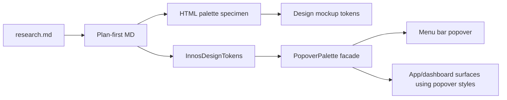

# 2026-06-20 Dark Palette Plan-First

## Goal

Adopt a very dark neutral palette across the InnosDimmer design artifacts and AppKit popover implementation. The main correction is to remove the older blue-tinted surface colors from production code and make the project palette explicit.

## Requested Outcome

- Research dark-mode palette references and local token drift.
- Lock a project palette that is very dark, neutral, and readable.
- Provide an HTML specimen for visual review.
- Implement the palette in Swift and update design docs/mockups.
- Commit the resulting implementation package.

## Codebase Evidence

- `/Users/moonsoo/projects/InnosDimmer/DESIGN.md` requires neutral system backgrounds, compact utility layout, and a dark popover.
- `/Users/moonsoo/projects/InnosDimmer/InnosDimmer/UI/MenuBarPopoverView.swift` contains old private blue-surface tokens in `PopoverPalette`.
- `/Users/moonsoo/projects/InnosDimmer/InnosDimmer/UI/DesignSystem/InnosDesignTokens.swift` exists but uses approximate calibrated whites instead of locked hex tokens.
- `/Users/moonsoo/projects/InnosDimmer/docs/design/schedule-editing/mockup.html` and `/Users/moonsoo/projects/InnosDimmer/docs/design/shared-control-system/specimen.html` already moved toward neutral dark tokens.

## System Visualization



## Palette Contract

| Token | Dark value | Swift owner | HTML owner |
| --- | --- | --- | --- |
| `page` | `#0f0f11` | n/a, docs canvas only | `--page` |
| `surfaceRoot` | `#161616` | `InnosDesignTokens.surfaceRoot` | `--surface` / `--surface-root` |
| `surfaceSection` | `#1f1f22` | `InnosDesignTokens.surfaceSection` | `--panel` / `--surface-section` |
| `surfaceSubtle` | `#262626` | `InnosDesignTokens.surfaceSubtle` | `--panel-2` / `--surface-subtle` |
| `surfaceControl` | `#303036` | `InnosDesignTokens.surfaceControl` | `--control` / `--surface-control` |
| `border` | `#3b3b40` | `InnosDesignTokens.border` | `--line` / `--border` |
| `accent` | `#5aa7ff` | `InnosDesignTokens.accent` | `--blue` / `--accent` |
| `primary` | `#1f7bd9` | `InnosDesignTokens.primaryBackground` | `--blue-strong` / `--accent-strong` |
| `ready` | `#75d99b` | `foreground(.ready)` | `--green` / `--ready` |
| `warning` | `#f1c45f` | `foreground(.warning)` | `--amber` / `--warning` |
| `danger` | `#ff6b6b` | `foreground(.danger)` | `--danger` |

## 검토용 결과물

- [Dark palette specimen](artifacts/dark-palette-specimen.html)
- [Research basis](research.md)

## Operator 결정 필요 사항

상태: 없음.

- 결정 제목: 팔레트 방향
- 맥락: 사용자는 아주 어두운 다크모드 계열과 목업 기반의 실제 운영 반영을 요청했다.
- 선택지:
  - A. Carbon Gray 100 계열의 매우 어두운 중립 팔레트.
  - B. 기존 파란 표면 계열 유지.
  - C. macOS 시스템 색상만 사용하고 프로젝트 토큰 제거.
- 추천안: A.
- 기본값: A.
- 보류 시 영향: 보류하지 않는다. 이번 구현은 A 기준으로 진행한다.

## Skill Routing Manifest

| Phase | Required skills | Optional skills | Evidence |
| --- | --- | --- | --- |
| Phase 1: Research and palette lock | `research` | `디자인올인원` | `research.md`, external design-system sources, local token grep. |
| Commit 1: Palette artifact and docs | `plan-first-implementation` | `review-all-in-one` | HTML specimen and shared-control contract update. |
| Commit 2: Swift token adoption | `구현커밋` | `qa-gate` | `InnosDesignTokens`, `PopoverPalette`, focused XCTest. |
| Final Gate | `review-all-in-one`, `테스트` | `review-swarm` | Build/test output and visual artifact comparison. |

## Implementation Plan

### Phase 1: Research and palette lock

- 대상 파일:
  - `/Users/moonsoo/projects/InnosDimmer/docs/design/dark-palette/research.md`
  - `/Users/moonsoo/projects/InnosDimmer/docs/design/dark-palette/2026-06-20-dark-palette-plan-first.md`
- 변경:
  - local token drift와 외부 디자인 시스템 근거를 기록한다.
  - 매우 어두운 중립 팔레트 값을 잠근다.
- 검증:
  - 대비 계산 결과를 문서에 남긴다.
- 성공 기준:
  - palette 값과 code/doc 적용 범위가 문서에서 일치한다.
- 중단 조건:
  - Apple/Carbon/Atlassian 근거와 로컬 UX 목표가 충돌하면 구현 전 재검토한다.
- 코드 스니펫:

```swift
// Proposed owner shape.
static func surfaceRoot(for appearance: NSAppearance) -> NSColor {
    token(dark: 0x161616, light: 0xf7f7f8, appearance: appearance)
}
```

### Commit 1: Palette artifact and docs

- 대상 파일:
  - `/Users/moonsoo/projects/InnosDimmer/docs/design/dark-palette/artifacts/dark-palette-specimen.html`
  - `/Users/moonsoo/projects/InnosDimmer/docs/design/shared-control-system/contract.md`
  - relevant design mockup HTML token headers
- 변경:
  - HTML specimen에 token swatches, compact popover sample, contrast notes를 만든다.
  - 공유 컨트랙트에 `InnosDesignTokens` 중심의 source-of-truth를 기록한다.
  - 기존 목업의 오래된 blue-surface values를 새 중립 토큰으로 정렬한다.
- 검증:
  - 브라우저에서 specimen 파일을 열 수 있다.
  - `rg`로 old token values가 남아있는지 확인한다.
- 성공 기준:
  - 목업 토큰이 palette contract와 같은 값이다.
- 중단 조건:
  - 기존 HTML이 특정 화면 의도를 위해 다른 색을 명시해야 한다면 mapping 표를 먼저 추가한다.
- 코드 스니펫:

```css
:root,
body[data-theme="dark"] {
  --page: #0f0f11;
  --surface: #161616;
  --panel: #1f1f22;
  --panel-2: #262626;
  --control: #303036;
  --line: #3b3b40;
}
```

### Commit 2: Swift token adoption

- 대상 파일:
  - `/Users/moonsoo/projects/InnosDimmer/InnosDimmer/UI/DesignSystem/InnosDesignTokens.swift`
  - `/Users/moonsoo/projects/InnosDimmer/InnosDimmer/UI/MenuBarPopoverView.swift`
- 변경:
  - `InnosDesignTokens`를 explicit hex token 기반으로 바꾼다.
  - `PopoverPalette`의 old blue hard-code를 제거하고 `InnosDesignTokens`로 위임한다.
  - light values는 기존 mockup 계열을 유지한다.
- 검증:
  - focused XCTest: `InnosDimmerTests/MenuBarStateTests`.
  - 빌드 또는 build-for-testing으로 AppKit compile 확인.
  - 가능하면 실제 app/popover screenshot으로 old blue cast가 제거됐는지 확인.
- 성공 기준:
  - 앱이 빌드되고 popover colors가 neutral dark palette로 나온다.
  - 명령 라우팅, 단축키, 스케줄 표시 동작은 바뀌지 않는다.
- 중단 조건:
  - `PopoverPalette` 위임으로 light mode 또는 diagnostic text contrast가 깨지면 해당 mapping만 조정한다.
- 코드 스니펫:

```swift
private enum PopoverPalette {
    static func background(for appearance: NSAppearance) -> NSColor {
        InnosDesignTokens.surfaceRoot(for: appearance)
    }

    static func sectionBackground(for appearance: NSAppearance) -> NSColor {
        InnosDesignTokens.surfaceSection(for: appearance)
    }
}
```

## Plan Quality Check

- Alternative considered: 기존 mockup blue-surface palette를 그대로 Swift에 맞추는 방식. 사용자가 문제 삼은 지점이 바로 이 방향이라 제외한다.
- Why this plan: 로컬 최신 목업과 mature dark-mode design-system 근거가 모두 neutral dark surface layering을 지지한다.
- Tradeoff: 아주 어두운 팔레트는 표면 간 차이가 작아질 수 있다. 대신 `#161616`, `#1f1f22`, `#262626`, `#303036` 네 단계로 충분한 위계를 확보한다.
- What this plan may still miss: 전체 앱 창의 모든 custom AppKit surface가 `InnosDesignTokens`를 쓰지 않을 수 있다. 이번 패스는 popover/shared-token 중심으로 제한한다.
- When to stop and revise: focused tests가 실패하거나 실제 screenshot에서 텍스트/버튼 대비가 떨어지면 팔레트가 아니라 component mapping을 조정한다.

## HTML 생략 보고서

HTML은 생략하지 않는다. 색상 토큰 변경은 시각 판단이 필요한 디자인 변경이므로 별도 specimen을 제공한다.

## 구현 후 검토 리스트

- 회귀 확인:
  - brightness/warmth controls, quick disable, restore previous, edit shortcuts, open control window command labels.
  - schedule summary rows and shortcut summary rows.
- 검증 확인:
  - `xcodebuild test -project InnosDimmer.xcodeproj -scheme InnosDimmer -only-testing:InnosDimmerTests/MenuBarStateTests`
  - `xcodebuild build -project InnosDimmer.xcodeproj -scheme InnosDimmer`
  - browser-openable HTML specimen.
- 리뷰 관점:
  - old blue surface values are removed from production popover code.
  - accent blue remains limited to slider/focus/primary action.
  - light-mode values are not accidentally darkened.
- Operator 재확인:
  - visually confirm the popover now reads as very dark neutral, not blue.

## 후행 실행

구현커밋.
