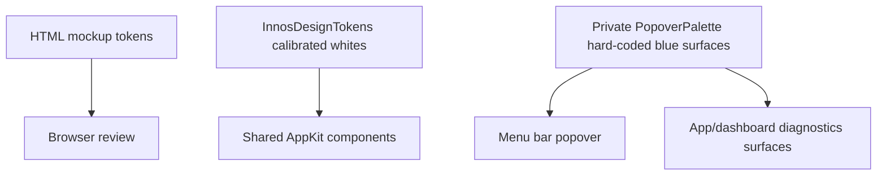
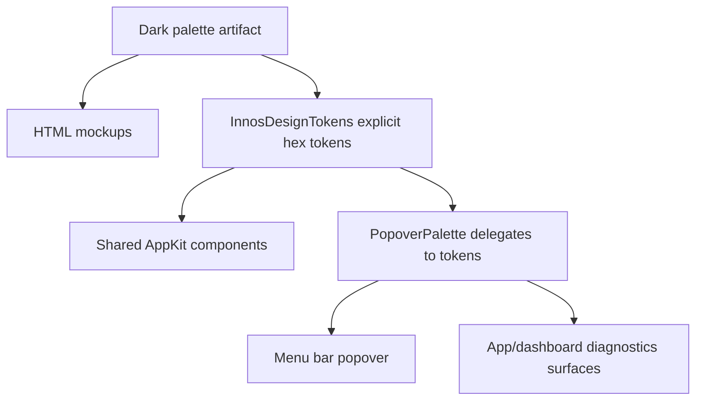

# Research: Very Dark Neutral Palette For InnosDimmer

Date: 2026-06-20

## Goal

Define and adopt a very dark, neutral palette for InnosDimmer so the AppKit popover and design mockups stop drifting toward the older blue surface treatment. The palette must support a macOS utility app used at night, preserve compact readability, and keep blue reserved for controls, progress, and primary actions.

Selected research mode: Pre-Plan Research Gate.

## Scope And Entry Points

- App palette entry points:
  - `/Users/moonsoo/projects/InnosDimmer/InnosDimmer/UI/DesignSystem/InnosDesignTokens.swift`
  - `/Users/moonsoo/projects/InnosDimmer/InnosDimmer/UI/MenuBarPopoverView.swift`
- Design artifact entry points:
  - `/Users/moonsoo/projects/InnosDimmer/docs/design/schedule-editing/mockup.html`
  - `/Users/moonsoo/projects/InnosDimmer/docs/design/shared-control-system/specimen.html`
  - `/Users/moonsoo/projects/InnosDimmer/docs/design/popover-redesign/mockup.html`
  - `/Users/moonsoo/projects/InnosDimmer/docs/design/settings-redesign/mockup.html`
  - `/Users/moonsoo/projects/InnosDimmer/docs/design/window-redesign/app-window-componentized-mockup.html`
- Design contract:
  - `/Users/moonsoo/projects/InnosDimmer/DESIGN.md`
  - `/Users/moonsoo/projects/InnosDimmer/docs/design/shared-control-system/contract.md`

## Local Findings

### Confirmed Facts

- `DESIGN.md` says the app should prefer a dark popover treatment, neutral system backgrounds and separators, compact spacing, and native macOS utility patterns.
- `MenuBarPopoverView.swift` still carries private hard-coded dark colors from the earlier blue palette:
  - `background`: `#182436`
  - `sectionBackground`: `#2d3f5c`
  - `subtleBackground`: `#21262d`
  - `border`: `#465b78`
  - `trackFill`: `#61a8ff`
- Newer mockups already use a more neutral palette:
  - `--page: #111113`
  - `--surface: #1b1b1f`
  - `--panel: #26262b`
  - `--panel-2: #202024`
  - `--control: #303036`
  - `--line: #3b3b40`
- `InnosDesignTokens.swift` exists but still uses approximate calibrated whites instead of an explicit project palette. This makes the source of truth hard to compare with HTML mockups.
- `docs/design/shared-control-system/contract.md` still says raw values should stay in `PopoverPalette` until code tokens are extracted, even though shared tokens now exist.

### Repeated Observations

- The perceived mismatch is not caused by icon choice. It is caused by old blue-tinted surface tokens remaining in Swift while newer mockups use neutral very dark surfaces.
- The app currently has two token layers with overlapping responsibility:
  - `InnosDesignTokens` for shared AppKit components.
  - private `PopoverPalette` for the menu bar popover and dashboard-related views.
- The HTML artifacts have multiple local token definitions. Without a locked palette artifact, future screen-specific mockups can drift again.

## External Evidence

| Source | Evidence quality | Relevant guidance | Adoption decision |
| --- | --- | --- | --- |
| [Apple HIG: Dark Mode](https://developer.apple.com/design/human-interface-guidelines/dark-mode/) | Official platform guidance | Prefer system background colors; Dark Mode background shifts dynamically between base and elevated surfaces. | Adopt the principle: neutral background layers, not saturated blue panels. |
| [Apple HIG: Color](https://developer.apple.com/design/human-interface-guidelines/color) | Official platform guidance | System colors adapt to background, vibrancy, and accessibility modes. | Keep semantic tokens and avoid raw one-off colors outside the token layer. |
| [Carbon Design System: Color](https://carbondesignsystem.com/elements/color/overview/) | Mature design system | Dark themes use Gray 100 and Gray 90 backgrounds. | Use Carbon-like very dark layering as the strongest numeric basis. |
| [Carbon Design System: Color Usage](https://carbondesignsystem.com/elements/color/usage/) | Mature design system | Products should choose a dark theme such as Gray 100 or Gray 90 and redline using tokens. | Lock palette as named tokens and route AppKit through those tokens. |
| [Atlassian Design: Color](https://atlassian.design/foundations/color) | Mature design system | Neutral colors cover backgrounds/text/shapes; design tokens support light and dark mappings. | Keep surfaces neutral and encode dark/light mapping in tokens. |
| [Material Design dark theme](https://m2.material.io/design/color/dark-theme.html) | Design-system reference; less platform-specific for macOS | Dark themes use very dark base surfaces and lighter layers for hierarchy. | Use only as supporting evidence for near-black base surfaces. |

## Palette Decision

Adopt a very dark neutral palette:

| Token | Dark value | Role |
| --- | --- | --- |
| `page` | `#0f0f11` | Documentation canvas / outside app chrome. |
| `surfaceRoot` | `#161616` | Primary app/popover root. Carbon Gray 100 aligned. |
| `surfaceSection` | `#1f1f22` | Section shell/card background. |
| `surfaceSubtle` | `#262626` | Status rows, schedule rows, diagnostics wells. Carbon Gray 90 aligned. |
| `surfaceControl` | `#303036` | Buttons, chips, shortcut row controls. |
| `border` | `#3b3b40` | Dividers and component borders. |
| `text` | `#f3f3f1` | Primary text. |
| `muted` | `#aaa9a3` | Secondary labels and captions. |
| `accent` | `#5aa7ff` | Slider fill, progress, focus accents only. |
| `primary` | `#1f7bd9` | Primary action button fill. |
| `ready` | `#75d99b` | Success/active badges. |
| `warning` | `#f1c45f` | Quick-disable/warning emphasis. |
| `danger` | `#ff6b6b` | Error states. |

Contrast spot checks against dark surfaces:

| Background | Primary text | Muted text | Accent | Warning |
| --- | ---: | ---: | ---: | ---: |
| `surfaceRoot #161616` | 16.29:1 | 7.68:1 | 7.24:1 | 11.03:1 |
| `surfaceSection #1f1f22` | 14.80:1 | 6.98:1 | 6.58:1 | 10.02:1 |
| `surfaceSubtle #262626` | 13.62:1 | 6.42:1 | 6.06:1 | 9.23:1 |
| `surfaceControl #303036` | 11.80:1 | 5.56:1 | 5.25:1 | 7.99:1 |

## Data Flow And Control Flow

Current flow:

Required flow:

## Existing Abstractions And Boundaries

- Keep `InnosDesignTokens` as the shared AppKit token layer.
- Keep `PopoverPalette` as a local compatibility facade for now because many existing popover classes already call it.
- Do not introduce a new design-system package or dependency.
- Do not change behavior, commands, schedule state, or shortcut routing as part of this palette pass.

## Side Effects And Integration Risks

- `PopoverPalette` is used by the popover and app window diagnostics surfaces, so color changes can affect both areas.
- Screenshot artifacts may visually drift after token changes and should be regenerated only if the test/update workflow owns them.
- Light mode should remain unchanged except where token delegation already maps through existing light values.
- `NSColor.labelColor` / `secondaryLabelColor` remain appropriate for native text adaptation; this palette only controls custom backgrounds, borders, controls, and semantic accents.

## Do Not Duplicate

- Do not create another private palette enum for the new dark colors.
- Do not keep hard-coded blue-tinted background values in `PopoverPalette`.
- Do not copy the browser selection outline color from annotated screenshots; use CSS/AppKit token values only.

## Open Questions

- Whether the settings and app window should eventually share one full reusable AppKit component library beyond palette tokens. This is broader than the palette pass.
- Whether screenshot baselines should be regenerated in this same commit or in a later visual verification commit. If existing tests require them, regenerate; otherwise document current visual verification.

## Plan Implications

- Create a palette specimen HTML artifact before implementation so the selected colors are reviewable outside AppKit.
- Update `InnosDesignTokens` to explicit hex-based values for dark tokens.
- Update `PopoverPalette` to delegate to `InnosDesignTokens`, removing the older blue-surface dark values.
- Update design mockup token headers and shared-control contract so HTML and Swift use the same palette language.
- Verify with focused XCTest targets and a built app/screenshot pass if feasible.
