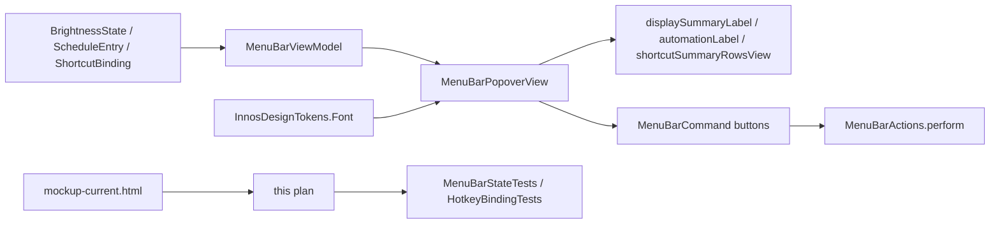

# Current-State Popover Production Sync Plan-First

## Goal

Carry the reviewed `mockup-current.html` popover changes into the real AppKit menu bar popover without changing internal command/storage semantics.

Primary target: make production `MenuBarPopoverView` match the current-state review mockup for copy, state display, shortcut labels, and typography weight.

후행 실행: `구현커밋`

## Requested Outcome

- The production popover header shows only display and dimming mode: `27QA100M · software dimming`.
- The Quick controls chip continues to switch `MANUAL` / `AUTO`.
- The Schedule section uses one status line:
  - paused: `Paused until 19:00`
  - active: `Active`
- The schedule action button uses:
  - paused: `Resume schedule`
  - active: `Pause schedule`
- The compact popover visible label uses `Warmth` instead of `Blue reduction`.
- Internal names stay unchanged:
  - `blueReduction`
  - `MenuBarCommand.blueReductionDown`
  - `MenuBarCommand.blueReductionUp`
  - `MenuBarCommand.setBlueReduction(Int)`
  - `ShortcutAction.blueReductionUp`
  - `ShortcutAction.blueReductionDown`
- Popover typography becomes less heavy, matching the reviewed current-state mockup.
- Existing routing and shortcut persistence continue to work.

## Codebase Evidence

- `Confirmed`:
  - [research.md](/Users/moonsoo/projects/InnosDimmer/docs/design/popover-redesign/current-state-production-sync/research.md) identifies the exact current-state mockup changes and production differences.
  - [mockup-current.html](/Users/moonsoo/projects/InnosDimmer/docs/design/popover-redesign/mockup-current.html) is the reviewed visual target.
  - [MenuBarPopoverView.swift](/Users/moonsoo/projects/InnosDimmer/InnosDimmer/UI/MenuBarPopoverView.swift) already uses `428 x 749`, root padding `16`, section spacing `12`, internal spacing `9`, shortcut chip tokenization, and `MANUAL` / `AUTO` badge logic.
  - [InnosDesignTokens.swift](/Users/moonsoo/projects/InnosDimmer/InnosDimmer/UI/DesignSystem/InnosDesignTokens.swift) already owns Pretendard font roles.
  - [MenuBarStateTests.swift](/Users/moonsoo/projects/InnosDimmer/InnosDimmerTests/MenuBarStateTests.swift) has direct expectations for the old strings.
- `Inferred`:
  - Copy/state changes should live in `MenuBarViewModel` and existing formatter helpers instead of hard-coded view patches.
  - Typography should be popover-specific where possible to avoid app-window regressions.
- `Unverified`:
  - Native AppKit visual output after production changes. This needs implementation plus native snapshot/popover verification.

## System Visualization



- changed nodes:
  - `MenuBarViewModel` visible copy
  - `ShortcutSummaryFormatter` visible group names
  - `MenuBarPopoverView.buildLayout()` visible labels and schedule status rendering
  - `InnosDesignTokens.Font` popover typography roles, or equivalent local popover font aliases
  - `MenuBarStateTests` expectations
- preserved nodes:
  - `MenuBarCommand`
  - `MenuBarActions`
  - `BrightnessController`
  - `ShortcutAction` storage cases
  - `blueReduction` persisted/data names
- diagram notes:
  - HTML stays a review artifact. Production remains native AppKit.

## Related Files

- [mockup-current.html](/Users/moonsoo/projects/InnosDimmer/docs/design/popover-redesign/mockup-current.html): reviewed current-state target with interactive `MANUAL` / `AUTO` schedule toggle.
- [mockup-compare.html](/Users/moonsoo/projects/InnosDimmer/docs/design/popover-redesign/mockup-compare.html): side-by-side review artifact.
- [research.md](/Users/moonsoo/projects/InnosDimmer/docs/design/popover-redesign/current-state-production-sync/research.md): source evidence for this plan.
- [MenuBarPopoverView.swift](/Users/moonsoo/projects/InnosDimmer/InnosDimmer/UI/MenuBarPopoverView.swift): production popover implementation, view model, formatters, AppKit layout.
- [InnosDesignTokens.swift](/Users/moonsoo/projects/InnosDimmer/InnosDimmer/UI/DesignSystem/InnosDesignTokens.swift): shared font/palette tokens.
- [MenuBarStateTests.swift](/Users/moonsoo/projects/InnosDimmer/InnosDimmerTests/MenuBarStateTests.swift): primary expected string and popover behavior tests.
- [HotkeyBindingTests.swift](/Users/moonsoo/projects/InnosDimmer/InnosDimmerTests/HotkeyBindingTests.swift): shortcut routing and legacy naming protection.

## Current Behavior

Production currently differs from the reviewed current-state mockup in these ways:

| Area | Current production | Reviewed current-state mockup |
| --- | --- | --- |
| Header paused state | `27QA100M · software dimming · automation paused until 19:00` | `27QA100M · software dimming` |
| Schedule status | `Automation paused until 19:00` + `Next boundary 19:00` | `Paused until 19:00` only |
| Schedule active status | `Automation active` + `Schedule rows below` | `Active` only |
| Schedule action | `Resume automation` / `Pause automation` | `Resume schedule` / `Pause schedule` |
| Control label | `Blue reduction` | `Warmth` |
| Shortcut group | `Blue reduction` | `Warmth` |
| Font weight | many `semibold` roles | lighter role hierarchy |

## Change Map

- likely files to edit:
  - `InnosDimmer/UI/MenuBarPopoverView.swift`
  - `InnosDimmer/UI/DesignSystem/InnosDesignTokens.swift`
  - `InnosDimmerTests/MenuBarStateTests.swift`
  - possibly `InnosDimmerTests/HotkeyBindingTests.swift` if visible copy expectations are present after implementation
- likely functions/components/helpers to touch:
  - `MenuBarViewModel.init(...)`
  - `MenuBarViewModel.scheduleStatusDetail(state:schedule:)`
  - `MenuBarViewModel.shortcutActionLabel(for:)`
  - `ShortcutSummaryFormatter.groups(from:)`
  - `MenuBarPopoverView.buildLayout()`
  - `MenuBarPopoverView.makeControlGroup(...)` call for warmth row
  - `MenuBarPopoverView.scheduleStatusForTesting()`
  - `InnosDesignTokens.Font`
  - `BadgePillView`, `PopoverCommandButton`, `ShortcutPairRowView`, `ShortcutKeyChipView` only if font tokens are not enough
- state/data/content dependencies:
  - `BrightnessState.automationPausedUntilNextBoundary`
  - `BrightnessState.automationResumeMinuteOfDay`
  - `ScheduleEntry`
  - `ShortcutBinding.defaultBindings`
- side effects/integrations to preserve:
  - command routing via `MenuBarActions.perform`
  - `.pauseAutomation` / `.resumeAutomation` command registration
  - `blueReductionTrackView.onUserFractionChange`
  - shortcut persistence and legacy decoding
- likely new files:
  - none required for production
- remaining narrow unknowns before patch:
  - whether popover-specific font aliases should be added to `InnosDesignTokens.Font` or kept as private local aliases. Default: add popover-specific token aliases to make reviewable semantics explicit.

## Planned Changes

- expected behavior changes:
  - Compact popover copy follows `mockup-current.html`.
  - Visual label `Warmth` replaces `Blue reduction` only in the menu bar popover.
  - Schedule status card removes the redundant second line.
  - User-facing accessibility labels follow visible copy.
  - Internal command and model names remain `blueReduction`.
- constraints to preserve:
  - no rename of storage or enum cases
  - no route/action bypass
  - no dependency additions
  - no app-window naming expansion in this pass
  - preferred popover size remains `428 x 749`
- execution order:
  - update focused tests and production copy in one commit so the branch stays green
  - then apply typography/layout refinements
  - then run visual/native verification and update docs if needed

## Review Notes

- risks:
  - App-wide tests may still expect `Blue reduction` outside the popover. Do not update those unless they are specifically asserting the popover.
  - A broad token weight change can unintentionally alter app-window UI.
  - Removing `scheduleStatusDetailLabel` without accounting for `scheduleStatusForTesting()` can break existing test helpers.
- assumptions:
  - The user-approved current-state mockup is the target for this implementation cycle.
  - `Warmth` is a visible UI label only; `blueReduction` remains the technical model name.
- unanswered questions:
  - App-wide naming audit remains separate.
  - Whether active schedule card should disappear instead of showing `Active` remains out of scope; the current mockup keeps `Active`.

## Plan Quality Check

- Alternative considered:
  - Rename `blueReduction` everywhere to `warmth`. Rejected because it would touch persistence, shortcuts, tests, and domain semantics beyond this compact popover pass.
  - Keep `Automation paused` wording. Rejected because the reviewed mockup and Schedule section context favor the shorter `Paused until ...` copy.
  - Globally reduce all shared font token weights. Rejected as first move because it risks app-window and editor regressions.
- Why this plan:
  - It uses the reviewed mockup and the local research artifact as evidence.
  - It keeps existing command boundaries and changes only user-facing compact popover behavior.
  - It splits copy/state changes from typography/layout changes so regressions are easier to isolate.
- Tradeoff:
  - The popover may temporarily use `Warmth` while other app surfaces still say `Blue reduction`.
  - This is acceptable because the user requested the compact popover fix first and an app-wide naming audit is larger.
- What this plan may still miss:
  - Native AppKit text metrics can differ from browser Pretendard rendering.
  - Snapshot/nonblank tests may not catch subtle visual weight issues.
- When to stop and revise:
  - If `MenuBarStateTests` reveal that app-window and popover copy are coupled more tightly than expected.
  - If native capture shows clipping or missing action buttons at `428 x 749`.
  - If changing font tokens affects unrelated app-window pages.

## Skill Routing Manifest

| Phase | Required skills | Optional skills | Evidence |
| --- | --- | --- | --- |
| Commit 1: Lock popover copy and state contract | `구현커밋` | `review-all-in-one` | `research.md`, `MenuBarStateTests.swift`, `MenuBarPopoverView.swift`; copy changes must preserve routing and tests. |
| Commit 2: Apply popover typography and one-line schedule status layout | `구현커밋` | `디자인올인원`, `review-swarm` | `mockup-current.html` font weights and schedule card; risk is visual/layout regression. |
| Phase 3: Native verification and documentation sync | `구현커밋`, `review-all-in-one` | `qa-gate`, `테스트` | Native AppKit needs focused tests plus visual inspection; docs and review links must match implementation. |
| Final Gate | `review-all-in-one`, `qa-gate` | `review-swarm`, `테스트` | Run focused Xcode tests, inspect mockup/native output, confirm no command/storage rename. |

## Implementation Plan

### Commit 1: Lock popover copy and state contract

- target files:
  - `InnosDimmer/UI/MenuBarPopoverView.swift`
  - `InnosDimmerTests/MenuBarStateTests.swift`
- changes:
  - Update `MenuBarViewModel.displaySummary` so paused schedule text is not appended to the header.
  - Update `MenuBarViewModel.automationTitle`:
    - paused: `Paused until HH:mm`
    - active: `Active`
  - Update `MenuBarViewModel.automationActionTitle`:
    - paused: `Resume schedule`
    - active: `Pause schedule`
  - Update `scheduleStatusDetail(state:schedule:)` to return an empty string for configured schedules.
  - Keep `No schedule configured` for empty schedules if existing behavior needs an explicit empty state.
  - Update `scheduleStatusForTesting()` expectation so it does not require `Next boundary` or `Schedule rows below`.
  - Update focused popover tests to expect `Warmth` in compact popover summaries and to stop asserting `Blue reduction` for popover-only labels.
- code snippets:
  - Proposed `MenuBarViewModel` copy shape:

```swift
displaySummary = state.display.map { display in
    [Self.displaySummaryDisplayName(for: display), "software dimming"]
        .joined(separator: " · ")
} ?? "No display selected"

if state.automationPausedUntilNextBoundary, let resumeMinute = state.automationResumeMinuteOfDay {
    automationTitle = "Paused until \(Self.timeLabel(for: resumeMinute))"
} else if state.automationPausedUntilNextBoundary {
    automationTitle = "Paused"
} else {
    automationTitle = "Active"
}

automationActionTitle = state.automationPausedUntilNextBoundary ? "Resume schedule" : "Pause schedule"
```

  - Proposed schedule detail helper:

```swift
private static func scheduleStatusDetail(state: BrightnessState, schedule: [ScheduleEntry]) -> String {
    guard !SettingsSnapshot.sortedSchedule(schedule).isEmpty else {
        return "No schedule configured"
    }
    return ""
}
```

- tradeoff:
  - chosen: move reviewed copy into `MenuBarViewModel`.
  - alternative: hard-code copy in `MenuBarPopoverView.update(...)`.
  - cost/risk: several tests need intentional updates.
  - why acceptable: `MenuBarViewModel` is already the source of popover display strings.
  - revisit when: if app-window view models share these exact strings and unintentionally change outside the popover.
- verification:
  - `xcodebuild -project InnosDimmer.xcodeproj -scheme InnosDimmer -destination 'platform=macOS' CODE_SIGNING_ALLOWED=NO test -only-testing:InnosDimmerTests/MenuBarStateTests`: confirms updated view model and popover helper expectations.
  - `rg -n "Automation paused|Next boundary|Resume automation|Pause automation" InnosDimmerTests/MenuBarStateTests.swift InnosDimmer/UI/MenuBarPopoverView.swift`: confirms old popover-only copy is removed or intentionally limited to non-popover surfaces.
- success criteria:
  - Header display summary stays `27QA100M · software dimming` while paused.
  - Schedule status testing returns `Paused until 19:00` without a second `Next boundary` line.
  - The action button title is `Resume schedule` / `Pause schedule`.
  - `.pauseAutomation` / `.resumeAutomation` command registration remains intact.
- stop conditions:
  - Any production code change requires renaming `MenuBarCommand` or `ShortcutAction`.
  - App-window tests start failing because shared copy changed outside the popover; then split the popover view model copy from app-window copy before continuing.

### Commit 2: Apply popover typography and one-line schedule status layout

- target files:
  - `InnosDimmer/UI/DesignSystem/InnosDesignTokens.swift`
  - `InnosDimmer/UI/MenuBarPopoverView.swift`
  - `InnosDimmerTests/MenuBarStateTests.swift`
- changes:
  - Add popover-specific font aliases instead of weakening global roles.
  - Use those aliases in `MenuBarPopoverView`, `BadgePillView`, `PopoverCommandButton`, `ShortcutPairRowView`, and `ShortcutKeyChipView` where the current mockup requires lower weight.
  - Keep value labels visually strong.
  - Change the second control visible title to `Warmth`.
  - Change user-facing accessibility labels to `Warmth down`, `Warmth up`, and `Warmth percentage`.
  - Change `ShortcutSummaryFormatter.groups(from:)` display title to `Warmth`.
  - Change `shortcutActionLabel(for:)` display title to `Warmth up` / `Warmth down`.
  - Avoid changing app-window schedule/shortcut page copy unless tests prove they share the same popover-only formatter.
- code snippets:
  - Proposed font aliases:

```swift
static var popoverTitle: NSFont { app(ofSize: 17, weight: .bold) }
static var popoverSectionLabel: NSFont { app(ofSize: 12, weight: .semibold) }
static var popoverLabel: NSFont { app(ofSize: 13, weight: .semibold) }
static var popoverValue: NSFont { app(ofSize: 18, weight: .bold) }
static var popoverButton: NSFont { app(ofSize: 12, weight: .semibold) }
static var popoverStepperButton: NSFont { app(ofSize: 15, weight: .bold) }
static var popoverBadge: NSFont { app(ofSize: 12, weight: .semibold) }
static var popoverBadgeCompact: NSFont { app(ofSize: 10, weight: .semibold) }
static var popoverShortcutName: NSFont { app(ofSize: 13, weight: .semibold) }
static var popoverShortcutDirection: NSFont { app(ofSize: 12, weight: .medium) }
static var popoverShortcutToken: NSFont { app(ofSize: 13, weight: .semibold) }
static var popoverShortcutSeparator: NSFont { app(ofSize: 9, weight: .regular) }
static var popoverShortcutOff: NSFont { app(ofSize: 12, weight: .semibold) }
```

  - Proposed visible label update:

```swift
makeControlGroup(
    title: "Warmth",
    iconSystemName: "thermometer.medium",
    iconFallback: "🌡",
    iconColor: NSColor(calibratedRed: 0.94, green: 0.58, blue: 0.16, alpha: 1),
    valueLabel: blueReductionValueLabel,
    trackView: blueReductionTrackView,
    decrement: compactButton("-", accessibilityLabel: "Warmth down", command: .blueReductionDown, action: #selector(blueReductionDownPressed)),
    increment: compactButton("+", accessibilityLabel: "Warmth up", command: .blueReductionUp, action: #selector(blueReductionUpPressed))
)
blueReductionTrackView.setAccessibilityLabel("Warmth percentage")
```

  - Proposed shortcut formatter display-only update:

```swift
ShortcutSummaryGroup(
    title: "Warmth",
    upKeyLabel: lookup[.blueReductionUp] ?? "Off",
    downKeyLabel: lookup[.blueReductionDown] ?? "Off"
)
```

- tradeoff:
  - chosen: add popover-specific font roles and keep internal `blueReduction` names.
  - alternative: change existing global font roles directly.
  - cost/risk: more token names.
  - why acceptable: avoids unintended app-window typography regression and documents role intent.
  - revisit when: future design cleanup wants all app surfaces to share the lighter role hierarchy.
- verification:
  - `xcodebuild -project InnosDimmer.xcodeproj -scheme InnosDimmer -destination 'platform=macOS' CODE_SIGNING_ALLOWED=NO test -only-testing:InnosDimmerTests/MenuBarStateTests -only-testing:InnosDimmerTests/HotkeyBindingTests`: confirms popover tests and shortcut legacy behavior.
  - `rg -n "Blue reduction" InnosDimmer/UI/MenuBarPopoverView.swift`: should show no popover-visible compact labels, except internal comments/tests if intentionally preserved.
  - `rg -n "Warmth" InnosDimmer/UI/MenuBarPopoverView.swift InnosDimmerTests/MenuBarStateTests.swift`: confirms visible label coverage.
- success criteria:
  - Popover control row displays `Warmth` without truncation.
  - Shortcut row displays `Warmth`.
  - Shortcut command enum and persisted shortcut logic remain unchanged.
  - No unrelated app-window tests are rewritten just to force a broader naming change.
- stop conditions:
  - Font alias changes cause app-window visual or test regressions.
  - A formatter is shared with app-window shortcut table and would change app-window copy unintentionally.

### Phase 3: Native verification and documentation sync

- target:
  - production AppKit popover after Commits 1 and 2
  - `docs/design/popover-redesign/current-state-production-sync/research.md`
  - this plan document if implementation evidence changes
- work:
  - Run focused test suite.
  - Render or manually inspect the native popover at the real `428 x 749` size.
  - Compare against [mockup-current.html](/Users/moonsoo/projects/InnosDimmer/docs/design/popover-redesign/mockup-current.html).
  - Confirm `MANUAL` / `AUTO` state still maps to `.resumeAutomation` / `.pauseAutomation` command registration.
  - Update docs only if implementation changes diverge from the plan.
- code snippets:
  - Not needed. This is a verification/documentation phase.
- tradeoff:
  - chosen: native verification after tests.
  - alternative: rely only on HTML mockup and unit tests.
  - cost/risk: takes more time and may require manual inspection.
  - why acceptable: typography and clipping are visual risks that unit tests do not fully catch.
  - revisit when: an automated native snapshot harness becomes reliable enough to replace manual inspection.
- verification:
  - `xcodebuild -project InnosDimmer.xcodeproj -scheme InnosDimmer -destination 'platform=macOS' CODE_SIGNING_ALLOWED=NO test -only-testing:InnosDimmerTests/MenuBarStateTests -only-testing:InnosDimmerTests/HotkeyBindingTests`: focused regression.
  - `git diff --check`: whitespace/path sanity.
  - native visual check: no clipping; `Warmth`, `Paused until 19:00`, `Resume schedule`, `MANUAL` / `AUTO` visible as expected.
- success criteria:
  - Focused tests pass.
  - Native popover visually matches the reviewed current-state mockup closely enough for the next feedback round.
  - Documentation and implementation no longer disagree on the compact popover copy.
- stop conditions:
  - Actual native popover clips at `428 x 749`.
  - `MANUAL` / `AUTO` badge and schedule action route to the wrong command.
  - Native font rendering makes shortcut chips overflow.

## Operator 결정 필요 사항

- 상태: 없음
- 결정 1: Compact popover naming scope
  - 맥락: `Warmth` is now the reviewed compact popover label, but app-window pages may still use `Blue reduction`.
  - A: Apply `Warmth` only to the compact menu bar popover. This is narrow and matches the current request.
  - B: Apply `Warmth` app-wide. This is broader and needs a separate naming audit.
  - C: Keep production as `Blue reduction`. This conflicts with the reviewed current-state mockup.
  - 추천안: A. Apply `Warmth` only to the compact menu bar popover now.
  - 기본값: A. Apply `Warmth` only to the compact menu bar popover now.
  - 보류 시 영향: If deferred, implementation can still proceed with compact popover only and leave app-wide naming for a later plan.

## 검토용 결과물

- HTML:
  - [Current implementation clone](../mockup-current.html)
  - [Mockup compare](../mockup-compare.html)
  - [Ideal mockup](../mockup.html)
- 테스트 링크:
  - Localhost: not required. Review artifacts are static `file://` HTML files.
  - Deploy: unavailable. This is local design/implementation planning only.
- 상태: implemented and previously browser-verified during the current workstream.
- 실제 동작:
  - `mockup-current.html` includes a JavaScript `MANUAL` / `AUTO` state toggle through `Resume schedule` / `Pause schedule`.
  - It shows `Warmth` and one-line schedule status.
- Mock:
  - Values are sample review data: `45%`, `32%`, `09:00`, `19:00`, `23:00`.
  - The HTML is not embedded in production.

## 후행 실행

- 기본 실행: `구현커밋`
- 계획 경로 처리: `구현커밋`이 직전 대화, 계획 링크, active plan context에서 자동 탐지한다.
- 모호할 때: 후보 목록을 보여주고 Operator에게 선택 요청.
- 이 plan-first 단계에서는 Swift 구현 패치를 하지 않는다.

## HTML 생략 보고서

- 판정: 생략하지 않음
- 생략 사유:
  - 해당 없음. 기존 HTML 검토물인 `mockup-current.html`과 `mockup-compare.html`을 이 계획의 검토 표면으로 사용한다.
- 대체 검토물:
  - 해당 없음
- 테스트 링크:
  - Localhost: not required for static HTML.
  - Deploy: unavailable.
- 사용자가 바로 열어볼 링크:
  - [Current implementation clone](../mockup-current.html)
  - [Mockup compare](../mockup-compare.html)

## 구현 후 검토 리스트

- 회귀 확인:
  - `MenuBarCommand` route remains unchanged.
  - `.pauseAutomation` and `.resumeAutomation` buttons are still registered under the correct command.
  - `blueReduction` internal names, shortcut enum cases, and persistence remain unchanged.
  - App-window pages do not unintentionally switch to `Warmth`.
- 검증 확인:
  - Focused Xcode tests pass.
  - `git diff --check` passes.
  - Native popover shows:
    - `27QA100M · software dimming`
    - `Warmth`
    - `Paused until 19:00`
    - `Resume schedule`
    - no `Next boundary` second line in the status card
  - `MANUAL` / `AUTO` badge still tracks paused schedule state.
- 리뷰 관점:
  - `review-all-in-one`: copy boundaries, test expectations, command routing.
  - `review-swarm`: visual hierarchy, typography, overflow risks.
  - `qa-gate`: focused test command and native visual check.
- Operator 재확인:
  - Inspect the real popover after implementation and compare it with `mockup-current.html`.
  - Decide later whether app-wide `Blue reduction` should become `Warmth`.

## Validation

- implementation result:
  - Status: implemented in production `MenuBarPopoverView`.
  - Header display summary no longer appends paused schedule text.
  - Schedule status is now one line inside the `Schedule` section: `Paused until HH:mm` or `Active`.
  - Schedule action copy is now `Resume schedule` / `Pause schedule`, while commands remain `.resumeAutomation` / `.pauseAutomation`.
  - Compact popover visible copy now uses `Warmth`; internal `blueReduction` names remain unchanged.
  - Popover-specific Pretendard font aliases are used instead of weakening global font roles.
  - Popover actual captures were regenerated through `MenuBarStateTests`.
- manual checks:
  - Open [mockup-current.html](/Users/moonsoo/projects/InnosDimmer/docs/design/popover-redesign/mockup-current.html).
  - Click `Resume schedule` and confirm the badge changes from `MANUAL` to `AUTO` and copy changes to `Active` / `Pause schedule`.
  - Open [mockup-compare.html](/Users/moonsoo/projects/InnosDimmer/docs/design/popover-redesign/mockup-compare.html) and compare current/ideal surfaces.
- lint/build/test scope:
  - Plan document validation:

```bash
git diff --check -- docs/design/popover-redesign/current-state-production-sync/2026-06-22-current-state-production-sync-plan-first.md
```

  - Future implementation validation:

```bash
xcodebuild -project InnosDimmer.xcodeproj -scheme InnosDimmer -destination 'platform=macOS' CODE_SIGNING_ALLOWED=NO test -only-testing:InnosDimmerTests/MenuBarStateTests -only-testing:InnosDimmerTests/HotkeyBindingTests
```

  - Executed after implementation on 2026-06-22:
    - `69 tests`
    - `0 failures`
    - `TEST SUCCEEDED`

```bash
git diff --check
```

  - Executed after implementation on 2026-06-22:
    - passed with no output

- scenario-to-surface checks:
  - paused schedule state maps to `MANUAL`, `Paused until 19:00`, `Resume schedule`
  - active schedule state maps to `AUTO`, `Active`, `Pause schedule`
  - compact warmth control maps to `Warmth`, `32%`, `Warmth down`, `Warmth up`
  - shortcut summary maps to `Brightness` and `Warmth`
