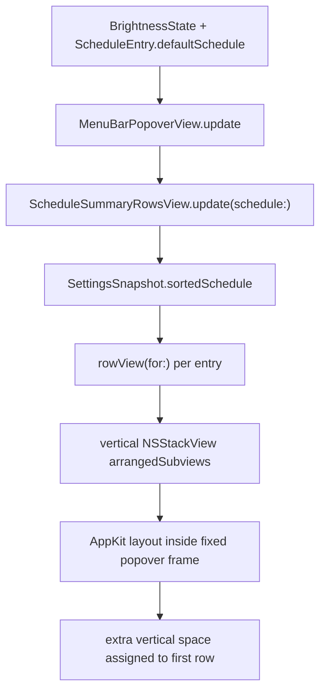

# Research

## Goal

Find why the production popover schedule table renders with an oversized first row and determine the safest repair path.

## Scope And Entry Points

- Entry point:
  - `/Users/moonsoo/projects/InnosDimmer/InnosDimmer/UI/MenuBarPopoverView.swift`
- Test entry point:
  - `/Users/moonsoo/projects/InnosDimmer/InnosDimmerTests/MenuBarStateTests.swift`
- Visual evidence:
  - user-provided popover screenshot showing the first schedule row stretched.

## Relevant Files

- `/Users/moonsoo/projects/InnosDimmer/InnosDimmer/UI/MenuBarPopoverView.swift`
- `/Users/moonsoo/projects/InnosDimmer/InnosDimmerTests/MenuBarStateTests.swift`
- `/Users/moonsoo/projects/InnosDimmer/docs/design/popover-redesign/captures/actual-dark.png`
- `/Users/moonsoo/projects/InnosDimmer/docs/design/popover-redesign/captures/actual-light.png`
- `/Users/moonsoo/projects/InnosDimmer/docs/design/popover-redesign/schedule-table-production-sync/2026-06-22-schedule-table-production-sync-plan-first.md`

## Current Behavior

The schedule table now uses one bordered table container. Each schedule row is an arranged subview in a vertical `NSStackView`.

The visual regression shows row 1 much taller than rows 2 and 3.

## Data Flow And Control Flow



## Existing Abstractions And Boundaries

- `MenuBarPopoverView` owns popover-only visual layout and test helpers.
- `ScheduleSummaryRowsView` owns schedule summary row rendering.
- `SettingsSnapshot.sortedSchedule(schedule)` owns ordering and must not be bypassed.
- `MenuBarViewModel` owns text/state derivation and should remain unchanged for this layout-only repair.

## Side Effects And Integration Points

- The fix should affect only popover schedule row geometry.
- Command routing, schedule persistence, shortcut rendering, and automation state must remain unchanged.
- Snapshot capture tests will update `actual-dark.png` and `actual-light.png` after visual repair.

## Risk To Surrounding Systems

- If the row height is made exact without a regression test, future AppKit constraint changes can reintroduce the stretch.
- If the fix changes `plainSummary`, app window or dashboard tests could regress unnecessarily.
- If the fix changes command or schedule data flow, it widens the bugfix beyond the user-visible issue.

## Do Not Duplicate Or Bypass

- Do not duplicate `SettingsSnapshot.sortedSchedule(schedule)`.
- Do not replace `ScheduleSummaryRowsView` with a second schedule table implementation.
- Do not alter `MenuBarViewModel` for this layout-only bug.
- Do not use image-only verification as the sole acceptance gate.

## Open Questions

- None blocking.

## Plan Implications

- Use an exact row height constraint: `container.heightAnchor.constraint(equalToConstant: 34)`.
- Set vertical hugging and compression resistance to required for row containers.
- Add `popoverScheduleRowHeightsForTesting()` to verify actual row frames after layout.
- Refresh captures only after structural tests pass.

## Source Evaluation

- Local code evidence: Adopt.
- User screenshot evidence: Adopt as visual reproduction.
- External sources: Not needed. This is a local AppKit constraint/layout regression, and the relevant behavior is in repository code.

## Evidence

- Current faulty constraint:

```swift
container.heightAnchor.constraint(greaterThanOrEqualToConstant: 34)
```

- Proposed repaired constraint:

```swift
container.heightAnchor.constraint(equalToConstant: 34)
container.setContentHuggingPriority(.required, for: .vertical)
container.setContentCompressionResistancePriority(.required, for: .vertical)
```

- Verification commands:

```bash
xcodebuild -project InnosDimmer.xcodeproj -scheme InnosDimmer -destination 'platform=macOS' CODE_SIGNING_ALLOWED=NO test -only-testing:InnosDimmerTests/MenuBarStateTests/testMenuBarPopoverExposesScheduleStructureForTesting
xcodebuild -project InnosDimmer.xcodeproj -scheme InnosDimmer -destination 'platform=macOS' CODE_SIGNING_ALLOWED=NO test -only-testing:InnosDimmerTests/MenuBarStateTests -only-testing:InnosDimmerTests/HotkeyBindingTests
git diff --check
```
