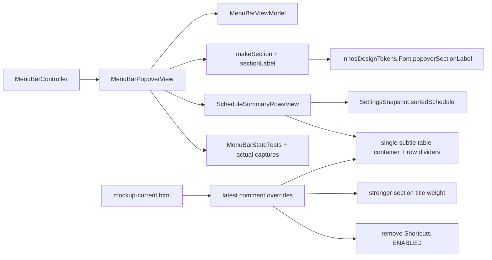

# Schedule Table Production Sync Plan First

## Goal

Move the approved `mockup-current.html` schedule table treatment into the production AppKit menu bar popover and strengthen the top-level popover section title weight.

## Requested Outcome

- Production popover `Schedule` rows render as one compact table-like block, not three separate card boxes.
- Schedule times render as plain aligned text, not badge/pill boxes.
- Schedule row values remain evenly distributed across three columns and slightly shifted left, matching the current mockup.
- `Quick controls`, `Schedule`, and `Shortcuts` section labels use a stronger weight.
- The static `ENABLED` badge is removed from the `Shortcuts` section header.
- Existing schedule sorting, automation state, command routing, shortcut rendering, and copy remain unchanged.

## Codebase Evidence

- `Confirmed`:
  - `ScheduleSummaryRowsView` currently renders each schedule entry as its own `PopoverContainerView(style: .subtle)`.
  - Time uses `pillLabel(...)`, which creates a `BadgePillView`.
  - Section labels use `InnosDesignTokens.Font.popoverSectionLabel`.
  - `mockup-current.html` now uses `.schedule-table` and equal three-column `.schedule-row` layout.
  - `mockup-current.html` still shows the `Shortcuts` `ENABLED` badge and uses `.section-title { font-weight: 620; }`.
- `Inferred`:
  - The production schedule summary should become one container with internal row dividers, mirroring the shortcut table and mockup schedule table.
  - Bumping `popoverSectionLabel` to `.bold` is the safest single-point typography change for the three top-level section labels.
- `Unverified`:
  - Exact visual weight of `.bold` in Pretendard inside AppKit must be confirmed through regenerated `actual-dark.png` and `actual-light.png`.

## System Visualization



- changed nodes: `FontToken`, `ScheduleRows`, `Table`, `Tests`, `ShortcutBadge`, `SectionTitle`
- preserved nodes: `Controller`, `ViewModel`, `Sort`, command routing
- diagram notes: the change is visual/layout only and should not alter state derivation or side effects. `mockup-current.html` is the approved base, but latest comments override its still-visible `ENABLED` badge and mid-weight section title CSS.

## Mockup-To-Production Mapping

| Area | Current production | Current mockup | Latest override | Production target |
| --- | --- | --- | --- | --- |
| Schedule rows | Three separate subtle cards | One `.schedule-table` with dividers | Approved | One `ScheduleSummaryRowsView` table container |
| Schedule time | `BadgePillView` via `pillLabel(...)` | `.schedule-time` plain text | Approved | Plain secondary time label |
| Schedule columns | time + brightness + warmth + spacer | `repeat(3, minmax(0, 1fr))`, shifted left | Approved | Three equal cells with left-biased content constraints |
| Section title weight | `popoverSectionLabel` `.semibold` | `.section-title` `font-weight: 620` | Make bolder | `popoverSectionLabel` `.bold`; mockup CSS also updated |
| Shortcuts badge | `pillBadge("ENABLED", compact: true)` | `<span class="badge compact">ENABLED</span>` | Remove | `trailing: nil`; HTML badge removed |
| Quick controls badge | `MANUAL` / `AUTO` state badge | `MANUAL` / `AUTO` state badge | Preserve | Unchanged |

## Related Files

- `/Users/moonsoo/projects/InnosDimmer/InnosDimmer/UI/MenuBarPopoverView.swift`: owns production popover sections and `ScheduleSummaryRowsView`.
- `/Users/moonsoo/projects/InnosDimmer/InnosDimmer/UI/DesignSystem/InnosDesignTokens.swift`: owns popover font roles.
- `/Users/moonsoo/projects/InnosDimmer/InnosDimmerTests/MenuBarStateTests.swift`: owns popover behavior, layout, and capture tests.
- `/Users/moonsoo/projects/InnosDimmer/docs/design/popover-redesign/mockup-current.html`: approved current-state reference.
- `/Users/moonsoo/projects/InnosDimmer/docs/design/popover-redesign/captures/actual-dark.png`: production dark capture to refresh.
- `/Users/moonsoo/projects/InnosDimmer/docs/design/popover-redesign/captures/actual-light.png`: production light capture to refresh.
- `/Users/moonsoo/projects/InnosDimmer/docs/design/popover-redesign/schedule-table-production-sync/research.md`: evidence basis for this plan.

## Current Behavior

Production schedule rows are visually heavier than the approved mockup because every row is a separate subtle card and the time value is another badge-like pill inside that card.

Production section headers are generated correctly through one helper, but the current `popoverSectionLabel` weight is too light for the reviewed hierarchy.

The `Shortcuts` section also currently carries a trailing compact `ENABLED` badge. Latest review feedback says this badge can be removed because it adds visual noise without changing the shortcut table's meaning.

The review HTML is not a perfect final artifact after the latest comments: it still contains the `ENABLED` badge and uses `font-weight: 620` for section titles. Treat it as the approved schedule-table base plus the latest comment overrides listed in `Mockup-To-Production Mapping`.

## Change Map

- likely files to edit:
  - `InnosDimmer/UI/MenuBarPopoverView.swift`
  - `InnosDimmer/UI/DesignSystem/InnosDesignTokens.swift`
  - `InnosDimmerTests/MenuBarStateTests.swift`
  - `docs/design/popover-redesign/captures/actual-dark.png`
  - `docs/design/popover-redesign/captures/actual-light.png`
  - `docs/design/popover-redesign/mockup-current.html`
- likely functions/components/hooks/stores/routes to touch:
  - `ScheduleSummaryRowsView.update(schedule:)`
  - `ScheduleSummaryRowsView.rowView(for:)`
  - `ScheduleSummaryRowsView.metricView(...)`
  - `ScheduleSummaryRowsView.pillLabel(...)` should become unused or be removed if no longer needed.
  - `MenuBarPopoverView.sectionLabel(_:)` only indirectly through token update.
  - `MenuBarPopoverView.buildLayout()` `Shortcuts` section trailing badge argument.
  - `InnosDesignTokens.Font.popoverSectionLabel`
  - `mockup-current.html` `.section-title` and `#current-shortcuts` header contents
- state/data/content dependencies:
  - `SettingsSnapshot.sortedSchedule(schedule)` must remain the source of row order.
  - `plainSummary` must remain unchanged.
- side effects/integrations to preserve or adjust:
  - Command routing and action buttons must remain untouched.
  - Snapshot capture output should be refreshed after visual changes.
- likely new files:
  - None for production implementation.
- remaining narrow unknowns before patch:
  - Whether AppKit `.bold` renders slightly too heavy; verify through captures.

## Planned Changes

- expected behavior changes:
  - The schedule summary becomes one table-like visual container.
  - Time values are text cells rather than pill badges.
  - Section labels are visibly stronger.
  - The `Shortcuts` section title has no trailing `ENABLED` badge.
  - The review mockup is synced with the same badge removal and stronger title weight.
- constraints to preserve:
  - No command routing changes.
  - No schedule editing changes.
  - No shortcut table behavior changes.
  - No persisted data shape changes.
- execution order:
  1. Add or update tests/identifiers to define the intended schedule table structure.
  2. Implement table-like schedule rows and section label token weight.
  3. Regenerate captures and run focused tests.

## Review Notes

- risks:
  - Table row dividers may add height and create bottom slack or clipping.
  - Section label `.bold` may overpower badges.
  - Removing `ENABLED` may make shortcut enablement less explicit, but the table itself remains visible and actionable.
  - Private view structure may be hard to assert without adding identifiers.
  - `mockup-current.html` can drift from production if the latest overrides are only applied in Swift.
- assumptions:
  - The current mockup is the approved visual target.
  - The user wants this exact schedule table direction in production.
- unanswered questions:
  - None blocking. Weight can be tuned after capture review.

## Review-All-In-One Hardening Passes

### Pass 1 Findings

- Important: The plan called `mockup-current.html` the direct source of truth while the latest comments changed two details not yet represented there: `Shortcuts` `ENABLED` removal and stronger section-title weight.
- Important: The test strategy did not name the current gap that popover tests expose text summaries but do not yet expose a popover structure tree comparable to app-window `containsIdentifier(...)`.
- Minor: The AppKit implementation snippets showed the target direction but did not specify how to preserve equal cell sizing while applying the mockup's left-biased padding.

### Pass 1 Resolutions

- Added `Mockup-To-Production Mapping` to distinguish approved mockup base from latest-comment overrides.
- Added explicit `mockup-current.html` updates to Commit 2 so HTML and production do not drift.
- Added concrete testing helper and AppKit layout snippets under Commit 1 and Commit 2.

### Pass 2 Status

- Initial Pass 2 found one minor snippet ambiguity: the `MANUAL` assertion needs a paused automation state setup.
- Resolved by making the proposed test setup explicit.
- Remaining risk is visual calibration after implementation: `.bold` section labels and AppKit table alignment must be verified in `actual-dark.png` and `actual-light.png`.

### Pass 3 Status

- No additional document-contract, content-sync, or code-snippet issue found.
- The plan is implementation-ready for `구현커밋` with one expected post-implementation visual review risk: screenshot calibration.

## Plan Quality Check

- Alternative considered:
  - Keep each schedule row as a separate `PopoverContainerView` and only remove the time pill. Rejected because the user approved the compact table-like grouping.
  - Use `NSGridView`. Rejected for this small popover because current layout already uses `NSStackView`; stack-based rows reduce AppKit complexity.
- Why this plan:
  - It changes only the owner components and token already responsible for the visual behavior.
- Tradeoff:
  - A single table container gives the desired compactness, but requires careful divider and constraints work. This is acceptable because it avoids side effects outside the popover.
- What this plan may still miss:
  - The exact visual center after AppKit rendering may differ slightly from CSS. Captures must be checked.
- When to stop and revise:
  - Stop if popover fit tests fail, row content clips, or captures show section headers overpowering the layout.

## Skill Routing Manifest

| Phase | Required skills | Optional skills | Evidence |
| --- | --- | --- | --- |
| Commit 1: Define production schedule table contract | `구현커밋` | `review-all-in-one` | Tests should define the new AppKit structure before visual code changes. |
| Commit 2: Implement schedule table, shortcuts header cleanup, and section title weight | `구현커밋` | `디자인올인원` | Production files are `MenuBarPopoverView.swift` and `InnosDesignTokens.swift`; approved visual target is `mockup-current.html`; latest comment removes the static `ENABLED` badge. |
| Commit 3: Refresh captures and docs sync | `구현커밋` | `테스트` | Snapshot files and docs must match the production change. |
| Final Gate | `review-all-in-one`, `qa-gate` | `review-swarm`, `테스트` | Final pass should inspect layout regression, tests, and capture output. |

## Implementation Plan

### Commit 1: Define production schedule table contract

- target files:
  - `InnosDimmerTests/MenuBarStateTests.swift`
  - `InnosDimmer/UI/MenuBarPopoverView.swift`
- changes:
  - Add a narrow popover test that can verify schedule rows are rendered as one table group instead of independent row cards.
  - Add lightweight production identifiers or testing helpers because current popover tests expose visible text summaries but not a popover structure tree.
  - Prefer identifiers such as `popover-schedule-table`, `popover-schedule-row`, `popover-schedule-time`, and `popover-schedule-divider`.
  - Add a test that also asserts `Shortcuts` no longer exposes `ENABLED` while `MANUAL` / `AUTO` remains available through Quick controls.
- code snippets:
  - Proposed identifier shape:

```swift
tableContainer.setAccessibilityIdentifier("popover-schedule-table")
row.setAccessibilityIdentifier("popover-schedule-row")
timeLabel.setAccessibilityIdentifier("popover-schedule-time")
divider.setAccessibilityIdentifier("popover-schedule-divider")
```

  - Proposed testing helper shape:

```swift
func popoverScheduleTableIdentifiersForTesting() -> [String] {
    scheduleSummaryRowsView.flattenedAccessibilityIdentifiersForTesting()
}
```

  - Proposed assertions:

```swift
var state = BrightnessState.defaultState()
state.automationPausedUntilNextBoundary = true
state.automationResumeMinuteOfDay = 1_140
let view = MenuBarPopoverView(state: state)

XCTAssertEqual(view.popoverScheduleTableIdentifiersForTesting().filter { $0 == "popover-schedule-row" }.count, 3)
XCTAssertEqual(view.popoverScheduleTableIdentifiersForTesting().filter { $0 == "popover-schedule-divider" }.count, 2)
XCTAssertFalse(view.flattenedVisibleTextForTesting().contains("ENABLED"))
XCTAssertTrue(view.flattenedVisibleTextForTesting().contains("MANUAL"))
```

- tradeoff:
  - chosen: add lightweight identifiers only where tests need structural evidence.
  - alternative: rely only on PNG captures.
  - cost/risk: identifiers add minor test-only surface to production views.
  - why acceptable: they improve regression detection without changing user-visible behavior.
  - revisit when: if existing test helpers can prove the structure without identifiers.
- verification:
  - `xcodebuild -project InnosDimmer.xcodeproj -scheme InnosDimmer -destination 'platform=macOS' CODE_SIGNING_ALLOWED=NO test -only-testing:InnosDimmerTests/MenuBarStateTests/testMenuBarPopoverScheduleRowsUseTableLayout`: verifies table, row, divider, and plain time-cell structure after the test is added.
- success criteria:
  - New structural assertions fail against the old per-card schedule layout and pass after implementation.
  - Test confirms `ENABLED` is gone from `Shortcuts` while the Quick controls state badge remains.
  - No unrelated app-window dirty files are staged.
- stop conditions:
  - Stop if reliable structure assertion requires broad production API changes.

### Commit 2: Implement schedule table, shortcuts header cleanup, and section title weight

- target files:
  - `InnosDimmer/UI/MenuBarPopoverView.swift`
  - `InnosDimmer/UI/DesignSystem/InnosDesignTokens.swift`
  - `docs/design/popover-redesign/mockup-current.html`
- changes:
  - Replace per-row `PopoverContainerView(style: .subtle)` schedule rendering with one subtle table container.
  - Render internal rows with three equal-width cells.
  - Remove schedule time `BadgePillView` usage and render time as plain secondary text.
  - Add row dividers between rows inside the table.
  - Remove the `Shortcuts` section trailing `ENABLED` badge in production and the current-state mockup.
  - Change `popoverSectionLabel` from `.semibold` to `.bold`.
  - Change `mockup-current.html` `.section-title` weight to the HTML equivalent of the production title weight.
- code snippets:
  - Proposed token change:

```swift
static var popoverSectionLabel: NSFont { app(ofSize: 12, weight: .bold) }
```

  - Proposed shortcuts section cleanup:

```swift
let shortcuts = makeSection(
    title: "Shortcuts",
    trailing: nil,
    views: [...]
)
```

  - Proposed schedule row direction:

```swift
let row = NSStackView(views: [timeCell, brightnessCell, warmthCell])
row.orientation = .horizontal
row.alignment = .centerY
row.distribution = .fillEqually
row.spacing = 0
row.edgeInsets = NSEdgeInsets(top: 0, left: 0, bottom: 0, right: 18)
```

  - Proposed table direction:

```swift
let rows = NSStackView()
rows.orientation = .vertical
rows.spacing = 0
rows.addArrangedSubview(row)
rows.addArrangedSubview(separator)
return PopoverContainerView(style: .subtle, content: rows)
```

  - Proposed plain time cell:

```swift
let timeLabel = NSTextField(labelWithString: timeLabel(for: entry.minuteOfDay))
timeLabel.font = InnosDesignTokens.Font.popoverLabel
timeLabel.textColor = .secondaryLabelColor
timeLabel.alignment = .center
```

  - Proposed divider:

```swift
let divider = NSBox()
divider.boxType = .separator
divider.setAccessibilityIdentifier("popover-schedule-divider")
```

  - Proposed mockup sync:

```css
.section-title {
  font-weight: 700;
}
```

```html
<div class="section-title" id="current-shortcuts">
  <span>Shortcuts</span>
</div>
```

- tradeoff:
  - chosen: stack-based table using existing `PopoverContainerView`.
  - alternative: new custom `NSView.draw(_:)` table.
  - cost/risk: stack/divider constraints can be slightly more verbose.
  - why acceptable: this stays aligned with existing AppKit layout patterns.
  - revisit when: if row height or divider constraints break preferred content fit.
- verification:
  - `xcodebuild -project InnosDimmer.xcodeproj -scheme InnosDimmer -destination 'platform=macOS' CODE_SIGNING_ALLOWED=NO test -only-testing:InnosDimmerTests/MenuBarStateTests -only-testing:InnosDimmerTests/HotkeyBindingTests`: ensures popover behavior and hotkeys still pass.
  - `git diff --check`: ensures no whitespace errors.
- success criteria:
  - Schedule table visually matches the mockup direction.
  - Section labels are visibly stronger without layout clipping.
  - `Shortcuts` no longer shows the static `ENABLED` badge.
  - `mockup-current.html` no longer conflicts with production on section title weight or `Shortcuts` badge visibility.
  - Existing automation and command tests still pass.
- stop conditions:
  - Stop if the popover preferred fit test fails or row values clip at normal width.

### Commit 3: Refresh captures and docs sync

- target files:
  - `docs/design/popover-redesign/captures/actual-dark.png`
  - `docs/design/popover-redesign/captures/actual-light.png`
  - `docs/design/popover-redesign/schedule-table-production-sync/research.md` if implementation evidence changes
  - this plan document if implementation scope changes
- changes:
  - Regenerate actual popover captures through the existing snapshot test path.
  - Inspect capture diffs for schedule row table grouping and section title weight.
  - Update docs only if the implementation diverges from this plan.
- code snippets:
  - Not needed; this phase is capture/doc sync.
- tradeoff:
  - chosen: use existing capture path.
  - alternative: create a new screenshot harness.
  - cost/risk: snapshot tests can rewrite app-window captures if broad tests are run.
  - why acceptable: focused popover tests already write `actual-dark.png` and `actual-light.png`.
  - revisit when: if capture regeneration dirties unrelated files.
- verification:
  - Confirm `actual-dark.png` and `actual-light.png` changed only as expected.
  - Re-run focused tests after capture refresh.
- success criteria:
  - Updated captures show table-like schedule rows.
  - No unrelated dirty files are staged.
- stop conditions:
  - Stop if capture changes include unrelated dashboard/app-window output.

## Operator 결정 필요 사항

- 상태: 없음
- 결정 1: Section title weight default
  - 맥락: user requested stronger top-level section title weight.
  - A: `.bold` at 12pt. Stronger and scoped to the existing token.
  - B: `.semibold` at 13pt. Larger but changes vertical rhythm.
  - C: keep `.semibold` and only update mockup. Does not satisfy production request.
  - 추천안: A. It is the smallest production change that directly addresses weight.
  - 기본값: A. It is scoped, reversible, and testable through captures.
  - 보류 시 영향: Section labels may continue to look too thin after schedule table implementation.

## 검토용 결과물

- HTML: [current popover mockup](../mockup-current.html)
- 테스트 링크:
  - Localhost: not required. The review artifact is a static local file.
  - Deploy: unavailable. No remote/deploy target is configured.
- 상태: implemented mockup, production implementation planned
- 실제 동작:
  - Production app still uses the old schedule card structure until `구현커밋` executes this plan.
- Mock:
  - `mockup-current.html` contains the approved table-like schedule row layout and current visual direction.

## 후행 실행

- 기본 실행: 구현커밋
- 계획 경로 처리: 구현커밋이 직전 대화, 계획 링크, active plan context에서 자동 탐지
- 모호할 때: 후보 목록을 보여주고 Operator에게 선택 요청

## HTML 생략 보고서

- 판정: 생략 가능
- 생략 사유:
  - A review HTML already exists and is the direct source of truth: `docs/design/popover-redesign/mockup-current.html`.
  - This plan is for production implementation of that approved mockup, not creation of a new visual direction.
- 대체 검토물:
  - [current popover mockup](../mockup-current.html)
- 테스트 링크:
  - Localhost: not required; static file review.
  - Deploy: unavailable; no remote/deploy target configured.
- 사용자가 바로 열어볼 링크:
  - `/Users/moonsoo/projects/InnosDimmer/docs/design/popover-redesign/mockup-current.html`

## 구현 후 검토 리스트

- 회귀 확인:
  - Popover opens and fits preferred content size.
  - `Quick disable`, `Restore previous`, `Edit schedule`, `Resume schedule`, `Edit Shortcuts`, and `Open Control Window` still route correctly.
  - `plainSummary` remains unchanged for schedule summaries.
  - `MANUAL` / `AUTO` badge remains in Quick controls; only the static `Shortcuts` `ENABLED` badge is removed.
- 검증 확인:
  - Focused `xcodebuild` test command passes.
  - `git diff --check` passes.
  - `actual-dark.png` and `actual-light.png` are refreshed and visually inspected.
- 리뷰 관점:
  - `review-all-in-one`: check for layout regressions, hidden side effects, and test gaps.
  - `review-swarm`: optional visual/code risk pass if the AppKit table implementation is larger than expected.
  - `qa-gate`: final focused test and capture verification.
- Operator 재확인:
  - User should visually confirm the production popover schedule table and section title weight in the generated captures or running app.

## Validation

- manual checks:
  - Open `docs/design/popover-redesign/mockup-current.html` and compare the production capture after implementation.
- lint/build/test scope:
  - `xcodebuild -project InnosDimmer.xcodeproj -scheme InnosDimmer -destination 'platform=macOS' CODE_SIGNING_ALLOWED=NO test -only-testing:InnosDimmerTests/MenuBarStateTests -only-testing:InnosDimmerTests/HotkeyBindingTests`
  - `git diff --check`
- scenario-to-surface checks:
  - Schedule table visual: `actual-dark.png`, `actual-light.png`
  - Section title weight: same captures plus direct code token check.
