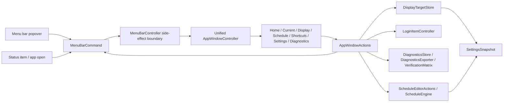

# InnosDimmer App Window Unification Plan First

## Goal

Replace the current split native UI with one componentized app window that follows `docs/design/window-redesign/app-window-componentized-mockup.html`.

The final app should:

- use one unified app window for current controls, display, schedule, shortcuts, settings, and diagnostics;
- remove the separate `SettingsWindowController` only after every setting-window feature is available in the unified window;
- preserve existing dimming, schedule, shortcut, login item, diagnostics, and persistence behavior;
- keep the menu bar popover as the quick-control surface;
- reuse shared component language from `InnosDesignTokens` and `InnosDesignComponents`;
- normalize user-facing copy toward `Schedule` and `Blue reduction`, not `Automation` and `Warmth`.

후행 실행: `구현커밋`

## Requested Outcome

Create an implementation-ready plan for a later `구현커밋` run. This plan is the source of truth for replacing the AppKit app window, moving settings-window capabilities into that window, and safely deleting the old settings window after coverage is proven.

No production code should be patched by this plan-first pass.

## Codebase Evidence

- `Confirmed`:
  - `MenuBarController.start()` currently calls `showAppWindow()`.
  - `MenuBarController.showAppWindow(focus:)` creates or reuses `AppDashboardWindowController`.
  - `MenuBarController.openSettings()` still opens `SettingsWindowController`.
  - `SettingsWindowController` owns display selection, shortcut editing, launch-at-login, diagnostics export, verification summary, and transient status feedback.
  - `AppDashboardWindowController` is currently embedded inside `MenuBarPopoverView.swift`.
  - `InnosDesignComponents.swift` already has shared section, chip, button, dimming track, dimming control group, action row, and summary row primitives.
  - `docs/design/window-redesign/app-window-componentized-mockup.html` exists and is the current review artifact.
  - `docs/design/window-redesign/research.md` records the research basis and deletion gates.
- `Inferred`:
  - The safest implementation path is progressive migration: extract reusable actions and controls first, build unified pages, migrate tests, then delete `SettingsWindowController`.
  - Adding specific commands such as `.openShortcuts` and `.openDiagnostics` is safer than overloading `.openSettings` for multiple page destinations.
  - `ScheduleEditorView` should likely become a table-style editor or be replaced by a new `ScheduleTableEditorView`; its current three text columns are not enough for the latest mockup.
- `Unverified`:
  - The exact native AppKit preferred/minimum size for the unified window.
  - Whether existing shared design components are sufficient for navigation tiles, ops list, diagnostics rows, and schedule value controls without extension.
  - Final screenshot quality of the native app window after implementation.

## System Visualization



- changed nodes:
  - `AppDashboardWindowController` becomes or is replaced by `AppWindowController`.
  - `SettingsWindowController` is retired after behavior migration.
  - `MenuBarCommand` gains page-specific routing commands.
  - `ScheduleEditorView` is extended or replaced with a table-like schedule editor.
- preserved nodes:
  - `MenuBarController.perform(_:)`
  - `DisplayTargetStore`
  - `ScheduleEngine`
  - `HotkeyManager`
  - `LoginItemController`
  - `DiagnosticsStore`, `DiagnosticsExporter`, `VerificationMatrix`
- diagram notes:
  - No page control should call `BrightnessController`, `DisplayTargetStore`, `LoginItemController`, or `DiagnosticsStore` directly. Side effects stay behind `MenuBarController` and injected action closures.

## Related Files

- `InnosDimmer/UI/MenuBarController.swift`: command router, app/settings window lifecycle, persistence action owner, diagnostics export owner.
- `InnosDimmer/UI/MenuBarPopoverView.swift`: current popover plus embedded `AppDashboardWindowController`; must be split.
- `InnosDimmer/UI/SettingsWindowController.swift`: old settings form; behavior inventory and final deletion target.
- `InnosDimmer/UI/ScheduleEditorView.swift`: current schedule text editor; target for table-style replacement or extraction.
- `InnosDimmer/UI/ScheduleEditorWindowController.swift`: legacy standalone schedule window; keep unless explicitly removed after unified schedule page is proven.
- `InnosDimmer/UI/DesignSystem/InnosDesignTokens.swift`: shared design token owner.
- `InnosDimmer/UI/DesignSystem/InnosDesignComponents.swift`: shared AppKit component owner.
- `InnosDimmer/Domain/SettingsSnapshot.swift`: persisted settings schema.
- `InnosDimmer/Domain/ScheduleEntry.swift`: schedule row model.
- `InnosDimmer/Domain/ShortcutBinding.swift`: shortcut model.
- `InnosDimmer/Services/DisplayTargetStore.swift`: selected display, schedule, and shortcut persistence owner.
- `InnosDimmer/Diagnostics/DiagnosticsStore.swift`: recent runtime event owner.
- `InnosDimmer/Diagnostics/DiagnosticsExporter.swift`: JSON export owner.
- `InnosDimmer/Diagnostics/VerificationMatrix.swift`: verification summary owner.
- `InnosDimmerTests/MenuBarStateTests.swift`: app window, popover, schedule, and routing regression tests.
- `InnosDimmerTests/HotkeyBindingTests.swift`: shortcut and settings-window tests that must migrate.
- `InnosDimmerTests/DiagnosticsStoreTests.swift`: diagnostics export regression tests.
- `InnosDimmerTests/VerificationMatrixTests.swift`: verification matrix regression tests.
- `docs/design/window-redesign/research.md`: research source.
- `docs/design/window-redesign/app-window-componentized-mockup.html`: visual and IA target.
- `docs/design/shared-control-system/contract.md`: component contract.
- `docs/design-components/README.md`: reusable component registry.

## Current Behavior

Current runtime has two app-window-like surfaces:

1. `AppDashboardWindowController`
   - Opened by `MenuBarController.showAppWindow()`.
   - Embedded in `MenuBarPopoverView.swift`.
   - Tall scroll dashboard, not the latest page-based mockup.
   - Has current controls, inline schedule editor, configuration buttons, diagnostics text view.

2. `SettingsWindowController`
   - Opened by `MenuBarController.openSettings()`.
   - Separate 500 x 620 settings window.
   - Owns display picker, shortcut editing, launch-at-login, diagnostics export, verification summary, transient status label.

The popover currently has `Edit Shortcuts` wired to `.openSettings`, which opens the separate settings window. This will become ambiguous after unification unless shortcut routing receives its own command or focus target.

## Change Map

- likely files to edit:
  - `InnosDimmer/UI/MenuBarPopoverView.swift`
  - `InnosDimmer/UI/MenuBarController.swift`
  - `InnosDimmer/UI/SettingsWindowController.swift`
  - `InnosDimmer/UI/ScheduleEditorView.swift`
  - `InnosDimmer/UI/DesignSystem/InnosDesignComponents.swift`
  - `InnosDimmer/UI/DesignSystem/InnosDesignTokens.swift`
  - `InnosDimmerTests/MenuBarStateTests.swift`
  - `InnosDimmerTests/HotkeyBindingTests.swift`
  - `InnosDimmer.xcodeproj/project.pbxproj`
- likely new files:
  - `InnosDimmer/UI/AppWindowController.swift`
  - `InnosDimmer/UI/AppWindowActions.swift`
  - `InnosDimmer/UI/AppWindowViewModel.swift`
  - `InnosDimmer/UI/ShortcutEditorView.swift`
  - `InnosDimmer/UI/ScheduleTableEditorView.swift`
- likely functions/components/selectors to touch:
  - `MenuBarCommand`
  - `MenuBarCommand.buttonCommands`
  - `MenuBarController.perform(_:)`
  - `MenuBarController.showAppWindow(focus:)`
  - `MenuBarController.openSettings()`
  - `MenuBarController.makeSettingsActions()`
  - `MenuBarController.refreshAppWindow()`
  - `MenuBarPopoverView.openSettingsPressed`
  - `AppDashboardWindowController.update(...)` or replacement `AppWindowController.update(...)`
  - `SettingsWindowController.saveShortcutsForTesting`
  - `SettingsWindowController.shortcutForTesting`
  - `ScheduleEditorView.editedSchedule()`
- state/data/content dependencies:
  - `BrightnessState`
  - `[ScheduleEntry]`
  - `[ShortcutBinding]`
  - `[DiagnosticsEvent]`
  - `[DisplayIdentity]`
  - `LoginItemStatus`
  - `SettingsSnapshot`
- side effects/integrations to preserve:
  - manual dimming pauses automation until next boundary;
  - quick disable stores previous dimming command and restore replays it;
  - schedule save persists through `DisplayTargetStore.saveSchedule`;
  - shortcut save persists through `DisplayTargetStore.saveShortcuts` and re-registers hotkeys;
  - display save persists through `DisplayTargetStore.saveSelectedDisplay`;
  - login item toggle stays behind `LoginItemController`;
  - diagnostics export records and exports through `DiagnosticsExporter`.
- remaining narrow unknowns before patch:
  - native preferred size after page implementation;
  - whether `ScheduleEditorWindowController` remains as a legacy fallback;
  - exact test names after old `SettingsWindowShortcutCustomizationTests` migrate.

## Planned Changes

- expected behavior changes:
  - `Open Control Window` opens a unified page-based app window.
  - `Edit schedule` opens the unified app window focused on `Schedule`.
  - `Edit Shortcuts` opens the unified app window focused on `Shortcuts`.
  - generic settings navigation opens the unified app window focused on `Settings`.
  - diagnostics navigation/export lives in the unified `Diagnostics` page.
  - `SettingsWindowController` is deleted after migration.
- constraints to preserve:
  - no direct UI-to-service side effects outside injected action closures;
  - existing schedule, shortcut, login item, diagnostics, display persistence semantics;
  - popover remains quick-control surface;
  - visible table copy uses `Blue` or `Blue reduction`, not `Warmth`, where the new UI is introduced;
  - short visible button labels keep explicit accessibility labels.
- execution order:
  1. extract current dashboard/actions without behavior change;
  2. build unified page shell;
  3. implement low-risk read-only pages and Home;
  4. implement schedule editor;
  5. migrate display/settings/shortcuts;
  6. switch routing;
  7. delete old settings window only after tests pass.

## Review Notes

- risks:
  - deleting `SettingsWindowController` too early breaks shortcut tests and diagnostics export UI;
  - replacing `ScheduleEditorView` can regress sorted schedule parsing and validation messages;
  - overloading `.openSettings` can route `Edit Shortcuts` to the wrong page;
  - native AppKit layout may not match the static HTML without screenshot QA.
- assumptions:
  - Existing untracked `app-window-componentized-mockup.html` and `research.md` are intentional work artifacts.
  - User intent is to unify app window and settings window, not merely restyle the old settings form.
  - `ScheduleEditorWindowController` does not have to be deleted in the same pass unless it becomes unreachable and obsolete.
- unanswered questions:
  - Whether app window should still auto-open on app launch. Default: preserve current behavior.
  - Whether to keep `Open Control Window` copy or rename it. Default: preserve existing popover label until visual QA.

## Plan Quality Check

- Alternative considered:
  - Directly edit `SettingsWindowController` into a page-based controller. Rejected because `showAppWindow()` already routes to `AppDashboardWindowController`, and settings-window deletion would still require moving dashboard behavior.
  - Create a brand-new window without extracting existing tests/actions first. Rejected because it would duplicate settings and schedule side effects.
  - Keep `.openSettings` as the only settings-related command. Rejected because `Edit Shortcuts` and generic Settings should focus different pages.
- Why this plan:
  - It follows the existing runtime boundary: `MenuBarController` remains the side-effect owner.
  - It keeps compile/test checkpoints small enough for `구현커밋`.
  - It makes deletion of `SettingsWindowController` a final verified gate, not a risky first step.
- Tradeoff:
  - The plan uses more commits and more transitional files, but it lowers regression risk and makes review easier.
  - It may temporarily have both old and new settings-related code, but deletion is explicitly gated.
- What this plan may still miss:
  - Native AppKit layout details that only show up in screenshots.
  - Keyboard focus order and accessibility labels after control extraction.
  - Hidden assumptions in tests that assert old `Warmth` copy.
- When to stop and revise:
  - Stop if moving `AppDashboardWindowController` changes behavior before any visual work.
  - Stop if shortcut validation cannot be extracted without changing saved shortcut semantics.
  - Stop if the unified schedule editor cannot round-trip `ScheduleEntry` rows through existing persistence.
  - Stop if `xcodebuild build-for-testing` fails in a way unrelated to the current commit.

## Skill Routing Manifest

| Phase | Required skills | Optional skills | Evidence |
| --- | --- | --- | --- |
| Commit 1: Extract dashboard and neutral action contracts | `구현커밋` | `review-all-in-one` | `AppDashboardWindowController` is embedded in `MenuBarPopoverView.swift`; `SettingsActions` lives in deletion target. |
| Commit 2: Add unified page shell and focus routing | `구현커밋` | `review-all-in-one` | `research.md` recommends `AppWindowPage` and `AppWindowFocusTarget`; popover/settings routing is ambiguous. |
| Commit 3: Promote missing shared AppKit components | `구현커밋` | `디자인올인원`, `review-all-in-one` | Mockup uses navigation tiles, ops list, diagnostics rows, and schedule value rows not yet represented by shared components. |
| Commit 4: Implement Home, Current status, and Diagnostics pages | `구현커밋` | `review-all-in-one` | These pages are mostly read-only and reuse existing dashboard diagnostics/state data. |
| Commit 5: Implement Schedule page table editor | `구현커밋` | `review-all-in-one`, `테스트` | Latest mockup requires `Time / Bright / Blue` table and `value -> track -> -/+` rows. |
| Commit 6: Implement Display and Settings pages | `구현커밋` | `review-all-in-one` | Display picker and launch-at-login behavior currently live in `SettingsWindowController`. |
| Commit 7: Implement Shortcuts page and migrate shortcut tests | `구현커밋` | `review-all-in-one` | `SettingsWindowShortcutCustomizationTests` instantiate `SettingsWindowController` and must move before deletion. |
| Commit 8: Switch routing and retire SettingsWindowController | `구현커밋` | `review-all-in-one`, `review-swarm` | Old settings route must disappear only after all features are reachable in the unified window. |
| Commit 9: Final vocabulary, QA, and manual verification docs | `구현커밋` | `테스트`, `review-all-in-one`, `qa-gate` | Need native screenshot/manual QA and copy normalization after the new window exists. |
| Final Gate | `review-all-in-one`, `qa-gate` | `review-swarm`, `테스트` | Full flow requires compile/test, code review, and native UI QA. |

## Implementation Plan

### Commit 1: Extract dashboard and neutral action contracts

- target files:
  - `InnosDimmer/UI/MenuBarPopoverView.swift`
  - `InnosDimmer/UI/AppWindowController.swift`
  - `InnosDimmer/UI/AppWindowActions.swift`
  - `InnosDimmer/UI/SettingsWindowController.swift`
  - `InnosDimmer.xcodeproj/project.pbxproj`
  - `InnosDimmerTests/MenuBarStateTests.swift`
  - `InnosDimmerTests/HotkeyBindingTests.swift`
- changes:
  - Move `AppDashboardWindowController` and any dashboard-only support types out of `MenuBarPopoverView.swift`.
  - Keep public behavior and test hooks unchanged.
  - Extract `SettingsActions` to a neutral file before `SettingsWindowController` becomes deletable.
  - Keep `SettingsWindowController` compiling and behavior-equivalent.
- code snippets:
  - `InnosDimmer/UI/AppWindowActions.swift` proposed:

```swift
import Foundation

struct AppWindowActions {
    var performCommand: @MainActor (MenuBarCommand) -> Void
    var selectDisplay: @MainActor (DisplayIdentity?) -> Result<SettingsSnapshot, Error>
    var updateSchedule: @MainActor ([ScheduleEntry]) -> Result<SettingsSnapshot, Error>
    var updateShortcuts: @MainActor ([ShortcutBinding]) -> Result<SettingsSnapshot, Error>
    var setLaunchAtLogin: @MainActor (Bool) -> Result<LoginItemStatus, Error>
    var exportDiagnostics: @MainActor () -> Result<Data, Error>
}
```

  - `SettingsActions` compatibility bridge proposed:

```swift
extension SettingsActions {
    init(appWindowActions: AppWindowActions) {
        self.init(
            selectDisplay: appWindowActions.selectDisplay,
            openScheduleEditor: { appWindowActions.performCommand(.openScheduleEditor) },
            updateShortcuts: appWindowActions.updateShortcuts,
            setLaunchAtLogin: appWindowActions.setLaunchAtLogin,
            exportDiagnostics: appWindowActions.exportDiagnostics
        )
    }
}
```

- tradeoff:
  - chosen: extract first, no visual changes.
  - alternative: rebuild in place.
  - cost/risk: new files and project references before visible progress.
  - why acceptable: lowers regression risk and makes later deletion possible.
  - revisit when: extraction changes existing dashboard tests.
- verification:
  - `xcodebuild -scheme InnosDimmer -configuration Debug build-for-testing CODE_SIGNING_ALLOWED=NO`: project still compiles after extraction.
  - `xcodebuild -scheme InnosDimmer -configuration Debug test-without-building CODE_SIGNING_ALLOWED=NO`: existing tests still pass, especially dashboard and settings tests.
  - `rg -n "final class AppDashboardWindowController" InnosDimmer/UI/MenuBarPopoverView.swift`: no result after extraction.
- success criteria:
  - No user-visible behavior changes.
  - `SettingsWindowController` still works.
  - Dashboard tests still pass.
- stop conditions:
  - Stop if moving the controller creates circular type visibility or AppKit initialization failures.

### Commit 2: Add unified page shell and focus routing

- target files:
  - `InnosDimmer/UI/AppWindowController.swift`
  - `InnosDimmer/UI/AppWindowViewModel.swift`
  - `InnosDimmer/UI/MenuBarController.swift`
  - `InnosDimmer/UI/MenuBarPopoverView.swift`
  - `InnosDimmerTests/MenuBarStateTests.swift`
- changes:
  - Rename or wrap the extracted dashboard as `AppWindowController`.
  - Add `AppWindowPage` and `AppWindowFocusTarget`.
  - Add root page container, Home/detail page switching, and Back behavior.
  - Keep old dashboard content available until pages are implemented.
  - Add specific commands for page routes: `.openShortcuts` and optionally `.openDiagnostics`.
- code snippets:
  - `AppWindowPage` proposed:

```swift
enum AppWindowPage: CaseIterable {
    case home
    case current
    case display
    case schedule
    case shortcuts
    case settings
    case diagnostics
}

enum AppWindowFocusTarget {
    case page(AppWindowPage)
    case schedule
}
```

  - `MenuBarController.perform(_:)` proposed:

```swift
case .openAppWindow:
    showAppWindow(focus: .page(.home))
case .openScheduleEditor:
    showAppWindow(focus: .page(.schedule))
    record(.appLifecycle, "Opened app window schedule page")
case .openShortcuts:
    showAppWindow(focus: .page(.shortcuts))
    record(.appLifecycle, "Opened app window shortcuts page")
case .openSettings:
    showAppWindow(focus: .page(.settings))
    record(.appLifecycle, "Opened app window settings page")
case .openDiagnostics:
    showAppWindow(focus: .page(.diagnostics))
```

- tradeoff:
  - chosen: add page-specific commands.
  - alternative: keep `.openSettings` and infer caller context.
  - cost/risk: more enum cases and test updates.
  - why acceptable: routing is explicit and avoids shortcut/settings ambiguity.
  - revisit when: command list causes excessive churn in hotkey/default binding logic.
- verification:
  - `xcodebuild -scheme InnosDimmer -configuration Debug build-for-testing CODE_SIGNING_ALLOWED=NO`: compile.
  - Unit tests:
    - `testOpenSettingsRoutesToUnifiedAppWindow`
    - `testPopoverEditShortcutsRoutesToShortcutsPage`
    - `testAppWindowBackButtonReturnsHome`
- success criteria:
  - Page focus can be tested without showing the old settings window.
  - Existing `.openAppWindow` and `.openScheduleEditor` behavior remains non-dimming.
- stop conditions:
  - Stop if `MenuBarCommand.buttonCommands` cannot preserve existing popover button tests without unclear compatibility shims.

### Commit 3: Promote missing shared AppKit components

- target files:
  - `InnosDimmer/UI/DesignSystem/InnosDesignTokens.swift`
  - `InnosDimmer/UI/DesignSystem/InnosDesignComponents.swift`
  - `InnosDimmer/UI/AppWindowController.swift`
  - `docs/design-components/README.md`
  - `docs/design/shared-control-system/contract.md`
  - `InnosDimmerTests/MenuBarStateTests.swift`
- changes:
  - Add reusable `InnosNavigationTileView`.
  - Add reusable ops/list row helpers for Home `Next actions`.
  - Add diagnostics row helper.
  - Add `ScheduleValueControl` helper matching `value -> track -> -/+`.
  - Do not create a separate window-only palette.
- code snippets:
  - `ScheduleValueControl` proposed:

```swift
@MainActor
final class ScheduleValueControl: NSStackView {
    let valueField = NSTextField(string: "")
    let trackView = InnosDimmingTrackView()
    let decrementButton: InnosCommandButton
    let incrementButton: InnosCommandButton

    init(label: String, target: AnyObject?, decrement: Selector?, increment: Selector?) {
        decrementButton = InnosCommandButton(title: "-", target: target, action: decrement)
        incrementButton = InnosCommandButton(title: "+", target: target, action: increment)
        super.init(frame: .zero)
        orientation = .horizontal
        alignment = .centerY
        spacing = InnosDesignTokens.Spacing.rowGap
        setViews([valueField, trackView, decrementButton, incrementButton], in: .leading)
        setAccessibilityLabel(label)
    }

    required init?(coder: NSCoder) { nil }
}
```

- tradeoff:
  - chosen: extend shared components.
  - alternative: implement private page-only helpers in `AppWindowController`.
  - cost/risk: shared components need clearer contracts and tests.
  - why acceptable: project design contract explicitly forbids a third visual language.
  - revisit when: a helper is truly one-off and pollutes the design system.
- verification:
  - `xcodebuild -scheme InnosDimmer -configuration Debug build-for-testing CODE_SIGNING_ALLOWED=NO`: compile.
  - Layout-unit checks through fitting sizes where practical:
    - buttons maintain minimum 30pt height;
    - schedule value control order is value, track, decrement, increment;
    - navigation tile exposes accessibility label.
- success criteria:
  - Home, schedule, diagnostics, and tile components can be built without new private palette.
- stop conditions:
  - Stop if shared component changes break current popover layout.

### Commit 4: Implement Home, Current status, and Diagnostics pages

- target files:
  - `InnosDimmer/UI/AppWindowController.swift`
  - `InnosDimmer/UI/AppWindowViewModel.swift`
  - `InnosDimmer/UI/MenuBarController.swift`
  - `InnosDimmerTests/MenuBarStateTests.swift`
  - `InnosDimmerTests/DiagnosticsStoreTests.swift`
- changes:
  - Build Home page:
    - title;
    - status chips;
    - `Quick actions` section with brightness and blue reduction controls;
    - short visible labels `Disable`, `Restore`, `Resume` with explicit accessibility labels;
    - vertical `Next actions` list;
    - page navigation tiles.
  - Build Current status page as read-only detail.
  - Build Diagnostics page with verification matrix summary, real event rows, and export action.
  - Keep Diagnostics export behind `AppWindowActions.exportDiagnostics`.
- code snippets:
  - `AppWindowViewModel` next actions proposed:

```swift
struct AppWindowNextActionRow: Equatable {
    var title: String
    var value: String
    var destination: AppWindowPage
}

extension AppWindowViewModel {
    static func nextActions(
        state: BrightnessState,
        schedule: [ScheduleEntry],
        shortcuts: [ShortcutBinding],
        latestEvent: DiagnosticsEvent?
    ) -> [AppWindowNextActionRow] {
        [
            .init(title: "Schedule", value: scheduleValue(state: state, schedule: schedule), destination: .schedule),
            .init(title: "Diagnostics", value: diagnosticsValue(latestEvent), destination: .diagnostics),
            .init(title: "Shortcuts", value: HotkeyManager.summary(for: shortcuts), destination: .shortcuts)
        ]
    }
}
```

- tradeoff:
  - chosen: start with low-risk Home/current/diagnostics pages.
  - alternative: build all pages before testing.
  - cost/risk: temporary incomplete page set.
  - why acceptable: pages can be tested and reviewed incrementally.
  - revisit when: partial page implementation makes current app window less usable than existing dashboard.
- verification:
  - `xcodebuild -scheme InnosDimmer -configuration Debug build-for-testing CODE_SIGNING_ALLOWED=NO`
  - Unit tests:
    - `testAppWindowHomeRoutesNavigationTiles`
    - `testAppWindowHomeButtonsRouteQuickCommands`
    - `testAppWindowCurrentStatusUsesStateValues`
    - `testAppWindowDiagnosticsPageExportsDiagnostics`
    - `testAppWindowVisibleLabelsUseBlueReductionVocabulary`
- success criteria:
  - Home can route to each implemented page.
  - Diagnostics export remains available.
  - No duplicate Home quick controls appear on Current status page.
- stop conditions:
  - Stop if diagnostics export cannot be presented without an active window.

### Commit 5: Implement Schedule page table editor

- target files:
  - `InnosDimmer/UI/ScheduleEditorView.swift`
  - `InnosDimmer/UI/ScheduleTableEditorView.swift`
  - `InnosDimmer/UI/AppWindowController.swift`
  - `InnosDimmerTests/MenuBarStateTests.swift`
  - `InnosDimmerTests/ScheduleEngineTests.swift`
- changes:
  - Implement table-like schedule editor:
    - columns: `Time`, `Bright`, `Blue`;
    - each value cell: value input, track, adjacent `-`/`+`;
    - bottom action row: `Pause automation`, `Save schedule`;
    - value changes update an in-memory row model only;
    - save calls `ScheduleEditorActions.updateSchedule`.
  - Preserve schedule parsing and sorting behavior from `ScheduleEditorView`.
  - Normalize validation copy from `warmth` to `blue reduction` for new UI while avoiding accidental domain rename.
- code snippets:
  - row model proposed:

```swift
struct EditableScheduleRow: Equatable {
    var timeText: String
    var brightnessText: String
    var blueReductionText: String

    func entry(rowIndex: Int) throws -> ScheduleEntry {
        guard let minute = Self.minuteOfDay(from: timeText) else {
            throw ScheduleEditorError.invalidTime(row: rowIndex + 1)
        }
        guard let brightness = Int(brightnessText), (0...100).contains(brightness) else {
            throw ScheduleEditorError.invalidPercent(row: rowIndex + 1, field: "brightness")
        }
        guard let blue = Int(blueReductionText), (0...100).contains(blue) else {
            throw ScheduleEditorError.invalidPercent(row: rowIndex + 1, field: "blue reduction")
        }
        return ScheduleEntry(minuteOfDay: minute, brightness: brightness, blueReduction: blue)
    }
}
```

- tradeoff:
  - chosen: build a new schedule table editor if extending old text-only `ScheduleEditorView` becomes awkward.
  - alternative: heavily modify `ScheduleEditorView`.
  - cost/risk: new editor needs test coverage.
  - why acceptable: latest mockup requires track/stepper UI and direct numeric entry, which is structurally different.
  - revisit when: old `ScheduleEditorWindowController` depends too tightly on `ScheduleEditorView`.
- verification:
  - `xcodebuild -scheme InnosDimmer -configuration Debug build-for-testing CODE_SIGNING_ALLOWED=NO`
  - Unit tests:
    - `testAppWindowSchedulePageSavesEditedRows`
    - `testAppWindowSchedulePageValueTrackStepperLayoutModel`
    - `testAppWindowSchedulePageUsesBlueReductionVocabulary`
    - existing schedule validation tests still pass.
- success criteria:
  - Edited schedule rows persist through `DisplayTargetStore.saveSchedule`.
  - Track and step buttons update values without saving until `Save schedule`.
  - Pause/resume command still routes through `MenuBarCommand`.
- stop conditions:
  - Stop if schedule row editor cannot preserve sorted schedule output.

### Commit 6: Implement Display and Settings pages

- target files:
  - `InnosDimmer/UI/AppWindowController.swift`
  - `InnosDimmer/UI/AppWindowViewModel.swift`
  - `InnosDimmer/UI/MenuBarController.swift`
  - `InnosDimmer/UI/SettingsWindowController.swift`
  - `InnosDimmerTests/MenuBarStateTests.swift`
  - `InnosDimmerTests/SettingsSnapshotTests.swift`
- changes:
  - Move display picker behavior into unified Display page:
    - automatic external display;
    - active candidates;
    - current resolved display;
    - save display;
    - use automatic.
  - Move launch-at-login behavior into unified Settings page:
    - checkbox/toggle;
    - status summary;
    - approval/unsupported text;
    - transient status row.
  - Keep old `SettingsWindowController` available until Shortcuts page is also migrated.
- code snippets:
  - display save proposed:

```swift
@objc private func saveDisplayPressed() {
    let selected = displayPicker.selectedDisplayForCurrentSelection()
    switch actions.selectDisplay(selected) {
    case .success(let snapshot):
        viewModel = viewModel.replacing(snapshot: snapshot)
        report("Settings saved.")
    case .failure(let error):
        report(error.localizedDescription, isError: true)
    }
}
```

- tradeoff:
  - chosen: move display/settings before shortcuts.
  - alternative: migrate shortcuts first.
  - cost/risk: settings-window still remains for shortcut tests.
  - why acceptable: display and login item are lower complexity than shortcut key capture.
  - revisit when: display candidate refresh cannot be represented without large controller changes.
- verification:
  - `xcodebuild -scheme InnosDimmer -configuration Debug build-for-testing CODE_SIGNING_ALLOWED=NO`
  - Unit tests:
    - `testAppWindowDisplayPageUsesSelectedDisplayAction`
    - `testAppWindowSettingsPageTogglesLaunchAtLogin`
    - existing `SettingsSnapshotTests`.
- success criteria:
  - Display and login item settings are reachable without opening `SettingsWindowController`.
  - Transient status feedback remains visible.
- stop conditions:
  - Stop if login item status needs live OS approval UI behavior that cannot be tested safely.

### Commit 7: Implement Shortcuts page and migrate shortcut tests

- target files:
  - `InnosDimmer/UI/ShortcutEditorView.swift`
  - `InnosDimmer/UI/AppWindowController.swift`
  - `InnosDimmer/UI/SettingsWindowController.swift`
  - `InnosDimmerTests/HotkeyBindingTests.swift`
  - `InnosDimmerTests/MenuBarStateTests.swift`
- changes:
  - Extract `ShortcutKeyField` out of `SettingsWindowController`.
  - Extract shortcut row controls and validation into `ShortcutEditorView`.
  - Add full Shortcuts page:
    - all `ShortcutAction.allCases`;
    - enabled checkbox;
    - modifiers;
    - key capture/text;
    - save/reset;
    - includes `Open popover`.
  - Migrate `SettingsWindowShortcutCustomizationTests` to target the new app-window/shortcut editor.
- code snippets:
  - shortcut editor action proposed:

```swift
@discardableResult
func saveShortcutsForTesting() -> Result<SettingsSnapshot, Error> {
    do {
        let shortcuts = try shortcutEditorView.editedShortcuts()
        return saveShortcuts(shortcuts, reportsStatus: false)
    } catch {
        return .failure(error)
    }
}
```

- tradeoff:
  - chosen: extract key field and editor before deleting settings window.
  - alternative: rewrite shortcut handling from scratch.
  - cost/risk: keyboard capture is easy to regress.
  - why acceptable: old tests define behavior and can be migrated directly.
  - revisit when: extracted `ShortcutKeyField` cannot preserve human-readable labels.
- verification:
  - `xcodebuild -scheme InnosDimmer -configuration Debug build-for-testing CODE_SIGNING_ALLOWED=NO`
  - Unit tests:
    - `testAppWindowShortcutsPageSavesAndResetsBindings`
    - `testAppWindowShortcutsPageIncludesOpenPopoverBinding`
    - `testAppWindowShortcutsPageReportsInvalidCustomizedShortcutKey`
    - migrated human-readable shortcut key label test.
- success criteria:
  - Shortcut editing works from unified app window.
  - `SettingsWindowShortcutCustomizationTests` no longer instantiate `SettingsWindowController`.
- stop conditions:
  - Stop if default shortcut normalization or unsafe/duplicate validation changes.

### Commit 8: Switch routing and retire SettingsWindowController

- target files:
  - `InnosDimmer/UI/MenuBarController.swift`
  - `InnosDimmer/UI/MenuBarPopoverView.swift`
  - `InnosDimmer/UI/SettingsWindowController.swift`
  - `InnosDimmer.xcodeproj/project.pbxproj`
  - `InnosDimmerTests/MenuBarStateTests.swift`
  - `InnosDimmerTests/HotkeyBindingTests.swift`
  - `README.md`
  - `docs/operator-guide.md`
- changes:
  - Change `MenuBarController.openSettings()` to `showAppWindow(focus: .page(.settings))`.
  - Route popover `Edit Shortcuts` through `.openShortcuts`.
  - Remove `private lazy var settingsWindowController`.
  - Delete `SettingsWindowController.swift` after all tests compile against replacements.
  - Update documentation that says diagnostics export lives in Settings window.
- code snippets:
  - final routing proposed:

```swift
private func openSettings() {
    record(.appLifecycle, "Opened settings page")
    showAppWindow(focus: .page(.settings))
    refreshPopover()
}
```

  - deletion verification command:

```bash
rg -n "SettingsWindowController|settingsWindowController" InnosDimmer InnosDimmerTests
```

- tradeoff:
  - chosen: delete old settings window in a dedicated final routing commit.
  - alternative: leave old settings window hidden but compiled.
  - cost/risk: deletion can expose missing features late.
  - why acceptable: previous commits should have migrated each feature with tests.
  - revisit when: any settings-window feature remains unreachable in unified app window.
- verification:
  - `xcodebuild -scheme InnosDimmer -configuration Debug build-for-testing CODE_SIGNING_ALLOWED=NO`
  - `xcodebuild -scheme InnosDimmer -configuration Debug test-without-building CODE_SIGNING_ALLOWED=NO`
  - `rg -n "SettingsWindowController|settingsWindowController" InnosDimmer InnosDimmerTests`: no production/test references after deletion.
  - Unit tests:
    - `testOpenSettingsRoutesToUnifiedAppWindow`
    - `testPopoverEditShortcutsRoutesToShortcutsPage`
- success criteria:
  - Settings workflows do not open a second settings window.
  - Build has no settings-window references.
  - Old settings features are reachable in unified pages.
- stop conditions:
  - Stop if any deleted test represented behavior not yet covered by unified app-window tests.

### Commit 9: Final vocabulary, QA, and manual verification docs

- target files:
  - `InnosDimmer/UI/AppWindowController.swift`
  - `InnosDimmer/UI/MenuBarPopoverView.swift`
  - `InnosDimmer/UI/ScheduleEditorView.swift`
  - `InnosDimmerTests/MenuBarStateTests.swift`
  - `docs/qa-matrix.md`
  - `docs/operator-guide.md`
  - `docs/design/window-redesign/feedback.md`
- changes:
  - Normalize visible copy:
    - `Automation` page -> `Schedule`;
    - visible `Warmth` -> `Blue` or `Blue reduction`;
    - keep internal `blueReduction` property names.
  - Run native manual QA:
    - open unified app window;
    - click page tiles;
    - use Back;
    - adjust brightness/blue controls;
    - save schedule;
    - save shortcuts;
    - toggle launch at login if safe;
    - export diagnostics;
    - confirm no separate settings window opens.
  - Update docs with the new unified-window usage path.
- code snippets:
  - visible/accessibility split proposed:

```swift
let disableButton = InnosCommandButton(title: "Disable", tone: .warning, target: self, action: #selector(quickDisablePressed))
disableButton.setAccessibilityLabel("Quick disable overlay")
```

- tradeoff:
  - chosen: final copy and QA after functional migration.
  - alternative: normalize all copy early.
  - cost/risk: some tests may keep old wording until late.
  - why acceptable: avoids mixing behavior migration with copy churn.
  - revisit when: old copy blocks tests or user QA.
- verification:
  - `xcodebuild -scheme InnosDimmer -configuration Debug build-for-testing CODE_SIGNING_ALLOWED=NO`
  - `xcodebuild -scheme InnosDimmer -configuration Debug test-without-building CODE_SIGNING_ALLOWED=NO`
  - `xcodebuild -scheme InnosDimmer -configuration Release build CODE_SIGNING_ALLOWED=NO`
  - Manual QA with screenshots/captures where possible.
- success criteria:
  - Native app window visually matches the approved HTML direction closely enough for user review.
  - No visible new-window text says `Warmth` unless intentionally kept in old docs/history.
  - User can use settings/diagnostics without a second window.
- stop conditions:
  - Stop if native layout clips controls, overlaps text, or requires scroll in core pages at preferred size.

## Operator 결정 필요 사항

- 상태: 없음. 적용한 기본값은 아래와 같음.

- 결정 1: App window implementation anchor
  - 맥락: 기존 `AppDashboardWindowController`가 이미 앱 윈도우 route와 테스트를 갖고 있다.
  - A: 기존 컨트롤러를 추출/리네임해서 `AppWindowController`로 발전시킨다. 기존 테스트와 route를 최대한 보존한다.
  - B: 완전히 새 `AppWindowController`를 만들고 기존 dashboard는 나중에 삭제한다. 초기 중복이 크다.
  - C: `SettingsWindowController`를 직접 page-shell로 바꾼다. 현재 `showAppWindow()` route와 어긋난다.
  - 추천안: A. 현재 route와 테스트를 가장 잘 보존한다.
  - 기본값: A.
  - 보류 시 영향: 구현자가 컨트롤러 소유권을 다시 판단해야 해서 `구현커밋` 시작이 느려진다.

- 결정 2: Separate schedule editor window
  - 맥락: 사용자 결정은 settings window 제거이며, schedule editor window 제거는 별도 명시가 없다.
  - A: 이번 pass에서는 `ScheduleEditorWindowController`를 유지하고 primary route만 unified Schedule page로 바꾼다.
  - B: settings window와 함께 schedule editor window도 삭제한다. 범위와 리스크가 커진다.
  - C: schedule page에서 advanced action으로 separate editor를 계속 노출한다. 목업 단순성과 어긋난다.
  - 추천안: A. 범위를 settings-window 통합에 집중한다.
  - 기본값: A.
  - 보류 시 영향: schedule editor deletion은 후속 cleanup으로 남는다.

- 결정 3: Page-specific commands
  - 맥락: `Edit Shortcuts`와 generic Settings는 서로 다른 destination이다.
  - A: `.openShortcuts`, `.openDiagnostics`를 추가하고 `.openSettings`는 settings page 전용으로 둔다.
  - B: `.openSettings` 하나로 context를 추론한다. 테스트와 유지보수가 어렵다.
  - C: `MenuBarCommand.openPage(AppWindowPage)`로 일반화한다. enum associated value가 테스트/Hashable 경로에 더 큰 변경을 준다.
  - 추천안: A. 명확하고 테스트하기 쉽다.
  - 기본값: A.
  - 보류 시 영향: popover routing ambiguity가 남는다.

- 결정 4: Visible copy vocabulary
  - 맥락: 목업에는 일부 `Warmth`/`Automation` residue가 있고, 제품 목표는 blue reduction이다.
  - A: 새 unified window visible copy는 `Schedule`, `Blue`, `Blue reduction`으로 정리한다.
  - B: 기존 `Warmth` test/copy를 유지한다. 사용자 피드백과 어긋난다.
  - C: 내부 이름까지 `warmth`로 바꾼다. 도메인 혼선이 커진다.
  - 추천안: A. visible copy만 정리하고 internal property는 `blueReduction` 유지.
  - 기본값: A.
  - 보류 시 영향: 최종 QA에서 copy churn이 발생한다.

## 검토용 결과물

- 계획 MD:
  - [2026-06-20-app-window-unification-plan-first.md](2026-06-20-app-window-unification-plan-first.md)
- HTML:
  - [app-window-componentized-mockup.html](app-window-componentized-mockup.html)
- Research:
  - [research.md](research.md)
- 테스트 링크:
  - Localhost: 해당 없음. 정적 HTML 파일 검토물이며 dev server가 필요 없다.
  - File URL: `file:///Users/moonsoo/projects/InnosDimmer/docs/design/window-redesign/app-window-componentized-mockup.html`
  - Deploy: 해당 없음. 로컬 개인 macOS 앱이며 배포 preview가 없다.
- 상태: planned
- 실제 동작:
  - HTML 목업은 페이지 버튼, 테마 버튼, schedule table layout을 정적으로 검토할 수 있다.
- Mock:
  - 표시 데이터는 mock data이다. 실제 AppKit 구현은 `BrightnessState`, `ScheduleEntry`, `ShortcutBinding`, `DiagnosticsEvent`, `VerificationMatrix`에서 값을 받아야 한다.

## 후행 실행

- 기본 실행: `구현커밋`
- 계획 경로 처리: `구현커밋`이 직전 대화, 계획 링크, active plan context에서 자동 탐지
- 모호할 때: 후보 목록을 보여주고 Operator에게 선택 요청
- 실행 전 주의:
  - 현재 worktree에는 기존 수정/삭제/untracked 파일이 있다. 후행 구현은 사용자 변경을 되돌리지 말고 필요한 파일만 읽고 작업해야 한다.
  - `SettingsWindowController.swift` 삭제는 Commit 8 전에는 금지한다.
  - 새 dependency 추가는 금지한다.

## HTML 생략 보고서

- 판정: 생략하지 않음.
- 생략 사유:
  - 해당 없음. 기존 HTML 검토물 `docs/design/window-redesign/app-window-componentized-mockup.html`을 이번 계획의 시각/IA 검토물로 재사용한다.
- 대체 검토물:
  - 해당 없음.
- 테스트 링크:
  - File URL: `file:///Users/moonsoo/projects/InnosDimmer/docs/design/window-redesign/app-window-componentized-mockup.html`
  - Localhost: 해당 없음. 정적 HTML이다.
  - Deploy: 해당 없음.
- 사용자가 바로 열어볼 링크:
  - [app-window-componentized-mockup.html](app-window-componentized-mockup.html)

## 구현 후 검토 리스트

- 회귀 확인:
  - Popover quick controls still route brightness, blue reduction, quick disable, restore previous, pause/resume.
  - `Open Control Window`, `Edit schedule`, `Edit Shortcuts`, `Settings`, and `Diagnostics` routes open the expected unified page.
  - Schedule save still sorts and persists rows.
  - Shortcut save/reset still validates and re-registers hotkeys.
  - Display selection still persists and resolves automatic external display.
  - Launch-at-login status still reports enabled/disabled/requires approval/unsupported.
  - Diagnostics export still encodes without sensitive user paths.
- 검증 확인:
  - `xcodebuild -scheme InnosDimmer -configuration Debug build-for-testing CODE_SIGNING_ALLOWED=NO`
  - `xcodebuild -scheme InnosDimmer -configuration Debug test-without-building CODE_SIGNING_ALLOWED=NO`
  - `xcodebuild -scheme InnosDimmer -configuration Release build CODE_SIGNING_ALLOWED=NO`
  - `rg -n "SettingsWindowController|settingsWindowController" InnosDimmer InnosDimmerTests`
  - Native manual QA for all pages.
- 리뷰 관점:
  - `review-all-in-one`: route coverage, deleted settings-window behavior, tests.
  - `review-swarm`: hidden side effects, component drift, AppKit layout/a11y risks.
  - `qa-gate`: build/test/manual QA evidence.
- Operator 재확인:
  - Native app window visually matches the approved mockup.
  - Schedule page table layout is readable.
  - No separate settings window opens from Spotlight/menu/popover flows.

## Validation

- manual checks:
  - Confirmed `docs/design/window-redesign/app-window-componentized-mockup.html` exists.
  - Confirmed `docs/design/window-redesign/research.md` includes the latest mockup deltas and settings-window deletion gate.
  - Confirmed current worktree is dirty; implementation plan includes non-revert guard.
- lint/build/test scope:
  - Not run in this plan-first pass.
  - Planned commands are listed per commit.
- scenario-to-surface checks:
  - Home quick actions -> `MenuBarCommand`.
  - Schedule table -> `ScheduleEditorActions.updateSchedule`.
  - Display page -> `DisplayTargetStore.saveSelectedDisplay`.
  - Shortcuts page -> `DisplayTargetStore.saveShortcuts` and `HotkeyManager`.
  - Settings page -> `LoginItemController`.
  - Diagnostics page -> `DiagnosticsStore`, `DiagnosticsExporter`, `VerificationMatrix`.
