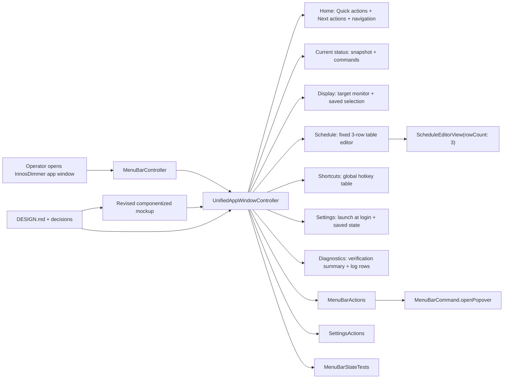

# 2026-06-22 Design-System Aligned App Window Plan

## Goal

Bring the native `InnosDimmer` full app window into alignment with the current design system and the revised componentized mockup, without treating the mockup as a pixel-perfect implementation target.

The important distinction for this plan:

- The mockup is not sacred.
- The design system is the source of truth.
- Good mockup patterns that reduce the learning curve must be reflected in the real app.
- Inefficient mockup artifacts must be rejected, simplified, or treated as proof-only scaffolding.

## Requested Outcome

The user has now locked the following decisions:

- Schedule is fixed to three rows in this pass.
- No add/remove-row behavior should be introduced in this pass.
- Use the recommended command approach: replace self-referential full-window `Open app window` with `Open popover` where a command is needed inside the full app window.
- Reduce or remove detail-page subtitle/caption copy.
- Keep the schedule editor direct and table-like.
- Let Codex choose the right timing for extracting `UnifiedAppWindowController` into a separate file.

This plan must therefore prepare the implementation so `구현커밋` can execute without another broad design debate.

## Source Of Truth

Priority order for this plan:

1. `DESIGN.md`
2. active decisions in `docs/design-decisions.md`
3. revised mockup: `docs/design/window-redesign/app-window-componentized-mockup.html`
4. design review: `docs/design/window-redesign/design-all-in-one-review-2026-06-22.md`
5. current native implementation under `InnosDimmer/UI`
6. tests and smoke screenshots

Do not use older mockups, older research, or stale plan text as the final authority when they conflict with the list above.

## Codebase Evidence

- `Confirmed`:
  - `UnifiedAppWindowController` currently lives inside `InnosDimmer/UI/MenuBarPopoverView.swift`.
  - `UnifiedAppWindowController` owns the native full app window pages: Home, Current status, Display, Schedule, Shortcuts, Settings, and Diagnostics.
  - `MenuBarCommand.openPopover` already exists.
  - `MenuBarController.perform(.openPopover)` routes to `showPopover()`.
  - `ScheduleEditorView` already defaults to `rowCount: 3`.
  - `ScheduleEditorView` already renders table headers `Time`, `Bright`, `Blue`.
  - `ScheduleEditorView` already supports percent text fields, slider tracks, and adjacent `-` / `+` steppers.
  - `ScheduleEditorView.editedSchedule()` preserves parsing, sorting, validation, and persistence boundaries.
  - Current tests already cover schedule table controls, percent suffix parsing, invalid fields, app-window pages, open-popover routing, and visual smoke.
  - The revised HTML mockup no longer contains `SettingsWindowController`, `Open app window`, detail subtitles, detail captions, `Warmth`, or a remove-row column.
  - `scripts/smoke_app_window_snapshot.sh` already exists and expects seven safe app-window snapshots under `/tmp/InnosDimmerSafeSmoke`.
  - `AppWindowPageStructure` exposes `visibleText`, `containsText(_:)`, and `containsIdentifier(_:)` for app-window structural assertions.
  - `UnifiedAppWindowController` currently depends on app/popover-local helper types such as `PopoverCommandButton`, `PopoverPalette`, `PopoverContainerView`, and `ProgressTrackView`; these extraction dependencies must be mapped before moving the controller.
- `Inferred`:
  - The largest remaining product risk is not missing functionality; it is UI drift between the design system, the mockup, and the native AppKit layout.
  - `UnifiedAppWindowController` extraction is desirable but should not happen before the visible layout has stabilized. Moving a large controller while layout requirements are still changing makes review harder.
  - The current app already contains many of the required primitives, so the implementation should be a targeted sync pass rather than a rewrite.
- `Unverified`:
  - Whether current native screenshots visually match the revised mockup after the latest mockup cleanup.
  - Whether `Open popover` inside the current detail page is preferable in daily use after manual QA, even though the command route exists.
  - Whether a fixed three-row schedule remains enough after longer real use. This is explicitly out of scope for this pass.

## System Visualization



- changed nodes:
  - `UnifiedAppWindowController`
  - `ScheduleEditorView`
  - `MenuBarStateTests`
  - design docs and smoke artifacts
- preserved nodes:
  - `MenuBarController`
  - `MenuBarActions`
  - `ScheduleEditorActions`
  - `SettingsActions`
  - `SettingsSnapshot`
  - `ScheduleEntry`
  - `ShortcutBinding`
  - `DiagnosticsEvent`
- diagram notes:
  - The revised mockup is a specimen. It proves structure and language, but native AppKit remains the product surface.
  - `UnifiedAppWindowController` extraction is delayed until after visible layout and tests are stable.

## Related Files

- `DESIGN.md`
  - Current design contract.
  - Defines quiet/dense utility, shared popover/app-window language, compact spacing, and action hierarchy.
- `docs/design-decisions.md`
  - Active design decisions.
  - Important current rule: popover and app window share one control-system language.
- `docs/design-components/README.md`
  - Component registry.
  - Important rule: app window can widen/regroup popover components, but should not invent different visual language for the same command family.
- `docs/design/window-redesign/app-window-componentized-mockup.html`
  - Revised review artifact.
  - Now reflects fixed three-row schedule, reduced subtitles/captions, `Schedule` label, `Open popover`, and no row removal.
- `docs/design/window-redesign/design-all-in-one-review-2026-06-22.md`
  - Design-all-in-one review and research handoff.
  - Defines which mockup patterns to preserve and which to reject.
- `InnosDimmer/UI/MenuBarPopoverView.swift`
  - Current owner of `MenuBarCommand`, `MenuBarViewModel`, popover view, and `UnifiedAppWindowController`.
  - This is the immediate implementation file for app-window UI sync.
- `InnosDimmer/UI/ScheduleEditorView.swift`
  - Schedule table editor.
  - Must remain fixed to three rows in this pass.
- `InnosDimmer/UI/MenuBarController.swift`
  - Command routing owner.
  - Confirms `.openPopover` is available.
- `InnosDimmer/UI/DesignSystem/InnosDesignTokens.swift`
  - Native typography, spacing, color, radius, and size tokens.
- `InnosDimmer/UI/DesignSystem/InnosDesignComponents.swift`
  - Shared native section/chip/button/control primitives.
- `InnosDimmerTests/MenuBarStateTests.swift`
  - Main acceptance and smoke surface for app-window behavior.

## Current Behavior

Current native behavior is partially aligned:

- Home already has Quick actions and navigation tiles.
- Schedule already uses a three-row table-like editor with `Time`, `Bright`, and `Blue`.
- Shortcuts includes `Open popover`.
- Diagnostics has log feed rows and verification-style summaries.
- Display and Settings already use split-style detail layouts.

Current drift still visible in code/tests:

- Current status page still uses `Open app window` in the app window itself.
- Some tests still expect `Open app window`.
- `UnifiedAppWindowPage.tileDescription` still uses longer explanatory copy than the revised mockup.
- Some older docs and audit artifacts still talk about mockup parity rather than design-system alignment.
- Settings page still has `Startup` as a section title in code, while the revised mockup and product language prefer `Launch at login` inside `Settings`.
- `UnifiedAppWindowController` remains embedded in `MenuBarPopoverView.swift`; this is acceptable short term, but the file is now too large for long-term maintainability.

## Change Map

- likely files to edit:
  - `InnosDimmer/UI/MenuBarPopoverView.swift`
  - `InnosDimmer/UI/ScheduleEditorView.swift`
  - `InnosDimmerTests/MenuBarStateTests.swift`
  - `docs/design/window-redesign/app-window-componentized-mockup.html`
  - `docs/design/window-redesign/design-all-in-one-review-2026-06-22.md`
  - final screenshot/artifact files under `docs/design/window-redesign` or `/tmp/InnosDimmerSafeSmoke`
- likely new files:
  - `InnosDimmer/UI/UnifiedAppWindowController.swift`
    - only after visible layout and acceptance tests stabilize
- likely functions/classes to touch:
  - `UnifiedAppWindowController.makeCurrentPage()`
  - `UnifiedAppWindowController.makeSchedulePage()`
  - `UnifiedAppWindowController.makeSettingsPage()`
  - `UnifiedAppWindowController.makeDiagnosticsPage()`
  - `UnifiedAppWindowController.makeDetailPage(...)`
  - `ScheduleEditorView.installContent()`
  - `ScheduleEditorView.Layout`
  - relevant `MenuBarStateTests`
- state/data/content dependencies:
  - `BrightnessState`
  - `ScheduleEntry.defaultSchedule`
  - `SettingsSnapshot.sortedSchedule`
  - `ShortcutBinding.defaultBindings`
  - `DiagnosticsEvent`
  - `LoginItemStatus`
- side effects/integrations to preserve:
  - dimming command routing
  - `openPopover` routing
  - schedule save/parse/sort behavior
  - shortcut editing and saving
  - display target persistence
  - login item toggle
  - diagnostics export
- remaining narrow unknowns before patch:
  - Whether the current runtime ever loads a saved schedule with more than three entries.
  - Whether controller extraction can be move-mostly, given private helper dependencies.
  - Visual details still need screenshot verification after implementation.

## Planned Changes

Expected behavior changes:

- Current status page command row uses `Open popover`, not `Open app window`.
- Schedule page remains fixed to three rows.
- Schedule table has no add/remove-row affordance.
- Detail-page explanatory subtitles and implementation captions are not introduced in native UI.
- Settings page uses `Launch at login` as the visible setting group, not `Startup` as a standalone page concept.
- Final extracted controller file happens only after the UI passes acceptance tests and smoke verification.

Constraints to preserve:

- No hardware brightness/DDC work is introduced.
- No WebView embedding of the HTML mockup.
- No new schedule row cardinality behavior.
- No broad refactor before layout fixes are verified.
- No package install or Playwright browser download during supply-chain freeze.

Execution order:

1. Test/contract lock.
2. User-facing command/copy sync.
3. Schedule fixed-row layout polish.
4. Detail page layout and diagnostics polish.
5. Extraction after stabilization.
6. Final smoke/review/docs.

## Review Artifact Gate

This is a UI/design implementation plan, so an HTML review artifact is required. It already exists and has been updated for this plan:

- [Revised app-window componentized mockup](app-window-componentized-mockup.html)

The artifact is not a perfect source of pixel values. It is the review specimen for:

- page names
- section order
- fixed three-row schedule
- action placement
- copy density
- commands that should or should not appear
- table/log/matrix structure

## Operator 결정 필요 사항

- 상태: 없음
- 적용한 기본값:
  - Schedule rows: fixed 3 rows.
  - Current detail command: use `Open popover`.
  - Schedule copy: compact `Blue` for table headers; `Blue reduction` for accessible labels and longer control labels.
  - subtitle/caption: remove explanatory copy by default.
  - controller extraction: delay until visible layout is stabilized and acceptance tests pass.

### 결정 1: Schedule row cardinality

- 맥락: older mockup variants showed a remove-looking column, but the current app has a fixed three-row schedule model and the user explicitly selected fixed three rows.
- A: fixed 3 rows, no add/remove controls.
  - impact: lowest risk, preserves current persistence and editor tests.
- B: variable rows with add/remove.
  - impact: larger state/schema/UI change; not needed for this pass.
- C: visually show remove buttons but disable them.
  - impact: confusing; contradicts fixed-row direction.
- 추천안: A.
- 기본값: A.
- 보류 시 영향: none; user already selected fixed 3 rows.

### 결정 2: Full-window Current status command

- 맥락: `Open app window` inside the already-open app window is self-referential. The code already supports `.openPopover`.
- A: replace with `Open popover`.
  - impact: current page can still expose a useful command without self-reference.
- B: remove the command entirely.
  - impact: simpler, but loses the bridge back to the quick-control surface.
- C: keep `Open app window`.
  - impact: confusing and now rejected by the revised mockup.
- 추천안: A.
- 기본값: A.
- 보류 시 영향: none; `.openPopover` routing already exists.

### 결정 3: Subtitle/caption density

- 맥락: previous page comments repeatedly removed explanatory text from the mockup. This is a personal utility, not an onboarding page.
- A: remove explanatory subtitles/captions from detail pages.
  - impact: cleaner and denser app surface.
- B: keep one-line subtitles on first-use pages.
  - impact: easier to explain, but adds clutter.
- C: keep implementation captions only in docs, never UI.
  - impact: acceptable only as a docs rule, not a UI rule.
- 추천안: A for UI, C for docs.
- 기본값: A for UI, C for docs.
- 보류 시 영향: none; implementation can proceed with compact UI copy.

### 결정 4: `UnifiedAppWindowController` extraction timing

- 맥락: the controller is large and embedded in `MenuBarPopoverView.swift`, but moving it before visible UI corrections are verified creates noisy diffs.
- A: extract first.
  - impact: cleaner architecture up front, but harder visual review and higher merge risk.
- B: fix layout/copy first, then extract after tests/smoke pass.
  - impact: smaller functional diffs first, cleaner extraction later.
- C: never extract in this pass.
  - impact: reduces immediate risk but leaves a maintainability issue.
- 추천안: B.
- 기본값: B.
- 보류 시 영향: extraction can be delayed if layout tests fail; do not extract until the visible surface is stable.

## Plan Quality Check

- Alternative considered:
  - Rebuild the full window from the HTML mockup in one pass.
  - Extract `UnifiedAppWindowController` before any visual sync.
  - Add variable schedule rows because old mockup variants included remove buttons.
- Why this plan:
  - The app already has most behavior implemented. The safest path is design-system sync, not rewrite.
  - Fixed three-row schedule is now a user decision and matches current `ScheduleEditorView(rowCount: 3)`.
  - `Open popover` is already a supported command route.
  - Delayed extraction keeps review focused on visual/product behavior first.
- Tradeoff:
  - This plan prioritizes smaller verifiable UI corrections over immediate architecture cleanup.
  - It accepts one more short period with `UnifiedAppWindowController` inside `MenuBarPopoverView.swift`.
  - It gains cleaner reviews and safer tests before the move-only extraction.
- What this plan may still miss:
  - Small AppKit spacing mismatches that only appear in screenshot review.
  - Text clipping under different macOS font rendering.
  - Real user preference for removing `Open popover` entirely after manual use.
- When to stop and revise:
  - Stop if `Open popover` from the full window triggers unstable popover/window focus behavior.
  - Stop if fixed three-row schedule cannot represent current saved schedules without data loss.
  - Stop if extraction causes behavior changes rather than move-only or import/access-control changes.
  - Stop if smoke screenshots show overlap, clipping, or large empty areas that tests do not catch.

## Review-All-In-One Iteration Log

### Iteration 1 Findings

- `important`: The plan said Schedule is fixed to three rows, but the test strategy only checked for three visible time labels. That is weaker than asserting the editor row count and no remove-row affordance.
  - Fix in this plan: Commit 1 and Commit 3 now require a direct `ScheduleEditorView` row-count test hook and exact no-remove assertions.
- `important`: The plan delayed `UnifiedAppWindowController` extraction, but did not name the private helper dependencies that make extraction risky.
  - Fix in this plan: Commit 5 now requires a dependency map before moving the controller, with explicit handling for `PopoverCommandButton`, `PopoverPalette`, `PopoverContainerView`, and `ProgressTrackView`.
- `important`: The plan said old schedules with more than three rows are out of scope, but did not explain how to avoid silent data loss.
  - Fix in this plan: Commit 3 now includes a stop condition and verification note for `schedule.count != 3`.
- `minor`: Navigation tile copy drift was named generally but not tied to the current source location.
  - Fix in this plan: Commit 2 now calls out `UnifiedAppWindowPage.tileDescription`.

### Iteration 2 Findings

- `blocker`: none.
- `important`: Blanket `rg` scans for `Warmth` or `Open app window` across `MenuBarPopoverView.swift` can produce false positives because the popover and full app window still share the same source file.
  - Fix in this plan: final stale-copy checks now target rendered full-app-window text and app-window-specific tests, not every occurrence in the shared file.
- `minor`: The final implementation still needs screenshot evidence because text/identifier tests do not prove visual density or spacing.
  - Status: already covered by Commit 6 and final validation.

### Iteration 3 Findings

- `blocker`: none.
- `important`: none.
- `minor`: none that require more plan changes before `구현커밋`.
- Final status: the plan is internally consistent enough to use as the next implementation source. Remaining uncertainty is implementation-time visual evidence, which is explicitly assigned to Commit 6.

## Skill Routing Manifest

| Phase | Required skills | Optional skills | Evidence |
| --- | --- | --- | --- |
| Commit 1: Lock revised design contract in tests | `구현커밋` | `review-all-in-one` | `MenuBarStateTests` still references `Open app window`; tests must lock fixed 3-row/no explanatory-copy behavior before UI edits. |
| Commit 2: Sync Current status and Home command language | `구현커밋` | `디자인올인원`, `review-all-in-one` | `MenuBarCommand.openPopover` exists; revised mockup uses `Open popover`; Home copy should stay compact. |
| Commit 3: Polish fixed 3-row Schedule layout | `구현커밋` | `review-all-in-one`, `테스트` | `ScheduleEditorView(rowCount: 3)` exists; revised mockup has no remove column; width/spacing must be smoke-checked. |
| Commit 4: Simplify detail pages and preserve full settings coverage | `구현커밋` | `디자인올인원`, `review-swarm` | `Display`, `Settings`, `Shortcuts`, `Diagnostics` must carry settings capabilities without subtitle/caption clutter. |
| Commit 5: Extract `UnifiedAppWindowController` after stabilization | `구현커밋` | `review-all-in-one`, `review-swarm` | Extraction should happen only after Commits 1-4 pass so the diff is mostly move/access-control. |
| Commit 6: Final smoke, docs, and visual handoff | `구현커밋`, `테스트` | `review-all-in-one`, `qa-gate` | Need screenshots, tests, and links to prove the real app matches the revised design direction. |
| Final Gate | `review-all-in-one`, `테스트` | `review-swarm`, `qa-gate` | Final review must compare `DESIGN.md`, revised mockup, native screenshots, tests, and remaining dirty docs. |

## Implementation Plan

### Commit 1: Lock revised design contract in tests

- target files:
  - `InnosDimmerTests/MenuBarStateTests.swift`
- changes:
  - Update Current status acceptance text from `Open app window` to `Open popover`.
  - Add a negative assertion that Current status does not contain `Open app window`.
  - Add or update schedule assertions proving the schedule editor is fixed to exactly three rows.
  - Add a negative assertion that schedule page does not expose remove-row controls.
  - Add a negative assertion that detail pages do not contain old explanatory subtitles/captions from the mockup.
- code snippets:
  - proposed, target `testUnifiedAppWindowCurrentPageDefinesStatusContract`:

```swift
assert(text, contains: [
    "Current status",
    "Snapshot lines",
    "Commands",
    "Open popover",
    "Settings",
    "Resume automation"
])
assert(text, doesNotContain: [
    "Open app window",
    "Quick actions",
    "Disable",
    "Restore"
])
```

  - proposed, target `ScheduleEditorView` direct row-count hook:

```swift
func rowCountForTesting() -> Int {
    rows.count
}
```

  - proposed, target a direct `ScheduleEditorView` fixed-row test:

```swift
let view = ScheduleEditorView()
XCTAssertEqual(view.rowCountForTesting(), 3)
XCTAssertNil(view.rowValuesForTesting(index: 3))
```

  - proposed, target app-window schedule structure test:

```swift
let schedule = controller.pageStructureForTesting(focus: .schedule)
XCTAssertTrue(schedule.containsIdentifier("app-window-schedule-table"))
XCTAssertTrue(schedule.containsText("09:00"))
XCTAssertTrue(schedule.containsText("19:00"))
XCTAssertTrue(schedule.containsText("23:00"))
XCTAssertEqual(schedule.visibleText.filter { $0 == "09:00" }.count, 1)
XCTAssertEqual(schedule.visibleText.filter { $0 == "19:00" }.count, 1)
XCTAssertEqual(schedule.visibleText.filter { $0 == "23:00" }.count, 1)
XCTAssertFalse(schedule.visibleText.contains { $0.localizedCaseInsensitiveContains("remove") })
```

- tradeoff:
  - chosen: test contract first.
  - alternative: patch UI first and adjust tests later.
  - cost/risk: tests may temporarily fail until Commit 2-3.
  - why acceptable: this is a narrow acceptance contract and prevents another "tests pass but UI wrong" loop.
  - revisit when: assertions become too text-fragile and fail on harmless copy polish.
- verification:
  - `xcodebuild -scheme InnosDimmer -configuration Debug build-for-testing CODE_SIGNING_ALLOWED=NO`
    - assertion: tests compile after contract updates.
  - `xcodebuild -scheme InnosDimmer -configuration Debug test-without-building -only-testing:InnosDimmerTests/MenuBarStateTests CODE_SIGNING_ALLOWED=NO`
    - assertion: failures, if any, point to intended UI drift only.
- success criteria:
  - Tests name the revised design decisions.
  - No test expects `Open app window` inside Current status.
  - Schedule tests encode fixed three rows without remove controls through a direct row-count hook and app-window visible structure.
- stop conditions:
  - Stop if `.openPopover` is unavailable in the current command enum or controller route. Current evidence says it is available.

### Commit 2: Sync Current status and Home command language

- target files:
  - `InnosDimmer/UI/MenuBarPopoverView.swift`
  - `InnosDimmerTests/MenuBarStateTests.swift`
- changes:
  - In `UnifiedAppWindowController.makeCurrentPage()`, replace `Open app window` button with `Open popover`.
  - Wire the button to `.openPopover`, not `.openAppWindow`.
  - Ensure command dictionary and test lookup remain valid.
  - Keep Home quick commands short: `Disable`, `Restore`, `Resume`.
  - Keep navigation tile labels compact and aligned with the revised mockup by updating `UnifiedAppWindowPage.tileDescription`.
- code snippets:
  - proposed, target `UnifiedAppWindowController.makeCurrentPage()`:

```swift
makeActionRow([
    button("Open popover", command: .openPopover, action: #selector(openPopoverPressed), style: .primary),
    button("Settings", command: .openSettings, action: #selector(openSettingsPressed)),
    button(automationActionTitle(), command: automationActionCommand, action: #selector(automationActionPressed))
])
```

  - proposed, if a selector is needed:

```swift
@objc private func openPopoverPressed() {
    actions.perform(.openPopover)
}
```

  - proposed, target `UnifiedAppWindowPage.tileDescription`:

```swift
var tileDescription: String {
    switch self {
    case .home:
        return ""
    case .current:
        return "State and commands."
    case .display:
        return "Target monitor."
    case .schedule:
        return "Rows and pause state."
    case .shortcuts:
        return "Global hotkeys."
    case .settings:
        return "Startup and persistence."
    case .diagnostics:
        return "Failures and export."
    }
}
```

- tradeoff:
  - chosen: add/reuse an explicit `openPopoverPressed` selector.
  - alternative: remove the command entirely from Current status.
  - cost/risk: opening a popover while a full window is open can create focus quirks.
  - why acceptable: the app already supports the command for shortcuts and menu routing; this command bridges back to the quick surface.
  - revisit when: manual QA shows the popover opens behind the window or closes immediately.
- verification:
  - `xcodebuild -scheme InnosDimmer -configuration Debug test-without-building -only-testing:InnosDimmerTests/MenuBarStateTests/testMenuBarControllerRoutesOpenPopoverWithoutApplyingDimmingCommand CODE_SIGNING_ALLOWED=NO`
    - assertion: `.openPopover` is a navigation command, not a dimming command.
  - `xcodebuild -scheme InnosDimmer -configuration Debug test-without-building -only-testing:InnosDimmerTests/MenuBarStateTests/testUnifiedAppWindowCurrentPageDefinesStatusContract CODE_SIGNING_ALLOWED=NO`
    - assertion: Current status exposes `Open popover`.
- success criteria:
  - Current status page no longer says `Open app window`.
  - Current status page exposes `Open popover`.
  - Existing open-app-window menu behavior remains unchanged elsewhere.
- stop conditions:
  - Stop if the button target cannot safely show the popover while the app window is open.

### Commit 3: Polish fixed 3-row Schedule layout

- target files:
  - `InnosDimmer/UI/ScheduleEditorView.swift`
  - `InnosDimmer/UI/MenuBarPopoverView.swift`
  - `InnosDimmerTests/MenuBarStateTests.swift`
- changes:
  - Preserve `ScheduleEditorView(rowCount: 3)` as the only supported schedule row count in this pass.
  - Do not add row removal UI.
  - Do not silently introduce support for add/remove behavior through hidden code paths.
  - Make schedule cells use available horizontal width more effectively.
  - Keep visible header labels compact: `Time`, `Bright`, `Blue`.
  - Keep accessibility labels explicit: `Brightness`, `Blue reduction`.
  - Keep the value/track/step order already accepted: percent field, slider, adjacent `-` / `+`.
  - Keep `Pause/Resume automation` and `Save schedule` near the schedule rows, aligned as section actions.
  - Avoid large empty right-side space in the Schedule rows section.
  - Before changing save behavior, check whether the incoming `schedule` array can contain more than three entries in current tests or fixtures. If a real >3 schedule exists, stop and decide whether to normalize, block save, or support a future variable-row feature.
- code snippets:
  - current evidence, target `ScheduleEditorView.init`:

```swift
init(rowCount: Int = 3) {
    self.rowCount = rowCount
    super.init(frame: .zero)
    installContent()
    update(schedule: ScheduleEntry.defaultSchedule)
}
```

  - proposed guard, target `ScheduleEditorView` if future rowCount flexibility becomes risky:

```swift
private enum Layout {
    static let fixedRowCount = 3
}

init(rowCount: Int = Layout.fixedRowCount) {
    self.rowCount = Layout.fixedRowCount
    super.init(frame: .zero)
    installContent()
    update(schedule: ScheduleEntry.defaultSchedule)
}
```

  - proposed, target `UnifiedAppWindowController.saveScheduleFromEditor(...)` if implementation finds >3 entries in real saved data:

```swift
if schedule.count > ScheduleEditorView.fixedRowCountForThisPass {
    report("Saved schedule has more than 3 rows. Variable rows need a separate pass.", isError: true)
    return .failure(ScheduleEditorError.unsupportedRowCount(schedule.count))
}
```

  - note: the exact error type can differ. The key requirement is a non-crashing, non-destructive policy if real saved data can exceed three rows.

  - proposed width policy, target `metricCell(...)`:

```swift
cell.widthAnchor.constraint(greaterThanOrEqualToConstant: Layout.metricCellWidth).isActive = true
cell.setContentHuggingPriority(.defaultLow, for: .horizontal)
cell.setContentCompressionResistancePriority(.defaultLow, for: .horizontal)
track.setContentHuggingPriority(.defaultLow, for: .horizontal)
track.setContentCompressionResistancePriority(.defaultLow, for: .horizontal)
```

- tradeoff:
  - chosen: fixed three rows, no add/remove behavior.
  - alternative: variable schedule rows.
  - cost/risk: user cannot add a fourth schedule boundary in this pass.
  - why acceptable: user selected fixed three rows; current persistence and tests already assume this shape.
  - revisit when: user explicitly asks for custom schedule row count or imported settings contain more than three intended rows.
- verification:
  - `xcodebuild -scheme InnosDimmer -configuration Debug test-without-building -only-testing:InnosDimmerTests/MenuBarStateTests/testScheduleEditorViewTableControlsSynchronizeValues CODE_SIGNING_ALLOWED=NO`
    - assertion: numeric fields, sliders, and steppers remain synchronized.
  - `xcodebuild -scheme InnosDimmer -configuration Debug test-without-building -only-testing:InnosDimmerTests/MenuBarStateTests/testScheduleEditorViewReturnsSortedEditedSchedule CODE_SIGNING_ALLOWED=NO`
    - assertion: save parsing and sorting are unchanged.
  - safe app-window smoke screenshot for Schedule.
    - assertion: no huge unused right-side gap, no remove column, no text overlap.
- success criteria:
  - Schedule page has exactly three rows.
  - No remove-row affordance exists.
  - Table occupies useful width.
  - Save and automation action remain reachable.
- stop conditions:
  - Stop if constraining row count would drop valid existing saved schedule entries silently.
  - Stop if any current fixture, default, or persisted snapshot can contain more than three schedule entries and the implementation lacks a non-destructive policy.

### Commit 4: Simplify detail pages and preserve full settings coverage

- target files:
  - `InnosDimmer/UI/MenuBarPopoverView.swift`
  - `InnosDimmerTests/MenuBarStateTests.swift`
- changes:
  - Keep `makeDetailPage(...)` subtitle-free.
  - Do not introduce implementation captions into native UI.
  - Normalize Settings page visible group title to `Launch at login` instead of `Startup` when the section is specifically about login behavior.
  - Ensure all old settings-window capabilities remain available in the unified app window:
    - display target selection
    - launch at login
    - saved schedule summary
    - shortcut summary/editing
    - diagnostics export
  - Keep Diagnostics as verification summary plus actual log rows.
  - Keep Shortcuts as a table/list, not a descriptive card.
- code snippets:
  - proposed, target `makeSettingsPage()`:

```swift
let split = makeDetailSplit(
    sidebar: makeSection(title: "Launch at login", views: [
        loginItemCheckbox,
        makeTokenRow(title: "State", value: loginItemSummary()),
        makeTokenRow(title: "Approval", value: loginItemApprovalSummary()),
        makeTokenRow(title: "Behavior", value: "App reappears in the menu bar after macOS login")
    ]),
    primary: makeSection(title: "Saved settings", views: [
        makeTokenRow(title: "Target display", value: snapshot.selectedDisplay?.localizedName ?? "Automatic"),
        makeTokenRow(title: "Schedule", value: "\(snapshot.schedule.count) row(s)"),
        makeTokenRow(title: "Shortcuts", value: "\(snapshot.shortcuts.filter(\\.isEnabled).count) enabled"),
        makeTokenRow(title: "Schema", value: "SettingsSnapshot")
    ])
)
```

  - proposed diagnostics row contract:

```swift
private func makeDiagnosticsLogRow(time: String, severity: String, message: String) -> NSView {
    // time + severity + message, no raw text wall as primary view
}
```

- tradeoff:
  - chosen: compact operational copy.
  - alternative: keep explanatory subtitles for first-time comprehension.
  - cost/risk: less explanatory for someone opening the app for the first time.
  - why acceptable: this is a personal utility and user explicitly asked to reduce subtitle/caption copy.
  - revisit when: manual QA shows a control is ambiguous without helper text.
- verification:
  - `xcodebuild -scheme InnosDimmer -configuration Debug test-without-building -only-testing:InnosDimmerTests/MenuBarStateTests/testUnifiedAppWindowSettingsPageDefinesPersistentSettingsContract CODE_SIGNING_ALLOWED=NO`
    - assertion: settings capabilities remain visible.
  - `xcodebuild -scheme InnosDimmer -configuration Debug test-without-building -only-testing:InnosDimmerTests/MenuBarStateTests/testUnifiedAppWindowDiagnosticsPageUsesReadableLogFeedRows CODE_SIGNING_ALLOWED=NO`
    - assertion: diagnostics uses matrix/log feed rows.
  - rendered full-app-window text scan through `renderedAppWindowText(...)`
    - assertion: Current, Display, Schedule, Shortcuts, Settings, and Diagnostics pages do not expose rejected full-window vocabulary.
  - `rg -n "Open app window|Warmth|Startup" InnosDimmer/UI/MenuBarPopoverView.swift InnosDimmerTests/MenuBarStateTests.swift`
    - assertion: any remaining matches are reviewed manually and are accepted only if they belong to popover behavior, old docs, comments, or explicit negative assertions. A raw `rg` match alone is not a failure because popover and full app window still share a source file.
- success criteria:
  - Detail pages are concise.
  - Full settings capabilities remain in the unified app window.
  - Diagnostics is readable without making raw export the primary UI.
- stop conditions:
  - Stop if removing helper copy makes a required setting undiscoverable.

### Commit 5: Extract `UnifiedAppWindowController` after stabilization

- target files:
  - `InnosDimmer/UI/MenuBarPopoverView.swift`
  - `InnosDimmer/UI/UnifiedAppWindowController.swift`
  - possibly `InnosDimmer.xcodeproj/project.pbxproj`
- prerequisites:
  - Commits 1-4 pass focused tests.
  - A Schedule smoke screenshot shows no large layout gap or clipping.
  - Current status, Settings, and Diagnostics acceptance tests pass.
  - A private dependency map has been written in the commit notes or implementation scratchpad before file movement begins.
- changes:
  - Move `UnifiedAppWindowController` and tightly related app-window-only support types out of `MenuBarPopoverView.swift`.
  - Keep shared popover types in `MenuBarPopoverView.swift` only if still used by the popover.
  - Do not combine extraction with new visual behavior.
  - Resolve access-control changes minimally.
  - Keep `MenuBarController.showAppWindow(...)` construction unchanged except for import/visibility needs.
- extraction boundary:
  - move:
    - `UnifiedAppWindowController`
    - `UnifiedAppWindowPage`
    - `AppWindowPageStructure`
    - app-window-only test helpers if they are currently nested near the controller
  - keep or promote deliberately:
    - `AppDashboardFocusTarget` can remain module-internal if other files already use it and the extracted controller can still reference it.
    - `MenuBarCommand` remains with menu/popover command definitions until a separate command-model extraction is justified.
  - must resolve before extraction:
    - `PopoverCommandButton` is currently private; either move it to a shared component file or replace app-window usage with an existing design-system command button.
    - `PopoverPalette` is currently private; either move only the needed color API or switch app-window code to `InnosDesignTokens`.
    - `PopoverContainerView` is currently private; either move it to a shared app-window component file or replace usages with `InnosSectionView` / design-system components.
    - `ProgressTrackView` usage must be checked; if it is private and shared with popover, do not duplicate behavior.
  - do not move:
    - `MenuBarPopoverView`
    - `MenuBarViewModel`
    - popover-only rendering helpers
- code snippets:
  - proposed new file header:

```swift
import AppKit

@MainActor
final class UnifiedAppWindowController: NSWindowController {
    // moved from MenuBarPopoverView.swift after UI stabilization
}
```

  - proposed keep-in-place note:

```swift
// MenuBarCommand remains with menu/popover command definitions until a separate
// command model extraction is justified.
```

  - proposed extraction preflight command:

```bash
rg -n "PopoverCommandButton|PopoverPalette|PopoverContainerView|ProgressTrackView|UnifiedAppWindowController|UnifiedAppWindowPage|AppWindowPageStructure|AppDashboardFocusTarget" InnosDimmer/UI/MenuBarPopoverView.swift InnosDimmer/UI
```

- tradeoff:
  - chosen: extract after visible UI stabilization.
  - alternative: extract before UI polish.
  - cost/risk: one more short-lived large file.
  - why acceptable: review stays focused on product behavior first, then move-only architecture cleanup.
  - revisit when: Commits 1-4 touch too many private helper types and extraction becomes necessary earlier to keep edits understandable.
- verification:
  - `xcodebuild -scheme InnosDimmer -configuration Debug build-for-testing CODE_SIGNING_ALLOWED=NO`
    - assertion: project file includes the new Swift file and access control compiles.
  - `xcodebuild -scheme InnosDimmer -configuration Debug test-without-building -only-testing:InnosDimmerTests/MenuBarStateTests CODE_SIGNING_ALLOWED=NO`
    - assertion: move did not alter behavior.
  - `git diff --stat`
    - assertion: extraction commit is mostly moved lines plus minimal access-control changes.
- success criteria:
  - `UnifiedAppWindowController` has its own file.
  - No behavior changes are mixed into the extraction commit.
  - Tests still pass.
- stop conditions:
  - Stop if extracting requires broad publicizing of popover internals.
  - Stop if a move-only commit becomes impossible because shared types need a larger design-system extraction.
  - Stop if `PopoverCommandButton`, `PopoverPalette`, `PopoverContainerView`, or `ProgressTrackView` cannot be shared without changing popover behavior.

### Commit 6: Final smoke, docs, and visual handoff

- target files:
  - `docs/design/window-redesign/design-all-in-one-review-2026-06-22.md`
  - this plan document
  - generated screenshot artifacts if the project stores them
  - `InnosDimmerTests/MenuBarStateTests.swift` only if final guard updates are required
- changes:
  - Run focused tests and full app-window safe smoke.
  - Capture or refresh screenshots for Home, Current status, Schedule, Settings, Diagnostics.
  - Compare screenshots against revised mockup structurally:
    - not exact pixels
    - no missing major sections
    - no stale labels
    - no obvious clipping
    - no wrong schedule row behavior
  - Record any known residual risk.
- code snippets:
  - not needed. This is verification/docs packaging.
- tradeoff:
  - chosen: final visual check after code changes.
  - alternative: rely on unit tests only.
  - cost/risk: screenshot smoke takes longer and may be environment-sensitive.
  - why acceptable: the repeated problem was visual drift despite implementation work.
  - revisit when: smoke script becomes flaky or cannot run without impacting real dimming state.
- verification:
  - `xcodebuild -scheme InnosDimmer -configuration Debug build-for-testing CODE_SIGNING_ALLOWED=NO`
  - `xcodebuild -scheme InnosDimmer -configuration Debug test-without-building -only-testing:InnosDimmerTests/MenuBarStateTests CODE_SIGNING_ALLOWED=NO`
  - `bash scripts/smoke_app_window_snapshot.sh`
    - assertion: exactly seven non-empty `safe-app-window-*.png` files are generated under `/tmp/InnosDimmerSafeSmoke`.
  - manual comparison with `docs/design/window-redesign/app-window-componentized-mockup.html`
- success criteria:
  - Focused tests pass.
  - Safe smoke images are nonblank and show the expected pages.
  - Review docs link the final state and remaining risks.
  - No unreviewed stale UI vocabulary remains in native app strings.
- stop conditions:
  - Stop if smoke screenshots show a materially broken layout even when tests pass.
  - Stop if the native app diverges from the design system in a way not captured by this plan.

## 검토용 결과물

- HTML: [Revised app-window componentized mockup](app-window-componentized-mockup.html)
- Design review: [Design All-In-One Review](design-all-in-one-review-2026-06-22.md)
- Plan: this file
- 테스트 링크:
  - Localhost: 해당 없음. This is a native macOS AppKit app plus static HTML mockup; no dev server is required for this plan.
  - Static file: `file:///Users/moonsoo/projects/InnosDimmer/docs/design/window-redesign/app-window-componentized-mockup.html`
  - Deploy: unavailable; this is a local native app design/implementation plan.
- 상태:
  - mockup: updated for fixed 3 rows and reduced subtitles/captions
  - plan: implementation-ready after this document passes validation checks
- 실제 동작:
  - The real native app is not changed by this plan-first document.
  - Real app implementation remains the next `구현커밋` step.
- Mock:
  - HTML contains static sample values: 09:00, 19:00, 23:00; 45% brightness; 32% blue.

## 후행 실행

- 기본 실행: 구현커밋
- 계획 경로 처리: 구현커밋이 직전 대화, 계획 링크, active plan context에서 자동 탐지
- 모호할 때: 후보 목록을 보여주고 Operator에게 선택 요청
- 실행 원칙:
  - one commit per implementation unit
  - after each commit, run focused tests
  - after visible-layout commits, run review-all-in-one or equivalent visual/code review
  - do not extract `UnifiedAppWindowController` until Commit 5 prerequisites are met

## HTML 생략 보고서

- 판정: 생략 불가
- 생략 사유:
  - 해당 없음. Design/UI work requires a review artifact, and the revised HTML mockup exists.
- 대체 검토물:
  - native app screenshots after `구현커밋`
- 테스트 링크:
  - Localhost: 해당 없음
  - Deploy: unavailable
- 사용자가 바로 열어볼 링크:
  - [Revised app-window componentized mockup](app-window-componentized-mockup.html)

## 구현 후 검토 리스트

- 회귀 확인:
  - brightness and blue reduction commands still route through `BrightnessController`.
  - quick disable still disables the overlay/gamma effect according to current product behavior.
  - restore previous still restores prior dimming state.
  - pause/resume automation still updates schedule state and labels.
  - schedule save still parses, validates, sorts, and persists exactly three rows.
  - shortcut save/reset still works and includes `Open popover`.
  - display target selection still saves and resolves.
  - launch-at-login toggle still works.
  - diagnostics export still returns data.
- 검증 확인:
  - `MenuBarStateTests`
  - focused `ScheduleEditorView` tests
  - focused `openPopover` routing test
  - safe app-window screenshot smoke for Home, Current status, Schedule, Settings, Diagnostics
  - stale full-window vocabulary check:
    - Use rendered app-window text and app-window acceptance tests as the primary evidence.
    - Rejected in full app window: `Open app window`, `Warmth`, unwanted explanatory subtitles/captions, and `Startup` when the section is specifically launch-at-login.
    - Raw source `rg` matches are secondary evidence only because the popover and full app window still share `MenuBarPopoverView.swift`.
- 리뷰 관점:
  - `review-all-in-one` should verify design-system alignment and implementation drift.
  - `review-swarm` should inspect extraction risk if Commit 5 happens.
  - `테스트` should package final local test/screenshot evidence.
- Operator 재확인:
  - User should visually compare the final native full app window against the revised mockup.
  - User should confirm whether `Open popover` feels useful or should be removed in a later simplification pass.
  - User should confirm whether fixed three schedule rows remain enough after real use.

## Validation

- manual checks:
  - Open the revised mockup file and click Home, Current status, Display, Schedule, Shortcuts, Settings, Diagnostics.
  - Confirm Schedule has exactly three rows and no remove column.
  - Confirm detail pages have no explanatory subtitle/caption blocks.
  - Confirm Current status says `Open popover`.
- lint/build/test scope:
  - `xcodebuild -scheme InnosDimmer -configuration Debug build-for-testing CODE_SIGNING_ALLOWED=NO`
  - `xcodebuild -scheme InnosDimmer -configuration Debug test-without-building -only-testing:InnosDimmerTests/MenuBarStateTests CODE_SIGNING_ALLOWED=NO`
- scenario-to-surface checks:
  - Home: quick controls first, Next actions as vertical list, navigation grid stable.
  - Current status: snapshot + command row, no duplicate quick controls.
  - Display: target display and saved selection remain reachable.
  - Schedule: fixed three rows, table-like controls, bottom actions.
  - Shortcuts: global bindings include `Open popover`.
  - Settings: launch at login and saved state are visible.
  - Diagnostics: verification summary and readable log rows.

## Implementation-Ready Self Check

- 대상 파일 listed: yes.
- 대상 functions/selectors listed: yes.
- 변경 순서 listed: yes.
- 유지할 동작 listed: yes.
- 검증 명령 listed: yes.
- 커밋 단위 listed: yes.
- 성공 기준 listed: yes.
- 중단 조건 listed: yes.
- Skill Routing Manifest present: yes.
- Commit headings present: yes.
- Operator decisions resolved: yes, no blocking decisions remain.
- Review artifact linked: yes.
- HTML omission report present: yes, not omitted.
- 후행 실행 set to `구현커밋`: yes.
