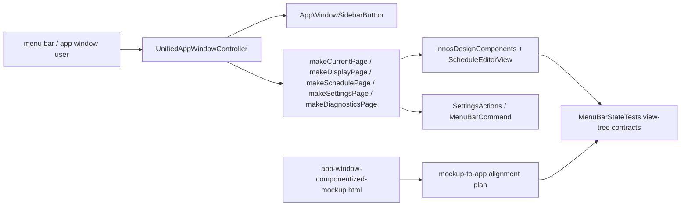

# 2026-06-22 Mockup-To-App Alignment Plan First

후행 실행: `구현커밋`

## Goal

Bring the latest operator-reviewed app-window mockup decisions into the native AppKit app window while preserving the concise, settings-like simplicity the operator preferred.

This plan does not mean "make the app pixel-identical to the HTML mockup." The implementation target is narrower:

- keep the persistent sidebar navigation structure
- remove leftover explanatory copy and unclear duplicate actions
- keep settings limited to actual global settings
- preserve the already-working schedule, diagnostics, display, shortcut, dimming, and launch-at-login behavior
- encode the simplified UI as native tests so the app does not drift back into verbose dashboard-style layout

## Requested Outcome

- The real app window should reflect the good mockup decisions that were refined through comments.
- The app should not become more verbose just because the mockup had intermediate explanatory states.
- The operator should be able to use the app window as the main control surface without needing the old separate settings window.
- The next implementation run must be executable by `구현커밋` without needing a new round of broad research.

## Latest Research Basis

Primary evidence for this plan:

- `/Users/moonsoo/projects/InnosDimmer/docs/design/window-redesign/research.md`
  - section: `2026-06-22 Current Implementation Vs Mockup Gap Audit`
- `/Users/moonsoo/projects/InnosDimmer/docs/design/window-redesign/app-window-componentized-mockup.html`
- `/Users/moonsoo/projects/InnosDimmer/InnosDimmer/UI/UnifiedAppWindowController.swift`
- `/Users/moonsoo/projects/InnosDimmer/InnosDimmer/UI/ScheduleEditorView.swift`
- `/Users/moonsoo/projects/InnosDimmer/InnosDimmerTests/MenuBarStateTests.swift`

The latest research narrows the implementation target to the remaining high-value mismatches:

| Priority | Surface | Current mismatch | Implementation stance |
| --- | --- | --- | --- |
| P0 | Sidebar navigation | visible `tileDescription` text remains | remove visible descriptions; use icon + title only |
| P0 | Current status commands | `Settings` remains in command row | remove because Settings is already persistent sidebar navigation |
| P0 | Display header actions | `Refresh displays` remains visible | remove visible page-level action; keep method temporarily if not dead-code safe |
| P0 | Display saved selection | `Use automatic` remains visible | remove visible button; keep recovery method temporarily |
| P0 | Tests | tests still expect stale labels | update tests before/native cleanup so stale UI cannot drift back |
| Done | Schedule | fixed 3-row table is already implemented | avoid rewriting |
| Done | Settings | launch-at-login only is already implemented | avoid expanding |
| Done | Diagnostics | checkmark matrix + scrollable code log is already implemented | avoid rewriting |

Implementation scope lock:

- This is not a new redesign pass.
- This is not a schedule/settings/diagnostics rewrite.
- This is a small native UI cleanup pass driven by the existing mockup and the latest research gap audit.
- If implementation reveals a display recovery path must remain visible, stop and record the reason instead of silently keeping or deleting the control.

## Current Codebase Recheck

Rechecked against the current working tree before this plan update.

Command evidence:

- `git status --short`
- `rg -n "tileDescription|descriptionLabel|Settings\"|Refresh displays|Use automatic|Quick controls and status\.|Target monitor\.|Startup and persistence\.|makeCurrentPage|makeDisplayPage|makeSidebar" InnosDimmer/UI/UnifiedAppWindowController.swift InnosDimmerTests/MenuBarStateTests.swift docs/design/window-redesign/app-window-componentized-mockup.html`
- `rg -n "ScheduleEditorView|Time|Bright|Blue|diagnostics-code-log|Recent diagnostics log|Launch at login|app-window-summary-table:Schedule|Mode|Software overlay" InnosDimmer/UI/UnifiedAppWindowController.swift InnosDimmer/UI/ScheduleEditorView.swift InnosDimmerTests/MenuBarStateTests.swift docs/design/window-redesign/app-window-componentized-mockup.html`

Resolved already; do not implement again:

| Surface | Current evidence | Plan action |
| --- | --- | --- |
| Schedule rows | `ScheduleEditorView` has fixed row count, `Time`, `Bright`, `Blue`, percent fields, tracks, and adjacent steppers | Preserve only |
| Schedule summary | tests assert `app-window-summary-table:Schedule` and related row identifiers | Preserve only |
| Settings page | `makeSettingsPage()` has `Launch at login`; tests reject `Apply settings`, `Saved settings`, `Schema`, and `Status label` | Preserve only |
| Diagnostics page | `makeDiagnosticsPage()` and tests have `Recent diagnostics log`, `Copy log`, `app-window-diagnostics-code-log`, and checkmark matrix | Preserve only |
| Display current state | `makeDisplayPage()` no longer has `Mode` in `Current state`; tests reject `Mode` / `Software overlay` for display page | Preserve only |

Still open; keep in implementation plan:

| Surface | Current evidence | Required action |
| --- | --- | --- |
| Sidebar descriptions | `UnifiedAppWindowPage.tileDescription`, `descriptionLabel`, and `setAccessibilityLabel("\(page.navigationTitle). \(page.tileDescription)")` still exist | remove visible description and reset accessibility label intentionally |
| Current status duplicate command | `makeCurrentPage()` still includes `button("Settings", command: .openSettings, ...)`; test still expects `Settings` | update test and remove visible command |
| Display refresh action | `makeDisplayPage()` still includes top-level `Refresh displays`; test still expects it | update test and remove visible button |
| Display automatic action | `Saved selection` still includes `Use automatic`; test still expects it | update test and remove visible button, retain method temporarily |
| Mockup residue | mockup visible display page is already clean, but JS `commandIconRules` still mentions `Refresh displays` and `Use automatic` | docs/mockup cleanup only, not a UI redesign |

Implication for this plan:

- Commit 1 and Commit 2 remain necessary.
- Commit 3 should be narrower than a mockup redesign: only remove stale non-visible mockup residues and update notes if implementation changes the display recovery stance.
- Do not touch already-resolved schedule/settings/diagnostics code unless implementation or tests reveal a direct regression.

## Codebase Evidence

- `Confirmed`:
  - `UnifiedAppWindowController` owns the current native app window page routing.
  - `makeSidebar()` still renders `page.tileDescription` in the visible sidebar.
  - `makeCurrentPage()` still includes a `Settings` button in `Commands`.
  - `makeDisplayPage()` still includes `Refresh displays` and `Use automatic`.
  - `makeSettingsPage()` is already reduced to `Launch at login`.
  - `makeDiagnosticsPage()` already uses a vertical stack with a scrollable code log.
  - `ScheduleEditorView` already uses fixed rows with `Time`, `Bright`, `Blue`, percent fields, tracks, and adjacent `-` / `+` controls.
  - `MenuBarStateTests` currently still expect some stale UI labels that the latest mockup removed.
  - Latest research confirms `ScheduleEditorView`, `makeSettingsPage()`, and `makeDiagnosticsPage()` already match the refined mockup direction closely enough that they should not be rewritten in this pass.
- `Inferred`:
  - The safest next step is to update UI contract tests first, then remove stale AppKit UI from the controller.
  - The old `Refresh displays` and `Use automatic` actions may remain as internal selectors temporarily, but they should not stay as first-class visible controls unless a test proves they are the only recovery path.
  - Sidebar descriptions can be removed visibly without removing icons or navigation titles.
- `Unverified`:
  - Whether a live native app screenshot perfectly matches the simplified mockup after the current dirty worktree changes.
  - Whether `Refresh displays` is required for a rare hot-plug display recovery path; no current evidence proves it must stay visible.

## System Visualization



- changed nodes:
  - `Sidebar`
  - `makeCurrentPage`
  - `makeDisplayPage`
  - `MenuBarStateTests`
  - `app-window-componentized-mockup.html` only if the mockup still contains stale helper icon rules or labels
- preserved nodes:
  - `ScheduleEditorView`
  - `makeSettingsPage`
  - `makeDiagnosticsPage`
  - command routing through `SettingsActions` / `MenuBarCommand`
- diagram notes:
  - The HTML mockup is evidence for structure and copy, not production code.
  - Native tests are the contract that should prevent future drift.

## Related Files

- `/Users/moonsoo/projects/InnosDimmer/docs/design/window-redesign/research.md`: latest research basis and accumulated window-redesign evidence.
- `/Users/moonsoo/projects/InnosDimmer/docs/design/window-redesign/app-window-componentized-mockup.html`: visual review artifact for the current simplified mockup.
- `/Users/moonsoo/projects/InnosDimmer/InnosDimmer/UI/UnifiedAppWindowController.swift`: native app-window page routing and page construction.
- `/Users/moonsoo/projects/InnosDimmer/InnosDimmer/UI/ScheduleEditorView.swift`: schedule table editor, already close to the latest mockup.
- `/Users/moonsoo/projects/InnosDimmer/InnosDimmer/UI/DesignSystem/InnosDesignComponents.swift`: shared section/status/button/summary-table components.
- `/Users/moonsoo/projects/InnosDimmer/InnosDimmerTests/MenuBarStateTests.swift`: native UI contract and regression test surface.

## Current Behavior

The latest native implementation is partially aligned with the revised mockup:

- Good alignment:
  - persistent sidebar navigation is present
  - settings page is concise
  - display page removed static `Mode`
  - display target facts are more useful than earlier placeholder state
  - schedule table structure is present
  - diagnostics matrix and log are close to the latest direction
- Remaining mismatch:
  - sidebar still shows small descriptions, despite the operator saying they are unnecessary
  - current-status commands still include `Settings`, which duplicates the persistent sidebar
  - display page still exposes `Refresh displays` and `Use automatic`, both of which the operator flagged as unclear/unnecessary
  - tests still lock in some of those stale labels

## Change Map

- likely files to edit:
  - `/Users/moonsoo/projects/InnosDimmer/InnosDimmer/UI/UnifiedAppWindowController.swift`
  - `/Users/moonsoo/projects/InnosDimmer/InnosDimmerTests/MenuBarStateTests.swift`
  - `/Users/moonsoo/projects/InnosDimmer/docs/design/window-redesign/app-window-componentized-mockup.html`
- likely functions/components/hooks/stores/routes to touch:
  - `UnifiedAppWindowPage.tileDescription`
  - `AppWindowSidebarButton.init(page:target:action:)`
  - `UnifiedAppWindowController.makeCurrentPage()`
  - `UnifiedAppWindowController.makeDisplayPage()`
  - `MenuBarStateTests.testUnifiedAppWindowCurrentStatusPageDefinesReadOnlyDetailContract`
  - `MenuBarStateTests.testUnifiedAppWindowDisplayPageDefinesTargetSelectionContract`
- state/data/content dependencies:
  - display state: `currentDisplaySummary()`, `selectedDisplaySummary()`, `resolvedTargetDisplay()`
  - automation state: `automationActionTitle()`, `automationActionCommand`
  - diagnostics state: `diagnosticsMatrixSummary()`, `diagnosticsLogText()`
  - schedule state: `ScheduleEditorView` and `SettingsSnapshot.sortedSchedule(...)`
- side effects/integrations to preserve or adjust:
  - do not remove display save behavior
  - do not remove app-window opening or popover opening behavior
  - do not remove automation pause/resume behavior
  - do not break launch-at-login toggling
  - do not break diagnostics export or copy-log behavior
- likely new files:
  - none required for implementation
- remaining narrow unknowns before patch:
  - whether `useAutomaticDisplayPressed` should be deleted or retained as an internal method after removing the visible button
  - whether `refreshDisplaysPressed` should remain reachable from diagnostics/manual refresh later
  - whether removing `tileDescription` entirely creates unnecessary churn; retaining it as a private accessibility/help concept is acceptable only if it does not surface in default visible text or tests

## Planned Changes

- expected behavior changes:
  - sidebar becomes title-only with icons
  - current-status page commands become `Open popover` plus the current automation action
  - display page shows saved display and `Save display`, but not `Refresh displays` / `Use automatic`
  - tests reject stale helper copy and duplicate controls
- constraints to preserve:
  - no standalone settings window is reintroduced
  - no schedule row delete/add behavior is added because the operator chose fixed three rows
  - no new dependency or package command is needed
  - no dimming algorithm, gamma behavior, overlay behavior, or persistence schema changes
- execution order if sequencing matters:
  1. write failing UI-contract tests for the remaining gaps
  2. update native AppKit layout/copy
  3. sync mockup only where the mockup still contains stale icon rules or labels
  4. run focused tests and review

## Review Notes

- risks:
  - removing visible controls can look like removing capability; preserve backend action methods until dead-code evidence is clear
  - sidebar description removal may affect accessibility labels; explicitly choose title-only visible labels and either title-only accessibility or hidden hint
  - tests can pass text extraction while the actual layout is visually cramped; add manual screenshot QA after implementation
  - current working tree already contains uncommitted code, test, mockup, and research changes; implementation must preserve those changes and avoid broad reverts
- assumptions:
  - the user's latest preference is stronger than older plans that leaned toward fuller dashboard-style detail pages
  - the current HTML mockup is the intended review artifact
  - the current implementation should stay native AppKit rather than embedding HTML
- unanswered questions:
  - none that should block the next implementation run

## Plan Quality Check

- Alternative considered:
  - Keep all existing actions visible and just rename them. Rejected because the operator repeatedly marked those controls as unnecessary or unclear.
- Why this plan:
  - It targets only the stale gaps found by direct code/test/mockup comparison and avoids reworking already-aligned schedule/settings/diagnostics work.
- Tradeoff:
  - The UI becomes simpler, but some recovery actions become less visible. This is acceptable for a personal app if underlying behavior remains available and the visible flow stays understandable.
- What this plan may still miss:
  - A rare display hot-plug recovery need for `Refresh displays`.
  - Visual density problems that text-based tests cannot catch.
- When to stop and revise:
  - Stop if removing `Refresh displays` or `Use automatic` breaks display-selection persistence tests or leaves no way to recover from a saved invalid display.
  - Stop if the real native app screenshot shows severe spacing/layout issues despite passing tests.

## Skill Routing Manifest

| Phase | Required skills | Optional skills | Evidence |
| --- | --- | --- | --- |
| Commit 1: Lock remaining simplified UI contracts in tests | `구현커밋` | `review-all-in-one` | `MenuBarStateTests` currently expects stale `Settings`, `Refresh displays`, and `Use automatic` labels; research marks this as P0. |
| Commit 2: Remove stale AppKit sidebar and command UI | `구현커밋` | `디자인올인원` | `UnifiedAppWindowController.makeSidebar`, `makeCurrentPage`, and `makeDisplayPage` own the remaining P0 mismatch. |
| Commit 3: Remove stale mockup residue and document retained hidden behavior | `구현커밋` | `research` | Visible mockup pages are already mostly aligned; only non-visible JS icon rules and documentation need cleanup if stale labels remain. |
| Final Gate | `review-all-in-one`, `테스트` | `review-swarm` | Focused native tests and manual visual comparison should prove the simplified mockup decisions reached the real app. |

## Implementation Plan

### Commit 1: Lock remaining simplified UI contracts in tests

- target files:
  - `/Users/moonsoo/projects/InnosDimmer/InnosDimmerTests/MenuBarStateTests.swift`
- changes:
  - Update current-status contract so `Settings` is no longer expected inside `Commands`.
  - Add `doesNotContain` assertions for sidebar helper descriptions such as `Quick controls and status.`, `Target monitor.`, and `Startup and persistence.`.
  - Update display-page contract so `Refresh displays` and `Use automatic` are no longer expected.
  - Keep assertions for meaningful display facts: `Selection rule`, `Active target`, `Safety scope`, `Blue reduction`, and `Save display`.
  - Preserve tests proving already-aligned surfaces: schedule summary table identifiers, diagnostics code-log identifiers, settings launch-at-login section.
- code snippets:
  - proposed test contract:

```swift
assert(text, contains: [
    "Current status",
    "Commands",
    "Open popover",
    "Resume automation"
])
assert(text, doesNotContain: [
    "Settings",
    "Quick controls and status.",
    "State and commands."
])
```

```swift
assert(text, contains: [
    "Target display",
    "Selection rule",
    "Active target",
    "Safety scope",
    "Blue reduction",
    "Save display"
])
assert(text, doesNotContain: [
    "Refresh displays",
    "Use automatic",
    "Mode",
    "Software overlay"
])
```

- tradeoff:
  - chosen: tests first, then code cleanup
  - alternative: edit AppKit first and adjust tests after
  - cost/risk: tests will temporarily fail during implementation
  - why acceptable: the failing tests precisely define the expected UI simplification
  - revisit when: assertions become too text-fragile or conflict with accessibility-only labels
- verification:
  - `xcodebuild test -scheme InnosDimmer -only-testing:InnosDimmerTests/MenuBarStateTests CODE_SIGNING_ALLOWED=NO`: first should fail on stale UI before Commit 2, then pass after cleanup
- success criteria:
  - tests express the latest mockup decisions and no longer lock in rejected labels/actions
- stop conditions:
  - if tests reveal that a supposedly stale button is the only path used by an existing behavioral test, pause and split behavior preservation from visual removal
  - if sidebar description text appears only in accessibility extraction rather than visible text, decide whether to update accessibility separately instead of making a brittle text assertion

### Commit 2: Remove stale AppKit sidebar and command UI

- target files:
  - `/Users/moonsoo/projects/InnosDimmer/InnosDimmer/UI/UnifiedAppWindowController.swift`
- changes:
  - Remove `descriptionLabel` from `AppWindowSidebarButton` visible layout.
  - Remove or deprecate `UnifiedAppWindowPage.tileDescription` only after confirming no other code needs it; if retained, it must not be visible or included in default accessibility labels.
  - Change sidebar accessibility label to page title only, or title plus hidden accessibility help if needed.
  - Remove `Settings` from `makeCurrentPage()` command row.
  - Remove page-level `Refresh displays` from `makeDisplayPage()`.
  - Remove visible `Use automatic` from `Saved selection`, leaving `Save display` as the primary display action.
  - Keep `useAutomaticDisplayPressed` and `refreshDisplaysPressed` methods until dead-code review proves they are no longer referenced or until a separate cleanup commit removes them.
- code snippets:
  - proposed sidebar shape:

```swift
let textStack = NSStackView(views: [titleLabel])
textStack.orientation = .vertical
textStack.alignment = .leading
textStack.spacing = 0
setAccessibilityLabel(page.navigationTitle)
```

  - proposed current commands:

```swift
makeActionRow([
    button("Open popover", command: .openPopover, action: #selector(openPopoverPressed), style: .primary),
    button(automationActionTitle(), command: automationActionCommand, action: #selector(automationActionPressed))
])
```

  - proposed display saved-selection actions:

```swift
makeActionRow([
    PopoverCommandButton(
        title: "Save display",
        style: .primary,
        target: self,
        action: #selector(saveDisplayPressed)
    )
])
```

- tradeoff:
  - chosen: remove unclear visible controls, retain internal methods initially
  - alternative: delete methods and command plumbing immediately
  - cost/risk: retained methods may look like dead code for one commit
  - why acceptable: it lowers regression risk while simplifying the visible app
  - revisit when: `rg` shows methods are unreferenced and no tests rely on them
- verification:
  - `xcodebuild test -scheme InnosDimmer -only-testing:InnosDimmerTests/MenuBarStateTests CODE_SIGNING_ALLOWED=NO`: native UI contract passes
  - inspect app-window text extraction to confirm stale labels are absent
- success criteria:
  - native app window no longer displays sidebar descriptions, current-page `Settings`, display `Refresh displays`, or display `Use automatic`
  - all existing behavior tests in the focused suite still pass
  - no changes are made to `ScheduleEditorView`, `makeSettingsPage()`, or `makeDiagnosticsPage()` unless tests expose a direct regression
- stop conditions:
  - stop if removing a visible display action breaks display selection save/reset workflows
  - stop if `rg` shows `tileDescription` is used outside sidebar rendering in a way that carries operator-facing meaning

### Commit 3: Remove stale mockup residue and document retained hidden behavior

- target files:
  - `/Users/moonsoo/projects/InnosDimmer/docs/design/window-redesign/app-window-componentized-mockup.html`
  - `/Users/moonsoo/projects/InnosDimmer/docs/design/window-redesign/research.md`
  - optionally this plan file, if implementation changes the selected approach
- changes:
  - Remove stale non-visible command icon rules for labels no longer present, such as `Refresh displays` and `Use automatic`, if they remain only as mockup leftovers.
  - Do not redesign or rewrite already-aligned mockup sections: sidebar without descriptions, display page without extra visible actions, schedule table, settings launch-at-login, diagnostics code log.
  - Add a short note in `research.md` if implementation discovers that a display recovery action must remain visible.
  - Do not create a second competing mockup; update the existing review artifact only when needed for consistency.
- code snippets:
  - proposed mockup icon-rule cleanup:

```js
const commandIconRules = [
  { match: /^Save|^Apply/, icon: "save" },
  { match: /^Export diagnostics$/, icon: "download" },
  { match: /^Open popover$/, icon: "monitor" }
];
```

- tradeoff:
  - chosen: sync only stale review-artifact labels, avoid redesigning the whole mockup again
  - alternative: make a new mockup version
  - cost/risk: existing mockup keeps historical CSS/classes
  - why acceptable: the current user request is about app implementation readiness, not a new visual exploration
  - revisit when: the operator asks for another visual redesign pass
- verification:
  - open `file:///Users/moonsoo/projects/InnosDimmer/docs/design/window-redesign/app-window-componentized-mockup.html`
  - search the file for removed labels:

```bash
rg -n "Refresh displays|Use automatic|Target monitor\\.|Quick controls and status\\." docs/design/window-redesign/app-window-componentized-mockup.html
```

- success criteria:
  - mockup, research, and native tests agree on the simplified labels and actions
  - any remaining occurrences of removed labels are either absent or explicitly documented as non-visible/internal
- stop conditions:
  - stop if the mockup still intentionally shows a label that the native plan removes; record the mismatch and ask for operator choice

### Commit 4: Final review and focused verification

- target files:
  - no code target required unless review finds issues
- changes:
  - Run `review-all-in-one` against the implementation diff.
  - Run focused UI and behavior tests.
  - Capture manual QA notes for the native app window, especially sidebar density, display page clarity, schedule table readability, diagnostics log scroll/copy behavior.
- code snippets:
  - verification command:

```bash
xcodebuild test -scheme InnosDimmer -only-testing:InnosDimmerTests/MenuBarStateTests CODE_SIGNING_ALLOWED=NO
```

- tradeoff:
  - chosen: focused UI regression first
  - alternative: full test suite immediately
  - cost/risk: focused tests may miss non-window regressions
  - why acceptable: this plan changes native UI contracts; broader tests can run if focused tests fail or if implementation touches shared services
  - revisit when: code changes leave `UnifiedAppWindowController` and touch service/domain files
- verification:
  - focused xcodebuild suite passes
  - visual/manual check confirms the app window is meaningfully closer to the simplified mockup
  - no unexpected edits appear outside the planned files unless documented in the review
- success criteria:
  - no known stale mockup decisions remain unimplemented without explanation
  - final review has no blocking findings
- stop conditions:
  - stop if the real app still looks materially different in a way not covered by tests, especially if it reintroduces dashboard clutter

## Operator 결정 필요 사항

- 상태: 없음
- 결정 1: Display page unclear recovery actions
  - 맥락: `Refresh displays` and `Use automatic` were previously exposed, but the operator marked them unclear/unnecessary.
  - A: Remove them from the visible display page and keep the underlying methods temporarily.
  - B: Keep them visible but rename them, increasing UI clutter.
  - C: Delete visible controls and underlying methods immediately.
  - 추천안: A. It matches the operator's simplification request while avoiding premature behavior deletion.
  - 기본값: A.
  - 보류 시 영향: If deferred, the app keeps controls the operator already flagged as confusing.
- 결정 2: Sidebar descriptions
  - 맥락: The mockup now uses a persistent sidebar and the operator said small descriptions are unnecessary.
  - A: Use icon + title only.
  - B: Keep descriptions in accessibility only.
  - C: Keep visible descriptions.
  - 추천안: A. It matches the visible simplification and the personal-use app does not need onboarding copy in every nav item.
  - 기본값: A.
  - 보류 시 영향: If deferred, the real app remains more verbose than the accepted mockup direction.

## 검토용 결과물

- HTML: [componentized mockup](/Users/moonsoo/projects/InnosDimmer/docs/design/window-redesign/app-window-componentized-mockup.html)
- Research: [research.md](/Users/moonsoo/projects/InnosDimmer/docs/design/window-redesign/research.md)
- 테스트 링크:
  - Localhost: 해당 없음. 이 작업은 네이티브 macOS AppKit 앱이며 정적 HTML mockup은 `file://`로 확인한다.
  - Deploy: 해당 없음. 개인용 로컬 macOS 앱이며 배포 URL이 없다.
- 상태: implemented
- 실제 동작:
  - 실제 앱에 반영됨: persistent sidebar, schedule table, simplified settings, diagnostics code log, display target facts.
  - 이번 실행에서 추가 반영됨: app-window sidebar visible descriptions removed, current `Settings` command removed, display `Refresh displays` / `Use automatic` controls removed.
  - 보존됨: `Settings` sidebar destination, display save flow, existing hidden recovery selectors for display refresh/automatic selection.
  - 목업 residue 정리됨: removed stale JS icon rules for labels no longer visible.
- Mock:
  - HTML mockup is static sample data and should not be treated as production runtime.

## 후행 실행

- 기본 실행: 구현커밋
- 계획 경로 처리: 구현커밋이 직전 대화, 계획 링크, active plan context에서 자동 탐지
- 모호할 때: 후보 목록을 보여주고 Operator에게 선택 요청

## HTML 생략 보고서

- 판정: 생략 가능
- 생략 사유:
  - 새 HTML을 만들지 않았다. 이미 존재하는 최신 mockup HTML이 이번 계획의 검토용 결과물이다.
  - 이번 단계는 research + plan-first 문서화이며 실제 구현 패치는 후행 `구현커밋`에서 실행한다.
- 대체 검토물:
  - `/Users/moonsoo/projects/InnosDimmer/docs/design/window-redesign/app-window-componentized-mockup.html`
  - `/Users/moonsoo/projects/InnosDimmer/docs/design/window-redesign/research.md`
- 테스트 링크:
  - Localhost: 해당 없음. 정적 HTML은 file URL로 열면 된다.
  - Deploy: 해당 없음.
- 사용자가 바로 열어볼 링크:
  - [componentized mockup](/Users/moonsoo/projects/InnosDimmer/docs/design/window-redesign/app-window-componentized-mockup.html)

## 구현 후 검토 리스트

- 회귀 확인:
  - dimming quick actions still route to `MenuBarCommand`
  - display selection still saves correctly
  - launch-at-login still toggles
  - schedule rows still edit and save
  - diagnostics export and copy-log still work
- 검증 확인:
  - passed: `xcodebuild test -scheme InnosDimmer -only-testing:InnosDimmerTests/MenuBarStateTests CODE_SIGNING_ALLOWED=NO`
  - passed: app-window tests now assert removed display actions and sidebar descriptions are absent from the rendered native view tree
  - checked: stale mockup icon rules for `Refresh displays` and `Use automatic` removed
  - manual native app-window visual check
- 리뷰 관점:
  - `review-all-in-one`: stale UI labels, command routing regressions, test coverage gaps
  - `review-swarm`: visual density, accessibility labels, hidden behavior loss
  - `테스트`: focused native QA and user-facing verification notes
- Operator 재확인:
  - confirm sidebar feels concise enough
  - confirm display page still feels recoverable without `Use automatic`
  - confirm no page has explanatory captions creeping back in

## Validation

- manual checks:
  - Review the HTML mockup at `file:///Users/moonsoo/projects/InnosDimmer/docs/design/window-redesign/app-window-componentized-mockup.html`.
  - After implementation, open the native InnosDimmer app window and compare Overview, Current status, Display, Schedule, Settings, and Diagnostics against the simplified structure.
- lint/build/test scope:
  - focused AppKit UI test suite first: `MenuBarStateTests`
  - broader suite only if shared command or service files are touched
- scenario-to-surface checks:
  - sidebar: icon + title only
  - current: status readout + popover/automation commands only
  - display: useful target facts + save display only
  - schedule: fixed 3-row table with editable percent fields/tracks/steppers
  - settings: launch at login only
  - diagnostics: checkmark matrix + scrollable copyable code log
