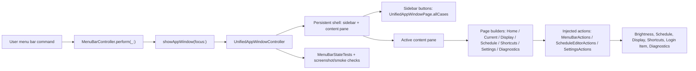

# InnosDimmer Sidebar Navigation App Window Plan

## Goal

실제 macOS 앱의 통합 전체창을 최신 목업 기준처럼 바꾼다.

핵심 목표는 기존 `홈 우측 타일 + 상세 Back 버튼` 구조를 버리고, 항상 보이는 왼쪽 사이드바와 오른쪽 콘텐츠 패널로 구성된 단일 설정창 구조를 만드는 것이다.

이 계획은 구현 패치가 아니다. 후행 실행은 반드시 `구현커밋`으로 진행한다.

## Requested Outcome

사용자 요청:

- `docs/design/window-redesign/app-window-componentized-mockup.html`의 최신 사이드바 네비게이션 구조를 실제 앱에 반영하기 위한 plan-first 문서를 만든다.
- 구현 전에 리서치 결과를 근거로 변경 범위, 위험, 실행 단위, 검증 방법을 잠근다.
- 후행 구현자가 추가 질문 없이 `구현커밋`으로 실행할 수 있게 `### Commit N:` 단위로 나눈다.

이번 계획의 해석:

- 목업 기준은 이미 존재하므로 새 HTML을 만들지 않는다.
- 기존 HTML 목업을 검토용 결과물로 고정한다.
- 실제 Swift/AppKit 구현은 후행 `구현커밋`에서 진행한다.

## Codebase Evidence

- `Confirmed`:
  - `docs/design/window-redesign/app-window-componentized-mockup.html`는 최신 기준에서 `.app-body`, `.sidebar`, `.content-pane` 구조를 갖는다.
  - 목업의 Back 버튼과 `icon-arrow-left`는 제거되었다.
  - `InnosDimmer/UI/UnifiedAppWindowController.swift`에는 이미 `UnifiedAppWindowPage`가 있고 `home`, `current`, `display`, `schedule`, `shortcuts`, `settings`, `diagnostics` 페이지가 정의돼 있다.
  - `MenuBarController.perform(_:)`는 이미 `.openScheduleEditor`, `.openShortcuts`, `.openDiagnostics`, `.openSettings`를 각각 앱 전체창의 특정 페이지로 라우팅한다.
  - `UnifiedAppWindowController.makeDetailPage()`는 아직 모든 상세 페이지에 `← Back` 버튼을 만든다.
  - `UnifiedAppWindowController.makeHomePage()`는 아직 홈 오른쪽에 2열 navigation grid를 만든다.
  - `InnosDimmerTests/MenuBarStateTests.swift`는 아직 `app-window-header-action:Back` 식별자가 존재한다고 기대한다.
  - `ScheduleEditorView`는 이미 `Time`, `Bright`, `Blue` 표 헤더, 값 입력, track, `-`/`+` steppers를 갖고 있어 이번 네비게이션 작업의 핵심 blocker가 아니다.
- `Inferred`:
  - 실제 구현은 `UnifiedAppWindowController`의 shell 구조를 바꾸는 작업이 중심이다.
  - `MenuBarController`의 라우팅은 큰 변경 없이 유지할 수 있다.
  - `NSSplitViewController`는 AppKit 정석 대안이지만, 현재 컨트롤러가 수동 `NSStackView` 기반이므로 이번 단계에서는 custom `NSStackView` sidebar shell이 더 작은 변경이다.
- `Unverified`:
  - 실제 앱 창에서 사이드바 250px, 창 크기 900x640이 모든 페이지에 가장 적절한지는 후행 screenshot/manual QA가 필요하다.
  - 오래된 `AppDashboardWindowController`를 이번 단계에서 삭제해도 컴파일/테스트 영향이 없는지는 별도 cleanup 검증이 필요하다.

## System Visualization



- changed nodes:
  - `UnifiedAppWindowController.installContent()`
  - `UnifiedAppWindowController.renderActivePage()`
  - `UnifiedAppWindowController.makeHomePage()`
  - `UnifiedAppWindowController.makeDetailPage()`
  - navigation test hooks in `UnifiedAppWindowController`
  - app window structure tests in `MenuBarStateTests`
- preserved nodes:
  - `MenuBarController.perform(_:)`
  - `MenuBarController.showAppWindow(focus:)`
  - `MenuBarActions`
  - `ScheduleEditorActions`
  - `SettingsActions`
  - `ScheduleEditorView`
  - domain/service layers
- diagram notes:
  - sidebar navigation is UI state only; it must not create new domain side-effect paths.

## Related Files

- `docs/design/window-redesign/app-window-componentized-mockup.html`: approved review artifact and visual source of truth.
- `docs/design/window-redesign/research.md`: latest research basis, especially `2026-06-22 Sidebar Navigation Structure Research`.
- `InnosDimmer/UI/UnifiedAppWindowController.swift`: primary implementation target.
- `InnosDimmer/UI/MenuBarController.swift`: existing route owner; mostly preserved.
- `InnosDimmer/UI/MenuBarPopoverView.swift`: command enum and old dashboard code; do not copy old `AppDashboardWindowController` structure.
- `InnosDimmer/UI/ScheduleEditorView.swift`: schedule table editor already close to target; preserve behavior.
- `InnosDimmer/UI/SettingsActions.swift`: durable settings side-effect boundary; preserve.
- `InnosDimmer/UI/DesignSystem/InnosDesignTokens.swift`: sizes, colors, spacing, fonts.
- `InnosDimmer/UI/DesignSystem/InnosDesignComponents.swift`: possible shared component helpers; optional use only if it reduces duplication.
- `InnosDimmerTests/MenuBarStateTests.swift`: primary behavior and layout contract test surface.
- `InnosDimmerTests/HotkeyBindingTests.swift`: shortcut command and unified window side-effect tests.
- `scripts/smoke_app_window_snapshot.sh`: likely final screenshot/smoke support script.

## Current Behavior

The native app currently behaves as a partially unified app window.

What is already good:

- `UnifiedAppWindowController` is the active app-window controller.
- Runtime commands can focus Schedule, Shortcuts, Settings, and Diagnostics pages.
- Display, shortcuts, login item, schedule, and diagnostics actions are routed through injected action structs.
- Schedule rows already use table-like editable rows.

What is still wrong relative to the latest mockup:

- Navigation appears only on Home as a right-side grid.
- Detail pages still need a Back button to return to Home.
- Home duplicates navigation that should move to the persistent sidebar.
- Tests still encode the old Back contract.
- The visible Home title still uses `InnosDimmer Control Center` rather than the simpler `InnosDimmer` target.
- Home status section still uses `Next actions`, while the latest mockup uses `Status`.

## Change Map

- likely files to edit:
  - `InnosDimmer/UI/UnifiedAppWindowController.swift`
  - `InnosDimmerTests/MenuBarStateTests.swift`
  - possibly `InnosDimmerTests/HotkeyBindingTests.swift` if active page or page structure helper output changes
  - optionally `docs/design/window-redesign/research.md` only if implementation finds new facts
- likely functions/components/hooks/stores/routes to touch:
  - `UnifiedAppWindowController.Layout`
  - `UnifiedAppWindowController.installContent()`
  - `UnifiedAppWindowController.makeHeader()`
  - `UnifiedAppWindowController.renderActivePage()`
  - `UnifiedAppWindowController.makeHomePage()`
  - `UnifiedAppWindowController.makeNavigationGrid()`
  - `UnifiedAppWindowController.makeNavigationTile(_:)`
  - `UnifiedAppWindowController.makeDetailPage(...)`
  - `UnifiedAppWindowController.pageStructureForTesting(...)`
  - `UnifiedAppWindowController.homeLayoutMetricsForTesting()`
  - `UnifiedAppWindowController.focus(_:)`
  - `UnifiedAppWindowController.pageButtonPressed(_:)`
- state/data/content dependencies:
  - `activePage`
  - `commandButtons`
  - current `pageButtons`
  - new `sidebarButtons`
  - current state, schedule, shortcuts, events, snapshot, display candidates, login status
- side effects/integrations to preserve or adjust:
  - preserve all command side effects behind existing action structs
  - no direct calls to service/domain layers from sidebar buttons
  - no changes to dimming/gamma/schedule engine semantics
- likely new files:
  - none required
- remaining narrow unknowns before patch:
  - whether to keep the top status chips in the global header or move them into content pane header. Default: keep them in the global header for a small patch.
  - exact window size. Default: update to `900x640` and min size around `780x520` unless visual QA shows clipping.

## Planned Changes

Expected behavior changes:

- The app window always shows a left sidebar with:
  - Overview
  - Current status
  - Display
  - Schedule
  - Shortcuts
  - Settings
  - Diagnostics
- Clicking a sidebar item switches the content pane directly.
- Focus calls such as `.openShortcuts` and `.openSettings` update sidebar selection and content pane.
- Detail pages have no Back button.
- Home no longer has a separate right navigation grid.
- Home's secondary section is named `Status`, not `Next actions`.

Constraints to preserve:

- Quick dimming controls still route through `MenuBarActions`.
- Schedule save still routes through `ScheduleEditorActions`.
- Display, shortcut, login item, and diagnostics export still route through `SettingsActions`.
- Existing shortcut validation remains unchanged.
- Existing schedule editor row parsing remains unchanged.
- Popover behavior remains unchanged except if tests reference app-window navigation labels.

Execution order:

1. Lock tests around the new navigation contract.
2. Refactor `UnifiedAppWindowController` shell.
3. Remove old Home grid and Back page contract.
4. Verify page routing and existing side-effect tests.
5. Run manual/screenshot QA and review.

## Review Notes

- risks:
  - Sidebar buttons must not be stored in `commandButtons`, because `commandButtons` is cleared on page render.
  - Reusing `pageButtons` may be confusing because it currently holds both navigation tiles and status-list buttons.
  - Removing Back changes tests and any accessibility expectations.
  - Home grid removal can break `homeLayoutMetricsForTesting()`.
  - `contentPane` constraints may need a scroll view if a page is taller than the window.
- assumptions:
  - User has accepted the mockup sidebar direction.
  - Existing route split among `.openSettings`, `.openShortcuts`, `.openDiagnostics`, and `.openScheduleEditor` should remain.
  - Old `AppDashboardWindowController` cleanup is lower priority than making active `UnifiedAppWindowController` correct.
- unanswered questions:
  - Whether sidebar should support collapse. Default: no collapse in this implementation.
  - Whether native `NSSplitViewController` should eventually replace custom shell. Default: defer.

## Plan Quality Check

- Alternative considered:
  - Use `NSSplitViewController` and `NSSplitViewItem.sidebarWithViewController`.
- Why not selected now:
  - It is more AppKit-native, but it would force a wider controller/view-controller refactor. Current app window is already a single `NSWindowController` with manual `NSStackView` composition and injected action closures.
- Why this plan:
  - A custom `NSStackView` sidebar shell changes the actual active controller with smaller blast radius while matching the mockup's `app-body/sidebar/content-pane` structure.
- Tradeoff:
  - chosen: custom `NSStackView` shell inside `UnifiedAppWindowController`.
  - alternative: `NSSplitViewController` with child view controllers.
  - cost/risk: custom layout has more manual constraints and less native sidebar behavior.
  - why acceptable: the app is a compact personal utility, does not need collapsible Finder-style sidebar behavior right now, and the existing code already uses manual layout.
  - revisit when: manual constraints become brittle, sidebar collapse becomes required, or AppKit screenshot QA shows persistent resizing problems.
- What this plan may still miss:
  - Exact visual polish of selected sidebar rows, hover/focus state, and per-page scroll behavior.
  - Potential interactions with the old `AppDashboardWindowController` dead code.
- When to stop and revise:
  - If active sidebar selection cannot be kept stable without broad rewrites.
  - If `UnifiedAppWindowController` tests require deleting or rewriting unrelated runtime logic.
  - If changing shell constraints causes core pages to clip or crash in headless rendering.

## Skill Routing Manifest

| Phase | Required skills | Optional skills | Evidence |
| --- | --- | --- | --- |
| Commit 1: Lock sidebar navigation contract in tests | `plan-first-implementation` | `review-all-in-one` | `MenuBarStateTests` currently expects `app-window-header-action:Back`; tests must define the new source-of-truth before implementation. |
| Commit 2: Build persistent sidebar shell in UnifiedAppWindowController | `구현커밋` | `design-all-in-one` | `UnifiedAppWindowController.installContent()` currently builds `header/statusLabel/bodyView`; research recommends `sidebar + contentPane`. |
| Commit 3: Remove old home navigation and Back detail contract | `구현커밋` | `review-swarm` | `makeHomePage()` still builds a home-only grid; `makeDetailPage()` still builds Back. |
| Commit 4: Preserve page behavior and side-effect routes | `구현커밋` | `테스트` | Display, schedule, shortcuts, settings, and diagnostics actions already pass through injected actions and must not regress. |
| Commit 5: Screenshot/smoke QA and documentation sync | `구현커밋` | `테스트`, `review-all-in-one` | User cares about visual match; smoke screenshots and the existing mockup link must remain aligned. |
| Final Gate | `review-all-in-one`, `테스트` | `review-swarm` | Final validation must inspect code structure, tests, and visual/smoke evidence before claiming completion. |

## Implementation Plan

### Commit 1: Lock sidebar navigation contract in tests

- target files:
  - `InnosDimmerTests/MenuBarStateTests.swift`
  - optionally `InnosDimmer/UI/UnifiedAppWindowController.swift` for test-only helper signatures if needed
- changes:
  - Replace the old Back expectation with a no-Back expectation.
  - Add tests that every page has a sidebar navigation item.
  - Add tests that focusing each `AppDashboardFocusTarget` updates the active page and active sidebar selection.
  - Replace or remove `homeLayoutMetricsForTesting()` expectations around 2-column home tiles.
  - Add a new testing helper if necessary, for example `sidebarNavigationForTesting()`.
- code snippets:
  - proposed helper shape in `UnifiedAppWindowController.swift`:

```swift
func sidebarPagesForTesting() -> [String] {
    UnifiedAppWindowPage.allCases.map(\.title)
}

func activeSidebarPageForTesting() -> String? {
    sidebarButtons.first { $0.value.state == .on }?.key.title
}
```

  - proposed test intent in `MenuBarStateTests.swift`:

```swift
let current = controller.pageStructureForTesting(focus: .current)
XCTAssertFalse(current.containsIdentifier("app-window-header-action:Back"))
XCTAssertTrue(current.containsIdentifier("app-window-sidebar"))
XCTAssertTrue(current.containsIdentifier("app-window-sidebar-page:Current status"))
```

- tradeoff:
  - chosen: update tests before implementation.
  - alternative: patch UI first and adjust tests after.
  - cost/risk: first commit may fail until implementation lands.
  - why acceptable: this is the clearest way to encode the new contract and prevent backsliding.
  - revisit when: test helpers require production-only API pollution; then keep helpers minimal and `internal`.
- verification:
  - `xcodebuild test -scheme InnosDimmer -only-testing:InnosDimmerTests/MenuBarStateTests`
    - assertion: expected to fail before Commit 2 if tests are updated first; should pass after Commit 4.
- success criteria:
  - Tests clearly express sidebar pages, no Back button, and active sidebar page behavior.
- stop conditions:
  - If tests reveal that page state is not inspectable without major UI API exposure, revise helper strategy before patching production layout.

### Commit 2: Build persistent sidebar shell in UnifiedAppWindowController

- target files:
  - `InnosDimmer/UI/UnifiedAppWindowController.swift`
- changes:
  - Add persistent shell properties:
    - `sidebarStack`
    - `contentPane`
    - `sidebarButtons`
  - Change `installContent()` to install one stable shell.
  - Build the sidebar once from `UnifiedAppWindowPage.allCases`.
  - Add `setActivePage(_:)` and `updateSidebarSelection()`.
  - Change `renderActivePage()` so it replaces only the content pane, not the whole shell.
  - Keep global header chips and `statusLabel` unless they conflict with visual QA.
- code snippets:
  - proposed layout:

```swift
private let contentPane = NSView()
private let sidebarStack = NSStackView()
private var sidebarButtons: [UnifiedAppWindowPage: NSButton] = [:]

private func makeAppBody() -> NSView {
    let sidebar = makeSidebar()
    let content = makeContentPane()
    let body = NSStackView(views: [sidebar, content])
    body.orientation = .horizontal
    body.alignment = .height
    body.spacing = 0
    return body
}
```

  - proposed page setter:

```swift
private func setActivePage(_ page: UnifiedAppWindowPage) {
    activePage = page
    renderActivePage()
    updateSidebarSelection()
}
```

- tradeoff:
  - chosen: custom `NSStackView` shell.
  - alternative: `NSSplitViewController`.
  - cost/risk: manual constraints and visual states need more care.
  - why acceptable: smaller patch, preserves current action injection, aligns with current code style.
  - revisit when: resizing or focus behavior is unstable in smoke screenshots.
- verification:
  - `xcodebuild test -scheme InnosDimmer -only-testing:InnosDimmerTests/MenuBarStateTests`
    - assertion: the unified window can instantiate, focus each page, and expose sidebar identifiers.
- success criteria:
  - All pages can render inside `contentPane`.
  - Sidebar remains visible across page changes.
  - Active page selection is reflected in sidebar state.
- stop conditions:
  - If shell constraints cause blank content or unsatisfiable constraints on basic page focus, stop before changing page internals.

### Commit 3: Remove old home navigation and Back detail contract

- target files:
  - `InnosDimmer/UI/UnifiedAppWindowController.swift`
  - `InnosDimmerTests/MenuBarStateTests.swift`
- changes:
  - Remove Back button creation from `makeDetailPage(...)`.
  - Remove or repurpose `backPressed()`.
  - Remove old home-only navigation grid from `makeHomePage()`.
  - Rename Home title to `InnosDimmer` if following latest mockup exactly.
  - Rename `Next actions` to `Status`.
  - Ensure `pageButtons` no longer means both sidebar buttons and list rows; either:
    - replace with `sidebarButtons`, or
    - keep `pageButtons` only for non-sidebar page jump controls and document that boundary.
- code snippets:
  - proposed `makeDetailPage` header after removing Back:

```swift
private func makeDetailPage(
    title: String,
    trailingActions: [NSView] = [],
    content: NSView
) -> NSView {
    let pageTitle = NSTextField(labelWithString: title)
    pageTitle.font = InnosDesignTokens.Font.app(ofSize: 22, weight: .bold)

    let header = NSStackView(views: [pageTitle, spacer()] + trailingActions)
    header.identifier = NSUserInterfaceItemIdentifier("app-window-page-header")
    header.orientation = .horizontal
    header.alignment = .centerY
    header.spacing = 12
    return verticalStack([header, content])
}
```

  - proposed Home section title:

```swift
private func makeNextActionsSection() -> NSView {
    makeSection(title: "Status", views: [
        makeListRow(title: "Schedule", value: nextScheduleText(), page: .schedule),
        makeListRow(title: "Diagnostics", value: diagnosticsSummary(), page: .diagnostics),
        makeListRow(title: "Shortcuts", value: "\(shortcuts.filter(\\.isEnabled).count) enabled", page: .shortcuts)
    ])
}
```

- tradeoff:
  - chosen: remove Back completely.
  - alternative: hide Back visually but leave it for tests/accessibility.
  - cost/risk: any test or helper relying on Back must change.
  - why acceptable: the approved information architecture makes Back redundant and potentially confusing.
  - revisit when: keyboard-only navigation lacks a clear way to return to Overview; in that case sidebar focus shortcuts should be added, not Back.
- verification:
  - `rg -n "← Back|app-window-header-action:Back|backPressed" InnosDimmer/UI/UnifiedAppWindowController.swift InnosDimmerTests/MenuBarStateTests.swift`
    - assertion: no production Back UI contract remains.
  - focused XCTest:
    - assertion: no page structure contains Back text or Back identifier.
- success criteria:
  - No visible Back button exists in the real app window.
  - Home no longer duplicates sidebar navigation.
  - Sidebar is the only primary page navigation.
- stop conditions:
  - If removing Back breaks an essential keyboard or accessibility path without sidebar replacement, pause and add sidebar keyboard focus handling.

### Commit 4: Preserve page behavior and side-effect routes

- target files:
  - `InnosDimmer/UI/UnifiedAppWindowController.swift`
  - `InnosDimmer/UI/MenuBarController.swift`
  - `InnosDimmerTests/MenuBarStateTests.swift`
  - `InnosDimmerTests/HotkeyBindingTests.swift`
- changes:
  - Confirm `MenuBarController.perform(_:)` command routing remains unchanged unless tests reveal a gap.
  - Keep `openSettings` focused to `.settings`.
  - Keep `openShortcuts` focused to `.shortcuts`.
  - Keep `openDiagnostics` focused to `.diagnostics`.
  - Keep `openScheduleEditor` focused to `.schedule`.
  - Keep schedule, display, shortcut, launch-at-login, diagnostics export action tests passing.
  - Preserve `ScheduleEditorView` behavior unless shell constraints require a scroll wrapper.
- code snippets:
  - route contract to preserve:

```swift
case .openScheduleEditor:
    showAppWindow(focus: .schedule)
case .openShortcuts:
    showAppWindow(focus: .shortcuts)
case .openDiagnostics:
    showAppWindow(focus: .diagnostics)
case .openSettings:
    openSettings()
```

- tradeoff:
  - chosen: leave route layer mostly unchanged.
  - alternative: introduce a new `AppWindowFocusTarget` type now.
  - cost/risk: keeping `AppDashboardFocusTarget` name is semantically stale.
  - why acceptable: renaming route types is cleanup, not required for the sidebar navigation behavior.
  - revisit when: app-window implementation stabilizes and old dashboard code cleanup is scheduled.
- verification:
  - `xcodebuild test -scheme InnosDimmer -only-testing:InnosDimmerTests/MenuBarStateTests`
    - assertions:
      - page routing does not apply dimming commands.
      - schedule save still uses `ScheduleEditorActions`.
      - display selection still uses `SettingsActions`.
      - shortcuts save still uses `SettingsActions`.
      - login item toggle still uses `SettingsActions`.
      - diagnostics export still uses `SettingsActions`.
  - `xcodebuild test -scheme InnosDimmer -only-testing:InnosDimmerTests/HotkeyBindingTests`
    - assertion: shortcut command mapping remains stable.
- success criteria:
  - Navigation shell changed without service/domain regressions.
  - Existing page actions still work.
- stop conditions:
  - If a page action starts calling services directly from UI code, stop and restore action-boundary design.

### Commit 5: Screenshot/smoke QA and documentation sync

- target files:
  - `scripts/smoke_app_window_snapshot.sh`
  - `docs/design/window-redesign/research.md`
  - possibly generated screenshots under the existing capture/smoke location if the repo already tracks them
  - no production code unless smoke reveals a small visual fix
- changes:
  - Run or update the smoke snapshot script if it still assumes the old dashboard layout.
  - Capture all pages if the existing test path supports it.
  - Verify no page is blank or clipped.
  - Update research/plan notes only if implementation discovers new facts that invalidate this plan.
  - Do not delete old `AppDashboardWindowController` in this commit unless tests prove it is completely unused and the deletion diff is small.
- code snippets:
  - no new API snippet required. This is validation/documentation sync.
- tradeoff:
  - chosen: smoke QA as a separate commit.
  - alternative: mix visual fixes into Commit 2 or Commit 3.
  - cost/risk: one more execution unit.
  - why acceptable: visual regression was the original pain point, so QA deserves a clean checkpoint.
  - revisit when: smoke script is broken for unrelated reasons; then record the blocker and use focused XCTest/manual QA.
- verification:
  - `bash scripts/smoke_app_window_snapshot.sh`
    - assertion: all target pages render nonblank screenshots.
  - manual app launch if feasible:
    - assertion: sidebar remains visible and clicking each page changes the content pane.
  - optional `rg`:
    - assertion: no stale user-visible `Warmth` or `Back` text remains in the app window path.
- success criteria:
  - Visual smoke confirms the sidebar shell across all pages.
  - Documentation reflects any real implementation deviations from the HTML mockup.
- stop conditions:
  - If screenshots are blank or cropped, do not claim implementation complete; return to Commit 2/3 layout constraints.

## Operator 결정 필요 사항

- 상태: 없음
- 결정 1: Sidebar implementation technology
  - 맥락: AppKit 공식 구조인 `NSSplitViewController`와 현재 코드 스타일인 custom `NSStackView` 중 선택이 필요해 보일 수 있다.
  - A: custom `NSStackView` sidebar shell. 현재 코드와 가장 잘 맞고 변경 범위가 작다.
  - B: `NSSplitViewController` + `NSSplitViewItem.sidebarWithViewController`. 더 native하지만 controller 구조 재편이 크다.
  - C: Home navigation grid 유지 + Back 숨김. 구현은 쉽지만 최신 목업의 핵심 방향을 약하게 반영한다.
  - 추천안: A. 현재 코드와 리서치 근거상 가장 안전하다.
  - 기본값: A. 별도 지시가 없으면 custom `NSStackView` shell로 진행한다.
  - 보류 시 영향: 보류하지 않아도 된다. 구현 중 constraint 문제가 나오면 B를 fallback으로 재검토한다.

## 검토용 결과물

- HTML: [app-window-componentized-mockup.html](app-window-componentized-mockup.html)
- 테스트 링크:
  - Localhost: 해당 없음. 정적 HTML 목업과 네이티브 AppKit 구현 계획이며 dev server가 필요하지 않다.
  - Deploy: 해당 없음. 로컬 개인 macOS 앱 작업이며 배포 preview가 없다.
- 상태: implemented review artifact, implementation planned
- 실제 동작:
  - HTML 목업은 sidebar click으로 active page와 active sidebar tile을 바꾸는 정적 검토물이다.
  - 네이티브 앱 실제 동작은 후행 `구현커밋`에서 구현/검증한다.
- Mock:
  - HTML 안의 값은 목업 데이터다.
  - 네이티브 구현에서는 `BrightnessState`, `SettingsSnapshot`, `DiagnosticsStore`, `LoginItemStatus`, `DisplayIdentity`에서 실제 값을 받아야 한다.

## 후행 실행

- 기본 실행: 구현커밋
- 계획 경로 처리: 구현커밋이 직전 대화, 계획 링크, active plan context에서 자동 탐지
- 모호할 때: 후보 목록을 보여주고 Operator에게 선택 요청

## HTML 생략 보고서

- 판정: 새 HTML 생성은 생략 가능
- 생략 사유:
  - 최신 검토용 HTML이 이미 존재하고, 이번 plan-first의 목적은 그 목업을 실제 AppKit 구조로 옮기는 구현 계획을 수립하는 것이다.
  - 새 HTML을 만들면 기준 artifact가 둘로 갈라질 위험이 있다.
- 대체 검토물:
  - [app-window-componentized-mockup.html](app-window-componentized-mockup.html)
  - [research.md](research.md)
- 테스트 링크:
  - Localhost: 해당 없음. 정적 파일을 브라우저에서 직접 연다.
  - Deploy: 해당 없음. 배포하지 않는다.
- 사용자가 바로 열어볼 링크:
  - [app-window-componentized-mockup.html](/Users/moonsoo/projects/InnosDimmer/docs/design/window-redesign/app-window-componentized-mockup.html)

## 구현 후 검토 리스트

- 회귀 확인:
  - Menu bar popover still opens and commands still route.
  - Brightness down/up and blue reduction down/up still update through `MenuBarActions`.
  - Quick disable and restore previous still work.
  - Pause/resume automation still toggles correctly.
  - Schedule save still returns a `SettingsSnapshot`.
  - Display selection save still persists through `DisplayTargetStore` via `SettingsActions`.
  - Shortcut save/reset validation still works.
  - Launch at login toggle still calls `SettingsActions.setLaunchAtLogin`.
  - Diagnostics export still returns JSON data through `SettingsActions.exportDiagnostics`.
- 검증 확인:
  - `xcodebuild test -scheme InnosDimmer -only-testing:InnosDimmerTests/MenuBarStateTests`
  - `xcodebuild test -scheme InnosDimmer -only-testing:InnosDimmerTests/HotkeyBindingTests`
  - `bash scripts/smoke_app_window_snapshot.sh`
  - manual visual check of sidebar active state and all pages.
- 리뷰 관점:
  - `review-all-in-one`: verify no UI side effect bypasses injected action boundaries.
  - `review-swarm`: inspect layout constraints, stale dead code, tests that overfit implementation details.
  - `테스트`: confirm smoke artifacts and local app behavior.
- Operator 재확인:
  - Check whether the sidebar density feels closer to the approved mockup.
  - Check whether `Status` section on Home is still useful or should be shortened further.
  - Check whether exact native window size should be adjusted after seeing screenshots.

## Validation

- manual checks:
  - Open the app window.
  - Click every sidebar item.
  - Confirm sidebar remains visible.
  - Confirm there is no Back button.
  - Confirm Home does not show a duplicate navigation grid.
  - Confirm Schedule table still allows time/value editing and `-`/`+` changes.
- lint/build/test scope:
  - Focused XCTest for `MenuBarStateTests`.
  - Focused XCTest for `HotkeyBindingTests`.
  - Snapshot/smoke script if available.
- scenario-to-surface checks:
  - `openScheduleEditor` -> Schedule page active.
  - `openShortcuts` -> Shortcuts page active.
  - `openSettings` -> Settings page active.
  - `openDiagnostics` -> Diagnostics page active.
  - `openAppWindow` -> Overview/Home page active or preserved page behavior if intentionally kept.
- source-of-truth checks:
  - Plan uses `schedule` in Swift even though HTML `data-go="automation"` remains as static mockup residue.
  - Plan forbids reintroducing Back.
  - Plan forbids duplicating navigation in Home.
