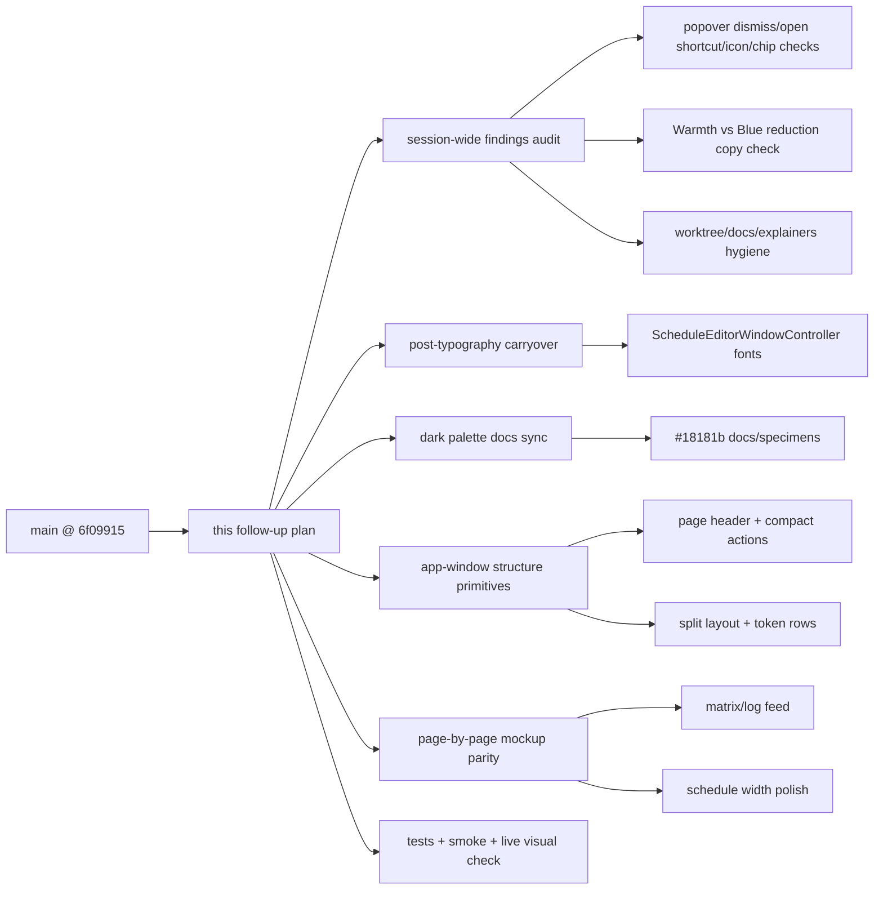

# 2026-06-22 Unimplemented Follow-Up Plan First

후행 실행: `구현커밋`

## Goal

Collect every known unimplemented or partially implemented follow-up item into one execution-ready plan. This plan starts from the updated `main` baseline at commit `6f09915` and covers both post-typography carryover work and the remaining native app-window mockup parity work.

This document also acts as the session-wide findings ledger. Before implementation, the executor must re-check every issue raised in this chat, classify it as implemented, intentionally deferred, or still missing, and either attach it to a commit below or record the exact verification that proves no code change is needed.

## Requested Outcome

- Keep the new work isolated on `codex/2026-06-22-layout-primitives-from-main`.
- Finish post-typography leftovers before new app-window layout work.
- Preserve existing working behavior for dimming, schedule editing, shortcuts, display selection, login item, diagnostics, and safe smoke snapshots.
- Avoid redoing work already merged into `main`.
- Audit every session finding before code changes, including early menu-bar popover behavior, shortcut chip rendering, icon/color requests, and copy drift.
- Include unresolved findings either as implementation work or as explicit final verification gates.
- Split implementation into reviewable commits that `구현커밋` can execute.

## Current Baseline

- Branch: `codex/2026-06-22-layout-primitives-from-main`
- Worktree: `/Users/moonsoo/.config/superpowers/worktrees/InnosDimmer/codex-2026-06-22-layout-primitives-from-main`
- Main baseline: `main` at `6f09915 Clean typography research EOF whitespace`
- Diff from `main`: `0 0`
- Baseline verification:
  - `INNOSDIMMER_SNAPSHOT_DIR=/tmp/InnosDimmerFromMainSnapshots xcodebuild -project InnosDimmer.xcodeproj -scheme InnosDimmer -destination 'platform=macOS' CODE_SIGNING_ALLOWED=NO test -only-testing:InnosDimmerTests/MenuBarStateTests -only-testing:InnosDimmerTests/HotkeyBindingTests`
  - Result: `64 tests`, `0 failures`, `TEST SUCCEEDED`

## Execution Status

Status after `구현커밋` execution on 2026-06-22:

- `58ce71f Use design font tokens in schedule editor shell`
  - Removed remaining direct schedule editor shell `.systemFont(...)` usage in favor of `InnosDesignTokens.Font`.
  - Verified with focused schedule editor shell tests.
- `5b09e51 Sync dark surface docs with production token`
  - Synced dark design docs and specimens from stale `#262626` surface examples to production `#18181b`.
  - Verified token search and contrast calculations.
- `d801009 Add app window layout structure primitives`
  - Added app-window detail page header Back behavior, split-layout structure identifiers, compact action row identifiers, and diagnostics log rows.
  - Added focused structure tests for header Back, split layouts, and diagnostics matrix/log contracts.
- `e4d75bd Polish schedule layout and blue reduction copy`
  - Let schedule editor metric columns expand across available width.
  - Unified user-facing copy around `Blue reduction` while preserving legacy `warmth` storage and decoding identifiers.
  - Verified focused schedule, shortcut, popover, dashboard, and hotkey tests.

Remaining final gate:

- Run the full focused regression suite and safe smoke after this document is committed.
- Record that live native menu-bar visual confirmation remains manual if the app is not inspected interactively in this execution environment.
- Push is skipped unless a remote/upstream appears; `git remote -v` previously returned no configured remote.

## Not In Scope

- Do not reimplement already merged app-window routing.
- Do not re-add `SettingsWindowController`.
- Do not rework popover typography unless a regression is found.
- Do not rename legacy stored identifiers such as `warmthUp`, `warmthDown`, or schedule JSON `warmth`; storage/backward-compatibility names are separate from user-facing copy.
- Do not add schedule row deletion unless the operator explicitly changes the fixed 3-row schedule model.
- Do not push until a remote/upstream exists.
- Do not commit generated `docs/explainers/**` unless they appear again and the operator explicitly chooses to preserve them.
- Do not mutate or mix in the original dirty worktree at `/Users/moonsoo/projects/InnosDimmer`; this plan executes from the main-based worktree above.

## Current Evidence

Confirmed implemented:

- App window home layout has `homeLayoutMetricsForTesting()` and a regression test.
- Unified app window routes Home, Current, Display, Schedule, Shortcuts, Settings, and Diagnostics.
- `SettingsWindowController` is removed and shortcut tests target `UnifiedAppWindowController`.
- `ShortcutAction.openPopover` exists in default bindings and has focused tests.
- Popover outside-click dismissal has helper coverage through `MenuBarController.shouldDismissPopover(...)`.
- Popover blue-reduction quick-control and schedule summary icons use `thermometer.medium` / `🌡`, not the earlier water-drop icon.
- Popover shortcut key chips already split symbols and `+` separators in `ShortcutKeyChipView`.
- Shortcut symbols already use `shortcutToken = 13 / semibold`; `+` separators use `shortcutSeparator = 9 / medium` and tertiary label color.
- Shortcut section `ENABLED` uses the compact badge path while `MANUAL` uses the regular badge path.
- `ScheduleEditorView` now has `Time`, `Bright`, `Blue`, value fields, tracks, and `-` / `+` controls.
- `ScheduleEditorView` metric columns now expand to available panel width instead of fixed `150` cells.
- `InnosDesignTokens.surfaceSubtle` uses production dark token `0x18181b`.
- Dark palette docs and HTML specimens use the production dark surface token `#18181b`.
- Unified app-window detail pages use header Back structure instead of body-first full-width Back.
- Display and Settings detail pages expose split-layout structure identifiers for regression coverage.
- Diagnostics exposes log-row structure plus compact export action instead of relying only on a large raw text area.
- User-facing popover/dashboard/schedule summary copy is standardized on `Blue reduction`; legacy `warmth` identifiers remain only for compatibility or negative tests.
- Safe visual smoke snapshots exist through `scripts/smoke_app_window_snapshot.sh`.

Confirmed still requiring final/manual verification:

- Shortcut summary code chips exist and are covered structurally, but session-specific spacing, row height, plus-sign weight, and symbol readability still need live/capture confirmation.
- Earlier icon work, including no circular icon background, brightness/blue-reduction color swap, and blue-reduction contrast-style icon, needs final visual confirmation against the current native popover.
- Live menu-bar popover outside-click dismissal and global open-popover shortcut behavior are code/test covered, but actual menu-bar runtime confirmation has not been recorded in this execution.
- Remote/upstream is still absent unless final remote checks show otherwise.

## Session-Wide Findings Audit

The following ledger covers the issues raised during this chat. `Status` reflects the codebase recheck on 2026-06-22 in the main-based worktree plus the implementation commits listed above. Final smoke/live checks still govern visual-only items.

| Finding from session | Current evidence | Status | Plan handling | Done when |
| --- | --- | --- | --- | --- |
| Menu-bar popover should dismiss when another app or outside area is clicked. | `MenuBarController.shouldDismissPopover(...)`, `installPopoverDismissMonitor()`, and `testPopoverDismissalHelperTreatsOutsideClicksAsDismissible` exist. | Code/test resolved; live app confirmation remains. | No planned code change unless live app check fails; include in Commit 8 live visual gate. | Live menu-bar check confirms outside click closes popover, or a failing repro becomes a new implementation commit. |
| Add a shortcut to open the popover. | `ShortcutAction.openPopover`, default binding `⌥⇧P`, command routing, and focused tests exist. | Code/test resolved; live/global registration confirmation remains. | No planned code change unless registration/live shortcut check fails; include in Phase 0 and Commit 8 verification. | Default binding and live/global shortcut path are verified. |
| Popover layout should match the provided mockup: quick controls, schedule rows, shortcut section, smaller `MANUAL`/`ENABLED` chips. | Native popover has section structure and compact `ENABLED`; `MANUAL` remains regular badge. | Partially resolved; visual/capture parity still unverified. | Phase 0 must compare current popover code/capture against the session requests; Commit 8 must record live popover visual status. | Visual/capture review says no regression, or missing layout deltas are added to Commit 7 before execution. |
| Blue-reduction icon should not be a water-drop circle and should read as the contrast/warmth icon. | Current popover uses `thermometer.medium` fallback `🌡`, not a water-drop symbol. | Code resolved for icon choice; visual approval remains. | Phase 0 validates whether current icon is the intended final state; Commit 7 or a new popover polish commit handles mismatch. | Icon is visually approved or a specific replacement symbol/token is implemented. |
| Brightness and warmth/blue-reduction icon colors may need to be switched; icons should not sit inside circular backgrounds. | Current popover quick controls pass raw `iconColor`; app-window tile icons still use boxed symbols. | Partially resolved; quick-control/app-window icon scopes must stay separated. | Phase 0 separates popover quick-control icons from app-window navigation tiles; only quick-control icon regressions belong in this plan. | Capture confirms quick-control icon colors/backgrounds match the intended visual language. |
| Shortcut key display should render as code-chip structure, with smaller/lighter `+` and larger symbols. | `ShortcutKeyChipView` splits tokens and plus labels; symbols use `shortcutToken`, plus signs use `shortcutSeparator` and tertiary color. | Code resolved; visual rhythm/fitting confirmation remains. | Commit 7 must preserve the internal token structure; tests should not collapse it back into plain text. | Native capture shows separated symbols/plus signs and no cramped layout. |
| Shortcut row spacing broke after mockup changes; Brightness and Warmth rows need equal vertical rhythm. | `ShortcutPairRowView` uses fixed `rowHeight = 34`, separators, and equal row construction. | Structurally resolved; visual confirmation remains. | Commit 7 includes shortcut row rhythm checks; Phase 0 records whether current native row height is visually acceptable. | Brightness and second row have equal top/bottom rhythm in capture. |
| All app fonts should prefer Pretendard and shortcut symbols should use one step lighter weight after Pretendard migration. | `InnosDesignTokens.Font.app(...)` resolves Pretendard; shortcut token/separator weights are reduced; `ScheduleEditorWindowController.swift` direct `.systemFont(...)` usage was removed in `58ce71f`. | Resolved by execution; shortcut visual confirmation remains. | Commit 1 completed; final gate may still visually inspect shortcut token weight. | No unintended direct `.systemFont` remains in the target shell; shortcut symbols remain readable in Pretendard. |
| Dark card palette should be toned down, with inner rows darker than surrounding cards. | Production `surfaceSubtle` is `#18181b`; docs/specimens were synced to `#18181b` in `5b09e51`. | Resolved by execution; final smoke still checks hierarchy. | Commit 2 completed; final smoke snapshots preserve darker inner rows. | Docs match production token and snapshots retain visible surface hierarchy. |
| `ENABLED` chip should be smaller than `MANUAL`, not globally shrink all chips. | `pillBadge("ENABLED", compact: true)` is present; `MANUAL` uses `BadgePillView` regular path. | Code resolved; visual confirmation remains. | Phase 0 verifies there is no regression; no code change unless capture says otherwise. | Popover capture shows `ENABLED` compact and `MANUAL` unchanged. |
| Existing old plan is stale because `unit-001` through `unit-006` are already mostly implemented. | `main` includes commits through `unit-006`; this new plan starts from `6f09915`. | Resolved by this replacement plan. | Do not execute stale plan documents directly; this document is the new execution source. | `구현커밋` uses this plan, not older mockup-gap plan. |
| Actual remaining app-window problem is detail page structure: header Back, split layouts, token rows, matrix/log rows. | `d801009` added header Back structure, split-layout identifiers, compact action identifiers, and diagnostics log-row structure tests. | Resolved by execution for structural regression coverage; exact visual parity remains smoke/manual. | Commit 3/4/5/6 structure work completed in one implementation commit. | Structure tests fail on body Back/split/log-row regressions; final smoke captures are nonblank. |
| Schedule table uses fixed cell widths and can leave unused horizontal space. | `e4d75bd` replaced fixed `metricCellWidth = 150` with flexible metric cells and equal-width metric columns. | Resolved by execution. | Commit 7 completed. | Schedule rows use available width without clipping in focused tests. |
| Diagnostics page should become matrix card plus log feed while preserving export/raw access. | `d801009` replaced the visible raw text block with log-row structure and kept export as a compact action. | Resolved by execution for native structure; export remains covered by tests/smoke. | Commit 6 completed inside `d801009`. | Diagnostics visual structure changes and export still passes tests. |
| Existing tests are too text-only to catch visual/layout regressions. | `d801009` added structure signals for header Back, split layouts, compact actions, and diagnostics log rows. | Resolved by execution for the targeted regressions; pixel-perfect visual approval remains manual. | Commit 3 completed; Commit 8 final smoke records runtime status. | Tests fail on body Back/split/log-row regressions. |
| App dashboard/window typography and home layout diffs need separate review if not already covered. | Home layout diff was committed before this plan; schedule shell direct font cleanup was completed in `58ce71f`. | Resolved by execution for this plan scope. | Commit 1 completed; broader dashboard/window typography beyond this scope should be a separate plan if desired. | No extra typography drift is pulled into this plan without explicit scope. |
| Generated `docs/explainers/**` should stay untracked this cycle. | `find docs -path '*/explainers/*'` returns no files in this main-based worktree. | Resolved for current worktree; keep final hygiene gate. | Final status gate checks it did not reappear. | Final `git status --short` has no accidental explainers unless intentionally preserved. |
| Original worktree has dirty PNG/docs from earlier tests. | Current main-based worktree status only shows this plan document. | Resolved for current branch isolation; keep final hygiene gate. | Phase 0 and final gate must not mix original dirty files into this branch. | Current worktree status only includes intentional files. |
| Remote/upstream is absent, so push may be skipped. | `git remote -v` returned no configured remote output. | Not resolved; environment/config issue. | Commit 8 reports push readiness and skips push unless upstream exists. | Final report says pushed or skipped because upstream is absent. |

## System Map



## Related Files

- `InnosDimmer/UI/ScheduleEditorWindowController.swift`
- `InnosDimmer/UI/DesignSystem/InnosDesignTokens.swift`
- `InnosDimmer/Domain/ShortcutBinding.swift`
- `InnosDimmer/UI/MenuBarPopoverView.swift`
- `InnosDimmer/UI/ScheduleEditorView.swift`
- `InnosDimmerTests/MenuBarStateTests.swift`
- `InnosDimmerTests/HotkeyBindingTests.swift`
- `docs/design/dark-palette/2026-06-20-dark-palette-plan-first.md`
- `docs/design/dark-palette/artifacts/dark-palette-specimen.html`
- `docs/design/dark-palette/research.md`
- `docs/design/popover-redesign/mockup.html`
- `docs/design/schedule-editing/mockup.html`
- `docs/design/settings-redesign/mockup.html`
- `docs/design/shared-control-system/contract.md`
- `docs/design/shared-control-system/specimen.html`
- `docs/design/window-redesign/app-window-componentized-mockup.html`
- `scripts/smoke_app_window_snapshot.sh`

## Operator 결정 필요 사항

상태: 없음. 기본값으로 진행 가능.

### 결정 1: Schedule remove column

- 맥락: HTML mockup에는 remove-like affordance가 있지만 현재 native schedule editor는 fixed 3-row model이다.
- A: 이번 plan에서 remove column을 추가한다.
- B: fixed 3-row model을 유지하고 width/action polish만 한다.
- C: 별도 schedule model redesign plan으로 분리한다.
- 추천안: B
- 기본값: B
- 보류 시 영향: row deletion은 구현되지 않지만 현재 schedule persistence와 tests를 안정적으로 유지한다.

### 결정 2: Diagnostics raw log copy/select

- 맥락: 현재 Diagnostics는 visible `NSTextView`라 raw log 선택이 쉽고, mockup은 row feed 구조다.
- A: visible UI를 row feed로 바꾸고 export action만 raw path로 유지한다.
- B: row feed와 raw selectable text를 모두 보이게 둔다.
- C: raw selectable text만 유지하고 visual parity를 포기한다.
- 추천안: A
- 기본값: A
- 보류 시 영향: diagnostics export는 유지되지만 화면에서 직접 raw text를 선택하는 편의는 줄 수 있다.

### 결정 3: `UnifiedAppWindowController` extraction timing

- 맥락: app window controller가 `MenuBarPopoverView.swift` 안에 남아 있어 파일이 크다.
- A: layout primitive 도입 전에 controller를 별도 파일로 추출한다.
- B: 이번 plan에서는 같은 파일 안에서 작게 고치고, 구조가 안정화되면 추출한다.
- C: 추출하지 않는다.
- 추천안: B
- 기본값: B
- 보류 시 영향: 파일 크기는 당분간 유지되지만 move-only diff와 UI behavior change가 섞이는 위험을 줄인다.

## Skill Routing Manifest

| Phase | Required skills | Optional skills | Evidence |
| --- | --- | --- | --- |
| Phase 0: Session-wide findings audit gate | `review-all-in-one`, `review-swarm` | `디자인올인원`, `테스트` | This chat contains earlier popover, icon, shortcut chip, copy, worktree, and push-readiness findings that must be classified before implementation. |
| Commit 1: Carry over schedule editor shell typography cleanup | `구현커밋`, `review-all-in-one` | `테스트` | `ScheduleEditorWindowController.swift` still uses `.systemFont(...)`. |
| Commit 2: Sync dark palette docs/specimens to production token | `구현커밋`, `review-all-in-one` | `content-sync-auditor` | Production `surfaceSubtle` is `0x18181b`, docs/specimens still show `#262626`. |
| Commit 3: Add app-window structure tests and layout signals | `구현커밋`, `review-all-in-one` | `review-swarm` | Existing tests mostly assert text; layout regressions can pass. |
| Commit 4: Introduce page header and compact action layout | `구현커밋`, `review-all-in-one` | `디자인올인원` | `makeDetailPage(_:)` inserts a full-width body Back button. |
| Commit 5: Apply split layouts to Display and Settings | `구현커밋`, `review-all-in-one` | `디자인올인원` | Mockup uses detail layouts; native pages are vertical full-width sections. |
| Commit 6: Convert Diagnostics to matrix card and log feed | `구현커밋`, `review-all-in-one` | `review-swarm` | Current Diagnostics uses visible `NSTextView`; mockup uses matrix/log rows. |
| Commit 7: Polish Schedule width, actions, Shortcuts rows, and popover summary checks | `구현커밋`, `review-all-in-one` | `테스트`, `디자인올인원` | `ScheduleEditorView.metricCellWidth = 150`; shortcuts table and popover shortcut chips need token-row and visual-rhythm polish. |
| Commit 8: Final visual verification and push readiness report | `구현커밋`, `테스트` | `computer-use-operator` | Need safe smoke plus live menu-bar popover/app-window visual check, including dismiss/open shortcut/icon/chip verification; remote/upstream absent. |
| Final Gate | `review-all-in-one`, `review-swarm`, `테스트` | `qa-gate` | Ensure no session finding or carryover item is missed and final code remains shippable. |

## Implementation Plan

### Phase 0: Session-wide findings audit gate

- target files:
  - `docs/design/window-redesign/2026-06-22-unimplemented-followup-plan-first.md`
  - `InnosDimmer/UI/MenuBarPopoverView.swift`
  - `InnosDimmer/UI/DesignSystem/InnosDesignTokens.swift`
  - `InnosDimmer/Domain/ShortcutBinding.swift`
  - `InnosDimmerTests/MenuBarStateTests.swift`
  - `InnosDimmerTests/HotkeyBindingTests.swift`
  - `docs/design/**/*.md`
  - `docs/design/**/*.html`
- changes:
  - Re-run the session-wide findings ledger above against current code before implementation.
  - Mark each finding as one of: `implemented`, `needs code change`, `needs visual verification`, `intentionally deferred`, or `not applicable`.
  - If a finding needs code, attach it to Commit 1-8 or add a new small commit heading before implementation starts.
  - Preserve legacy data names while checking user-facing copy separately.
- audit commands:

```bash
rg -n "shouldDismissPopover|openPopover|ShortcutAction|ShortcutBinding|Warmth|Blue reduction|shortcutToken|shortcutSeparator|ShortcutKeyChipView|MANUAL|ENABLED|surfaceSubtle|#262626|#18181b|systemFont" InnosDimmer InnosDimmerTests docs/design -g'*.swift' -g'*.md' -g'*.html'
git status --short
git remote -v
```

- code snippet: no production code change in this phase. If the audit exposes a gap, add it to a later commit first.
- verification:
  - The ledger has no `unknown` or unassigned item.
  - Any popover item not changed in code has an explicit Commit 8 visual check.
  - Any copy mismatch has a reason: user-facing inconsistency, legacy compatibility, or intentional docs-only artifact.
- success criteria:
  - The executor can start Commit 1 without relying on memory of the chat.
  - Older stale plans are not used as execution sources.
- stop conditions:
  - A session finding affects behavior but cannot be proven implemented or assigned to a commit.
  - A finding requires an operator design decision that this plan currently treats as safe default.

### Commit 1: Carry over schedule editor shell typography cleanup

- target files:
  - `InnosDimmer/UI/ScheduleEditorWindowController.swift`
  - `InnosDimmerTests/MenuBarStateTests.swift`
- changes:
  - Replace direct `.systemFont(...)` in the shell controller with `InnosDesignTokens.Font` equivalents.
  - Set save/close button font to the shared button token if needed.
  - Keep `ScheduleEditorView` behavior unchanged.
- code snippet:

```swift
title.font = InnosDesignTokens.Font.app(ofSize: 20, weight: .bold)
subtitle.font = InnosDesignTokens.Font.app(ofSize: 13)
statusLabel.font = InnosDesignTokens.Font.app(ofSize: 12)
titleLabel.font = InnosDesignTokens.Font.app(ofSize: 12, weight: .semibold)
```

- verification:
  - `rg -n "systemFont|NSFont\\.systemFont" InnosDimmer/UI/ScheduleEditorWindowController.swift` returns no direct shell font usage.
  - `xcodebuild ... -only-testing:InnosDimmerTests/MenuBarStateTests/testScheduleEditorWindowShellShowsCurrentSchedule -only-testing:InnosDimmerTests/MenuBarStateTests/testScheduleEditorWindowSaveUsesInjectedScheduleAction`
- success criteria:
  - Schedule editor shell still opens and saves.
  - No behavior change to schedule parsing or persistence.
- stop conditions:
  - Button sizing regresses or schedule editor tests fail.

### Commit 2: Sync dark palette docs/specimens to production token

- target files:
  - `docs/design/dark-palette/2026-06-20-dark-palette-plan-first.md`
  - `docs/design/dark-palette/artifacts/dark-palette-specimen.html`
  - `docs/design/dark-palette/research.md`
  - `docs/design/popover-redesign/mockup.html`
  - `docs/design/schedule-editing/mockup.html`
  - `docs/design/settings-redesign/mockup.html`
  - `docs/design/shared-control-system/contract.md`
  - `docs/design/shared-control-system/specimen.html`
  - `docs/design/window-redesign/app-window-componentized-mockup.html`
- changes:
  - Align `surfaceSubtle`, `--panel-2`, and `--surface-subtle` dark token references with production `#18181b`.
  - Preserve `#262626` only if a file clearly uses it for another semantic role; otherwise replace or document the role change.
- code snippet:

```css
--panel-2: #18181b;
--surface-subtle: #18181b;
```

- verification:
  - `rg -n "#262626|#18181b|surfaceSubtle|panel-2|surface-subtle" <target docs>`
  - Visual review of existing HTML mock/specimen files in browser.
- success criteria:
  - Docs/specimens no longer contradict `InnosDesignTokens.surfaceSubtle`.
  - No production Swift token is changed in this commit.
- stop conditions:
  - A document intentionally defines `#262626` as a different semantic and needs a separate token name.

### Commit 3: Add app-window structure tests and layout signals

- target files:
  - `InnosDimmer/UI/MenuBarPopoverView.swift`
  - `InnosDimmerTests/MenuBarStateTests.swift`
- changes:
  - Add narrow testing hooks for page structure, not pixel-perfect layout.
  - Capture whether a page uses body Back, header Back, split layout, compact actions, diagnostics log rows, and schedule useful width.
  - Keep existing text acceptance tests.
- proposed API shape:

```swift
struct AppWindowPageStructure {
    var hasHeaderBackControl: Bool
    var hasBodyBackRow: Bool
    var usesSplitLayout: Bool
    var compactActionLabels: [String]
    var diagnosticsLogRowCount: Int
}
```

- verification:
  - Focused `MenuBarStateTests` for structure signals.
  - Existing page text tests still pass.
- success criteria:
  - Tests can fail on full-width body Back regression.
  - Tests can detect split-layout and diagnostics-row adoption.
- stop conditions:
  - Test hooks become too coupled to private AppKit implementation details without useful regression value.

### Commit 4: Introduce page header and compact action layout

- target files:
  - `InnosDimmer/UI/MenuBarPopoverView.swift`
  - `InnosDimmerTests/MenuBarStateTests.swift`
- changes:
  - Replace body-width `← Back` row with a page header Back control.
  - Introduce compact page action placement for actions such as `Refresh displays`, `Save schedule`, `Save shortcuts`, `Apply settings`, and `Export diagnostics`.
  - Preserve command targets and selectors.
- proposed implementation shape:

```swift
private func makeDetailPage(
    title: String,
    trailingActions: [NSView] = [],
    content: [NSView]
) -> NSView
```

- verification:
  - Structure tests assert `hasHeaderBackControl == true` and `hasBodyBackRow == false`.
  - Existing routing/action tests pass.
- success criteria:
  - Back/action placement matches the mockup structure more closely.
  - No command routing behavior changes.
- stop conditions:
  - Accessibility order or keyboard activation regresses.

### Commit 5: Apply split layouts to Display and Settings

- target files:
  - `InnosDimmer/UI/MenuBarPopoverView.swift`
  - `InnosDimmerTests/MenuBarStateTests.swift`
- changes:
  - Add a reusable split layout helper.
  - Convert Display to left current-state panel plus right target/saved selection stack.
  - Convert Settings to left startup/login state plus right saved-settings/status stack.
- proposed implementation shape:

```swift
private func makeDetailSplit(primary: NSView, secondary: NSView) -> NSView
```

- verification:
  - Display and Settings structure tests assert split layout presence.
  - `testUnifiedAppWindowRoutesDisplaySelectionThroughSettingsAction`
  - `testUnifiedAppWindowTogglesLaunchAtLoginThroughSettingsAction`
- success criteria:
  - Display/Settings stop reading like long full-width forms.
  - Existing actions still invoke `SettingsActions`.
- stop conditions:
  - Minimum window width causes clipping or compressed controls.

### Commit 6: Convert Diagnostics to matrix card and log feed

- target files:
  - `InnosDimmer/UI/MenuBarPopoverView.swift`
  - `InnosDimmerTests/MenuBarStateTests.swift`
- changes:
  - Replace the visible large diagnostics `NSTextView` with matrix card and log feed rows.
  - Keep `Export diagnostics` through `SettingsActions.exportDiagnostics`.
  - Optionally keep raw diagnostics text as an export/copy data path, not the primary visible layout.
- proposed implementation shape:

```swift
private func makeDiagnosticsMatrixCard() -> NSView
private func makeDiagnosticsLogRow(_ event: DiagnosticsEvent) -> NSView
```

- verification:
  - Diagnostics structure test asserts matrix card and log row count.
  - `testUnifiedAppWindowExportsDiagnosticsThroughSettingsAction`
  - safe visual smoke snapshots.
- success criteria:
  - Diagnostics page matches matrix/log-feed intent.
  - Export still works.
- stop conditions:
  - Raw diagnostics become inaccessible with no export/copy alternative.

### Commit 7: Polish Schedule width, actions, Shortcuts rows, and popover summary checks

- target files:
  - `InnosDimmer/UI/ScheduleEditorView.swift`
  - `InnosDimmer/UI/MenuBarPopoverView.swift`
  - `InnosDimmerTests/MenuBarStateTests.swift`
- changes:
  - Let Bright and Blue metric cells use available width instead of fixed `150` width.
  - Keep fixed 3-row schedule model.
  - Move Schedule actions into compact action placement.
  - Wrap Shortcuts rows in token-row-like containers while preserving existing checkbox/key-field behavior.
  - Verify popover shortcut summary rows keep the code-chip internal structure: separated symbols, smaller/lighter plus signs, equal row rhythm, and compact `ENABLED`.
  - Audit user-facing `Warmth` versus `Blue reduction` copy in popover summary, quick controls, docs, and tests. Preserve legacy storage names but do not leave accidental mixed vocabulary.
  - If Phase 0 finds quick-control icon/color regressions, scope the fix here only when it is a small popover polish; otherwise split a new commit before final verification.
- proposed schedule layout direction:

```swift
stack.alignment = .width
stack.trailingAnchor.constraint(equalTo: trailingAnchor).isActive = true
```

- verification:
  - Schedule editor tests:
    - `testScheduleEditorViewReturnsSortedEditedSchedule`
    - `testScheduleEditorViewTableControlsSynchronizeValues`
    - `testUnifiedAppWindowSavesTableScheduleThroughInjectedAction`
  - Shortcuts tests:
    - `testUnifiedAppWindowSavesShortcutsThroughSettingsAction`
    - `HotkeyBindingTests`
  - Popover visual/test audit:
    - `testMenuBarPopoverUpdateRefreshesVisibleStateAndDiagnostics`
    - focused search for user-facing `Warmth` / `Blue reduction`
    - capture or live check for shortcut chip rhythm
- success criteria:
  - Schedule rows fill useful horizontal panel space.
  - Shortcut editing behavior is unchanged.
  - Popover shortcut summary remains readable and does not collapse back into plain text.
  - Copy vocabulary is intentional and documented by tests or comments.
- stop conditions:
  - Schedule fields clip or row editing becomes unstable.
  - Popover copy/icon changes create ambiguity with legacy decoding or saved data.

### Commit 8: Final visual verification and push readiness report

- target files:
  - `scripts/smoke_app_window_snapshot.sh`
  - optional docs note under `docs/design/window-redesign/`
- changes:
  - Run safe visual smoke.
  - Record whether live menu-bar popover and app window were visually checked.
  - Verify menu-bar popover outside-click dismissal and open-popover shortcut behavior in the actual app when feasible.
  - Verify popover shortcut code-chip visual structure, `MANUAL` / compact `ENABLED` chip sizing, quick-control icons, and no unwanted circular icon backgrounds.
  - Verify no accidental generated `docs/explainers/**` files or original-worktree dirty captures were pulled into this branch.
  - Check remote/upstream status and report push readiness.
  - Do not push unless remote/upstream exists.
- verification:
  - `scripts/smoke_app_window_snapshot.sh`
  - focused app-window tests
  - optional live app visual inspection through manual or Computer Use safety gate
  - `rg -n "Warmth|Blue reduction|warmthUp|warmthDown" InnosDimmer InnosDimmerTests docs/design -g'*.swift' -g'*.md' -g'*.html'`
  - `git remote -v`
  - `git rev-parse --abbrev-ref --symbolic-full-name @{u}`
  - `git status --short`
- success criteria:
  - Seven safe app-window snapshots are nonblank.
  - Manual/live visual check is recorded or explicitly deferred with reason for every session-wide popover finding.
  - Current worktree status contains only intentional final files.
  - Push is either completed or skipped because remote/upstream is absent.
- stop conditions:
  - Safe smoke fails.
  - Live visual check reveals popover or app-window regressions.

## Plan Quality Check

- Alternative considered: execute only app-window layout work.
  - Rejected because post-typography carryover and earlier menu-bar popover findings would remain untracked.
- Alternative considered: treat early popover requests as already solved and leave them out.
  - Rejected because some items are likely implemented but still need live/capture verification, especially shortcut chips, icon treatment, outside-click dismiss, and open-popover shortcut behavior.
- Alternative considered: include generated `docs/explainers/**` packaging.
  - Rejected for now because current worktree has no tracked or untracked `docs/explainers` files.
- Alternative considered: extract `UnifiedAppWindowController` before visual work.
  - Rejected for this plan because it would mix move-only diff with layout behavior changes.
- Why this plan:
  - It starts with a session-wide audit gate, then small carryover fixes, then tests before visible layout changes.
- Tradeoff:
  - The controller remains in `MenuBarPopoverView.swift` for this pass. This preserves reviewability of visible changes but keeps the file large.
- What this plan may still miss:
  - Pixel-perfect parity against the HTML mockup.
  - Live menu bar state differences not captured by safe smoke snapshots.
  - Historical user intent where a visual request was later superseded by another mockup direction. Phase 0 should resolve this by checking current code and current screenshots, not by replaying every old request literally.
- When to stop and revise:
  - If Phase 0 finds a session issue that requires a new design decision rather than a safe default.
  - If app-window structure tests become brittle.
  - If schedule width changes cause clipping.
  - If Diagnostics row feed removes necessary debug affordances.

## 검토용 결과물

- 계획 MD:
  - `docs/design/window-redesign/2026-06-22-unimplemented-followup-plan-first.md`
- Existing HTML target:
  - `docs/design/window-redesign/app-window-componentized-mockup.html`
- Existing audit artifact:
  - `docs/design/window-redesign/mockup-gap-audit/artifacts/mockup-gap-audit.html`
- 테스트 링크:
  - Localhost: 해당 없음. Native macOS AppKit app이다.
  - Native safe smoke command: `scripts/smoke_app_window_snapshot.sh`
  - Deploy: 해당 없음.
- 상태:
  - planned; Phase 0 audit required before implementation commits.

## HTML 생략 보고서

- 판정: 새 HTML은 생략.
- 생략 사유:
  - 이번 계획은 새로운 디자인 방향 생성이 아니라 기존 HTML mockup을 native AppKit에 반영하는 implementation plan이다.
  - 이미 `app-window-componentized-mockup.html`과 mockup-gap audit artifact가 검토 기준으로 존재한다.
- 대체 검토물:
  - existing HTML mockup
  - safe smoke snapshots
  - app-window structure tests
  - Phase 0 session-wide findings ledger

## 구현 후 검토 리스트

- 회귀 확인:
  - Dimming commands still route through `MenuBarActions`.
  - Display selection still routes through `SettingsActions.selectDisplay`.
  - Schedule save still routes through `ScheduleEditorActions.updateSchedule`.
  - Shortcut save/reset and validation still work.
  - Diagnostics export still works.
- 검증 확인:
  - Phase 0 ledger has no unassigned finding.
  - `git diff --check`
  - Focused `MenuBarStateTests`
  - `HotkeyBindingTests`
  - `scripts/smoke_app_window_snapshot.sh`
  - Live visual check if possible.
  - `git status --short` confirms no accidental original-worktree files, generated explainers, or unrelated dirty files.
- 리뷰 관점:
  - Avoid text-only acceptance tests.
  - Avoid making `MenuBarPopoverView.swift` worse with repeated one-off layouts.
  - Ensure docs tokens and production tokens stay synchronized.
  - Ensure shortcut chip internals do not regress to cramped plain text.
  - Ensure user-facing copy drift is intentional and legacy storage names are not broken.
- Operator 재확인:
  - Decide only if schedule row deletion or raw diagnostics copy UI becomes required.
  - Decide only if Phase 0 finds that `Warmth` versus `Blue reduction` is a product-language choice that cannot be resolved from current code/tests.
