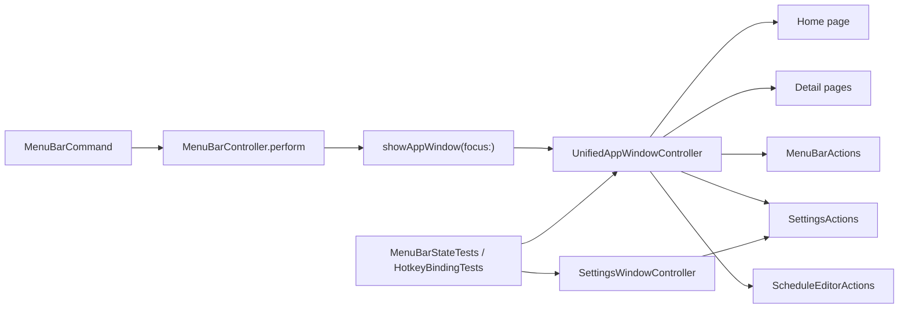

# 2026-06-22 Mockup Gap Repair Plan

## Goal

Bring the real native `InnosDimmer` app window closer to `docs/design/window-redesign/app-window-componentized-mockup.html` without again claiming completion from tests that only prove routing or basic functionality.

## Requested Outcome

- Convert the current gap audit into an implementation-ready plan.
- Preserve working dimming, schedule, shortcut, display, login item, and diagnostics behavior.
- Prioritize the pages that are most visibly different from the mockup.
- Keep `SettingsWindowController` deletion behind a feature-parity/test gate.
- Add verification that can catch visual or layout regressions, not only command routing.

## Codebase Evidence

- `Confirmed`:
  - `MenuBarController.showAppWindow(focus:)` creates `UnifiedAppWindowController`.
  - `UnifiedAppWindowController` currently owns Home, Current status, Display, Schedule, Shortcuts, Settings, and Diagnostics pages.
  - Full test suite passed on 2026-06-22: 135 tests, 0 failures.
  - Live screenshot smoke was blocked by software dimming: `/tmp/innos-gap-actual-home.png` was black.
  - `SettingsWindowController` still exists and is directly tested by `SettingsWindowShortcutCustomizationTests`.
- `Inferred`:
  - The real app is roughly 50% aligned with the mockup overall.
  - Home is no longer the biggest issue; Schedule and detail pages are.
  - Visual completion needs a safe no-dimming verification path.
- `Unverified`:
  - Exact pixel-level native-vs-HTML parity is not measured.
  - Actual detail-page screenshots are not reliable until the dimming overlay issue is controlled.

## System Visualization



- changed nodes:
  - `UnifiedAppWindowController`
  - `ScheduleEditorView` or a new schedule table editor
  - `MenuBarStateTests`
  - `HotkeyBindingTests`
- preserved nodes:
  - `MenuBarActions`
  - `SettingsActions`
  - `ScheduleEditorActions`
  - `SettingsSnapshot`
- diagram notes:
  - The active route is already unified, but test ownership still proves the old settings window cannot be removed yet.

## Related Files

- `InnosDimmer/UI/MenuBarController.swift`: active route owner.
- `InnosDimmer/UI/MenuBarPopoverView.swift`: current home/detail page implementation.
- `InnosDimmer/UI/ScheduleEditorView.swift`: current text-only schedule editor.
- `InnosDimmer/UI/SettingsWindowController.swift`: legacy settings window and helper ownership.
- `InnosDimmerTests/MenuBarStateTests.swift`: unified window behavior tests.
- `InnosDimmerTests/HotkeyBindingTests.swift`: old settings window shortcut tests.
- `docs/design/window-redesign/app-window-componentized-mockup.html`: target mockup.
- `docs/design/window-redesign/mockup-gap-audit/research.md`: evidence basis.
- `docs/design/window-redesign/mockup-gap-audit/artifacts/mockup-gap-audit.html`: review artifact.

## Current Behavior

The app window has the right top-level pages, but the detail pages are still simplified native sections. The biggest mismatch is the Schedule page: the mockup shows a table-like editor with values, sliders, adjacent steppers, and remove controls, while the actual code uses `ScheduleEditorView`, a narrow text-field row editor.

The old settings window is still compiled and tested. The runtime mostly routes into the unified window, but deletion is not safe until shortcut helpers/tests migrate.

## Change Map

- likely files to edit:
  - `InnosDimmer/UI/MenuBarPopoverView.swift`
  - `InnosDimmer/UI/ScheduleEditorView.swift`
  - `InnosDimmer/UI/SettingsWindowController.swift`
  - `InnosDimmerTests/MenuBarStateTests.swift`
  - `InnosDimmerTests/HotkeyBindingTests.swift`
- likely functions/components/hooks/stores/routes to touch:
  - `UnifiedAppWindowController.makeCurrentPage()`
  - `UnifiedAppWindowController.makeDisplayPage()`
  - `UnifiedAppWindowController.makeSchedulePage()`
  - `UnifiedAppWindowController.makeSettingsPage()`
  - `UnifiedAppWindowController.makeDiagnosticsPage()`
  - `ScheduleEditorView.installContent()`
  - `ScheduleEditorView.editedSchedule()`
  - shortcut test hooks migrated from `SettingsWindowController`
- state/data/content dependencies:
  - `BrightnessState`
  - `ScheduleEntry`
  - `ShortcutBinding`
  - `SettingsSnapshot`
  - `DisplayIdentity`
  - `LoginItemStatus`
  - `DiagnosticsEvent`
- side effects/integrations to preserve or adjust:
  - software dimming commands
  - schedule persistence
  - shortcut persistence and validation
  - display target persistence
  - login item toggle
  - diagnostics export
- likely new files:
  - optional `InnosDimmer/UI/AppWindowScheduleTableView.swift`
  - optional `InnosDimmer/UI/AppWindowPageComponents.swift`
- remaining narrow unknowns before patch:
  - whether to rename/extract `UnifiedAppWindowController` now or after page parity.
  - whether native visual verification should be snapshot tests, live screenshots with dimming disabled, or both.

## Planned Changes

- Normalize the mockup target vocabulary from `Warmth` to `Blue` or `Blue reduction`.
- Make Current status a read-only detail page instead of duplicating quick controls.
- Replace the Schedule page editor with a table-style editor that matches the mockup interaction pattern.
- Flesh out Display, Settings, and Diagnostics pages to match the mockup's information structure.
- Migrate old settings-window shortcut test coverage to the unified window.
- Add a safe visual smoke path so screenshots are not blocked by the dimming overlay.
- Retire `SettingsWindowController` only after tests prove feature parity.

## Review Notes

- risks:
  - Schedule editor replacement can break schedule parsing/sorting validation.
  - Shortcut migration can regress human-readable key labels and invalid key errors.
  - Visual tests can be flaky if they depend on live screen dimming state.
- assumptions:
  - User wants the unified app window to replace the separate settings window eventually.
  - Home is acceptable as a base after the recent card/layout fix, but still needs final visual QA.
- unanswered questions:
  - Final compact label should be `Blue` or `Blue reduction`; plan default is `Blue` in table headers and `Blue reduction` in labels/tooltips.

## Plan Quality Check

- Alternative considered: delete `SettingsWindowController` immediately.
  - Rejected because `HotkeyBindingTests` still instantiate it and it still protects shortcut behavior.
- Alternative considered: keep patching all UI inside `MenuBarPopoverView.swift`.
  - Acceptable for one more narrow page pass, but risky for full redesign because the file already owns popover and app window code.
- Why this plan:
  - It targets the largest visible gaps first and keeps old behavior until parity is test-proven.
- Tradeoff:
  - Chosen: progressive page parity, then deletion.
  - Cost: more commits and temporary duplicate code.
  - Benefit: avoids losing working settings behavior.
- What this plan may still miss:
  - Pixel-level visual polish needs a later screenshot/snapshot comparison gate.
- When to stop and revise:
  - Stop if schedule table replacement requires changing `ScheduleEntry` semantics.
  - Stop if deleting `SettingsWindowController` forces broad unrelated project-file churn before tests migrate.
  - Stop if visual smoke remains black after a safe launch/no-dimming strategy is added.

## Skill Routing Manifest

| Phase | Required skills | Optional skills | Evidence |
| --- | --- | --- | --- |
| Commit 1: Normalize target vocabulary and detail-page acceptance tests | `구현커밋` | `review-all-in-one` | Mockup still contains `Warmth`; tests must define page expectations before UI work. |
| Commit 2: Rebuild Current status and Display detail pages | `구현커밋` | `review-all-in-one` | `makeCurrentPage()` and `makeDisplayPage()` are thinner than mockup. |
| Commit 3: Replace Schedule page with table editor | `구현커밋` | `review-all-in-one`, `테스트` | Largest gap: current `ScheduleEditorView` is text-only. |
| Commit 4: Finish Shortcuts, Settings, and Diagnostics parity | `구현커밋` | `review-all-in-one` | Functional coverage exists, but visual/information structure is not aligned. |
| Commit 5: Migrate legacy settings tests and retire old settings window route/code | `구현커밋` | `review-all-in-one`, `review-swarm` | `SettingsWindowController` is still directly tested. |
| Commit 6: Add safe visual smoke verification | `구현커밋` | `테스트`, `review-all-in-one` | Live app screenshot produced black capture under software dimming. |
| Final Gate | `review-all-in-one`, `테스트` | `review-swarm` | Must prove tests, smoke, and visual target coverage before claiming completion. |

## Implementation Plan

### Commit 1: Normalize target vocabulary and detail-page acceptance tests

- target files:
  - `docs/design/window-redesign/app-window-componentized-mockup.html`
  - `InnosDimmerTests/MenuBarStateTests.swift`
- changes:
  - Replace visible `Warmth` schedule table copy with `Blue` or `Blue reduction`.
  - Add focused test hooks for current/display/schedule/settings/diagnostics page layout primitives.
  - Do not change production behavior yet except target-copy normalization if the mockup is tracked.
- code snippets:
  - Proposed test shape:

```swift
let metrics = try XCTUnwrap(controller.pageLayoutMetricsForTesting(.schedule))
XCTAssertTrue(metrics.containsScheduleTable)
XCTAssertTrue(metrics.hasPrimarySaveAction)
```

- tradeoff:
  - chosen: test target shape before rebuilding pages.
  - alternative: directly patch UI and inspect manually.
  - cost/risk: tests may need temporary hooks.
  - why acceptable: prevents another "tests pass but UI is wrong" outcome.
  - revisit when: hooks become too implementation-specific.
- verification:
  - `xcodebuild -scheme InnosDimmer -configuration Debug build-for-testing CODE_SIGNING_ALLOWED=NO`: compiles tests.
  - `xcodebuild -scheme InnosDimmer -configuration Debug test-without-building -only-testing:InnosDimmerTests/MenuBarStateTests CODE_SIGNING_ALLOWED=NO`: page tests fail before implementation or pass after each commit.
- success criteria:
  - Mockup vocabulary no longer conflicts with app vocabulary.
  - Tests describe the missing target surfaces.
- stop conditions:
  - If the mockup file has user edits that should not be overwritten, stop and ask before changing it.

### Commit 2: Rebuild Current status and Display detail pages

- target files:
  - `InnosDimmer/UI/MenuBarPopoverView.swift`
  - optional `InnosDimmer/UI/AppWindowPageComponents.swift`
  - `InnosDimmerTests/MenuBarStateTests.swift`
- changes:
  - Remove duplicated quick controls from Current status.
  - Build read-only snapshot rows and command/status sections according to the mockup.
  - Expand Display page to include current state, selected display, resolved display, and save/use-automatic actions.
- code snippets:
  - Proposed shape:

```swift
private func makeCurrentPage() -> NSView {
    makeDetailPage([
        makeSection(title: "Snapshot lines", trailing: makeChip("Live", tone: .neutral), views: snapshotRows()),
        makeSection(title: "Commands", views: currentCommandRow())
    ])
}
```

- tradeoff:
  - chosen: keep native AppKit sections, not embed WebView/HTML.
  - alternative: render HTML mock in a WebView.
  - cost/risk: manual AppKit layout work.
  - why acceptable: preserves native controls and existing action boundaries.
  - revisit when: AppKit layout becomes too large for `MenuBarPopoverView.swift`.
- verification:
  - Page layout tests for Current and Display.
  - Full `MenuBarStateTests`.
- success criteria:
  - Current page no longer duplicates home quick controls.
  - Display page has save/automatic behavior and richer state summary.
- stop conditions:
  - If display save behavior duplicates or bypasses `SettingsActions.selectDisplay`.

### Commit 3: Replace Schedule page with table editor

- target files:
  - `InnosDimmer/UI/ScheduleEditorView.swift`
  - optional `InnosDimmer/UI/AppWindowScheduleTableView.swift`
  - `InnosDimmer/UI/MenuBarPopoverView.swift`
  - `InnosDimmerTests/MenuBarStateTests.swift`
- changes:
  - Implement table rows with columns Time, Bright, Blue.
  - Each Bright/Blue cell has a text value, slider track, and adjacent `-`/`+` stepper.
  - Preserve `editedSchedule()` sorting and validation behavior.
  - Move Pause/Resume and Save schedule to the bottom action row.
- code snippets:
  - Proposed row model:

```swift
private struct ScheduleTableRowControls {
    let time: NSTextField
    let brightnessValue: NSTextField
    let brightnessTrack: ProgressTrackView
    let blueValue: NSTextField
    let blueTrack: ProgressTrackView
}
```

- tradeoff:
  - chosen: extend/replace native schedule editor.
  - alternative: keep text fields and only restyle lightly.
  - cost/risk: more AppKit controls and validation paths.
  - why acceptable: schedule is the largest blocker gap.
  - revisit when: row editing starts duplicating schedule parsing logic.
- verification:
  - Existing schedule tests still pass.
  - New tests for stepper changes, slider changes, text parsing, invalid values, and save action.
- success criteria:
  - Schedule page visually and behaviorally matches the table concept.
  - `ScheduleEditorView.editedSchedule()` semantics remain intact.
- stop conditions:
  - If live slider changes unexpectedly apply schedule before save.

### Commit 4: Finish Shortcuts, Settings, and Diagnostics parity

- target files:
  - `InnosDimmer/UI/MenuBarPopoverView.swift`
  - optional page component files
  - `InnosDimmerTests/MenuBarStateTests.swift`
- changes:
  - Make Shortcuts rows align visually with the mockup token rows while preserving checkbox/key editing.
  - Make Settings page show launch-at-login, saved settings, and status feedback more clearly.
  - Make Diagnostics page use a matrix overview and log feed layout.
- code snippets:
  - Proposed diagnostics summary:

```swift
makeSection(title: "Verification matrix", views: [
    makeMatrixOverview(VerificationMatrix.defaultRows),
    makeMatrixRows(VerificationMatrix.defaultRows)
])
```

- tradeoff:
  - chosen: improve page parity while keeping existing actions.
  - alternative: postpone all detail page polish.
  - cost/risk: more layout code.
  - why acceptable: otherwise the app remains visually far from the mockup.
  - revisit when: page components should be extracted before more code is added.
- verification:
  - Shortcut save/reset tests.
  - Login item toggle test.
  - Diagnostics export test.
- success criteria:
  - All detail pages expose the mockup-level information structure.
- stop conditions:
  - If visual changes break existing functional tests.

### Commit 5: Migrate legacy settings tests and retire old settings window route/code

- target files:
  - `InnosDimmer/UI/SettingsWindowController.swift`
  - `InnosDimmer/UI/MenuBarPopoverView.swift`
  - `InnosDimmerTests/HotkeyBindingTests.swift`
  - `InnosDimmerTests/MenuBarStateTests.swift`
  - Xcode project file if physical deletion is required.
- changes:
  - Move remaining `SettingsWindowShortcutCustomizationTests` coverage to `UnifiedAppWindowController`.
  - Extract any reusable helper types before deleting the old file.
  - Delete `SettingsWindowController` only when `rg -n "SettingsWindowController" InnosDimmer InnosDimmerTests` has no required references.
- code snippets:
  - Proposed migration assertion:

```swift
let controller = UnifiedAppWindowController(settingsActions: actions)
controller.focus(.shortcuts)
controller.setShortcutKeyStringForTesting(action: .brightnessUp, keyCode: "R")
XCTAssertEqual(savedShortcuts?.first { $0.action == .brightnessUp }?.keyCode, 15)
```

- tradeoff:
  - chosen: deletion after parity.
  - alternative: delete now and patch compile errors.
  - cost/risk: slower, but safer.
  - why acceptable: prevents settings functionality loss.
  - revisit when: all tests have migrated but file deletion requires unrelated project surgery.
- verification:
  - `rg -n "SettingsWindowController|settingsWindowController" InnosDimmer InnosDimmerTests`
  - Full test suite.
- success criteria:
  - No production or test dependency on the old settings window remains.
- stop conditions:
  - If deletion requires broad unrelated Xcode project restructuring.

### Commit 6: Add safe visual smoke verification

- target files:
  - `InnosDimmerTests/MenuBarStateTests.swift`
  - optional test helper or script under `scripts/` if repo convention allows
  - docs test instructions
- changes:
  - Add a deterministic way to verify app window layout without being blacked out by dimming.
  - Prefer native view-level layout/snapshot assertions first.
  - If live screenshots are used, ensure brightness 100 / blue 0 or a no-dimming launch path.
- code snippets:
  - Proposed helper concept:

```swift
func renderAppWindowForTesting(page: UnifiedAppWindowPage) -> NSImage {
    let controller = UnifiedAppWindowController()
    controller.focus(AppDashboardFocusTarget(page))
    controller.window?.contentView?.layoutSubtreeIfNeeded()
    return controller.window!.contentView!.bitmapImage()
}
```

- tradeoff:
  - chosen: test-owned view rendering over live screen capture when possible.
  - alternative: rely only on `screencapture`.
  - cost/risk: snapshot helper needs care to avoid flakiness.
  - why acceptable: live dimming already broke smoke capture.
  - revisit when: snapshot image tests are too brittle across macOS appearances.
- verification:
  - A smoke command that produces a nonblank window artifact.
  - Full tests after helper lands.
- success criteria:
  - Future "완료" claims have a visual artifact or native layout proof.
- stop conditions:
  - If the helper requires private APIs or brittle screen permissions.

## Operator 결정 필요 사항

- 상태: 보류됨
- 결정 1: Schedule table compact label
  - 맥락: mockup currently says `Warmth`, but app product language is blue reduction.
  - A: `Blue` as compact table header; detailed labels/tooltips say `Blue reduction`.
  - B: `Blue reduction` everywhere; clearer but may be wide in table cells.
  - C: keep `Warmth`; conflicts with product direction.
  - 추천안: A. Compact and consistent with blue-reduction goal.
  - 기본값: A.
  - 보류 시 영향: Implementation can proceed with A and revise copy later if visual width is poor.
- 결정 2: Controller extraction timing
  - 맥락: app-window code is currently inside `MenuBarPopoverView.swift`.
  - A: Extract before major detail-page work.
  - B: Patch in place for one more implementation unit, extract after parity.
  - C: Never extract.
  - 추천안: B for this plan. It avoids a huge structural diff before the page gaps are closed.
  - 기본값: B.
  - 보류 시 영향: File remains large temporarily, but implementation can move faster.

## 검토용 결과물

- HTML: [Mockup gap audit](artifacts/mockup-gap-audit.html)
- 테스트 링크:
  - Localhost: 해당 없음. This is a static HTML artifact and native macOS app audit.
  - Deploy: 해당 없음. No deploy requested or performed.
- 상태: implemented
- 실제 동작:
  - HTML artifact has filter buttons for All, Blocker, Important, Minor.
  - Research document records tests, smoke result, and code evidence.
- Mock:
  - Percent match values are audit estimates, not pixel measurements.

## 후행 실행

- 기본 실행: 구현커밋
- 계획 경로 처리: 구현커밋이 직전 대화, 계획 링크, active plan context에서 자동 탐지
- 모호할 때: 후보 목록을 보여주고 Operator에게 선택 요청

## HTML 생략 보고서

- 판정: 생략하지 않음
- 생략 사유:
  - 해당 없음
- 대체 검토물:
  - `docs/design/window-redesign/mockup-gap-audit/artifacts/mockup-gap-audit.html`
- 테스트 링크:
  - Localhost: 해당 없음
  - Deploy: 해당 없음
- 사용자가 바로 열어볼 링크:
  - [Mockup gap audit](artifacts/mockup-gap-audit.html)

## 구현 후 검토 리스트

- 회귀 확인:
  - quick dimming buttons still route through `MenuBarActions`.
  - schedule save preserves sorted entries and validation errors.
  - shortcut save preserves human-readable key mapping and invalid-key errors.
  - display selection persists through `SettingsActions.selectDisplay`.
  - login item toggle and diagnostics export still work.
- 검증 확인:
  - Full `xcodebuild` suite.
  - Page-specific layout tests.
  - Safe visual smoke artifact that is not black.
- 리뷰 관점:
  - `review-all-in-one`: implementation claims vs actual changed surface.
  - `review-swarm`: deletion safety, routing ambiguity, regression surface.
  - `테스트`: smoke-safe native app handoff.
- Operator 재확인:
  - Open the app window and inspect Schedule first.
  - Confirm `Blue` vs `Blue reduction` table copy.
  - Confirm old Settings window no longer appears after retirement commit.

## Validation

- manual checks:
  - Open [Mockup gap audit](artifacts/mockup-gap-audit.html).
  - Use the filter buttons and confirm blocker cards isolate Schedule and settings-window retirement.
- lint/build/test scope:
  - `xcodebuild -scheme InnosDimmer -configuration Debug build-for-testing CODE_SIGNING_ALLOWED=NO`
  - `xcodebuild -scheme InnosDimmer -configuration Debug test-without-building CODE_SIGNING_ALLOWED=NO`
- scenario-to-surface checks:
  - Home close enough to continue.
  - Schedule is the next blocker.
  - Settings-window deletion blocked until tests migrate.
