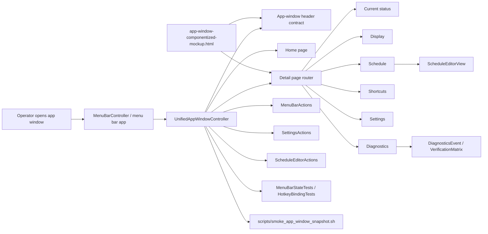

# 2026-06-22 Mockup Gap Repair Plan

## Goal

Make the real native `InnosDimmer` full app window match the approved componentized mockup closely enough that a visual review of Home, Current status, Display, Schedule, Shortcuts, Settings, and Diagnostics no longer finds the current structural gaps.

This is a plan-first document only. It does not implement the app code. The implementation handoff is `구현커밋`.

## Requested Outcome

- Pull together the latest research, strategy review, review-all-in-one findings, user comments on the mockup, and the current native code state.
- Prepare a very detailed implementation plan for replacing the current incomplete full-window detail pages with the target mockup structure.
- Treat the separate settings window as retired conceptually, but do not reintroduce or delete obsolete code blindly. Current code search shows no active `SettingsWindowController`, so the immediate problem is detail-page parity inside `UnifiedAppWindowController`.
- Preserve all existing working behavior:
  - brightness and blue-reduction commands
  - quick disable / restore / resume automation
  - schedule editing, parsing, sorting, and saving
  - shortcut editing and saving
  - display target selection
  - login item toggle
  - diagnostics export
- Add verification that catches layout regressions, not only command routing.

## Codebase Evidence

- `Confirmed`:
  - `UnifiedAppWindowController` is defined inside `InnosDimmer/UI/MenuBarPopoverView.swift` and owns Home plus all detail pages.
  - `SettingsWindowController` is not found in the current app or test code by the latest local search. The earlier plan text that said it still existed is stale.
  - `ScheduleEditorView` already has `Time`, `Bright`, `Blue`, numeric fields, slider tracks, and adjacent `-` / `+` buttons.
  - The real current issue is not that the app lacks every function. The issue is that the native full-window pages still use a generic vertical `makeDetailPage(_:)` template and therefore do not match the approved mockup layout.
  - The componentized mockup uses repeated structural vocabulary:
    - `.page-head`
    - `.detail-layout`
    - `.section-actions`
    - `.token-list`
    - `.schedule-table`
    - `.matrix-card`
    - `.log-feed`
  - Actual native code currently has:
    - `makeHeader()` with global title/chips only
    - `statusLabel` set to `"Ready."` under the global header
    - `makeDetailPage(_:)` that inserts a full-width body `← Back` button
    - vertical full-width sections for Display, Schedule, Shortcuts, Settings, and Diagnostics
    - raw `NSTextView` diagnostics log rather than matrix card plus log rows
    - schedule rows that function but visually cluster left with unused right-side space
- `Inferred`:
  - Home is closer than the detail pages, but still needs cleanup around status text and compact list rhythm.
  - Display and Settings can share the same split-detail primitive.
  - Diagnostics needs the largest structural conversion after Schedule because raw text export and readable log feed must coexist.
  - Trying to patch page strings alone will repeat the previous failure: the tests may pass while the UI still looks wrong.
- `Unverified`:
  - Exact pixel parity between the HTML mockup and native AppKit window is not yet measured.
  - Native screenshots must be re-run after implementation through the safe smoke script because previous live screenshots can be affected by software dimming.

## System Visualization



- changed nodes:
  - `UnifiedAppWindowController`
  - `ScheduleEditorView`
  - `InnosDesignComponents.swift` or a new app-window component file
  - `MenuBarStateTests.swift`
  - `scripts/smoke_app_window_snapshot.sh` only if final QA needs extra assertions beyond the current seven-page safe smoke output
- preserved nodes:
  - `MenuBarActions`
  - `SettingsActions`
  - `ScheduleEditorActions`
  - `SettingsSnapshot`
  - `ScheduleEntry`
  - `ShortcutBinding`
  - `DiagnosticsEvent`
  - `VerificationMatrix`
- diagram notes:
  - The mockup is the visual contract. Native AppKit remains the implementation surface.
  - The plan does not embed the HTML mockup in a WebView because that would bypass existing native controls and side-effect boundaries.

## Related Files

- `docs/design/window-redesign/app-window-componentized-mockup.html`
  - Approved componentized mockup.
  - Source for page names, layout classes, section order, schedule table shape, diagnostics matrix/log shape, and user-refined copy.
- `docs/design/window-redesign/mockup-gap-audit/research.md`
  - Current codebase research and page-by-page gap findings.
- `docs/design/window-redesign/mockup-gap-audit/strategy-review.md`
  - Strategy review recommending layout primitives first.
- `docs/design/window-redesign/mockup-gap-audit/review-all-in-one.md`
  - Review pass highlighting unresolved remove-column, diagnostics copy/select, weak layout tests, and extraction risks.
- `InnosDimmer/UI/MenuBarPopoverView.swift`
  - Current owner of `UnifiedAppWindowController`, Home, detail pages, command buttons, navigation tiles, display picker, login checkbox, diagnostics text view, and app-window test hooks.
- `InnosDimmer/UI/ScheduleEditorView.swift`
  - Current schedule table-like editor. Needs width/layout polish, not a full semantic rewrite.
- `InnosDimmer/UI/DesignSystem/InnosDesignTokens.swift`
  - Existing native design tokens for fonts, spacing, color, radius, chip, button, and track sizes.
- `InnosDimmer/UI/DesignSystem/InnosDesignComponents.swift`
  - Existing reusable native components: `InnosSectionView`, `InnosStatusChipView`, `InnosCommandButton`, `InnosDimmingControlGroupView`.
- `InnosDimmerTests/MenuBarStateTests.swift`
  - Existing app-window, schedule editor, display, settings, diagnostics, command, mockup-acceptance text, and safe visual smoke tests. The plan must strengthen these tests rather than assume no acceptance surface exists.
- `InnosDimmerTests/HotkeyBindingTests.swift`
  - Existing shortcut customization tests for unified app-window behavior.
- `scripts/smoke_app_window_snapshot.sh`
  - Existing native smoke artifact generator for app-window screenshots.

## Current Behavior

The app window currently opens and has the correct top-level destinations, but the detail pages still look like a raw AppKit settings stack rather than the approved mockup.

Specific current mismatches:

- Global window header:
  - Current: `makeHeader()` shows title and chips. `statusLabel` below it always starts as `"Ready."`.
  - Target: Home has a concise title row. Detail pages have their own page header with Back and page actions.
- Detail pages:
  - Current: `makeDetailPage(_:)` inserts a full-width body `← Back` button and stacks everything vertically.
  - Target: each detail page has a header-level Back button and content-specific split/token/table layout.
- Home:
  - Current: functionally close, but still includes explanatory/status text that the user previously asked to remove from the mockup.
  - Target: operational controls, concise next-action list, destination tiles.
- Current status:
  - Current: read-only snapshot and commands exist, but are still inside the generic detail template.
  - Target: compact detail page with page-header Back and command section.
- Display:
  - Current: all display information is vertical.
  - Target: split layout with current state on one side and target/saved selection details on the other.
- Schedule:
  - Current: `ScheduleEditorView` has the correct core controls, but it does not fill its panel well, and action placement does not match the mockup.
  - Target: compact schedule summary above a wide table with `Time / Bright / Blue`, value-field + slider + adjacent stepper, with Save/Pause or Resume grouped below.
- Shortcuts:
  - Current: functional shortcut rows exist.
  - Target: tokenized rows and cleaner header-level Save/Reset actions.
- Settings:
  - Current: vertical Startup and Saved settings sections.
  - Target: split layout with Launch/status and saved/persistence groups.
- Diagnostics:
  - Current: matrix summary rows plus large raw `NSTextView`.
  - Target: matrix card plus readable log feed, while preserving export/raw-copy capability.

## Change Map

- likely files to edit:
  - `InnosDimmer/UI/MenuBarPopoverView.swift`
  - `InnosDimmer/UI/ScheduleEditorView.swift`
  - `InnosDimmer/UI/DesignSystem/InnosDesignComponents.swift`
  - `InnosDimmer/UI/DesignSystem/InnosDesignTokens.swift`
  - `InnosDimmerTests/MenuBarStateTests.swift`
  - `InnosDimmerTests/HotkeyBindingTests.swift`
  - `scripts/smoke_app_window_snapshot.sh`
- likely functions/components/APIs to touch:
  - `UnifiedAppWindowController.installContent()`
  - `UnifiedAppWindowController.makeHeader()`
  - `UnifiedAppWindowController.renderActivePage()`
  - `UnifiedAppWindowController.makeDetailPage(_:)`
  - `UnifiedAppWindowController.makeCurrentPage()`
  - `UnifiedAppWindowController.makeDisplayPage()`
  - `UnifiedAppWindowController.makeSchedulePage()`
  - `UnifiedAppWindowController.makeShortcutsPage()`
  - `UnifiedAppWindowController.makeSettingsPage()`
  - `UnifiedAppWindowController.makeDiagnosticsPage()`
  - `UnifiedAppWindowController.makeSection(...)`
  - `ScheduleEditorView.installContent()`
  - `ScheduleEditorView.metricCell(...)`
  - `ScheduleEditorView.editedSchedule()`
- state/data/content dependencies:
  - `BrightnessState`
  - `ScheduleEntry`
  - `SettingsSnapshot`
  - `ShortcutBinding`
  - `DisplayIdentity`
  - `LoginItemStatus`
  - `DiagnosticsEvent`
  - `VerificationMatrix`
- side effects/integrations to preserve or adjust:
  - `actions.perform(...)` for brightness, blue reduction, quick disable, restore, and automation commands
  - `SettingsActions.selectDisplay`
  - `SettingsActions.updateShortcuts`
  - `SettingsActions.exportDiagnostics`
  - `ScheduleEditorActions.updateSchedule`
  - `loginItemToggled()`
  - `presentDiagnosticsSavePanel(data:)`
- likely new files:
  - Preferred: `InnosDimmer/UI/DesignSystem/AppWindowLayoutComponents.swift` plus explicit `InnosDimmer.xcodeproj/project.pbxproj` registration. The current project file manually lists Swift source files, so a new Swift file should be treated as project-file work, not auto-discovered work.
  - Lower-churn fallback: append the new app-window primitives to `InnosDimmer/UI/DesignSystem/InnosDesignComponents.swift` first, then extract later.
  - Optional after size pressure: `InnosDimmer/UI/UnifiedAppWindowController.swift` plus explicit project-file registration.
- remaining narrow unknowns before patch:
  - Whether final screenshot artifacts should stay under `/tmp/InnosDimmerSafeSmoke` only or whether selected review screenshots should be copied into `docs/design/window-redesign/` for durable comparison.
  - Whether a real row remove feature belongs in Schedule now. Plan default is no, because the current model is fixed three rows and user feedback asked for the layout, not dynamic schedule cardinality.

## Planned Changes

- Replace the generic detail-page body Back pattern with a page-header contract.
- Suppress non-actionable `"Ready."` copy from the normal app-window surface. Only show status messages when they carry useful feedback such as saved, error, warning, or pending state.
- Add native AppKit layout primitives that map directly to the mockup vocabulary:
  - page header with Back and trailing actions
  - split detail layout
  - section actions row
  - token row / token list
  - diagnostics matrix card
  - log feed row
  - compact app-window action bar
- Convert pages one by one:
  - Current status first to prove page-header conversion.
  - Display and Settings next because they share split layout.
  - Diagnostics next because it needs matrix/log primitives.
  - Schedule next because it has the highest visible mismatch and must preserve input behavior.
  - Shortcuts last because behavior is mostly working and polish can reuse token rows.
- Strengthen tests before visual polish:
  - keep the existing mockup-acceptance visible-text tests in `MenuBarStateTests.swift`
  - add structural app-window testing hooks only for layout facts that visible text cannot prove
  - assert page header shape
  - assert detail pages no longer use a body-width Back button
  - assert split-layout/token/table/matrix/log-feed markers exist as native view identifiers or accessibility identifiers
  - assert key content groups and action labels exist on each page
  - preserve existing schedule/shortcut/display/settings behavior tests
- Use smoke screenshots as a final gate, not as the only correctness proof.

## Review Notes

- risks:
  - Moving actions into page headers can break `commandButtons` lookup if button registration changes.
  - Replacing the generic detail template may accidentally lose Back navigation.
  - Diagnostics row-feed conversion can reduce copy/select convenience if raw text is removed entirely.
  - Schedule layout changes can break percent-field synchronization or minimum-window clipping.
  - Splitting out new Swift files will require Xcode project updates in this repo because `project.pbxproj` manually lists source files. Keep the first component pass small, or patch `InnosDesignComponents.swift` first if avoiding project-file churn is more important than file separation.
- assumptions:
  - User wants the native app window to be the only settings/control surface, with menu bar popover remaining a compact control surface.
  - Mockup explanatory text should not be copied into the actual app unless it represents a real status/value.
  - `Blue` can be used in compact table headers, but user-facing controls should still use `Blue reduction` where clarity matters.
- unanswered questions:
  - Whether Schedule should ever support adding/removing rows. Default: not in this implementation plan.
  - Whether Diagnostics should show both row feed and raw text panel. Default: row feed visible, raw text kept for copy/export support.

## Plan Quality Check

- Alternative considered: patch each detail page directly inside `MenuBarPopoverView.swift` without shared primitives.
  - Rejected because the same structural problems repeat across Display, Settings, Diagnostics, Schedule, and Shortcuts. Direct page patching would produce another large fragile file and inconsistent spacing.
- Alternative considered: embed `app-window-componentized-mockup.html` in a WebView.
  - Rejected because the app already has native controls, injected actions, accessibility behavior, and tests. A WebView would bypass too much working behavior.
- Alternative considered: rewrite the entire app window into a new controller file before page work.
  - Rejected for the first pass because extraction plus redesign would make review too broad. Extraction can happen after one or two pages prove the component contract.
- Why this plan:
  - It addresses the root cause: missing native layout vocabulary, not missing copy.
  - It turns the mockup into a set of reusable native layout contracts.
  - It keeps behavior tests close to each commit so another "looks unfinished but marked done" failure is less likely.
- Tradeoff:
  - chosen: layout primitives first, then page-by-page conversion.
  - alternative: one big rewrite matching the HTML in a single commit.
  - cost/risk: more commits and more intermediate states.
  - why acceptable: each page can be visually and functionally reviewed before moving on.
  - revisit when: the component primitives require so much plumbing that a controller extraction becomes smaller than continuing in-place.
- What this plan may still miss:
  - Pixel-level native-vs-HTML parity. This plan aims for structural and interaction parity first, then smoke/visual QA.
  - Exact AppKit text metrics may differ from the browser mockup.
- When to stop and revise:
  - Stop if moving page header actions breaks command dispatch or accessibility focus order.
  - Stop if `ScheduleEditorView.editedSchedule()` behavior changes without a deliberate data-model decision.
  - Stop if Diagnostics export no longer includes the raw event data.
  - Stop if minimum window size creates clipped controls after Schedule changes.

## Skill Routing Manifest

| Phase | Required skills | Optional skills | Evidence |
| --- | --- | --- | --- |
| Commit 1: Strengthen existing app-window acceptance tests with structural layout assertions | `구현커밋` | `review-all-in-one` | `MenuBarStateTests.swift` already has mockup-acceptance visible-text tests, but screenshots showed text assertions cannot prove split layouts, body Back removal, table width, or diagnostics row-feed structure. |
| Commit 2: Add app-window layout primitives | `구현커밋` | `디자인올인원` | Mockup repeatedly uses page-head, detail-layout, token-list, matrix-card, log-feed. Native code lacks equivalent primitives. |
| Commit 3: Convert page header and Current status | `구현커밋` | `review-all-in-one` | `makeDetailPage(_:)` currently inserts a body Back button. Current is the smallest detail page to prove the header contract. |
| Commit 4: Convert Display and Settings to split layouts | `구현커밋` | `review-all-in-one` | Display and Settings share two-column information architecture and existing settings actions. |
| Commit 5: Convert Diagnostics to matrix card and log feed | `구현커밋` | `review-all-in-one`, `테스트` | Diagnostics is currently raw `NSTextView`; mockup requires matrix card plus log rows while keeping export. |
| Commit 6: Polish Schedule table layout and action placement | `구현커밋` | `테스트`, `review-all-in-one` | `ScheduleEditorView` already has controls but snapshot shows unused width and action placement mismatch. |
| Commit 7: Tokenize Shortcuts and finish Home polish | `구현커밋` | `review-all-in-one` | Shortcuts behavior exists; remaining work is row/token rhythm and removing non-actionable explanatory copy. |
| Commit 8: Final smoke, docs, and handoff verification | `구현커밋` | `테스트`, `review-all-in-one`, `review-swarm` | Must prove tests, native screenshots, and mockup alignment before claiming completion. |
| Final Gate | `review-all-in-one`, `테스트` | `review-swarm` | Final review must check layout parity, preserved behavior, smoke screenshots, and dirty-worktree separation. |

## Implementation Plan

### Commit 1: Strengthen existing app-window acceptance tests with structural layout assertions

- target files:
  - `InnosDimmer/UI/MenuBarPopoverView.swift`
  - `InnosDimmerTests/MenuBarStateTests.swift`
  - `InnosDimmerTests/HotkeyBindingTests.swift` only if shortcut layout assertions belong there
- changes:
  - Keep the existing visible-text mockup acceptance tests such as `testUnifiedAppWindowCurrentStatusPageDefinesReadOnlyDetailContract`, `testUnifiedAppWindowSchedulePageDefinesTableEditorContract`, and `testUnifiedAppWindowDiagnosticsPageDefinesMatrixAndLogContract`.
  - Add a lightweight testing-only structure report for `UnifiedAppWindowController` to cover what visible text cannot prove.
  - Record page, title, header action labels, body section labels, whether a page uses split layout, whether it contains token rows, whether it contains schedule table/matrix/log-feed regions, and whether the old body Back button still exists.
  - Add assertions that initially expose the known structural mismatch instead of pretending text tests are sufficient.
  - Keep the report semantic. Do not assert exact pixel coordinates in this commit.
- code snippets:
  - proposed, target `UnifiedAppWindowController`:

```swift
#if DEBUG
struct AppWindowPageStructure: Equatable {
    var page: String
    var title: String
    var headerActions: [String]
    var bodySections: [String]
    var usesSplitLayout: Bool
    var hasBodyBackButton: Bool
    var tokenGroups: [String: Int]
    var structuralRegions: Set<String>
}

func pageStructureForTesting(_ page: UnifiedAppWindowPage) -> AppWindowPageStructure {
    activePage = page
    renderActivePage()
    window?.contentView?.layoutSubtreeIfNeeded()
    return collectPageStructureForTesting()
}

private func collectPageStructureForTesting() -> AppWindowPageStructure {
    let contentView = window?.contentView
    let identifiers = contentView?.recursiveIdentifiersForTesting() ?? []
    return AppWindowPageStructure(
        page: activePage.title,
        title: titleLabel.stringValue,
        headerActions: identifiers.filter { $0.hasPrefix("app-window-header-action:") },
        bodySections: identifiers.filter { $0.hasPrefix("app-window-section:") },
        usesSplitLayout: identifiers.contains("app-window-detail-split"),
        hasBodyBackButton: identifiers.contains("app-window-body-back"),
        tokenGroups: tokenGroupCounts(from: identifiers),
        structuralRegions: Set(identifiers)
    )
}
#endif
```

  - proposed, target `MenuBarStateTests.swift`:

```swift
func testUnifiedAppWindowDetailPagesUseHeaderBackInsteadOfBodyBack() {
    let controller = makeMockupAcceptanceController()
    for page in [UnifiedAppWindowPage.current, .display, .schedule, .shortcuts, .settings, .diagnostics] {
        let structure = controller.pageStructureForTesting(page)
        XCTAssertTrue(structure.headerActions.contains("Back"), page.title)
        XCTAssertFalse(structure.hasBodyBackButton, page.title)
    }
}

func testUnifiedAppWindowSchedulePageExposesNativeScheduleTableRegion() {
    let controller = makeMockupAcceptanceController()
    let structure = controller.pageStructureForTesting(.schedule)

    XCTAssertTrue(structure.structuralRegions.contains("schedule-table"))
    XCTAssertTrue(structure.bodySections.contains("Schedule rows"))
}
```

- tradeoff:
  - chosen: semantic structure tests.
  - alternative: snapshot-only tests.
  - cost/risk: testing hooks can couple tests to implementation names.
  - why acceptable: current failure mode is structural, and semantic hooks catch it more reliably than pixel-only smoke.
  - revisit when: hooks become larger than the production layout code.
- verification:
  - `xcodebuild -scheme InnosDimmer -configuration Debug build-for-testing CODE_SIGNING_ALLOWED=NO`
    - assertion: test target compiles with the new debug structure type.
  - `xcodebuild -scheme InnosDimmer -configuration Debug test-without-building -only-testing:InnosDimmerTests/MenuBarStateTests CODE_SIGNING_ALLOWED=NO`
    - assertion: existing visible-text and behavior tests still pass; new structural assertions either pass for already-converted pages or explicitly document the remaining known mismatch before page conversion.
- success criteria:
  - Test hooks describe the layout target without requiring manual screenshot inspection.
  - No production behavior changes.
  - Existing command, schedule, display, diagnostics, and shortcut tests still compile.
- stop conditions:
  - Stop if testing hooks require exposing private app state outside test/debug builds.
  - Stop if test hooks start encoding visual styling details such as exact colors or pixel positions.

### Commit 2: Add app-window layout primitives

- target files:
  - preferred: `InnosDimmer/UI/DesignSystem/AppWindowLayoutComponents.swift`
  - required with preferred path: `InnosDimmer.xcodeproj/project.pbxproj`, because the current project file manually registers Swift sources
  - fallback if project-file churn is risky: `InnosDimmer/UI/DesignSystem/InnosDesignComponents.swift`
  - `InnosDimmer/UI/DesignSystem/InnosDesignTokens.swift`
  - `InnosDimmer/UI/MenuBarPopoverView.swift` for helper adoption stubs only
- changes:
  - Add native primitives that match the mockup vocabulary:
    - `AppWindowPageHeaderView`
    - `AppWindowDetailSplitView`
    - `AppWindowSectionActionsView`
    - `AppWindowTokenRowView`
    - `AppWindowMatrixCardView`
    - `AppWindowLogRowView`
  - Reuse existing tokens:
    - `InnosDesignTokens.Radius.section`
    - `InnosDesignTokens.Spacing.sectionPadding`
    - `InnosDesignTokens.Spacing.sectionGap`
    - `InnosDesignTokens.Font.sectionLabel`
    - `InnosDesignTokens.Font.bodyStrong`
  - Add only missing layout constants, such as detail side width and table minimum widths.
- code snippets:
  - proposed, target `AppWindowLayoutComponents.swift`:

```swift
@MainActor
final class AppWindowPageHeaderView: NSStackView {
    init(title: String, leading: NSView, trailing: [NSView] = []) {
        let titleLabel = NSTextField(labelWithString: title)
        titleLabel.font = InnosDesignTokens.Font.windowTitle

        let spacer = NSView()
        spacer.setContentHuggingPriority(.defaultLow, for: .horizontal)

        super.init(frame: .zero)
        identifier = NSUserInterfaceItemIdentifier("app-window-page-head")
        orientation = .horizontal
        alignment = .centerY
        spacing = InnosDesignTokens.Spacing.rowGap
        setViews([leading, titleLabel, spacer] + trailing, in: .leading)
    }

    required init?(coder: NSCoder) { nil }
}

@MainActor
final class AppWindowDetailSplitView: NSStackView {
    init(primary: NSView, secondary: NSView, secondaryWidth: CGFloat = 280) {
        super.init(frame: .zero)
        identifier = NSUserInterfaceItemIdentifier("app-window-detail-split")
        orientation = .horizontal
        alignment = .top
        spacing = InnosDesignTokens.Spacing.sectionGap
        setViews([primary, secondary], in: .leading)
        secondary.translatesAutoresizingMaskIntoConstraints = false
        secondary.widthAnchor.constraint(greaterThanOrEqualToConstant: secondaryWidth).isActive = true
    }

    required init?(coder: NSCoder) { nil }
}
```

  - proposed, target `AppWindowTokenRowView`:

```swift
@MainActor
final class AppWindowTokenRowView: NSStackView {
    init(group: String, title: String, value: String, accessory: NSView? = nil) {
        let titleLabel = NSTextField(labelWithString: title)
        titleLabel.font = InnosDesignTokens.Font.bodySmallStrong
        let valueLabel = NSTextField(labelWithString: value)
        valueLabel.font = InnosDesignTokens.Font.bodyStrong
        let spacer = NSView()
        spacer.setContentHuggingPriority(.defaultLow, for: .horizontal)
        let views = accessory.map { [titleLabel, spacer, valueLabel, $0] } ?? [titleLabel, spacer, valueLabel]
        super.init(frame: .zero)
        identifier = NSUserInterfaceItemIdentifier("app-window-token-row:\(group)")
        orientation = .horizontal
        alignment = .centerY
        spacing = InnosDesignTokens.Spacing.rowGap
        setViews(views, in: .leading)
    }

    required init?(coder: NSCoder) { nil }
}
```

- tradeoff:
  - chosen: small native primitives before page conversion.
  - alternative: continue adding local helper methods inside `UnifiedAppWindowController`.
  - cost/risk: new component file may require project-file registration.
  - why acceptable: shared primitives prevent each page from inventing its own spacing and token rows.
  - revisit when: Xcode project churn becomes larger than the component code.
- verification:
  - `xcodebuild -scheme InnosDimmer -configuration Debug build CODE_SIGNING_ALLOWED=NO`
    - assertion: new components compile and, if placed in a new file, are correctly registered in `project.pbxproj`.
  - `rg -n "AppWindowDetailSplitView|AppWindowTokenRowView|AppWindowMatrixCardView" InnosDimmer/UI`
    - assertion: components exist in one canonical location.
- success criteria:
  - Page conversion commits can call shared primitives rather than duplicating local layout code.
  - Existing popover controls remain unaffected.
- stop conditions:
  - Stop if adding a new Swift file requires broad unrelated project-file rewrites beyond file reference, build file, group entry, and target source membership.
  - Stop if components duplicate existing `InnosSectionView` behavior instead of composing it.

### Commit 3: Convert page header and Current status

- target files:
  - `InnosDimmer/UI/MenuBarPopoverView.swift`
  - `InnosDimmerTests/MenuBarStateTests.swift`
- changes:
  - Replace body-level Back with header-level Back for all detail pages.
  - Keep global title/chips on Home, but let detail pages render page header row with:
    - Back
    - page title
    - optional trailing actions or chips
  - Remove or suppress always-on `"Ready."` from the normal root stack. Show status only when it has useful feedback.
  - Convert Current status first:
    - no duplicate quick controls
    - snapshot lines in token rows
    - command row for Disable / Restore / Resume or equivalent current commands if needed
    - no explanatory subtitle copied from the mockup
- code snippets:
  - proposed, target `renderActivePage()`:

```swift
private func renderActivePage() {
    titleLabel.stringValue = activePage == .home ? "InnosDimmer Control Center" : activePage.title
    statusLabel.isHidden = statusLabel.stringValue == "Ready."
    bodyView.subviews.forEach { $0.removeFromSuperview() }
    let content = makePageContainer(for: activePage)
    installBody(content)
}
```

  - proposed, target `makeDetailPage` replacement:

```swift
private func makeDetailPage(
    title: String,
    trailingActions: [NSView] = [],
    content: NSView
) -> NSView {
    let header = AppWindowPageHeaderView(
        title: title,
        leading: PopoverCommandButton(title: "Back", style: .normal, target: self, action: #selector(backPressed)),
        trailing: trailingActions
    )
    return verticalPageStack([header, content])
}
```

- tradeoff:
  - chosen: convert shell/header first with Current as proof.
  - alternative: convert every detail page shell and body in one pass.
  - cost/risk: intermediate pages may temporarily use new header but old vertical content.
  - why acceptable: the header contract is the root mismatch and can be reviewed independently.
  - revisit when: a mixed old/new page becomes harder to test than converting it fully.
- verification:
  - `xcodebuild -scheme InnosDimmer -configuration Debug test-without-building -only-testing:InnosDimmerTests/MenuBarStateTests CODE_SIGNING_ALLOWED=NO`
    - assertion: detail pages report header Back and no body Back.
  - `scripts/smoke_app_window_snapshot.sh`
    - assertion: the generated `safe-app-window-current.png` has page-header Back, not a wide body Back button. The current script captures all seven pages at once.
- success criteria:
  - Current status matches the target structure more closely than the current vertical template.
  - Back navigation still returns to Home.
  - Command buttons remain registered in `commandButtons`.
- stop conditions:
  - Stop if Back navigation or command button testing access breaks.
  - Stop if status messages disappear when save/error actions occur.

### Commit 4: Convert Display and Settings to split layouts

- target files:
  - `InnosDimmer/UI/MenuBarPopoverView.swift`
  - `InnosDimmerTests/MenuBarStateTests.swift`
- changes:
  - Convert Display:
    - left/primary card: current state snapshot
    - right/secondary stack: target display, picker, resolved display, main display, gamma table, saved selection
    - header action: Refresh displays
    - bottom or section action row: Save display / Use automatic
  - Convert Settings:
    - left card: Launch at login, approval, behavior
    - right stack: saved display, schedule count, shortcuts enabled, schema/status
    - action placement: Apply settings where it belongs, not as a full-width random row
  - Keep all current actions:
    - `displaySelectionChanged()`
    - `refreshDisplaysPressed()`
    - `saveDisplayPressed()`
    - `useAutomaticDisplayPressed()`
    - `loginItemToggled()`
- code snippets:
  - proposed, target `makeDisplayPage()`:

```swift
private func makeDisplayPage() -> NSView {
    renderDisplayPicker()
    let current = makeSection(title: "Current state", views: displayCurrentRows())
    let target = makeSection(title: "Target display", views: displayTargetRowsAndPicker())
    let saved = makeSection(title: "Saved selection", views: displaySavedRowsAndActions())
    let detail = AppWindowDetailSplitView(primary: current, secondary: verticalPageStack([target, saved]))
    return makeDetailPage(
        title: "Display",
        trailingActions: [PopoverCommandButton(title: "Refresh displays", style: .primary, target: self, action: #selector(refreshDisplaysPressed))],
        content: detail
    )
}
```

- tradeoff:
  - chosen: convert two similar pages in one commit after primitives exist.
  - alternative: one commit per page.
  - cost/risk: slightly larger diff.
  - why acceptable: both pages are straightforward split layouts and share the same new primitive.
  - revisit when: Display picker constraints or login checkbox layout causes page-specific complexity.
- verification:
  - `xcodebuild -scheme InnosDimmer -configuration Debug test-without-building -only-testing:InnosDimmerTests/MenuBarStateTests CODE_SIGNING_ALLOWED=NO`
    - assertion: display selection and login item tests still pass.
  - App-window structure tests:
    - Display reports `usesSplitLayout == true`.
    - Settings reports `usesSplitLayout == true`.
    - Display includes `Refresh displays`, `Save display`, `Use automatic`.
    - Settings includes `Launch at login`, `Apply settings`, and saved-state rows.
- success criteria:
  - Display and Settings no longer render as full-width vertical piles.
  - Existing settings actions are preserved.
- stop conditions:
  - Stop if display picker loses selection state after rerender.
  - Stop if login checkbox changes state without invoking the existing action path.

### Commit 5: Convert Diagnostics to matrix card and log feed

- target files:
  - `InnosDimmer/UI/MenuBarPopoverView.swift`
  - `InnosDimmerTests/MenuBarStateTests.swift`
  - optional `InnosDimmer/UI/DesignSystem/AppWindowLayoutComponents.swift`
- changes:
  - Replace the visible raw `NSTextView`-first diagnostics layout with:
    - matrix card: summary, overlay, gamma, hotkeys, login item
    - log feed: recent events as rows with time/category/severity/message
    - header action: Export diagnostics
    - optional action: Copy latest
  - Keep raw diagnostics text generation for export/copy support.
  - Do not remove `settingsActions.exportDiagnostics()`.
  - If row feed has fewer events, show a concise empty state, not a giant blank text area.
- code snippets:
  - proposed log row model:

```swift
private struct DiagnosticsLogRow {
    var time: String
    var severity: DiagnosticsSeverity
    var message: String
}

private func diagnosticsLogRows(limit: Int = 6) -> [DiagnosticsLogRow] {
    events.suffix(limit).reversed().map {
        DiagnosticsLogRow(
            time: Self.timeString(for: $0.timestamp),
            severity: $0.severity,
            message: $0.message
        )
    }
}
```

  - proposed visible structure:

```swift
private func makeDiagnosticsPage() -> NSView {
    let matrix = AppWindowMatrixCardView(rows: diagnosticsMatrixRows())
    let feed = makeSection(title: "Recent diagnostics", views: diagnosticsLogFeedViews())
    return makeDetailPage(
        title: "Diagnostics",
        trailingActions: [PopoverCommandButton(title: "Export diagnostics", style: .primary, target: self, action: #selector(exportDiagnosticsPressed))],
        content: AppWindowDetailSplitView(primary: matrix, secondary: feed)
    )
}
```

- tradeoff:
  - chosen: row feed visible, raw text retained behind export/copy.
  - alternative: keep raw `NSTextView` visible as today.
  - cost/risk: row feed is less convenient for selecting arbitrary multi-line raw text.
  - why acceptable: user explicitly said the log entries should be represented as log items, not as a dashboard-style fake block.
  - revisit when: user needs direct raw log selection inside the app window.
- verification:
  - `xcodebuild -scheme InnosDimmer -configuration Debug test-without-building -only-testing:InnosDimmerTests/MenuBarStateTests CODE_SIGNING_ALLOWED=NO`
    - assertion: diagnostics export still succeeds and matrix/log labels are present.
  - `scripts/smoke_app_window_snapshot.sh`
    - assertion: the generated `safe-app-window-diagnostics.png` shows matrix card and log rows, not a giant raw text area. The current script captures all seven pages at once rather than accepting page arguments.
- success criteria:
  - Diagnostics page has matrix card and log feed visual structure.
  - Export diagnostics remains available.
  - Recent warnings/errors are readable as rows.
- stop conditions:
  - Stop if export data changes shape or loses raw event content.
  - Stop if empty event state creates an oversized blank panel.

### Commit 6: Polish Schedule table layout and action placement

- target files:
  - `InnosDimmer/UI/ScheduleEditorView.swift`
  - `InnosDimmer/UI/MenuBarPopoverView.swift`
  - `InnosDimmerTests/MenuBarStateTests.swift`
- changes:
  - Keep the current fixed three-row schedule model.
  - Do not implement real row add/remove in this pass.
  - Make `ScheduleEditorView` fill useful horizontal space in the section.
  - Adjust column widths and constraints so `Time / Bright / Blue` table uses available width.
  - Keep value field + slider + adjacent stepper order for each metric:
    - `80% [slider] [-][+]` or native equivalent with adjacent `-` / `+`
  - Move Pause/Resume and Save schedule into a compact bottom action row near the schedule table, per user comment.
  - Keep `editedSchedule()` parsing, sorting, and validation unchanged.
- code snippets:
  - proposed, target `ScheduleEditorView.installContent()`:

```swift
stack.alignment = .width
NSLayoutConstraint.activate([
    stack.leadingAnchor.constraint(equalTo: leadingAnchor),
    stack.trailingAnchor.constraint(equalTo: trailingAnchor),
    stack.topAnchor.constraint(equalTo: topAnchor),
    stack.bottomAnchor.constraint(equalTo: bottomAnchor)
])
```

  - proposed, target `metricCell(...)`:

```swift
let stepper = NSStackView(views: [decrement, increment])
stepper.spacing = 0
let cell = NSStackView(views: [valueField, track, stepper])
cell.distribution = .fill
track.setContentHuggingPriority(.defaultLow, for: .horizontal)
```

  - proposed fixed decision for remove column:

```swift
// Keep row count fixed for now. The mockup remove column is not wired until
// ScheduleEntry cardinality is made a product decision.
```

- tradeoff:
  - chosen: improve layout only, keep schedule cardinality fixed.
  - alternative: implement dynamic add/remove rows now.
  - cost/risk: mockup remove-column visual may not be fully present.
  - why acceptable: user feedback focused on table layout, numeric input, slider, and adjacent steppers. Dynamic row count would expand scope and risk schedule semantics.
  - revisit when: user explicitly asks for add/remove schedule rows.
- verification:
  - `xcodebuild -scheme InnosDimmer -configuration Debug test-without-building -only-testing:InnosDimmerTests/MenuBarStateTests/testScheduleEditorViewTableControlsSynchronizeValues CODE_SIGNING_ALLOWED=NO`
    - assertion: values still synchronize between text fields, sliders, and steppers.
  - `xcodebuild -scheme InnosDimmer -configuration Debug test-without-building -only-testing:InnosDimmerTests/MenuBarStateTests/testUnifiedAppWindowSavesTableScheduleThroughInjectedAction CODE_SIGNING_ALLOWED=NO`
    - assertion: schedule save still routes through `ScheduleEditorActions`.
  - `scripts/smoke_app_window_snapshot.sh`
    - assertion: the generated `safe-app-window-schedule.png` shows the table spanning the panel and action buttons below/near the table instead of detached full-width blocks. The current script captures all seven pages at once rather than accepting page arguments.
- success criteria:
  - Schedule page no longer has the large unused right-side blank area.
  - Pause/Resume and Save schedule are grouped where the user expects.
  - Existing schedule validation behavior remains unchanged.
- stop conditions:
  - Stop if minimum width clips the Bright or Blue controls.
  - Stop if `editedSchedule()` output order or percent parsing changes unexpectedly.

### Commit 7: Tokenize Shortcuts and finish Home polish

- target files:
  - `InnosDimmer/UI/MenuBarPopoverView.swift`
  - `InnosDimmerTests/MenuBarStateTests.swift`
  - `InnosDimmerTests/HotkeyBindingTests.swift`
- changes:
  - Convert Shortcuts page to tokenized rows while preserving actual editable controls:
    - action label
    - enabled checkbox
    - modifier checkboxes
    - key field
  - Move Save shortcuts / Reset shortcuts to the page header or a compact section action row.
  - Make Home operational-only:
    - no explanatory subtitle
    - no unnecessary footer
    - concise `Quick actions`
    - concise `Next actions` as vertical list rows
    - destination tiles remain in a stable grid
  - Keep existing command labels where they are clearer:
    - `Disable`
    - `Restore`
    - `Resume` or `Resume automation` depending on available width
- code snippets:
  - proposed, target Shortcuts:

```swift
private func makeShortcutRow(action: ShortcutAction, controls: ShortcutControls) -> NSView {
    AppWindowTokenRowView(
        title: Self.shortcutActionLabel(for: action),
        value: controls.enabled.state == .on ? "Enabled" : "Off",
        accessory: makeShortcutControlsInline(controls)
    )
}
```

  - proposed, target Home action row:

```swift
makeActionRow([
    button("Disable", command: .quickDisable, action: #selector(quickDisablePressed), style: .warning),
    button("Restore", command: .restorePrevious, action: #selector(restorePreviousPressed)),
    button(resumeShortTitle(), command: automationActionCommand, action: #selector(automationActionPressed))
])
```

- tradeoff:
  - chosen: polish existing functional shortcut rows, not invent a new shortcut editor.
  - alternative: rebuild shortcut editor into fully custom token controls.
  - cost/risk: native checkbox/field controls may still look slightly AppKit-standard.
  - why acceptable: shortcut behavior is high risk; visual polish should not break capture and validation.
  - revisit when: user asks for a fully custom shortcut editor appearance.
- verification:
  - `xcodebuild -scheme InnosDimmer -configuration Debug test-without-building -only-testing:InnosDimmerTests/HotkeyBindingTests CODE_SIGNING_ALLOWED=NO`
    - assertion: shortcut navigation, save, labels, invalid key handling still pass.
  - `scripts/smoke_app_window_snapshot.sh`
    - assertion: the generated `safe-app-window-home.png` has no explanatory clutter and `safe-app-window-shortcuts.png` has readable, unclipped rows. The current script captures all seven pages at once rather than accepting page arguments.
- success criteria:
  - Shortcuts page visually aligns with token-row treatment without losing editability.
  - Home keeps only information/actions the user needs.
- stop conditions:
  - Stop if shortcut controls become non-editable or lose target/action wiring.
  - Stop if Home destination tiles overflow or shrink below readable size.

### Commit 8: Final smoke, docs, and handoff verification

- target files:
  - `scripts/smoke_app_window_snapshot.sh`
  - `docs/design/window-redesign/mockup-gap-audit/research.md`
  - `docs/design/window-redesign/mockup-gap-audit/review-all-in-one.md`
  - optional final screenshot artifacts under `docs/design/window-redesign/...` only if the repo already stores them intentionally
- changes:
  - Run the full focused test matrix.
  - Use the existing safe smoke path to capture Home, Current, Display, Schedule, Shortcuts, Settings, and Diagnostics screenshots through a no-dimming state. The current script already expects 7 files under `/tmp/InnosDimmerSafeSmoke`.
  - Update research/review docs with what was implemented and what remains intentionally deferred.
  - Record any non-goal differences from the HTML mockup:
    - fixed three-row schedule
    - raw diagnostics retained for export/copy
    - native AppKit text metrics not pixel-identical to browser HTML
- code snippets:
  - not needed. This commit is verification and documentation packaging.
- tradeoff:
  - chosen: final verification in one packaging commit.
  - alternative: run only unit tests and skip screenshot smoke.
  - cost/risk: screenshot smoke may be slower and can expose environment differences.
  - why acceptable: the user specifically caught visual mismatch after earlier "complete" claims.
  - revisit when: smoke script is flaky or blocked by OS permissions.
- verification:
  - `xcodebuild -scheme InnosDimmer -configuration Debug build CODE_SIGNING_ALLOWED=NO`
    - assertion: app builds.
  - `xcodebuild -scheme InnosDimmer -configuration Debug test CODE_SIGNING_ALLOWED=NO`
    - assertion: unit/UI-adjacent tests pass.
  - `scripts/smoke_app_window_snapshot.sh`
    - assertion: all seven `safe-app-window-*.png` files exist, render nonblank, are not dimmed black, and roughly match the target page structure.
  - manual comparison:
    - target mockup: `docs/design/window-redesign/app-window-componentized-mockup.html`
    - actual screenshots from smoke output
- success criteria:
  - All pages pass structure tests.
  - Existing behavior tests still pass.
  - Native screenshots no longer show the previous incomplete layout:
    - no giant body Back button
    - no detached narrow Schedule table
    - no raw Diagnostics-only text block
    - no redundant explanatory copy on Home
- stop conditions:
  - Stop if the smoke screenshots contradict the tests.
  - Stop if tests pass but user-visible detail pages still materially differ from the mockup.

## Operator 결정 필요 사항

- 상태: 보류됨
- 결정 1: Schedule row remove feature
  - 맥락: mockup had a remove-looking column at one point, but the app currently uses a fixed three-row schedule model and the latest feedback focused on table layout, value input, slider, and adjacent `-` / `+`.
  - A: Fixed three rows, no remove action in this pass. Impact: least risky, preserves current `ScheduleEntry` assumptions.
  - B: Show disabled remove affordances only. Impact: visually closer to one mockup version but may imply a feature that does not work.
  - C: Implement real add/remove rows. Impact: largest scope, requires product decision and broader tests.
  - 추천안: A. The current task is mockup parity for the existing full-window app, not schedule cardinality redesign.
  - 기본값: A.
  - 보류 시 영향: Implementation proceeds with fixed rows. Add/remove can become a later feature plan.
- 결정 2: Diagnostics raw text visibility
  - 맥락: user said log items should be represented directly, but raw diagnostics is useful for copy/export.
  - A: Show matrix card + log feed, keep raw text behind export/copy support. Impact: best balance of mockup parity and utility.
  - B: Keep raw text panel visible. Impact: current utility remains, but mockup gap persists.
  - C: Remove raw text entirely. Impact: clean look, but worse diagnostics troubleshooting.
  - 추천안: A.
  - 기본값: A.
  - 보류 시 영향: Implementation proceeds with visible row feed and preserved export/raw generation.
- 결정 3: Explanatory subtitles/captions in actual app
  - 맥락: user repeatedly marked explanatory copy as unnecessary in the mockup.
  - A: Remove non-actionable explanatory copy from the actual app. Impact: cleaner utility UI.
  - B: Keep compact subtitles on detail pages. Impact: easier for first-time users, more clutter for personal-use tool.
  - C: Move explanations to tooltips/help later. Impact: keeps UI clean but requires separate help design.
  - 추천안: A.
  - 기본값: A.
  - 보류 시 영향: Implementation proceeds with operational labels/values only.
- 결정 4: Controller extraction timing
  - 맥락: `MenuBarPopoverView.swift` is large, but extraction plus redesign is a bigger diff.
  - A: Add layout primitives first, keep controller in place during page conversion. Extract only if file size/risk becomes unmanageable. Impact: smaller, safer initial diffs.
  - B: Extract `UnifiedAppWindowController` before page conversion. Impact: cleaner architecture, larger first diff.
  - C: Never extract and keep all helpers local. Impact: fewer files, worse maintainability.
  - 추천안: A.
  - 기본값: A.
  - 보류 시 영향: Implementation proceeds in-place unless code size or project-file constraints force extraction.

## 검토용 결과물

- HTML: [mockup-gap-audit.html](artifacts/mockup-gap-audit.html)
- Source mockup: [app-window-componentized-mockup.html](../app-window-componentized-mockup.html)
- Research: [research.md](research.md)
- Strategy review: [strategy-review.md](strategy-review.md)
- Review all-in-one: [review-all-in-one.md](review-all-in-one.md)
- 테스트 링크:
  - Localhost: not required for the review artifact because it is a static HTML file opened with `file://`.
  - Deploy: unavailable; this is a local macOS app planning artifact, not a deployed web app.
- 상태: implemented
- 실제 동작:
  - The HTML artifact has interactive page tabs, implementation-phase mapping, decision toggles, and checklist toggles.
  - It is a review/spec artifact, not the native app.
- Mock:
  - Sample page gap data and default decisions are embedded as static review data.

## 후행 실행

- 기본 실행: 구현커밋
- 계획 경로 처리: 구현커밋이 직전 대화, 계획 링크, active plan context에서 자동 탐지
- 모호할 때: 후보 목록을 보여주고 Operator에게 선택 요청
- 이 문서가 후행 실행 source of truth다:
  - `/Users/moonsoo/projects/InnosDimmer/docs/design/window-redesign/mockup-gap-audit/2026-06-22-mockup-gap-repair-plan-first.md`

## HTML 생략 보고서

- 판정: 생략 불가
- 생략 사유:
  - 해당 없음. 화면/레이아웃/목업 parity 계획이므로 HTML 검토물이 필요하다.
- 대체 검토물:
  - 해당 없음. HTML 검토물을 생성한다.
- 테스트 링크:
  - Localhost: 정적 HTML이라 필요 없음.
  - Deploy: 로컬 macOS 앱 계획 문서라 배포 없음.
- 사용자가 바로 열어볼 링크:
  - [mockup-gap-audit.html](artifacts/mockup-gap-audit.html)

## 구현 후 검토 리스트

- 회귀 확인:
  - Menu bar popover quick controls still work.
  - Full app window opens from menu bar and from any existing command path.
  - Disable, Restore, Resume/Pause automation commands still dispatch through `MenuBarActions`.
  - Schedule save still uses `ScheduleEditorActions.updateSchedule`.
  - Display save/use automatic still uses `SettingsActions.selectDisplay`.
  - Shortcut save/reset still uses `SettingsActions.updateShortcuts`.
  - Login item toggle still uses the existing login item path.
  - Diagnostics export still uses `SettingsActions.exportDiagnostics`.
- 검증 확인:
  - Focused unit tests for app-window structure.
  - Schedule editor value synchronization tests.
  - Shortcut customization tests.
  - Display and settings action tests.
  - Diagnostics export tests.
  - Safe screenshot smoke for all pages.
- 리뷰 관점:
  - `review-all-in-one`: check for missing mockup elements, broken actions, and inconsistent page shells.
  - `review-swarm`: check regression risk in large AppKit file, shortcut controls, schedule validation, diagnostics export.
  - `테스트`: run native app/smoke review and produce user-visible evidence.
- Operator 재확인:
  - Compare target mockup and native screenshots page-by-page.
  - Confirm fixed three-row schedule is acceptable.
  - Confirm Diagnostics row feed plus export/raw support is acceptable.
  - Confirm Home has enough information after explanatory text removal.

## Validation

- manual checks:
  - Open target mockup and actual app screenshots side by side.
  - Check Home:
    - Quick actions are aligned and button spacing is sane.
    - Next actions are vertical list rows, not horizontal mini cards.
    - Destination tiles remain readable.
  - Check Current:
    - Page-header Back exists.
    - No duplicated full quick-control panel unless intentionally kept.
  - Check Display:
    - Split layout appears.
    - Display picker and save/automatic actions are present.
  - Check Schedule:
    - Table spans useful width.
    - Time / Bright / Blue headers exist.
    - Numeric inputs, sliders, and adjacent stepper buttons are present.
    - Save and Pause/Resume are grouped at the bottom.
  - Check Shortcuts:
    - Rows are readable and editable.
    - Save/reset actions are not awkwardly full-width.
  - Check Settings:
    - Launch at login and saved-state groups are visually separated.
  - Check Diagnostics:
    - Matrix card and log rows are visible.
    - Export remains available.
- lint/build/test scope:
  - `xcodebuild -scheme InnosDimmer -configuration Debug build CODE_SIGNING_ALLOWED=NO`
  - `xcodebuild -scheme InnosDimmer -configuration Debug test CODE_SIGNING_ALLOWED=NO`
  - focused fallback if full test is slow:
    - `xcodebuild -scheme InnosDimmer -configuration Debug test-without-building -only-testing:InnosDimmerTests/MenuBarStateTests CODE_SIGNING_ALLOWED=NO`
    - `xcodebuild -scheme InnosDimmer -configuration Debug test-without-building -only-testing:InnosDimmerTests/HotkeyBindingTests CODE_SIGNING_ALLOWED=NO`
- scenario-to-surface checks:
  - `UnifiedAppWindowController.focus(.schedule)` renders target schedule structure.
  - `UnifiedAppWindowController.focus(.diagnostics)` renders matrix/log feed and preserves export.
  - `UnifiedAppWindowController.focus(.display)` preserves display picker persistence.
  - `UnifiedAppWindowController.focus(.shortcuts)` preserves shortcut editing.
  - `scripts/smoke_app_window_snapshot.sh` produces seven nonblank screenshots for every full-window page under `/tmp/InnosDimmerSafeSmoke`.
