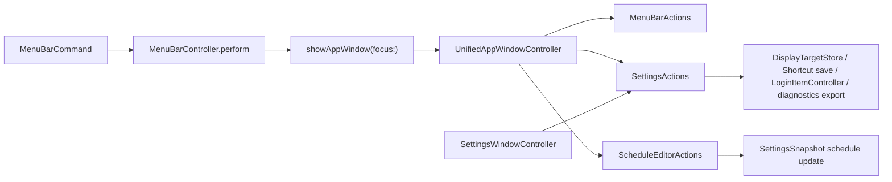

# Research

## Goal

Measure how far the current native `InnosDimmer` app window is from the componentized mockup, verify the current implementation with tests and smoke checks, and prepare a plan that can drive a follow-up implementation without claiming premature completion.

Trigger mode: Pre-Plan Research Gate.

## Scope And Entry Points

- Mockup target: `docs/design/window-redesign/app-window-componentized-mockup.html`
- Existing comparison explainer: `docs/explainers/window-settings-unification/comparison.html`
- Native app route: `MenuBarController.showAppWindow(focus:)`
- Native app controller: `UnifiedAppWindowController` in `InnosDimmer/UI/MenuBarPopoverView.swift`
- Legacy settings window still present: `InnosDimmer/UI/SettingsWindowController.swift`
- Schedule editor shared by old and new surfaces: `InnosDimmer/UI/ScheduleEditorView.swift`

Out of scope for this research pass:

- No app code changes.
- No settings window deletion.
- No package install, dependency change, deploy, or push.

## Relevant Files

- `InnosDimmer/UI/MenuBarController.swift`
  - `showAppWindow(focus:)` creates/reuses `UnifiedAppWindowController`.
  - `openSettings()` now routes to the unified app window settings page.
- `InnosDimmer/UI/MenuBarPopoverView.swift`
  - Owns the popover plus `UnifiedAppWindowController`.
  - Current unified window pages are `home`, `current`, `display`, `schedule`, `shortcuts`, `settings`, and `diagnostics`.
- `InnosDimmer/UI/SettingsWindowController.swift`
  - Legacy controller still exists.
  - Still owns or preserves older behavior and tests for shortcut customization.
- `InnosDimmer/UI/ScheduleEditorView.swift`
  - Current editor is text-field based: Time, Brightness, Blue.
  - It does not match the mockup schedule table with numeric value, slider track, adjacent stepper, and remove control.
- `InnosDimmerTests/MenuBarStateTests.swift`
  - Covers unified window routing, display action, shortcut save, login item toggle, diagnostics export, and home layout metrics.
- `InnosDimmerTests/HotkeyBindingTests.swift`
  - `SettingsWindowShortcutCustomizationTests` still instantiate `SettingsWindowController`, proving the old settings surface is not fully retired.
- `docs/design/window-redesign/app-window-componentized-mockup.html`
  - The visual target for the app window, with home and detail pages.
  - Still contains a schedule table header labeled `Warmth`, which conflicts with the app vocabulary `Blue reduction`.

## Current Behavior

Confirmed by local code and test inspection:

1. The actual app window route is unified enough that settings, shortcuts, diagnostics, and schedule focus can be opened through `UnifiedAppWindowController`.
2. The Home page has moved closer to the mockup after the recent layout fix: quick actions, next actions, and card-like navigation tiles exist.
3. Detail pages are still much thinner than the mockup:
   - Current status page still duplicates quick controls, while the mockup says it should be read-only and not duplicate home controls.
   - Display page has a picker and summaries, but not the richer current-state plus saved-selection structure.
   - Schedule page uses the old text-field editor, not the table/slider/stepper layout.
   - Shortcuts page is functionally present, but visually closer to a raw settings table than the tokenized mockup.
   - Settings page has launch-at-login and saved-state summary, but not the mockup's fuller persistent settings/status structure.
   - Diagnostics page exports and logs, but the verification matrix layout is simpler than the mockup.
4. `SettingsWindowController` is still present and directly tested, so settings-window retirement is not complete.

## Data Flow And Control Flow

Key control-flow facts:

- `MenuBarController.perform(.openScheduleEditor)` focuses the unified app window schedule page.
- `MenuBarController.perform(.openShortcuts)` focuses the unified app window shortcuts page.
- `MenuBarController.perform(.openDiagnostics)` focuses the diagnostics page.
- `MenuBarController.perform(.openSettings)` calls `openSettings()`, which now focuses the unified settings page.
- `SettingsWindowController` remains in the codebase and test suite, so the old controller is not yet just dead code.

## Existing Abstractions And Boundaries

- `MenuBarActions` should remain the live dimming command boundary.
- `ScheduleEditorActions` should remain the durable schedule save boundary.
- `SettingsActions` is already neutral enough to serve both old and unified settings surfaces, but it physically lives in `SettingsWindowController.swift`.
- `ShortcutKeyField` and old shortcut validation behavior are still tied to the settings-window implementation/test history.
- `ScheduleEditorView` is a reusable editor, but its current abstraction is too narrow for the table layout in the mockup.

## Side Effects And Integration Points

- Actual app launch can apply software dimming. During this audit, launching the Debug app produced a black screenshot at `/tmp/innos-gap-actual-home.png`.
- No `InnosDimmer` process remained after quitting, but the smoke result still proves that visual verification cannot rely on a naive full-screen screenshot while dimming may be active.
- Future UI verification needs either:
  - a safe launch state with brightness 100 / blue reduction 0, or
  - a test-only no-dimming launch path, or
  - targeted native view snapshot tests that do not require the live overlay.

## Risk To Surrounding Systems

- Deleting `SettingsWindowController` now would break tests and may drop shortcut behavior that is still verified through the old controller.
- Replacing `ScheduleEditorView` without preserving `editedSchedule()` parsing/sorting/validation could regress saved automation.
- Routing every settings-like command through one generic `.openSettings` can still cause page ambiguity if popover, settings tile, and shortcut flows need different destinations.
- The current test suite can pass while visual parity remains incomplete; tests currently validate functionality more strongly than visual/detail-page completeness.

## Do Not Duplicate Or Bypass

- Do not bypass `MenuBarController.showAppWindow(focus:)`; it is the actual app-window entry point.
- Do not duplicate schedule save logic outside `ScheduleEditorActions`.
- Do not bypass `SettingsActions` for display, shortcuts, login item, or diagnostics export.
- Do not delete `SettingsWindowController.swift` until shortcut tests and any remaining helper dependencies have migrated.
- Do not treat `AppDashboardWindowController` tests as the target implementation; the active target is `UnifiedAppWindowController`, but old dashboard tests still exist and should be reviewed before removal.

## Mockup Gap Matrix

Estimated current match is about 50% overall.

This is not a visual pixel score. It is a feature/layout parity estimate from local code, tests, mockup HTML, and smoke results.

| Surface | Current match | Evidence | Main gap |
| --- | ---: | --- | --- |
| Home | 70-75% | `makeHomePage()`, actual card tile implementation, layout test | Home is close, but status rhythm and exact mock spacing still need final visual QA. |
| Current status | 45-55% | `makeCurrentPage()` duplicates `makeQuickActionsSection()` | Mockup expects read-only status without duplicating home controls. |
| Display | 35-45% | `makeDisplayPage()` only renders picker, current, candidates | Missing current-state side panel, saved-selection actions, resolved/gamma details. |
| Schedule | 25-35% | `makeSchedulePage()` embeds text-only `ScheduleEditorView` | Missing table row layout, inline slider, numeric value field, adjacent `-`/`+`, remove controls, bottom action row. |
| Shortcuts | 55-65% | Shortcut rows and save/reset work through tests | Functional, but visual treatment is closer to a raw native table than the mockup token rows/toggles. |
| Settings | 45-55% | `makeSettingsPage()` has login item and saved state | Missing richer status/apply structure and clear persistence feedback. |
| Diagnostics | 45-55% | `makeDiagnosticsPage()` has log/export | Missing mockup matrix overview layout and more readable log feed structure. |
| Settings-window retirement | 20-30% | `SettingsWindowController` still exists and is tested | Runtime route moved, but old controller is not deletable yet. |

## Review-All-In-One Findings

### Blocker

- The implementation cannot be called "mockup complete" because the schedule page is still the old text-field editor rather than the mockup table editor. This is the largest visible and interaction gap.

### Important

- The old settings window is still part of tested behavior. Removing or ignoring it without migrating tests would be unsafe.
- The current status page contradicts the mockup direction by reusing quick controls instead of becoming a focused read-only status page.
- Smoke verification needs a safer path because live dimming can make screenshots unusable.

### Minor

- The mockup itself still says `Warmth` in the schedule table header while the app uses `Blue reduction` / `Blue`. The target artifact should be normalized before implementation.
- `UnifiedAppWindowController` lives inside `MenuBarPopoverView.swift`, which increases review difficulty as the app window grows.

## Strategy Review

판정: 조건부 적절.

Candidate A: keep patching the existing `UnifiedAppWindowController` in place.

- Root-cause fit: medium. It directly changes the active runtime route.
- Regression surface: medium-high because the file also contains popover code.
- Implementation cost: low-to-medium.
- Verdict: acceptable for a small Home fix, not enough for the full redesign.

Candidate B: extract app-window-specific components/controllers, then implement pages.

- Root-cause fit: high. It targets the active route and reduces file coupling.
- Regression surface: medium. More files move, but boundaries become clearer.
- Implementation cost: medium.
- Verdict: recommended for the next implementation.

Candidate C: delete `SettingsWindowController` first and fill gaps afterward.

- Root-cause fit: low. It removes old code before parity is proven.
- Regression surface: high.
- Implementation cost: deceptively low, but failure cost is high.
- Verdict: reject.

## Open Questions

- Should the next implementation preserve the `UnifiedAppWindowController` class name or rename/extract it to a dedicated `AppWindowController` file?
- Should the final Schedule column label be `Blue`, `Blue reduction`, or another compact label? The current mockup says `Warmth`, which conflicts with the product direction.
- Should visual verification be done by native view snapshot tests, live app screenshots with dimming disabled, or both?

## Plan Implications

1. Treat Home as partially fixed, not complete.
2. Prioritize the Schedule page because it has the biggest interaction and visual gap.
3. Normalize the mockup vocabulary before coding against it.
4. Add safe visual smoke verification before claiming visual completion.
5. Delay `SettingsWindowController` deletion until tests no longer instantiate it.

## Source Evaluation

- Local code: Adopt. Strongest source for actual behavior.
- Local tests: Adopt with limits. Strong source for functional route coverage, weak for visual parity.
- Mockup HTML: Adopt as design target with one correction required: `Warmth` label.
- Live screenshot: Pilot/Watch. The black screenshot is useful evidence of smoke fragility, not useful as visual parity evidence.
- External sources: Not used. This is a local native-app/codebase comparison and does not need current web evidence.

## Evidence

- `xcodebuild -scheme InnosDimmer -configuration Debug build-for-testing CODE_SIGNING_ALLOWED=NO`
- `xcodebuild -scheme InnosDimmer -configuration Debug test-without-building CODE_SIGNING_ALLOWED=NO`
- Full test result on 2026-06-22: 135 tests, 0 failures.
- Smoke attempt on 2026-06-22:
  - `/tmp/innos-gap-actual-home.png`: black capture after launching the Debug app.
  - `ps -ef | rg "InnosDimmer|xcodebuild" | rg -v rg`: no remaining `InnosDimmer` process after quit.
- `InnosDimmer/UI/MenuBarController.swift`
- `InnosDimmer/UI/MenuBarPopoverView.swift`
- `InnosDimmer/UI/SettingsWindowController.swift`
- `InnosDimmer/UI/ScheduleEditorView.swift`
- `InnosDimmerTests/MenuBarStateTests.swift`
- `InnosDimmerTests/HotkeyBindingTests.swift`
- `docs/design/window-redesign/app-window-componentized-mockup.html`
