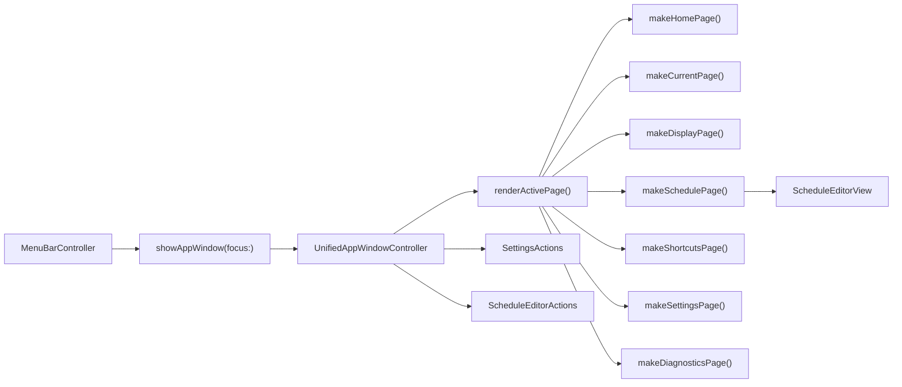

# Research

## Goal

Analyze why the current native `InnosDimmer` full app window still feels under-reflected compared with `docs/design/window-redesign/app-window-componentized-mockup.html`, focusing on the individual detail pages rather than the already-improved Home route.

Trigger mode: Purpose Research with codebase, design, empirical, and reasoning lanes.

## Scope And Entry Points

Target mockup:

- `docs/design/window-redesign/app-window-componentized-mockup.html`

Native implementation:

- `InnosDimmer/UI/MenuBarController.swift`
- `InnosDimmer/UI/MenuBarPopoverView.swift`
- `InnosDimmer/UI/ScheduleEditorView.swift`
- `InnosDimmer/UI/SettingsActions.swift`
- `InnosDimmer/UI/ShortcutKeyField.swift`
- `InnosDimmer/UI/DesignSystem/InnosDesignComponents.swift`
- `InnosDimmer/UI/DesignSystem/InnosDesignTokens.swift`

Verification and evidence:

- `InnosDimmerTests/MenuBarStateTests.swift`
- `InnosDimmerTests/HotkeyBindingTests.swift`
- `scripts/smoke_app_window_snapshot.sh`
- `/tmp/InnosDimmerSafeSmoke/safe-app-window-*.png`

Out of scope:

- No implementation changes in this research pass.
- No dependency/package work.
- No external design benchmarking. The user asked to compare the local mockup and native app.

## Relevant Files

- `docs/design/window-redesign/app-window-componentized-mockup.html`
  - Defines Home plus `Current status`, `Display`, `Schedule`, `Shortcuts`, `Settings`, and `Diagnostics`.
  - Uses compact headers, page-level action placement, side-by-side detail layouts, token rows, and HTML table-like structures.
- `InnosDimmer/UI/MenuBarPopoverView.swift`
  - Contains `UnifiedAppWindowController`.
  - Renders every full-window page through `makeHomePage`, `makeCurrentPage`, `makeDisplayPage`, `makeSchedulePage`, `makeShortcutsPage`, `makeSettingsPage`, and `makeDiagnosticsPage`.
  - Also still owns popover components, making the file large and mixing two UI surfaces.
- `InnosDimmer/UI/ScheduleEditorView.swift`
  - Now implements a schedule table with `Time`, `Bright`, `Blue`, editable values, sliders, and adjacent `-`/`+` controls.
  - It does not implement row removal, but the current app schedule is fixed at three rows.
- `InnosDimmer/UI/DesignSystem/InnosDesignComponents.swift`
  - Defines reusable token-like components such as `InnosSectionView`, `InnosStatusChipView`, `InnosCommandButton`, and `InnosDimmingTrackView`.
  - `UnifiedAppWindowController` still mostly uses local `makeSection`, `PopoverCommandButton`, `PopoverContainerView`, and AppKit stack views instead of fully adopting these components.
- `InnosDimmerTests/MenuBarStateTests.swift`
  - Has acceptance tests for page text/commands and safe visual smoke snapshots.
  - The tests verify that required content exists, but they do not enforce the mockup's exact layout density, header structure, two-column placement, or token-list visuals.
- `InnosDimmerTests/HotkeyBindingTests.swift`
  - Shortcut customization tests now target `UnifiedAppWindowController`, confirming old `SettingsWindowController` retirement happened.
- `scripts/smoke_app_window_snapshot.sh`
  - Generates safe non-live snapshots for all pages into `/tmp/InnosDimmerSafeSmoke`.

## Current Behavior

Confirmed current state:

1. The old dedicated settings window controller is no longer present in the current code path. Searches for `SettingsWindowController` return no active code references.
2. The full app window routes to seven pages: Home, Current status, Display, Schedule, Shortcuts, Settings, and Diagnostics.
3. The Home page is close to the mockup structurally: left quick actions, next actions, and right navigation tiles exist.
4. The Schedule editor has materially improved. It now has the core table controls the user requested: `Time / Bright / Blue`, value input, slider, and adjacent `-`/`+`.
5. The detailed pages still diverge visually because the native window uses a generic full-width vertical detail template:
   - a large page title in the window header
   - a separate `Ready.` status label under the header
   - a full-width `Back` button as the first content row
   - mostly full-width sections stacked vertically
   - full-width command buttons in several pages
6. The mockup detail pages are more compact:
   - Back button is inside the page header, not a full-width row
   - page action buttons live in the header or local section footer
   - many pages use two-column `detail-layout` structures
   - list-like content uses token rows rather than raw text views or wide summary rows.

## Data Flow And Control Flow

Important control-flow facts:

- `UnifiedAppWindowController.renderActivePage()` replaces `bodyView` content every time a page changes.
- All detail pages go through `makeDetailPage(_:)`.
- `makeDetailPage(_:)` currently prepends a full-width `← Back` button to every page.
- `makeHeader()` is global and only contains title, spacer, mode chip, and login chip. It does not support per-page header actions like the mockup.
- `makeSchedulePage()` embeds `ScheduleEditorView` plus an action row, but the section remains a full-width vertical block.
- `makeDiagnosticsPage()` uses an `NSTextView` inside an `NSScrollView`, which is functionally useful but does not match the mockup's tokenized log feed.

## Existing Abstractions And Boundaries

Use and preserve:

- `MenuBarController.showAppWindow(focus:)` as the app-window entry route.
- `UnifiedAppWindowController` as the current runtime page owner until a deliberate extraction plan exists.
- `SettingsActions` for display selection, shortcut saves, login item changes, and diagnostics export.
- `ScheduleEditorActions` for durable schedule saving.
- `ScheduleEditorView.editedSchedule()` for schedule parsing, sorting, validation, and persistence boundaries.
- `ShortcutKeyField` for human-readable shortcut editing.
- `scripts/smoke_app_window_snapshot.sh` for safe visual smoke evidence.

Abstractions that are currently underused:

- `InnosSectionView`, `InnosCommandButton`, `InnosDimmingTrackView`, and `InnosDesignTokens` exist, but the unified window still relies heavily on local popover-oriented section/button helpers.
- There is no explicit native equivalent of the mockup's page header, detail layout, token list row, matrix card, log row, or schedule table row components.

## Side Effects And Integration Points

- Live app screenshots can be misleading because the product can dim the display. Safe view-level snapshots are the reliable route for local UI evidence.
- Changing page templates affects every detail page because `makeDetailPage(_:)` is shared.
- Moving action buttons from page body into page header changes accessibility order and test text extraction order, but should not change underlying commands if `MenuBarCommand`, `SettingsActions`, and `ScheduleEditorActions` are preserved.
- Reworking Diagnostics from `NSTextView` to row views may affect copy/select/export ergonomics. Export should remain through `SettingsActions.exportDiagnostics`.

## Risk To Surrounding Systems

- If the next implementation only adds more text to pass tests, the visual mismatch will persist.
- If the next implementation hardcodes one-off layouts inside each page, `MenuBarPopoverView.swift` will become harder to review and maintain.
- If `makeDetailPage(_:)` is changed without testing every focus target, all detail pages can regress at once.
- If Diagnostics stops using selectable text entirely, copying recent logs may become worse even if the mockup looks closer.
- If Schedule row layout is widened or compressed incorrectly, the `Time / Bright / Blue` table can clip in the minimum window size.

## Do Not Duplicate Or Bypass

- Do not create a second app-window controller route while `UnifiedAppWindowController` is active.
- Do not bypass `SettingsActions` for settings-like mutations.
- Do not bypass `ScheduleEditorActions` for schedule persistence.
- Do not duplicate schedule parsing outside `ScheduleEditorView`.
- Do not treat the safe smoke PNGs as pixel-perfect approval; they prove nonblank render and rough structure, not exact mockup parity.
- Do not reintroduce a separate `SettingsWindowController`.

## Detail Page Gap Matrix

This is the current post-implementation gap analysis, based on the native code and `/tmp/InnosDimmerSafeSmoke` snapshots.

| Page | Current match | Confirmed implemented | Main remaining mismatch | Priority |
| --- | ---: | --- | --- | --- |
| Home | 75-85% | Quick actions, Next actions, 2x3 navigation tiles, chips | Native window still has global `Ready.` label and much larger typography/spacing than mockup | Medium |
| Current status | 60-70% | Read-only snapshot lines, no quick controls, commands exist | Back is full-width body row; page header does not match mockup; sections are full-width instead of compact detail-main rhythm | Medium |
| Display | 60-70% | Refresh, current state, target display, saved selection, display picker, gamma/main summaries | Mockup has left snapshot + right detail-main two-column layout; native stacks all sections vertically/full-width | High |
| Schedule | 65-75% | `Time / Bright / Blue`, value input, slider, adjacent `-`/`+`, save/resume controls | Mockup uses compact top summary above rows and table fills panel width; native table occupies left side with large unused blank space; buttons are full-width split, not compact section actions | High |
| Shortcuts | 65-75% | Global shortcut rows, all action/modifier/key fields, save/reset | Mockup has header-level save/reset and token row styling; native table is functional but visually raw AppKit checkboxes/fields | Medium |
| Settings | 60-70% | Launch at login, approval, behavior, saved settings, status label, apply settings | Mockup uses two-column launch/status + saved/status layout; native uses vertical full-width sections and status label is less integrated | Medium |
| Diagnostics | 45-60% | Verification matrix content, recent diagnostics, export button | Biggest visual mismatch: native uses full-width matrix and large `NSTextView`; mockup uses matrix card with score/list and log-feed token rows | High |

## Concrete Mockup-To-Code Mapping

The next implementation should treat the mismatch as a missing native layout vocabulary, not as missing business logic.

| Mockup construct | Mockup evidence | Current native code | Gap |
| --- | --- | --- | --- |
| Page header with Back, title, and page action | `app-window-componentized-mockup.html:1176`, `1221`, `1264`, `1365`, `1394`, `1430` | `makeHeader()` only has title/chips at `MenuBarPopoverView.swift:2674`; `makeDetailPage()` inserts Back as body content at `2921` | No per-page header/action slot |
| Split detail layout | `detail-layout` at mockup lines `1229`, `1272`, `1376`, `1402`, `1438` | All detail pages pass a vertical array into `makeDetailPage(_:)` at `2781`, `2804`, `2851`, `2863`, `2877`, `2906` | Display/Settings/Diagnostics/Schedule cannot match target density |
| Token lists | `token-list` at mockup lines `1288`, `1379`, `1454`, `1463` | Native rows are mostly `makeSummaryRow`, raw `NSStackView`, or `NSTextView` at `3010`, `2897` | Functional data is present but visual rhythm is not |
| Schedule table width | Mockup schedule table rows at `1288-1359` | `ScheduleEditorView` fixed widths at `ScheduleEditorView.swift:19-28`, `metricCellWidth = 150`, `stack.trailingAnchor <= trailing` at `327` | Controls cluster left and leave large empty panel space |
| Diagnostics matrix card | Mockup matrix card at `1438-1460` | `makeDiagnosticsPage()` summary rows at `2906-2913` | Missing score block and matrix row card treatment |
| Diagnostics log feed | Mockup log rows at `1462-1468` | `diagnosticsTextView` and `NSScrollView` at `2897-2905` | Raw selectable text area does not match row feed |

## Concrete Implementation Surface

Likely files for the next implementation:

1. `InnosDimmer/UI/MenuBarPopoverView.swift`
   - Short-term target because `UnifiedAppWindowController` currently lives here.
   - Required changes: page header, split layout helper, compact action row, token rows, diagnostics row rendering.
2. `InnosDimmer/UI/ScheduleEditorView.swift`
   - Required changes: table width distribution and possibly a remove-column decision.
   - Keep `editedSchedule()` untouched unless row-count behavior changes.
3. `InnosDimmer/UI/DesignSystem/InnosDesignComponents.swift`
   - Preferred place for reusable native components if extraction is allowed.
   - Candidate additions: page header, token row, split layout, matrix card, log row.
4. `InnosDimmer/UI/DesignSystem/InnosDesignTokens.swift`
   - Only add dimensions/tokens if the new components need shared values.
5. `InnosDimmerTests/MenuBarStateTests.swift`
   - Add structural tests beyond text existence.
6. `scripts/smoke_app_window_snapshot.sh`
   - Keep as final visual smoke gate.

Files that should not need business-logic changes:

- `InnosDimmer/Core/*`
- `SettingsSnapshot`
- `ScheduleEntry`
- `DisplayTargetStore`
- `DiagnosticsStore`
- `LoginItemController`

## Recommended Acceptance Criteria

Next implementation should not be accepted on text-only tests. The acceptance criteria should include:

- `Back` is represented as a page-header control, not a body-width button.
- Display page uses a split layout: current-state snapshot on one side, target/saved selection on the other.
- Settings page uses a split layout: launch-at-login/status on one side, saved settings/status feedback on the other.
- Diagnostics page uses matrix card plus log row feed; raw text can remain only as hidden/export/copy support.
- Schedule table fills useful horizontal space and no longer leaves a large blank right side in the panel.
- Page-level primary actions live in header or compact section action rows, not wide equal-width full-panel buttons unless the mockup requires it.
- Safe smoke snapshots still produce seven nonblank pages.
- Focused tests assert structure, not only labels.

## Strategy Review Link

Detailed solution strategy review is in:

- `docs/design/window-redesign/mockup-gap-audit/strategy-review.md`

Post-research review findings are in:

- `docs/design/window-redesign/mockup-gap-audit/review-all-in-one.md`

## Page-Specific Findings

### Current status

Confirmed facts:

- `makeCurrentPage()` now renders `Snapshot lines` and `Commands`.
- Acceptance test verifies it does not include `Quick actions`, `Disable`, or `Restore`.

Remaining issue:

- Actual snapshot `/tmp/InnosDimmerSafeSmoke/safe-app-window-current.png` shows a full-width `← Back` button and full-width sections.
- Mockup places Back in the page header and keeps the content visually tighter.

Plan implication:

- Add a real page-header component with Back/action/trailing chip slots.
- Stop rendering Back as a section-sized body button.

### Display

Confirmed facts:

- `makeDisplayPage()` has `Refresh displays`, `Current state`, `Target display`, and `Saved selection`.
- It reuses `displayPicker` and `SettingsActions.selectDisplay`.

Remaining issue:

- Mockup uses `detail-layout`: a compact left current-state card and a right detail-main stack.
- Native implementation uses a simple vertical list, so the page reads like a settings form rather than the mockup's dashboard-detail page.

Plan implication:

- Introduce a native `makeDetailSplitPage(primary:secondary:)` or equivalent.
- Display should become the first target for split layout because it maps cleanly to mockup sections.

### Schedule

Confirmed facts:

- `ScheduleEditorView` now has table headers and inline controls.
- `ScheduleEditorView` supports numeric fields, percent suffix parsing, slider changes, and `-`/`+` step buttons.

Remaining issue:

- Actual snapshot `/tmp/InnosDimmerSafeSmoke/safe-app-window-schedule.png` shows a huge empty right side in `Schedule rows`.
- Mockup table rows distribute across the full panel and include a remove column.
- Native action buttons are very wide and occupy the bottom as two large equal-width buttons.

Plan implication:

- Improve `ScheduleEditorView` width behavior before adding new features.
- Decide whether fixed three-row schedule means no remove column, or whether the mockup remove button should become disabled/hidden.
- Convert schedule action row to compact right-aligned or section-footer actions.

### Shortcuts

Confirmed facts:

- Shortcut editing is now in the unified window.
- `ShortcutAction.allCases` rows include Open popover.
- Save/reset are functional through `SettingsActions`.

Remaining issue:

- The page is functionally correct but likely visually under-reflected because it still uses native checkboxes and text fields in a plain horizontal stack.
- The mockup calls for token rows with a stronger table rhythm.

Plan implication:

- Keep the existing controls for behavior, but wrap each row in a token-row container.
- Add layout assertions for row count and header structure, not just text presence.

### Settings

Confirmed facts:

- `makeSettingsPage()` includes startup, login item checkbox, approval, behavior, saved settings, schema, and status label.

Remaining issue:

- The mockup makes Settings a persistent-settings dashboard with two-column grouping.
- Native still feels like a long generic form because every section is full-width.

Plan implication:

- Use the same split-detail template as Display.
- Move `Apply settings` into the page header, matching the mockup.

### Diagnostics

Confirmed facts:

- `makeDiagnosticsPage()` includes verification matrix content and recent diagnostics.
- Export remains available.

Remaining issue:

- Actual snapshot `/tmp/InnosDimmerSafeSmoke/safe-app-window-diagnostics.png` shows a large raw text area.
- Mockup expects:
  - a matrix card with score/blocked summary
  - a matrix row list
  - a log feed where each event is a row
  - export action in the page header.

Plan implication:

- Replace the visible recent log body with token log rows while preserving diagnostics export.
- Keep an optional copy/export path if selectable raw logs are still useful.

## Test Coverage Gap

Current tests are necessary but not sufficient.

Confirmed:

- The focused acceptance tests check required text/commands for all pages.
- The safe smoke test checks that seven pages render nonblank PNGs.

Missing:

- No tests assert Back button placement.
- No tests assert header-level actions.
- No tests assert split layout vs vertical layout.
- No tests assert table width usage or row container styling.
- No tests assert diagnostics token-log rows versus raw `NSTextView`.
- No tests assert that `InnosDesignComponents` are reused instead of local popover helpers.

Plan implication:

- Add page-structure testing hooks before the next UI pass:
  - active page
  - header action labels
  - body section count
  - split layout presence
  - schedule table row count and column count
  - diagnostics log row count

## System Integrity Checks

- Existing layers to preserve: `MenuBarController`, `UnifiedAppWindowController`, `SettingsActions`, `ScheduleEditorActions`, `ScheduleEditorView`, `ShortcutKeyField`.
- Ownership boundary: `SettingsActions` owns settings side effects; `ScheduleEditorActions` owns schedule side effects; diagnostics export remains a settings action.
- Hidden side effect: live dimming can affect screenshots, so visual QA must use safe snapshots or a known no-dimming state.
- Duplicate risk: a new settings route or second window controller would recreate the old fragmentation problem.
- Generated/build boundary: Xcode project references already include `SettingsActions.swift` and `ShortcutKeyField.swift`; do not hand-edit project references unless adding/extracting Swift files.

## Risk To Surrounding Systems

The highest-risk next step is changing page layout primitives used by all pages. The safer sequence is:

1. Add layout primitives under `UnifiedAppWindowController` or extract them to a dedicated app-window component file.
2. Convert one page at a time, starting with Display or Diagnostics.
3. Keep command/action closures unchanged.
4. Run focused acceptance tests and safe smoke snapshots after every page group.

## Open Questions

- Should `ScheduleEditorView` include a remove-row column, or is the app intentionally fixed to three schedule rows?
- Should raw diagnostics remain copy-selectable somewhere, or can visible diagnostics fully become row cards?
- Should `UnifiedAppWindowController` stay inside `MenuBarPopoverView.swift` for the next pass, or should the next implementation extract it first?
- Should the global `Ready.` label be removed, moved into status chips, or reserved only for transient feedback?

## Plan Implications

Recommended next plan:

1. Do not treat current state as mockup-complete.
2. Keep the existing functional work.
3. Focus the next implementation on layout primitives, not feature plumbing.
4. Create or extract:
   - `AppWindowPageHeader`
   - `AppWindowDetailSplit`
   - `AppWindowTokenRow`
   - `AppWindowMatrixCard`
   - `AppWindowLogRow`
   - compact section action rows
5. Convert pages in priority order:
   - Diagnostics
   - Display
   - Schedule width/actions
   - Settings
   - Current status
   - Shortcuts polish
6. Strengthen tests to catch layout regressions, then rerun safe visual smoke.

## Source Evaluation

- Local code: Adopt. Strongest source for actual behavior.
- Local mockup HTML: Adopt. Strongest source for target design, with one caveat that earlier mockup vocabulary around automation/history has changed over time.
- Safe smoke PNGs: Adopt with limits. Strong for current rendered structure, weak for pixel-perfect comparison.
- Local tests: Adopt with limits. Strong for functional coverage, weak for layout parity.
- External sources: Not used. Current question is a local mockup-vs-native-app analysis.

## Evidence

Commands and files read:

- `rg --files docs/design/window-redesign InnosDimmer/UI InnosDimmerTests`
- `rg -n "data-page|Current status|Display|Schedule|Shortcuts|Settings|Diagnostics" docs/design/window-redesign/app-window-componentized-mockup.html`
- `sed -n '1080,1475p' docs/design/window-redesign/app-window-componentized-mockup.html`
- `sed -n '2340,3065p' InnosDimmer/UI/MenuBarPopoverView.swift`
- `sed -n '1,560p' InnosDimmer/UI/ScheduleEditorView.swift`
- `sed -n '600,760p' InnosDimmerTests/MenuBarStateTests.swift`
- `sed -n '220,340p' InnosDimmerTests/HotkeyBindingTests.swift`
- `rg -n "SettingsWindowController|SettingsActions|ShortcutKeyField" InnosDimmer InnosDimmerTests InnosDimmer.xcodeproj/project.pbxproj`

Visual evidence:

- `/tmp/InnosDimmerSafeSmoke/safe-app-window-current.png`
- `/tmp/InnosDimmerSafeSmoke/safe-app-window-schedule.png`
- `/tmp/InnosDimmerSafeSmoke/safe-app-window-diagnostics.png`

Verification status:

- This was a read/research pass plus `research.md` update.
- No implementation or tests were run during this pass.
