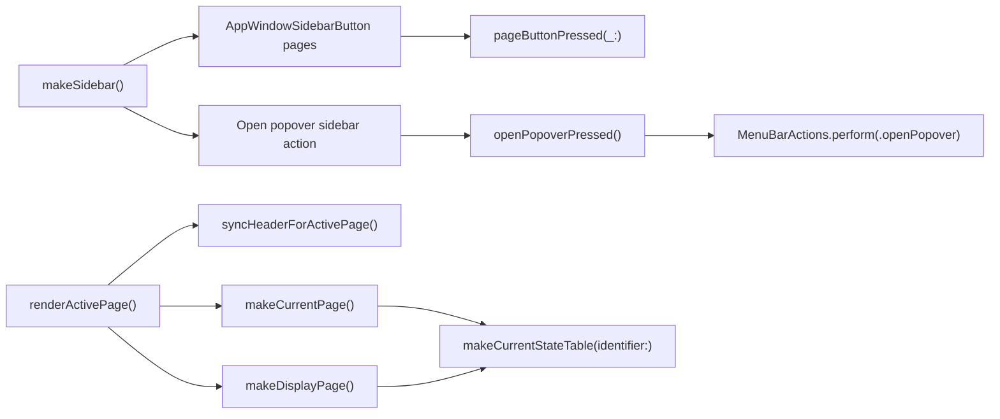

# Research

## Goal

Prepare the final implementation pass for the latest unified app-window cleanup request:

- merge overlapping `Current status` and `Display` current-state information instead of duplicating command surfaces;
- keep `Open popover` as a sidebar-level command instead of a `Current status` command;
- keep page-specific header actions aligned with their page title;
- harden the implementation with tests so the native app does not drift back toward noisy detail pages.

Mode: Pre-Plan Research Gate.

## Scope And Entry Points

Primary implementation surface:

- `InnosDimmer/UI/UnifiedAppWindowController.swift`
- `InnosDimmerTests/MenuBarStateTests.swift`

Supporting design and prior work:

- `InnosDimmer/DESIGN.md`
- `docs/design/window-redesign/2026-06-22-detail-density-toast-plan-first.md`
- `docs/design/window-redesign/2026-06-22-sidebar-navigation-plan-first.md`
- `docs/design/window-redesign/status-navigation-followup/review-all-in-one.md`

Out of scope:

- No new window redesign direction.
- No package/dependency work.
- No reintroduction of a separate settings window.
- No external research needed; the problem is local AppKit structure and tests.

## Relevant Files

- `InnosDimmer/UI/UnifiedAppWindowController.swift`
  - Owns `UnifiedAppWindowPage`, sidebar construction, page rendering, shared current-state table, header action syncing, and command routing.
- `InnosDimmerTests/MenuBarStateTests.swift`
  - Contains native app-window acceptance tests for sidebar layout, stable window size, detail pages, diagnostics, and command routing.
- `InnosDimmer/DESIGN.md`
  - Requires popover and app-window controls to share component language and keep the app utility-first.
- `docs/design/window-redesign/status-navigation-followup/review-all-in-one.md`
  - Records the review findings that this plan should address.

## Current Behavior

Confirmed facts from local code:

1. `Current status` no longer has local `Commands`.
2. `Display` and `Current status` both call `makeCurrentStateTable(identifier:)`, so the display/mode/brightness/warmth/automation data is already merged at the helper level.
3. `Open popover` is now rendered in the sidebar with identifier `app-window-sidebar-action:Open popover`.
4. The sidebar action is not stored in `commandButtons`, so `commandButtonForTesting(.openPopover)` cannot verify it.
5. `makeSidebar()` currently appends the sidebar action to the same `NSStackView` as page navigation after a generic `spacer()`.
6. The global header already hides Overview-only status chips on detail pages, keeps `Next 19:00` only on `Schedule`, and keeps `Export diagnostics` only on `Diagnostics`.

## Data Flow And Control Flow

## Existing Abstractions And Boundaries

- `MenuBarActions` is the correct boundary for the sidebar `Open popover` side effect.
- `UnifiedAppWindowPage` remains the canonical sidebar page list.
- `commandButtons` is scoped to page/body command buttons and should not be forced to own persistent sidebar actions.
- `makeCurrentStateTable(identifier:)` is the current shared component for overlapping status/current-state information.
- `AppWindowPageStructure` is the current testing surface for text and identifiers.

## Side Effects And Integration Points

- Clicking sidebar `Open popover` must not apply brightness or warmth commands.
- Rebuilding pages with `renderActivePage()` clears `commandButtons`, but the persistent sidebar action should remain available and routable.
- Adding a test hook must not expose new production behavior; it should only return the existing sidebar action button.
- Sidebar layout changes affect every page because the sidebar is persistent.

## Risk To Surrounding Systems

- If the sidebar action stays inside the same stack without a dedicated zone, future spacing edits can make it look like another navigation item.
- If only the identifier is tested, future refactors can break the `Open popover` click route while tests continue passing.
- If the current-state table helper is forked later, `Current status` and `Display` can diverge again and reintroduce duplicated status explanations.

## Do Not Duplicate Or Bypass

- Do not create another app-window controller or another popover-opening path.
- Do not route `Open popover` through dimming command machinery.
- Do not duplicate current-state rows in separate `Current status` and `Display` implementations.
- Do not reintroduce body-level `Settings`, `Pause automation`, or `Open popover` commands on `Current status`.

## Open Questions

- Should `Current status` remain as a separate sidebar page long-term? Current evidence says yes because the navigation model still includes it and tests assert it. Removing the page is a broader UX decision, not needed for this pass.

## Plan Implications

- Implementation can stay narrow:
  - add a dedicated sidebar action zone;
  - add a vertical spacer with vertical hugging;
  - store a weak reference to the persistent sidebar action for tests;
  - add route-level unit coverage.
- No HTML mockup is needed in this pass because the user requested direct app implementation of an already-reviewed native window direction, and the fix is structural rather than a new visual concept.

## Source Evaluation

- Local code evidence: Adopt. The relevant behavior is fully in `UnifiedAppWindowController.swift` and `MenuBarStateTests.swift`.
- Project design doc: Adopt. `DESIGN.md` directly governs the app-window component language.
- External sources: Not used. No current or external API claim affects this patch.

## Evidence

- `sed -n '450,535p' InnosDimmer/UI/UnifiedAppWindowController.swift`
- `sed -n '560,690p' InnosDimmer/UI/UnifiedAppWindowController.swift`
- `sed -n '735,820p' InnosDimmer/UI/UnifiedAppWindowController.swift`
- `rg -n "app-window-sidebar-action|Current status|Display current state|header-action|Open popover" InnosDimmerTests/MenuBarStateTests.swift`
- Date: 2026-06-22
