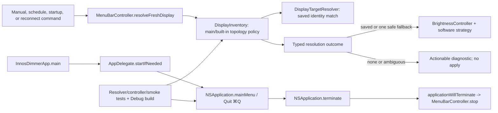

# Safe Display Fallback And Command-Q Reliability

## Goal

Keep InnosDimmer recoverable when its saved external monitor is unavailable: safely use one unambiguous alternate external monitor, never auto-target a main or built-in display, and allow normal active-app termination through `Command-Q` so the operator can relaunch the app.

## Requested Outcome

- If the saved target cannot be found, inspect the current display topology before rejecting the command.
- Automatically apply the original command only when exactly one eligible alternate external display exists.
- Preserve the saved target and return to it after reconnect.
- Refuse ambiguous multi-external selection and emit an actionable diagnostic.
- Add a standard `Quit InnosDimmer` AppKit menu command bound to `Command-Q`.
- Reuse the existing termination cleanup; do not create a global Quit hotkey.
- Implement test-first, review the plan before implementation, and finish with post-implementation review and verification.

## Codebase Evidence

- `Confirmed`: `docs/request-refiner-artifacts/2026-07-15-094631-refined-request.md` is the canonical execution brief for this work.
- `Confirmed`: `DisplayTargetResolver.resolve` returns `nil` for a missing saved display with stable hardware identity and does not select a different candidate.
- `Confirmed`: `DisplayInventory.resolveSelectedDisplay` filters only `mainDisplayID` when no target is saved; it has no independent built-in-display input.
- `Confirmed`: `MenuBarController.resolveFreshDisplay` receives only an optional display, so it cannot distinguish no candidates from multiple fallback candidates.
- `Confirmed`: runtime screen reconciliation already resolves the selected display again, allowing a retained saved preference to regain priority.
- `Confirmed`: InnosDimmer is an `LSUIElement` accessory app and does not create `NSApplication.mainMenu`.
- `Confirmed`: `AppDelegate.applicationWillTerminate` already calls `MenuBarController.stop()`.
- `Confirmed`: Quick disable resolves twice and caches before successful disable; Restore applies a cached display-specific command without fresh resolution.
- `Confirmed`: a connected fallback overlay is not cleared when the saved display reconnects because reconciliation only clears inactive displays.
- `Confirmed`: full Xcode is absent; current verification can use source inspection and `swiftc` checks where applicable, but XCTest/build claims remain blocked until Xcode is installed and selected.
- `Confirmed`: installed macOS SDK headers expose `CGDisplayIsBuiltin`, `NSApplication.mainMenu`, `NSApplication.terminate:`, and `NSMenuItem.keyEquivalentModifierMask`.
- `Inferred`: a typed inventory resolution outcome is the narrowest way to preserve ownership and produce correct fallback diagnostics.
- `Unverified`: an automated test can prove the menu contract and termination action wiring, but a fully hung main event loop can only be assessed manually and remains outside the guarantee.

## System Visualization



- changed nodes: `DisplayInventory`, bounded cleanup API in `BrightnessController`, `MenuBarController` resolution/transition sequencing, app-menu setup in `AppDelegate`, focused tests, operator documentation.
- preserved nodes: saved-identity matching in `DisplayTargetResolver`, persisted `SettingsSnapshot`, software overlay/gamma implementation, schedule policy, existing dimming shortcuts, termination cleanup.
- diagram notes: live topology stays in inventory; command application stays behind the existing controller and brightness boundaries.

## Related Files

- `docs/request-refiner-artifacts/2026-07-15-094631-refined-request.md`: canonical requirements and constraints.
- `docs/research/display-restore-warnings/research.md`: pre-plan evidence, alternatives, and SDK contracts.
- `docs/superpowers/specs/2026-07-15-safe-external-display-fallback-design.md`: approved display-fallback product design.
- `InnosDimmer/Services/DisplayTargetResolver.swift`: saved hardware identity matching; preserve unless a failing test proves a narrow change is required.
- `InnosDimmer/Services/DisplayInventory.swift`: owns active display discovery and main/built-in filtering; primary resolution-contract change.
- `InnosDimmer/Services/BrightnessController.swift`: owns software-state application and the new explicit old-display cleanup seam.
- `InnosDimmer/UI/MenuBarController.swift`: consumes resolution outcomes, updates runtime target, emits diagnostics, and applies commands.
- `InnosDimmer/App/InnosDimmerApp.swift`: application entry; expected to remain unchanged unless menu installation must occur before `startIfNeeded`.
- `InnosDimmer/App/AppDelegate.swift`: accessory activation, controller lifecycle, and minimal main-menu installation.
- `InnosDimmerTests/SoftwareDimmingControllerTests.swift`: existing inventory selection tests and new pure topology cases.
- `InnosDimmerTests/BrightnessControllerTests.swift`: focused explicit-display cleanup behavior and failure evidence.
- `InnosDimmerTests/MenuBarStateTests.swift`: command routing, persistence, diagnostics, ambiguity, and reconnect-priority coverage.
- `InnosDimmerTests/SmokeTests.swift`: accessory shell and Quit menu contract coverage.
- `docs/operator-guide.md`: operator-facing fallback, Quit, and Force Quit limits.

## Current Behavior

- A missing saved stable-hardware target returns no selected display even when one other external display exists.
- A failed operation emits generic missing-display/skipped-command diagnostics.
- Automatic mode without a saved target chooses the first non-main candidate even when multiple externals exist.
- Quick disable can resolve different displays for snapshot and disable; Restore can target the cached stale display.
- A fallback overlay can remain active after saved-target reconnect or after resolution becomes ambiguous/unavailable.
- The app has no standard main menu, so `Command-Q` has no Quit command to dispatch.
- Normal application termination already clears runtime dimming state and controller resources.

## Change Map

- likely files to edit: `DisplayInventory.swift`, `BrightnessController.swift`, `MenuBarController.swift`, `AppDelegate.swift`, four focused test files, and `docs/operator-guide.md`.
- likely functions/types to touch: `DisplayInventoryProviding.resolveSelectedDisplay`, `DisplayInventory.resolveSelectedDisplay`, `MenuBarController.resolveFreshDisplay`, `AppDelegate.startIfNeeded` or a small menu helper.
- state/data dependencies: persisted `DisplayTargetStore.selectedDisplay` remains read-only during fallback; `BrightnessState.display` tracks the runtime target and must not be dropped until abandoned software state is cleared or remains available for termination retry.
- side effects to preserve: overlay/gamma application, manual automation pause, schedule application, reconnect cleanup, diagnostics refresh, and termination cleanup.
- likely new files: none.
- remaining narrow unknowns before patch: whether `InnosDimmerApp.main` needs a one-line call-site change after testing the menu helper; default is AppDelegate-only ownership.

## Planned Changes

- Introduce a small Equatable display-resolution outcome at the inventory boundary with selected-source and unavailable-reason variants.
- Provide deterministic `mainDisplayID` and `builtInDisplayIDs` inputs to the static resolver; derive live built-in IDs with `CGDisplayIsBuiltin` in the concrete inventory.
- Preserve existing saved identity matching before considering fallback, but treat zero and multiple eligible externals as unavailable in both saved and no-saved modes.
- Use exactly one eligible external candidate as a temporary fallback; preserve the stored selection.
- Block zero/multiple eligible fallback candidates with different diagnostic reasons.
- Avoid repeating the fallback-selected diagnostic when the runtime display has not changed.
- Resolve Quick disable once, cache only after successful disable, and re-resolve Restore before applying cached values.
- Apply a replacement target first, then clear the prior fallback through `BrightnessController`; on no/ambiguous resolution, clear the tracked fallback before dropping runtime ownership and retain it for retry if cleanup fails.
- Install an idempotent minimal application menu with `Quit InnosDimmer`, `q`, `.command`, target `NSApplication`, action `terminate:`.
- Document that `Command-Q` requires a responsive event loop and that Force Quit remains the recovery for a complete hang.

## Review Notes

- risk: a built-in display can be active without being main; both predicates must be enforced.
- risk: arrays can contain multiple external displays; automatic selection must never depend on ordering, whether or not a saved target exists.
- risk: changing the inventory protocol touches the test double and every static inventory test.
- risk: diagnostics emitted from resolution can refresh the app window; do not introduce resolution recursion.
- risk: main-menu tests share global `NSApp`; installation must be idempotent and assertions should inspect the menu created by the current delegate start.
- risk: global `NSApp.mainMenu` tests can leak state across tests; snapshot and restore the previous menu with `defer` and disable parallel test execution for this suite.
- assumption: a matching explicitly saved display remains eligible even if it is currently main/built-in; only automatic choice is restricted, and changing explicit selection policy is out of scope.
- unanswered questions: none that block implementation after the latest explicit end-to-end execution request.

## Plan Quality Check

- Alternative considered: infer fallback by comparing optional values inside `MenuBarController`. Rejected because it duplicates topology ownership and cannot represent ambiguity precisely.
- Alternative considered: install Quit as a Carbon global hotkey or visible popover button. Rejected because the request is standard `Command-Q`, global interception is broader, and UI expansion is unnecessary.
- Why this plan: it changes the smallest existing ownership boundaries that have enough information to enforce safety and reuse cleanup.
- Tradeoff: a typed result changes the inventory protocol and tests, but buys explicit safety/diagnostic states and keeps persisted settings unchanged.
- Rollback: revert the two implementation commits independently. No persisted schema or external API migrates; reverting Commit 1 restores optional selection and old transition behavior, while reverting Commit 2 removes only the installed menu/documentation.
- Observability: preserve warnings and make them more specific; fallback, no eligible target, ambiguity candidates, apply failure, and cleanup failure remain diagnostic events rather than silent branches.
- What this plan may still miss: real-world display topology can change between resolution and software apply; the existing software strategy remains the final availability check, and cleanup failure must preserve retry ownership.
- When to stop and revise: stop if fallback requires persisting a new target, if a standard menu cannot dispatch while the accessory app is active, or if focused tests reveal that explicit saved-display selection currently relies on optional-only behavior not represented by the proposed outcome.

## Skill Routing Manifest

| Phase | Required skills | Optional skills | Evidence |
| --- | --- | --- | --- |
| Commit 1: Add safe typed external-display fallback | `superpowers:test-driven-development`, `systematic-debugging` | `없음` | inventory, brightness/controller transition code, focused tests, diagnostics assertions |
| Commit 2: Add standard Command-Q termination | `superpowers:test-driven-development` | `computer-use-operator` | `AppDelegate.swift`, `SmokeTests.swift`, local AppKit SDK menu/termination contract |
| Final Gate | `review-all-in-one`, `테스트`, `superpowers:verification-before-completion` | `computer-use-operator` | scoped diff review, focused tests, Debug build-for-testing, and optional native manual QA |

## Implementation Plan

### Commit 1: Add safe typed external-display fallback

- target files:
  - `InnosDimmer/Services/DisplayInventory.swift`
  - `InnosDimmer/Services/BrightnessController.swift`
  - `InnosDimmer/UI/MenuBarController.swift`
  - `InnosDimmerTests/SoftwareDimmingControllerTests.swift`
  - `InnosDimmerTests/BrightnessControllerTests.swift`
  - `InnosDimmerTests/MenuBarStateTests.swift`
- changes:
  - Write failing pure tests for saved match, one external fallback, main-only, non-main built-in-only, and multiple-external ambiguity both with and without a saved target.
  - Write failing controller tests proving fallback application, saved-selection preservation, deterministic actionable diagnostics, ambiguity blocking, saved-target priority after reconnect, and fallback cleanup on saved/ambiguous/unavailable transitions.
  - Write failing sequencing tests proving Quick disable resolves once and caches only after successful disable, while Restore freshly resolves the target, reuses only cached values, and clears its snapshot only after successful restore.
  - Add a typed result and source/failure enums in `DisplayInventory.swift`; keep `DisplayTargetResolver` focused on saved identity matching.
  - Change `DisplayInventoryProviding` and its test double to return the typed result.
  - Filter fallback candidates using both `mainDisplayID` and `builtInDisplayIDs`; derive the live built-in set with `CGDisplayIsBuiltin`.
  - Remove or redirect the unused main-only `preferredExternalDisplay()` helper so no unsafe eligibility policy remains.
  - Add a bounded explicit-display cleanup method to `BrightnessController`, with a result that lets the controller retain retry ownership on failure.
  - Update `MenuBarController` to consume the result, mutate only runtime state, emit transition-aware fallback diagnostics, and block ambiguity without reaching the dimming backend.
  - On successful target replacement, clear the old software overlay after the new apply succeeds. On unavailable resolution, clear the tracked fallback before setting runtime display to `nil`; keep it tracked if cleanup fails.
- code snippets:
  - `DisplayInventory.swift` proposed shape (illustrative; exact case labels may be shortened without changing semantics):

    ```swift
    enum DisplayResolution: Equatable {
        case selected(DisplayIdentity, source: DisplayResolutionSource)
        case unavailable(DisplayResolutionFailure)
    }

    enum DisplayResolutionSource: Equatable {
        case saved
        case automatic
        case fallback(saved: DisplayIdentity)
    }

    enum DisplayResolutionFailure: Equatable {
        case noEligibleExternalDisplay
        case multipleExternalDisplays(candidates: [DisplayIdentity])
    }
    ```

  - `DisplayInventory.resolveSelectedDisplay` proposed decision seam:

    ```swift
    let eligible = candidates.filter {
        $0.cgDisplayID != mainDisplayID && !builtInDisplayIDs.contains($0.cgDisplayID)
    }
    if let saved, let match = DisplayTargetResolver.resolve(saved: saved, candidates: candidates) {
        return .selected(match, source: .saved)
    }
    // saved missing or absent: exactly one eligible external; zero/many remain unavailable
    ```

  - `MenuBarController.resolveFreshDisplay`: switch on the typed outcome; call `displayTargetStore.load()` but never `saveSelectedDisplay` for fallback. Sort candidate diagnostics by stable display key/name before formatting.
  - `MenuBarController.applyCommand`: retain the prior display/mode, apply the replacement first, then clear the old software state only when target changes and the old mode requires it.
  - Quick disable/Restore: construct both commands from one resolution per operation; replace the cached command's display on Restore rather than reusing its stale identity.
- tradeoff:
  - chosen: typed inventory outcome with explicit topology inputs.
  - alternative: optional display plus controller inference.
  - cost/risk: protocol/test-double churn and more cases.
  - why acceptable: every new case represents a required safety or diagnostics distinction and remains local to the display boundary.
  - revisit when: future requirements need ranked multi-display fallback or explicit built-in selection policy changes.
- verification:
  - Preflight: `xcode-select -p` and `xcodebuild -version`. If full Xcode remains unavailable, record XCTest/build verification as blocked and do not claim passing or ready.
  - With Xcode: `DEVELOPER_DIR=/Applications/Xcode.app/Contents/Developer xcodebuild -project InnosDimmer.xcodeproj -scheme InnosDimmer -configuration Debug -destination 'platform=macOS' -derivedDataPath /tmp/InnosDimmerDerivedData -parallel-testing-enabled NO test -only-testing:InnosDimmerTests/SoftwareDimmingControllerTests -only-testing:InnosDimmerTests/BrightnessControllerTests -only-testing:InnosDimmerTests/MenuBarStateTests CODE_SIGNING_ALLOWED=NO`.
  - TDD baseline: genuinely RED tests are saved-missing plus one-external fallback, no-saved plus two-external ambiguity, explicit cleanup transition, single-resolution Quick disable, fresh-resolution Restore, and deterministic diagnostic reason. Existing main-only behavior may remain a green characterization test.
  - assertions: no command reaches the software strategy for main/built-in/ambiguous cases; saved snapshot remains unchanged; fallback diagnostics are emitted once per transition; ambiguity includes every sorted candidate and a selection action.
  - transition oracles: fallback→saved produces commands `[fallback, saved]` and clears `[fallback]`; fallback→ambiguous/unavailable performs no additional apply, clears fallback, and sets runtime display to `nil`; cleanup failure retains fallback ownership for termination retry.
- success criteria:
  - Exactly one eligible alternate external display receives the original command.
  - Main and all built-in displays are excluded from automatic fallback.
  - Multiple eligible external displays do not receive a command.
  - Saved preference remains persisted and regains priority on the next resolution after reconnect.
  - A no-saved state also refuses multiple external displays instead of selecting by array order.
  - Saved hardware match remains intact and Restore re-resolves to it after reconnect.
  - Quick disable never caches an unapplied or differently resolved target, and abandoned fallback overlays are cleared without clearing the old state before a replacement succeeds.
- stop conditions:
  - Tests reveal that live built-in classification cannot be deterministically injected without broadening `DisplayIdentity` persistence.
  - A required change would persist the temporary fallback or bypass existing command application.
  - Cleanup cannot be expressed behind `BrightnessController` without leaking direct strategy access into `MenuBarController`.

### Commit 2: Add standard Command-Q termination

- target files:
  - `InnosDimmer/App/AppDelegate.swift`
  - `InnosDimmer/App/InnosDimmerApp.swift` only if the failing test proves startup ordering requires it
  - `InnosDimmerTests/SmokeTests.swift`
  - `docs/operator-guide.md`
- changes:
  - Write a failing isolated menu-factory test and an integration smoke test that starts a fresh `AppDelegate` and finds exactly one `Quit InnosDimmer` in `NSApp.mainMenu`.
  - Assert key equivalent `q`, modifier mask `.command`, action `#selector(NSApplication.terminate(_:))`, and target identity `NSApp`.
  - Snapshot `NSApp.mainMenu`, replace it for the test, restore it with `defer`, and invoke termination cleanup on the test delegate.
  - Install a titled minimal menu once inside the existing `didStart` guard without changing `.accessory` activation policy; prove repeated startup does not duplicate the controller or Quit item.
  - Keep `applicationWillTerminate` and `MenuBarController.stop()` unchanged; the menu action routes through them.
  - Document active-app `Command-Q` behavior and Force Quit for a fully unresponsive event loop.
- code snippets:
  - `AppDelegate.swift` proposed menu helper (illustrative):

    ```swift
    private func installApplicationMenu(on application: NSApplication) {
        let mainMenu = NSMenu(title: "InnosDimmer")
        let appItem = NSMenuItem(title: "InnosDimmer", action: nil, keyEquivalent: "")
        let appMenu = NSMenu(title: "InnosDimmer")
        let quit = NSMenuItem(
            title: "Quit InnosDimmer",
            action: #selector(NSApplication.terminate(_:)),
            keyEquivalent: "q"
        )
        quit.keyEquivalentModifierMask = [.command]
        quit.target = application
        appMenu.addItem(quit)
        appItem.submenu = appMenu
        mainMenu.addItem(appItem)
        application.mainMenu = mainMenu
    }
    ```
- tradeoff:
  - chosen: standard AppKit menu command with explicit target.
  - alternative: global Carbon shortcut or visible Quit button.
  - cost/risk: the accessory app owns a minimal main menu that is not normally visible.
  - why acceptable: AppKit still uses the menu command for standard key-equivalent dispatch, and no global interception is introduced.
  - revisit when: the product later needs a visible full application menu or popover Quit control.
- verification:
  - Preflight full Xcode as in Commit 1. With Xcode: run `SmokeTests` and `MenuBarStateTests` with `-parallel-testing-enabled NO`, then Debug `build-for-testing` using the same project/scheme/destination/derived-data/code-signing flags.
  - Include `testMenuBarControllerStopClearsCurrentSoftwareState` in the focused cleanup evidence.
  - Required native QA for an end-to-end claim: activate the dashboard and separately the popover, press `Command-Q`, confirm process exit and successful relaunch. If this cannot be run, mark key dispatch unverified even when the structural menu tests pass.
- success criteria:
  - `NSApp.mainMenu` contains the exact Quit command contract.
  - `Command-Q` uses normal `NSApplication.terminate` handling while the app is responsive and active.
  - Existing termination cleanup remains the only cleanup path.
  - Operator guide states the complete-hang limitation accurately.
- stop conditions:
  - The menu test requires replacing global `NSApp` or intercepting termination in a way that would weaken production behavior.
  - `Command-Q` only works by registering a global hotkey; reject that direction and revisit the AppKit setup.

## Operator 결정 필요 사항

- 상태: 없음
- 적용한 기본값:
  - 외부 모니터 대체 정책은 사용자가 승인한 “정확히 한 대만 자동 적용, 여러 대면 보류, main/built-in 제외”를 사용한다.
  - 최신 사용자는 이 문서 기반의 전 단계 구현 실행을 명시했으므로, 표준 AppKit Quit 메뉴 설계도 구현 승인으로 본다.
  - 완전히 멈춘 프로세스는 `Command-Q` 보장 밖이며 Force Quit 안내로 남긴다.

## 검토용 결과물

- HTML: 해당 없음
- 계획 MD: `docs/plans/2026-07-15-display-fallback-and-command-q-plan.md`
- 테스트 링크:
  - Localhost: 해당 없음 — native macOS application이며 HTTP surface가 없다.
  - Deploy: 해당 없음 — 배포 요청이 아니며 배포 가능한 binary URL이 없다.
- 상태: planned
- 실제 동작:
  - 구현 후 `xcodebuild` focused tests, Debug build-for-testing, 그리고 가능한 경우 로컬 앱의 native `Command-Q`/display topology QA로 확인한다.
- Mock:
  - 자동 테스트의 `DisplayIdentity` fixtures와 recording strategies만 사용하며 사용자-facing mock UI는 만들지 않는다.

## 후행 실행

- 기본 실행: 구현커밋
- 계획 경로 처리: 구현커밋이 직전 대화, 계획 링크, active plan context에서 자동 탐지
- 모호할 때: 후보 목록을 보여주고 Operator에게 선택 요청

## HTML 생략 보고서

- 판정: 생략 가능
- 생략 사유:
  - 네이티브 AppKit 메뉴와 디스플레이 선택 정책을 수정하는 동작/신뢰성 작업이며 시각 디자인 판단이 없다.
  - 정적 HTML은 CoreGraphics display topology, AppKit key equivalent, application termination을 재현할 수 없다.
- 대체 검토물:
  - 이 계획 문서, focused XCTest 결과, Debug build-for-testing 로그, native manual QA 결과.
- 테스트 링크:
  - Localhost: 해당 없음 — native app.
  - Deploy: 해당 없음 — deploy 미요청.
- 사용자가 바로 열어볼 링크:
  - `docs/plans/2026-07-15-display-fallback-and-command-q-plan.md`

## 구현 전 검토 Findings

- `review-all-in-one`: 조건부 적절. 다음 blocker/important findings를 계획에 반영함.
  - Blocker: canonical contract forbids guessing among multiple externals even without a saved target. Decision table and tests now use `0 → unavailable`, `1 → selected`, `2+ → ambiguous` for both saved-missing and no-saved states.
  - Blocker: an earlier fallback overlay can survive saved reconnect or ambiguity. Added explicit `BrightnessController` cleanup, apply-new-then-clear-old ordering, failure retry ownership, and three transition oracles.
  - Important: Quick disable resolves twice/caches too early and Restore targets stale cached identity. Added single-resolution sequencing, cache-on-success, and fresh Restore resolution tests.
  - Important: global `NSApp` tests require save/restore isolation, nonparallel execution, idempotence, titled menus, and double-start coverage.
  - Important: structural menu wiring is not end-to-end key dispatch. Native active-dashboard/popover exit/relaunch QA is required for a verified `Command-Q` claim.
  - Verification blocker: full Xcode is not installed/selected. The workflow must preflight and report XCTest/build/native QA as blocked rather than passing until the toolchain is available.
- `해결전략검토`: 조건부 적절 (local code/SDK evidence: strong; end-to-end verification evidence: unavailable).
  - 가장 강한 반대: full Xcode 부재로 RED→GREEN XCTest, build-for-testing, 실제 key-equivalent dispatch를 현재 환경에서 입증할 수 없다. 따라서 구현은 가능하지만 `passing`, `ready`, 완전 검증 완료로 판정할 수 없다.
  - Root-cause fit: typed inventory outcome은 후보 수/내장 패널 오분류를 직접 해결하고, single-resolution Quick disable/fresh Restore/explicit cleanup은 확인된 stale-state causal chain을 직접 끊는다. 표준 AppKit 메뉴는 누락된 `Command-Q` command surface를 직접 복구한다.
  - 더 작은 대안 검토: controller의 optional 추론은 ambiguity 원인을 표현하지 못하고, global Carbon hotkey는 범위를 넓히며, 기존 `clearCurrentSoftwareState`만으로는 여전히 연결된 이전 fallback을 지정해 지울 수 없어 채택하지 않는다.
  - Blast radius/rollback: inventory protocol, controller sequencing, brightness cleanup, startup menu에 한정한다. persisted schema와 외부 dependency가 없고 두 구현 commit을 독립 revert할 수 있다.
  - Kill criteria: warning suppression, fallback 저장, 후보 배열 순서 선택, direct strategy access, 새 apply 전 이전 상태 제거, 테스트 assertion 완화가 필요해지면 구현을 중단하고 재설계한다.
  - What would change the verdict: full Xcode에서 focused suites와 Debug build-for-testing이 통과하고, active dashboard/popover 양쪽에서 `Command-Q` 종료·재실행을 확인하면 `적절`로 상향한다.
- 반영 규칙: blocker와 실제 구현 방향을 바꾸는 important finding은 해당 Commit의 변경/검증/중단 조건에 직접 반영한다.

## 구현 후 검토 리스트

- 회귀 확인:
  - Saved hardware identity reconnect remains preferred.
  - No-saved one-external behavior remains compatible; no-saved multi-external behavior intentionally becomes ambiguous.
  - Main/built-in/ambiguous cases never reach software dimming.
  - Quick disable and Restore resolve once per operation and abandoned fallback overlays do not remain active.
  - Schedule, manual override, diagnostics refresh, and termination cleanup remain intact.
- 검증 확인:
  - Focused inventory/controller/smoke tests.
  - Debug `build-for-testing`.
  - Exact diagnostic assertions.
  - Native `Command-Q` exit/relaunch and alternate-monitor QA when hardware is available.
- 리뷰 관점:
  - `review-all-in-one`: ownership leakage, stale saved state, ambiguity, global `NSApp` test isolation, missing edge cases.
  - `테스트`: package the verified commits, push, and report native manual-QA limitations without pretending an HTTP URL exists.
- Operator 재확인:
  - On hardware, confirm the fallback targets the intended alternate external display and reconnect returns to the saved display.
  - Confirm `Command-Q` exits the active app and it can be relaunched.

## Validation

- manual checks:
  - With one alternate external display, disconnect/unavailable the saved target, issue a brightness command, inspect the fallback diagnostic, reconnect the saved target, and confirm it regains priority.
  - Activate InnosDimmer, press `Command-Q`, confirm the process exits, relaunch, and confirm the app starts normally.
- lint/build/test scope:
  - Toolchain preflight first; without full Xcode, do not claim XCTest/build success.
  - Focused `SoftwareDimmingControllerTests`, `MenuBarStateTests`, and `SmokeTests` during TDD.
  - Focused `BrightnessControllerTests` for explicit old-display cleanup and failure handling.
  - Full Debug `build-for-testing` after both commits.
- scenario-to-surface checks:
  - Saved match -> resolver -> selected saved target.
  - Saved missing + one eligible external -> temporary fallback -> normal command apply.
  - Saved missing + zero/multiple eligible -> diagnostics -> no apply.
  - Active app `Command-Q` -> main menu -> `NSApplication.terminate` -> existing cleanup.
