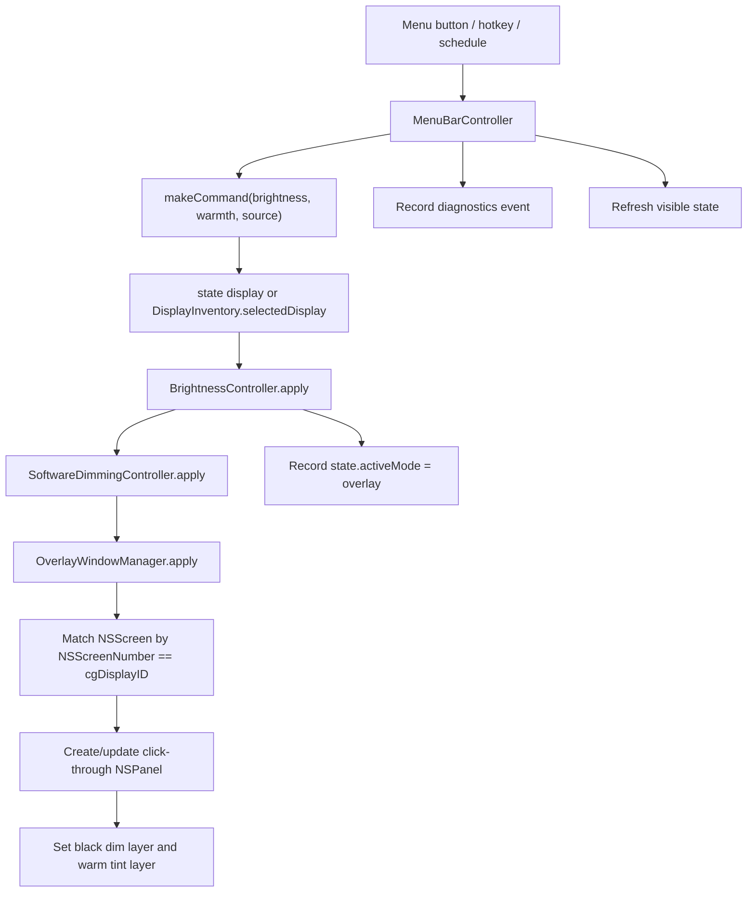
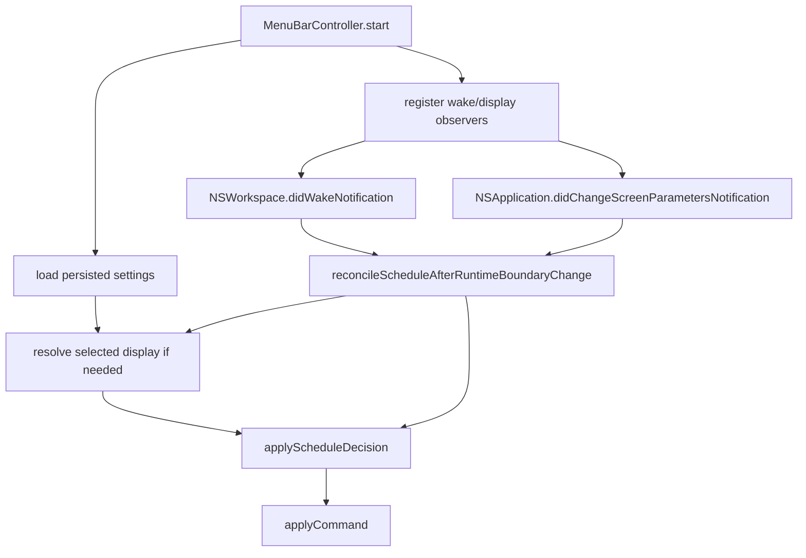
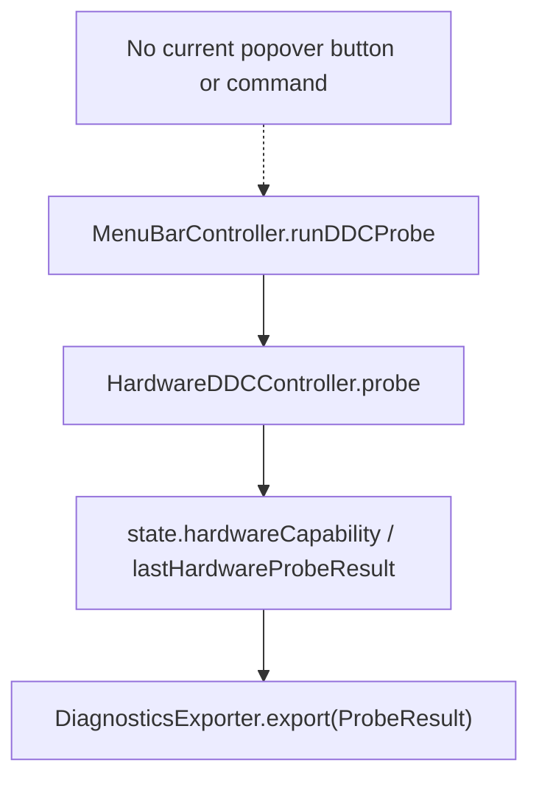

# Research

Date: 2026-06-18
Mode: Pre-Plan Research Gate
Project: `/Users/moonsoo/projects/InnosDimmer`
User direction: pivot away from direct monitor control and focus on making the screen look darker through software.

## Goal

Define the evidence base for a software-only dimming pivot before writing the next implementation plan.

The research must answer:

- What hardware/DDC code can be removed now.
- What code should remain until the software path is proven stable.
- What code can be removed after the software implementation is complete.
- Which macOS software dimming techniques are viable for this personal M1 Mac + direct HDMI + INNOS external monitor setup.
- Which implementation hypothesis should be tried first, and what should be tried next if that hypothesis is falsified.

The intended product outcome is not real monitor backlight control. The intended outcome is a reliable personal macOS menu bar app that reduces perceived brightness and adjusts warmth on the selected secondary display.

## Scope And Entry Points

### Local Scope

Read and evaluate the current InnosDimmer codebase after the recent software-only pivot:

- App/menu runtime entry point: `/Users/moonsoo/projects/InnosDimmer/InnosDimmer/UI/MenuBarController.swift`
- Menu popover: `/Users/moonsoo/projects/InnosDimmer/InnosDimmer/UI/MenuBarPopoverView.swift`
- Brightness policy: `/Users/moonsoo/projects/InnosDimmer/InnosDimmer/Services/BrightnessController.swift`
- Software dimming: `/Users/moonsoo/projects/InnosDimmer/InnosDimmer/Services/SoftwareDimmingController.swift`
- Overlay window path: `/Users/moonsoo/projects/InnosDimmer/InnosDimmer/Services/OverlayWindowManager.swift`
- Gamma path: `/Users/moonsoo/projects/InnosDimmer/InnosDimmer/Services/GammaDimmingController.swift`
- Display selection: `/Users/moonsoo/projects/InnosDimmer/InnosDimmer/Services/DisplayInventory.swift`
- Settings persistence: `/Users/moonsoo/projects/InnosDimmer/InnosDimmer/Services/DisplayTargetStore.swift`
- State/domain models: `/Users/moonsoo/projects/InnosDimmer/InnosDimmer/Domain/*.swift`
- Diagnostics/verification: `/Users/moonsoo/projects/InnosDimmer/InnosDimmer/Diagnostics/*.swift`
- Tests: `/Users/moonsoo/projects/InnosDimmer/InnosDimmerTests/*.swift`
- Local docs: `/Users/moonsoo/projects/InnosDimmer/README.md`, `/Users/moonsoo/projects/InnosDimmer/docs/*.md`

### External Scope

Use official Apple documentation and community/product evidence to evaluate macOS software dimming approaches:

- AppKit overlay windows and collection behaviors.
- CoreGraphics gamma/display transfer tables.
- Quartz display fade reservations.
- Display change and wake notifications.
- Existing macOS display-control apps that use DDC, gamma, overlay/shade, or combined dimming.

## Relevant Files

### Current User-Facing Software Path

- `/Users/moonsoo/projects/InnosDimmer/InnosDimmer/UI/MenuBarController.swift`
  - Starts the status item and popover.
  - Resolves the selected display.
  - Applies menu, hotkey, schedule, quick disable, and restore commands.
  - Observes wake and display-parameter changes.
  - Still contains dead DDC probe internals.
- `/Users/moonsoo/projects/InnosDimmer/InnosDimmer/UI/MenuBarPopoverView.swift`
  - Shows the current mode, selected display, brightness, warmth, automation, schedule, shortcut, diagnostics, and command buttons.
  - No longer exposes a DDC probe button.
- `/Users/moonsoo/projects/InnosDimmer/InnosDimmer/Services/BrightnessController.swift`
  - Current `apply(_:)` routes normal commands to software dimming.
  - Still stores a hardware strategy and private hardware application path that is no longer reachable.
- `/Users/moonsoo/projects/InnosDimmer/InnosDimmer/Services/SoftwareDimmingController.swift`
  - Delegates `apply` to `OverlayWindowManager`.
  - Delegates `clear` to overlay clear and gamma clear.
- `/Users/moonsoo/projects/InnosDimmer/InnosDimmer/Services/OverlayWindowManager.swift`
  - Creates click-through `NSPanel` overlays per display ID.
  - Uses `NSScreenNumber` to match `DisplayIdentity.cgDisplayID`.
  - Applies black dimming and warm tint through layers.
- `/Users/moonsoo/projects/InnosDimmer/InnosDimmer/Services/GammaDimmingController.swift`
  - Currently a no-op stub with only `clear(display:)`.

### Hardware/DDC Code Still Present

- `/Users/moonsoo/projects/InnosDimmer/InnosDimmer/Services/HardwareDDCController.swift`
  - Contains `DDCAdapter`, `NoopDDCAdapter`, safe probe, and hardware write abstraction.
  - No user-facing path currently calls the probe.
- `/Users/moonsoo/projects/InnosDimmer/InnosDimmer/Domain/HardwareCapability.swift`
  - Still part of `BrightnessState` and diagnostics snapshots.
- `/Users/moonsoo/projects/InnosDimmer/InnosDimmer/Domain/ProbeStep.swift`
  - Supports DDC probe diagnostics.
- `/Users/moonsoo/projects/InnosDimmer/InnosDimmer/Diagnostics/DiagnosticsExporter.swift`
  - Exports both DDC probe results and general diagnostics snapshots.
- `/Users/moonsoo/projects/InnosDimmer/InnosDimmer/Diagnostics/CapabilityProbe.swift`
  - Thin wrapper around `ProbeResult`.
- `/Users/moonsoo/projects/InnosDimmer/InnosDimmerTests/HardwareDDCControllerTests.swift`
  - Tests DDC probe/write behavior even though the product direction is now software-only.

### Docs With Mixed State

- `/Users/moonsoo/projects/InnosDimmer/docs/operator-guide.md`
  - Correctly says software overlay dimming is the primary and only user-facing dimming path.
- `/Users/moonsoo/projects/InnosDimmer/docs/release-notes-local.md`
  - Correctly says hardware brightness control is intentionally not user-facing.
- `/Users/moonsoo/projects/InnosDimmer/docs/qa-matrix.md`
  - Correctly focuses on overlay QA and platform-blocked disclosure.
- `/Users/moonsoo/projects/InnosDimmer/README.md`
  - Still says the app is hardware-first and describes DDC as a brightness mode. This is now stale.
- `/Users/moonsoo/projects/InnosDimmer/docs/2026-06-18-completion-plan-first.md`
  - Still reflects the previous hardware-first plan and should be treated as historical, not current execution policy.
- `/Users/moonsoo/projects/InnosDimmer/docs/ddc-probe-notes.md`
  - Should remain archived reference only if DDC code is retained temporarily.

## Current Behavior

### Confirmed Local Behavior

- `BrightnessController.apply(_:)` always calls `applySoftware(command, reason: .softwareOnly)` for normal commands.
- Forced diagnostic software mode still uses `.forcedForDiagnostics`.
- `applyHardware(_:)` exists but is not called from `apply(_:)`.
- `MenuBarCommand` no longer includes a DDC probe command.
- `MenuBarPopoverView` no longer renders a DDC probe button.
- `MenuBarController.perform(_:)` no longer switches on a DDC probe command.
- `MenuBarController` still has:
  - `private let hardwareDDCController`
  - `runDDCProbe()`
  - `probeExportNote(for:)`
  - `diagnosticsSeverity(for capability:)`
  These have no current user entry point.
- `OverlayWindowManager` is the only real dimming implementation.
- `GammaDimmingController` is a stub.
- `DisplayInventory` refuses to silently select the main display when no external display exists.
- `DisplayTargetResolver` uses stable hardware identity when vendor/model/serial are available.
- Tests already assert that brightness commands route to software and do not wait for DDC.

### Current Product Mismatch

The implementation has been pivoted to software-only in behavior, but stale code and docs still imply a hardware-first product in several places:

- README still describes a hardware-first app.
- `DimmingMode.hardwareDDC` is still a normal mode label.
- `BrightnessState` still stores `hardwareCapability` and `lastHardwareProbeResult`.
- `BrightnessController` still accepts `HardwareBrightnessStrategy`.
- DDC probe/export/test code still exists.

This mismatch is not immediately harmful because the user-facing popover no longer exposes DDC, but it will confuse future planning and tests unless the next plan explicitly cleans it up.

## Data Flow And Control Flow

### Current Software Dimming Flow



### Current Schedule/Wake/Reconnect Flow



### Dead DDC Flow

The following flow exists in code but is no longer reachable from user UI:



## Existing Abstractions And Boundaries

### Boundaries To Preserve

- `BrightnessController` should remain the policy boundary for applying a brightness command.
  - UI, schedule, and hotkeys should not call overlay or gamma directly.
- `SoftwareDimmingController` should remain the software strategy boundary.
  - Overlay and possible gamma/color-table strategies should stay behind it.
- `OverlayWindowManager` should remain the AppKit window boundary.
  - It owns `NSPanel`, `NSWindow.Level`, collection behavior, layer updates, and display frame lookup.
- `DisplayInventory` and `DisplayTargetResolver` should remain the display-selection boundary.
  - Avoid choosing the main display silently.
  - Prefer stable hardware identity when available.
- `DisplayTargetStore` should remain the settings persistence boundary.
  - Schema migrations should happen here or adjacent to settings snapshot code, not in UI.
- `HotkeyManager` and shortcut validation should remain the global shortcut boundary.
  - Do not create an additional ad hoc event-tap path for the same shortcuts.
- `VerificationMatrix` should remain the truth gate for claims like "all requested contexts are handled."

### Boundaries To Retire Or Shrink

- `HardwareBrightnessStrategy` should be removed from `BrightnessController` once software-only policy is fully accepted.
- `HardwareDDCController` should be moved to archive or removed after the software path is stable and docs no longer reference hardware.
- `HardwareCapability`, `ProbeStep`, `ProbeResult`, and `lastHardwareProbeResult` should be removed from the runtime state once persistence migration is planned.
- `DimmingMode.hardwareDDC` should be removed from user-facing labels after tests/docs no longer need it.

## Side Effects And Integration Points

### Overlay Side Effects

- A top-level transparent panel can obscure visual content even when it is click-through.
- `.screenSaver` level and `.fullScreenAuxiliary` can help with visibility, but full-screen Spaces, Stage Manager, DRM playback, and presentation contexts still require real visual QA.
- Overlay dimming may not dim the hardware cursor. Community evidence from MonitorControl shade mode explicitly reports cursor-related drawbacks.
- Overlay may appear in screen sharing or screenshots depending the capture path.
- Overlay does not reduce panel backlight power or improve LCD black level. It only changes perceived brightness.
- If overlay opacity can reach too high a value, the user can effectively black out the screen. Quick disable and minimum brightness limits are safety requirements, not optional polish.

### Gamma/Color Table Side Effects

- Gamma/color table changes affect display output more globally than a window overlay and may include surfaces a window overlay misses.
- Gamma can conflict with Night Shift, True Tone, f.lux, color profiles, HDR, calibration tools, and other brightness apps.
- Gamma changes must snapshot and restore the original transfer table per display.
- Gamma changes can be reset by the OS or other apps.
- Recent Apple Developer Forum evidence suggests gamma APIs can return success but fail to visibly apply on some newer Mac hardware. This does not prove failure on the user's M1 Mac, but it increases risk.

### Display Fade Side Effects

- Quartz display fade APIs are designed around reserving fade hardware and performing fade operations.
- This is useful for transitions or temporary blackout effects, not as the main persistent per-display brightness control.

### Persistence Side Effects

- `BrightnessState` is part of `SettingsSnapshot`.
- Removing `hardwareCapability` and `lastHardwareProbeResult` without a schema/migration decision can invalidate saved settings.
- Since `DisplayTargetStore.load()` falls back to `.defaultSnapshot()` if decoding or validation fails, an unplanned model deletion could silently reset user schedule/shortcuts.

### Diagnostics Side Effects

- Removing DDC diagnostics is safe only if the app still exposes enough software diagnostics:
  - selected display
  - overlay active/blocked
  - latest brightness/warmth command
  - wake/reconnect handling
  - verification status for known difficult contexts

## Risk To Surrounding Systems

### High Risk

- Directly calling overlay/gamma from UI would bypass `BrightnessController`, duplicate command policy, and make schedule/hotkey/manual behavior inconsistent.
- Removing hardware fields from `BrightnessState` without migration can reset settings due to decode fallback.
- Adding gamma as the default path can conflict with other color-management tools and can be harder to recover from if it makes the display too dark.
- Treating overlay success on the desktop as success in all contexts would overclaim. Full-screen, DRM, screen sharing, presentation, sleep/wake, and HDMI reconnect must be checked separately.

### Medium Risk

- Leaving dead DDC code in runtime classes keeps the mental model inconsistent and can mislead future tests.
- Leaving README hardware-first language can cause future implementation to reintroduce hardware-first behavior by mistake.
- Removing DDC files too early can break tests and diagnostics snapshots before the software-only state model is simplified.

### Low Risk

- Removing unreachable `MenuBarController.runDDCProbe()` and `hardwareDDCController` injection is low risk because there is no UI command path.
- Removing `BrightnessController` hardware injection is low risk once tests are updated to assert software-only behavior via a software strategy spy.
- Marking DDC docs as archived/historical is low risk and improves consistency.

## Do Not Duplicate Or Bypass

- Do not bypass `BrightnessController.apply(_:)`.
- Do not call `OverlayWindowManager.apply` directly from menu, hotkey, schedule, or settings UI.
- Do not add a second display selection system outside `DisplayInventory` and `DisplayTargetResolver`.
- Do not add a second shortcut registration path outside `HotkeyManager`.
- Do not add a separate schedule timer path outside `ScheduleEngine` and `ScheduleTimerController`.
- Do not add new package dependencies for MVP software dimming; AppKit/CoreGraphics/Foundation are enough.
- Do not use private Night Shift APIs or private display frameworks for the core path.
- Do not keep user-facing strings that imply real monitor backlight control.
- Do not mark platform-limited contexts as pass without notes in `VerificationMatrix`.

## Open Questions

- Does the overlay remain visible on the user's INNOS external display in full-screen Spaces on the current macOS version?
- Does the overlay appear in the user's screen sharing/recording output, and is that desired?
- Does the overlay dim browser full-screen video and DRM/protected playback enough for the user's actual use?
- Should gamma/color-table dimming be shipped as an advanced optional mode after overlay QA, or kept as an experiment only?
- What minimum brightness should be enforced to prevent accidental black screen? A reasonable starting policy is a visual floor around 10-15 percent plus always-available quick disable.
- Should persisted `SettingsSnapshot.currentSchemaVersion` be bumped when hardware fields are removed from `BrightnessState`?
- Should historical DDC files be deleted entirely or moved into an archive document after software-only implementation is accepted?

## Plan Implications

### Direction Decision

The next implementation plan should be software-only. The first-ranked approach is a robust per-display overlay. Gamma/color-table dimming should not be the default because it has higher conflict and recovery risk, despite being a useful later experiment.

### Ranked Implementation Hypotheses

#### H1: Per-Display AppKit Overlay Is The Primary Implementation

Hypothesis:

Use one click-through `NSPanel` per target display. Keep it above normal content, join all Spaces, resize/rebuild it on display changes, and update black/warm layers for brightness and warmth.

Why this is first:

- It matches the current codebase; `OverlayWindowManager` is already implemented and tested.
- It avoids DDC/CI and hardware monitor writes entirely.
- It is reversible through `orderOut`, app quit, and quick disable.
- It avoids global gamma/color-profile conflicts.
- It can be reasoned about and tested with AppKit window inspection plus manual visual QA.

Primary implementation notes:

```swift
@MainActor
final class OverlayWindowManager {
    func apply(display: DisplayIdentity, brightness: Int, warmth: Int) {
        guard let frame = displayFrameProvider(display) else {
            return
        }

        let panel = panelsByDisplayID[display.cgDisplayID] ?? makePanel()
        panelsByDisplayID[display.cgDisplayID] = panel
        Self.configureOverlayPanel(panel, for: frame)
        panel.contentView?.frame = NSRect(origin: .zero, size: frame.size)
        updateLayers(
            for: panel,
            appearance: OverlayAppearance.make(brightness: brightness, warmth: warmth)
        )
        panel.orderFrontRegardless()
    }
}
```

H1 must include these hardening tasks:

- Store the last requested command in the software layer or controller so wake/display changes can reapply the current overlay without waiting for a schedule boundary.
- Add an explicit overlay `reconcile(activeDisplays:)` or `reapplyLastCommand()` path.
- On screen parameter change, rebuild or resize the panel for the selected display.
- On wake/screens-wake, reapply the overlay after display identities settle.
- On HDMI disconnect, clear stale panels for disappeared display IDs and show an honest "display not selected" state.
- Keep quick disable and restore previous working from both popover and global shortcuts.
- Cap maximum dimming or enforce a minimum visual brightness to avoid accidental blackout.
- Keep platform-blocked/partial status visible instead of claiming universal success.

Falsification conditions:

- Overlay does not appear on top of the user's full-screen apps even with correct collection behavior.
- Overlay appears on the wrong display after reconnect and cannot be stabilized with display identity matching.
- Overlay breaks the user's required screen sharing/presentation behavior.
- Overlay fails to dim the actual content surfaces the user cares about.

If falsified, try H2 for the specific failed context rather than replacing the whole product.

#### H2: Optional CoreGraphics Gamma/Color Table Strategy For Contexts Overlay Cannot Cover

Hypothesis:

Keep overlay as default, but add an advanced software strategy using `CGGetDisplayTransferByTable` and `CGSetDisplayTransferByTable` or `CGSetDisplayTransferByFormula` for cases where overlay is insufficient.

Why this is second:

- Apple exposes public CoreGraphics gamma/display transfer APIs.
- It can affect display output below normal app windows and may cover cursor/content cases an overlay cannot.
- Existing apps such as BetterDisplay and MonitorControl distinguish color-table software dimming from overlay/shade dimming.

Why it is not first:

- It can conflict with color calibration, Night Shift, f.lux, HDR, and other display tools.
- It needs robust snapshot/restore handling.
- It can be reset by OS/app changes.
- Recent Apple Developer Forum reports suggest gamma APIs can sometimes return success without visual effect on newer hardware.

Possible implementation skeleton:

```swift
@MainActor
final class GammaDimmingController {
    private struct OriginalTable {
        var red: [CGGammaValue]
        var green: [CGGammaValue]
        var blue: [CGGammaValue]
    }

    private var originalsByDisplayID: [CGDirectDisplayID: OriginalTable] = [:]

    func apply(display: DisplayIdentity, brightness: Int, warmth: Int) throws {
        let displayID = CGDirectDisplayID(display.cgDisplayID)
        if originalsByDisplayID[display.cgDisplayID] == nil {
            originalsByDisplayID[display.cgDisplayID] = try readOriginalTable(displayID)
        }

        let factor = Float(max(10, Clamped.percent(brightness))) / 100.0
        let tableSize = 256
        var red = [CGGammaValue]()
        var green = [CGGammaValue]()
        var blue = [CGGammaValue]()

        for index in 0..<tableSize {
            let x = Float(index) / Float(tableSize - 1)
            red.append(CGGammaValue(min(1.0, x * factor * warmthRedMultiplier(warmth))))
            green.append(CGGammaValue(min(1.0, x * factor)))
            blue.append(CGGammaValue(min(1.0, x * factor * warmthBlueMultiplier(warmth))))
        }

        let error = CGSetDisplayTransferByTable(displayID, UInt32(tableSize), red, green, blue)
        guard error == .success else {
            throw SoftwareDimmingError.applyFailed("CGSetDisplayTransferByTable failed: \(error)")
        }
    }

    func clear(display: DisplayIdentity) throws {
        let displayID = CGDirectDisplayID(display.cgDisplayID)
        guard let original = originalsByDisplayID.removeValue(forKey: display.cgDisplayID) else {
            return
        }

        let count = UInt32(original.red.count)
        let error = CGSetDisplayTransferByTable(displayID, count, original.red, original.green, original.blue)
        guard error == .success else {
            throw SoftwareDimmingError.applyFailed("Restoring gamma table failed: \(error)")
        }
    }
}
```

This snippet is a design sketch, not ready code. A real implementation must handle table capacity, readback, display removal, app termination restore, and repeated OS resets.

Falsification conditions:

- API succeeds but no visible effect on the user's M1 HDMI display.
- It conflicts with the user's color/brightness tools.
- It makes the display too dark and restore is unreliable.
- It causes worse image quality than overlay.

If falsified, keep gamma disabled and continue with overlay-only plus explicit platform-blocked labels for uncovered contexts.

#### H3: Hybrid Overlay Plus Gamma For Specific Modes

Hypothesis:

Keep overlay for normal dimming and optionally add gamma for one narrow purpose, such as cursor or full-screen video contexts that overlay cannot cover.

Why this is third:

- BetterDisplay product evidence shows combined dimming is a real product pattern.
- It can reduce the weaknesses of each individual method.

Why it is not first:

- It doubles state restoration complexity.
- It requires a user-visible mode selector and diagnostics.
- It can make debugging "why did the screen change" harder.

Implementation constraint:

Hybrid mode must still be controlled by `SoftwareDimmingController`, not by UI directly.

Falsification conditions:

- Hybrid behavior is unpredictable across wake/reconnect.
- Gamma restore is unreliable.
- The user cannot tell which layer is active.

#### H4: Quartz Display Fade For Temporary Transitions Only

Hypothesis:

Use `CGAcquireDisplayFadeReservation` and `CGDisplayFade` only for temporary fade/restore effects, not persistent brightness.

Why this is fourth:

- Apple documents display fade reservations as time-bound operations.
- It does not map cleanly to a persistent menu bar dimmer with schedule, shortcuts, and per-display warmth.

Use only if:

- The app needs a transition animation when applying overlay or quick disable.
- The implementation can keep it optional and never rely on it for persistent dimming.

#### H5: Screen Capture / CoreImage / Metal Re-rendering Is Not Appropriate

Hypothesis:

Capture the screen, process it through CoreImage/Metal, and present a re-rendered dimmed desktop.

Why rejected:

- Requires screen recording permissions.
- Adds latency and privacy risk.
- Cannot safely replace the real desktop interaction model.
- Too complex for a personal dimmer when overlay already solves the main need.

#### H6: Private Night Shift Or Private Display APIs Are Not Appropriate

Hypothesis:

Use private macOS APIs to manipulate color temperature or brightness.

Why rejected:

- Private APIs are unstable and unnecessary for this personal MVP.
- They increase maintenance and security risk.
- Current requirements can be met with public AppKit/CoreGraphics APIs.

### Code Removal Plan

#### Remove Now

These items are no longer part of user-visible behavior and can be removed in the next implementation slice:

- `MenuBarController.hardwareDDCController`
- `MenuBarController` initializer parameter `hardwareDDCController`
- `MenuBarController.runDDCProbe()`
- `MenuBarController.probeExportNote(for:)`
- `MenuBarController.diagnosticsSeverity(for capability:)`
- `BrightnessController.hardwareStrategy`
- `BrightnessController` initializer parameter `hardwareStrategy`
- `BrightnessController.applyHardware(_:)`
- `BrightnessController.hardwareFailureMessage(from:)`
- `HardwareBrightnessStrategy` protocol if no other tests still need it after cleanup.
- Test spies that only prove hardware is not called. Replace them with simpler software-route assertions.
- README hardware-first language.

Representative target shape:

```swift
@MainActor
final class BrightnessController {
    private(set) var state: BrightnessState
    private(set) var pendingCommand: BrightnessCommand?
    private let softwareStrategy: SoftwareDimmingStrategy

    init(
        state: BrightnessState = .defaultState(),
        softwareStrategy: SoftwareDimmingStrategy = SoftwareDimmingController()
    ) {
        self.state = state
        self.softwareStrategy = softwareStrategy
    }

    func apply(_ command: BrightnessCommand) {
        let reason: SoftwareActivationReason = forcedSoftwareActivationReason(for: command) ?? .softwareOnly
        applySoftware(command, reason: reason)
    }
}
```

#### Keep Until Software Path Is Complete

These are useful guardrails or migration anchors until the overlay-only implementation has passed QA:

- `VerificationMatrix`
- `DiagnosticsStore` and `DiagnosticsExporter.export(_ snapshot:)`
- `DimmingMode.overlay`
- `DimmingMode.platformBlocked`
- `DimmingMode.gamma` if gamma remains a planned experiment
- `SoftwareActivationReason.softwareOnly`
- `SoftwareActivationReason.forcedForDiagnostics`
- `DisplayInventory`
- `DisplayTargetResolver`
- `DisplayTargetStore`
- `HotkeyManager`
- `ScheduleEngine`
- `SettingsWindowController`

#### Keep Temporarily As Archive Or Delete In A Later Slice

These are not needed for the software-only product, but removing them should be a separate cleanup after state migration and docs are aligned:

- `HardwareDDCController.swift`
- `HardwareCapability.swift`
- `ProbeStep.swift`
- `CapabilityProbe.swift`
- `DiagnosticsExporter.export(_ result: ProbeResult)`
- `HardwareDDCControllerTests.swift`
- `DimmingMode.hardwareDDC`
- `BrightnessState.hardwareCapability`
- `BrightnessState.lastHardwareProbeResult`
- `BrightnessCommandSource.diagnosticsProbe` if nothing else uses it
- `SoftwareActivationReason.hardwareNotReady`
- `SoftwareActivationReason.hardwareExhausted`
- `docs/ddc-probe-notes.md`
- historical plan files that say hardware-first, or at least their current-status labels

Reason to delay:

- These types are encoded through `BrightnessState` and `SettingsSnapshot`.
- Removing them should include a schema version and decode compatibility decision.

#### Do Not Remove Yet

- Quick disable and restore previous.
- Global shortcut customization.
- Schedule/manual override logic.
- Wake and screen-parameter observers.
- Popover diagnostics summary.
- QA matrix and platform-blocked concept.
- Display target selection and persistence.

These are necessary for a software-only dimmer to be usable and recoverable.

### Next Plan Shape

A plan-first document should use these slices:

1. Clean runtime DDC dead code from `BrightnessController` and `MenuBarController`.
2. Align docs and labels with software-only policy.
3. Add overlay lifecycle hardening:
   - remember last applied command
   - reapply on wake/display change
   - clear stale panels
   - surface no-display/platform-blocked status
4. Add safety constraints:
   - minimum visual brightness
   - always-available quick disable
   - diagnostics for overlay active/blocked
5. Add tests for software-only state, overlay reapply, stale display cleanup, persistence decode behavior.
6. Run xcodebuild and manual app/browser/desktop QA.
7. Only after H1 is stable, decide whether H2 gamma should be implemented as optional advanced mode.

## Evidence

### Local Commands

- `pwd && git status --short && rg --files`
- `sed -n '1,260p' InnosDimmer/Services/BrightnessController.swift`
- `sed -n '1,320p' InnosDimmer/Services/SoftwareDimmingController.swift`
- `sed -n '1,360p' InnosDimmer/Services/OverlayWindowManager.swift`
- `sed -n '1,180p' InnosDimmer/Services/GammaDimmingController.swift`
- `sed -n '1,760p' InnosDimmer/UI/MenuBarController.swift`
- `sed -n '1,320p' InnosDimmer/UI/MenuBarPopoverView.swift`
- `sed -n '1,260p' InnosDimmer/Domain/BrightnessState.swift`
- `sed -n '1,180p' InnosDimmer/Domain/DimmingMode.swift`
- `sed -n '1,220p' InnosDimmer/Domain/HardwareCapability.swift`
- `sed -n '1,220p' InnosDimmer/Domain/BrightnessCommand.swift`
- `sed -n '1,300p' InnosDimmerTests/BrightnessControllerTests.swift`
- `sed -n '1,260p' InnosDimmerTests/SoftwareDimmingControllerTests.swift`
- `sed -n '1,260p' InnosDimmerTests/MenuBarStateTests.swift`
- `sed -n '1,260p' README.md`
- `sed -n '1,260p' docs/operator-guide.md`
- `sed -n '1,240p' docs/qa-matrix.md`
- `sed -n '1,220p' docs/release-notes-local.md`
- `rg -n "DDC|Hardware|hardware|Gamma|gamma|Overlay|overlay|probe|HardwareCapability|hardwareDDC|lastHardwareProbeResult|SoftwareActivationReason|platformBlocked" InnosDimmer InnosDimmerTests docs README.md research.md`

### Confirmed Local File Evidence

- `/Users/moonsoo/projects/InnosDimmer/InnosDimmer/Services/BrightnessController.swift`
  - `apply(_:)` routes normal commands to `.softwareOnly`.
  - `applyHardware(_:)` remains present but unreachable.
- `/Users/moonsoo/projects/InnosDimmer/InnosDimmer/UI/MenuBarController.swift`
  - `perform(_:)` does not include DDC.
  - `runDDCProbe()` remains present but unreachable.
  - wake and display-change observers already exist.
- `/Users/moonsoo/projects/InnosDimmer/InnosDimmer/UI/MenuBarPopoverView.swift`
  - no DDC probe command in `MenuBarCommand`.
  - popover shows overlay mode, display, brightness, warmth, automation, schedule, shortcuts, diagnostics.
- `/Users/moonsoo/projects/InnosDimmer/InnosDimmer/Services/OverlayWindowManager.swift`
  - overlay uses `NSPanel`, `.screenSaver`, `.canJoinAllSpaces`, `.stationary`, `.ignoresCycle`, `.fullScreenAuxiliary`, and `ignoresMouseEvents`.
- `/Users/moonsoo/projects/InnosDimmer/InnosDimmer/Services/GammaDimmingController.swift`
  - no real gamma implementation yet.
- `/Users/moonsoo/projects/InnosDimmer/README.md`
  - stale hardware-first language remains.
- `/Users/moonsoo/projects/InnosDimmer/docs/operator-guide.md`
  - software overlay is primary and only user-facing dimming path.
- `/Users/moonsoo/projects/InnosDimmer/docs/qa-matrix.md`
  - manual QA rows cover full-screen, DRM, screen sharing, sleep/wake, HDMI reconnect, shortcuts, and schedule.

### Official Documentation Evidence

Apple Developer pages were checked on 2026-06-18. Some Apple documentation pages render primarily through JavaScript, so the research uses Apple Developer search snippets plus linked official pages rather than long quoted page text.

- AppKit `NSWindow.CollectionBehavior`
  - https://developer.apple.com/documentation/appkit/nswindow/collectionbehavior-swift.struct
  - Supports the idea that collection behavior controls how windows participate in Spaces/full-screen window management.
- AppKit `canJoinAllSpaces`
  - https://developer.apple.com/documentation/appkit/nswindow/collectionbehavior-swift.struct/canjoinallspaces
  - Relevant to making an overlay visible across Spaces.
- AppKit `fullScreenAuxiliary`
  - https://developer.apple.com/documentation/appkit/nswindow/collectionbehavior-swift.struct/fullscreenauxiliary
  - Relevant to making a non-main overlay window participate alongside full-screen content.
- AppKit `NSApplication.didChangeScreenParametersNotification`
  - https://developer.apple.com/documentation/appkit/nsapplication/didchangescreenparametersnotification
  - Relevant to display reconfiguration and HDMI reconnect handling.
- AppKit `NSWorkspace.didWakeNotification`
  - https://developer.apple.com/documentation/appkit/nsworkspace/didwakenotification
  - Relevant to wake handling and overlay reapply.
- CoreGraphics `CGSetDisplayTransferByTable`
  - https://developer.apple.com/documentation/coregraphics/cgsetdisplaytransferbytable%28_%3A_%3A_%3A_%3A_%3A%29
  - Public API for setting RGB display transfer/gamma tables.
- CoreGraphics `CGGetDisplayTransferByTable`
  - https://developer.apple.com/documentation/coregraphics/cggetdisplaytransferbytable%28_%3A_%3A_%3A_%3A_%3A_%3A%29
  - Relevant to snapshot/restore for gamma implementation.
- CoreGraphics `CGSetDisplayTransferByFormula`
  - https://developer.apple.com/documentation/coregraphics/1454126-cgsetdisplaytransferbyformula
  - Alternative public gamma formula API.
- CoreGraphics `CGAcquireDisplayFadeReservation`
  - https://developer.apple.com/documentation/coregraphics/cgacquiredisplayfadereservation%28_%3A_%3A%29
  - Relevant only to temporary fades, not persistent software brightness.
- CoreGraphics `CGDisplayFade`
  - https://developer.apple.com/documentation/coregraphics/cgdisplayfade%28_%3A_%3A_%3A_%3A_%3A_%3A_%3A_%3A%29
  - Fade operation API tied to fade reservation.

### Community And Product Evidence

- MonitorControl GitHub repository
  - https://github.com/MonitorControl/MonitorControl
  - Shows a mature macOS external-display app exposes menu, keyboard, and software/hardware brightness concepts.
- MonitorControl discussion 647
  - https://github.com/MonitorControl/MonitorControl/discussions/647
  - Maintainer discussion notes an alternate shade mode that avoids gamma table manipulation, with drawbacks such as cursor dimming limitations.
- MonitorControl issue 1252
  - https://github.com/MonitorControl/MonitorControl/issues/1252
  - Describes dark overlay behavior when software dimming avoids gamma table manipulation.
- MonitorControl discussion 866
  - https://github.com/MonitorControl/MonitorControl/discussions/866
  - Notes screenshot/capture effects for overlay-like dimming in an "avoid gamma table manipulation" mode.
- MonitorControl discussion 1387
  - https://github.com/MonitorControl/MonitorControl/discussions/1387
  - Maintainer suggests overlay dimming as a last resort when gamma table manipulation is not supported.
- BetterDisplay product page
  - https://betterdisplay.pro/
  - Lists software dimming by color table, software dimming by overlay, and combined dimming as distinct features.
- BetterDisplay discussion 3937
  - https://github.com/waydabber/BetterDisplay/discussions/3937
  - Mentions disabling color table adjustments so the app uses DDC plus overlay dimming for combined brightness.
- BetterDisplay issue 2006
  - https://github.com/waydabber/BetterDisplay/issues/2006
  - Shows software dimming can interact with macOS inverted colors in surprising ways.
- Lunar product page
  - https://lunar.fyi/
  - Shows user value for sub-zero dimming and hotkey-driven monitor brightness workflows.
- Lunar GitHub repository
  - https://github.com/alin23/lunar
  - Distinguishes DDC hardware control from software overlay behavior in a mature monitor-control app.
- Gamma Dimmer warning page
  - https://lowtechguys.com/gammadimmer/
  - Product warning claims macOS gamma API issues can leave screens black in some cases, supporting a cautious stance toward gamma as default.
- Apple Developer Forums thread about `CGSetDisplayTransferByTable`
  - https://developer.apple.com/forums/thread/819331
  - Recent report that gamma tables can read back as set while producing no visible effect on some hardware.

### Empirical Evidence Already Available From This Project

Previous local verification before this research pass:

- `git diff --check` passed.
- `xcodebuild -scheme InnosDimmer -configuration Debug build-for-testing CODE_SIGNING_ALLOWED=NO` passed.
- `xcodebuild -scheme InnosDimmer -configuration Release build CODE_SIGNING_ALLOWED=NO` passed.
- Release app was launched locally.
- Popover no longer showed `DDC Probe`.
- Popover diagnostics reported `Overlay active`.
- Clicking `Brightness down` produced diagnostics like `Applied brightness 55% warmth 32% on 27QA100M`.

This evidence proves basic software routing is live, not that every requested visual context is handled.

### Insufficient Evidence

- No current manual QA notes prove full-screen Spaces behavior on the user's exact macOS environment.
- No current manual QA notes prove browser full-screen video or DRM/protected playback behavior.
- No current manual QA notes prove screen sharing/recording behavior.
- No current manual QA notes prove HDMI reconnect behavior after the pivot.
- No gamma experiment has been run on the user's M1 HDMI INNOS display.
- No persistence migration test has been written for removing hardware fields from `BrightnessState`.
